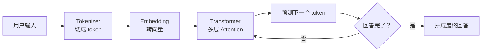
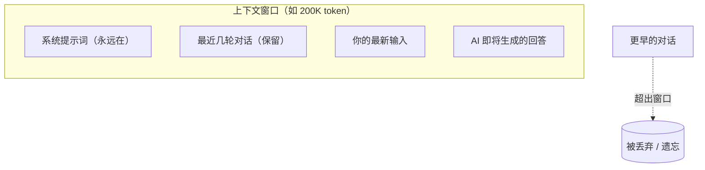
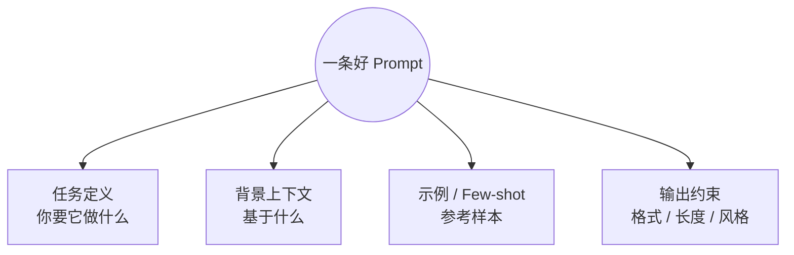
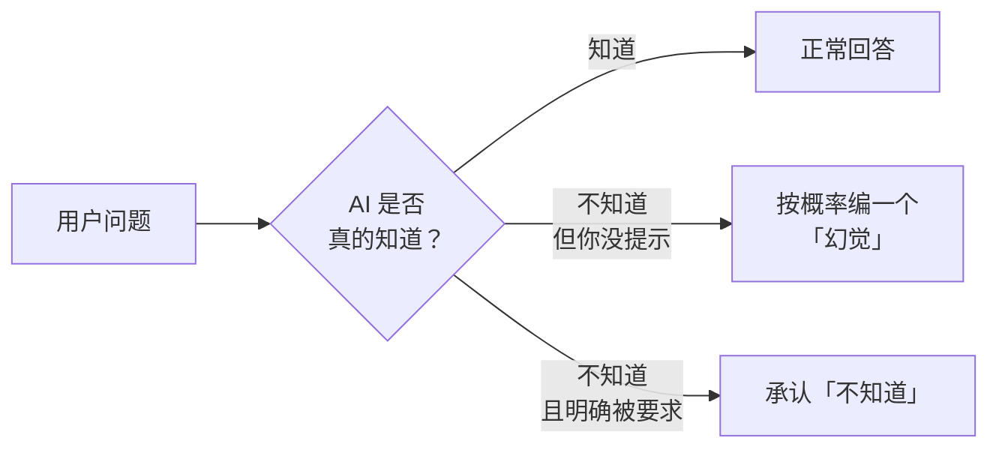
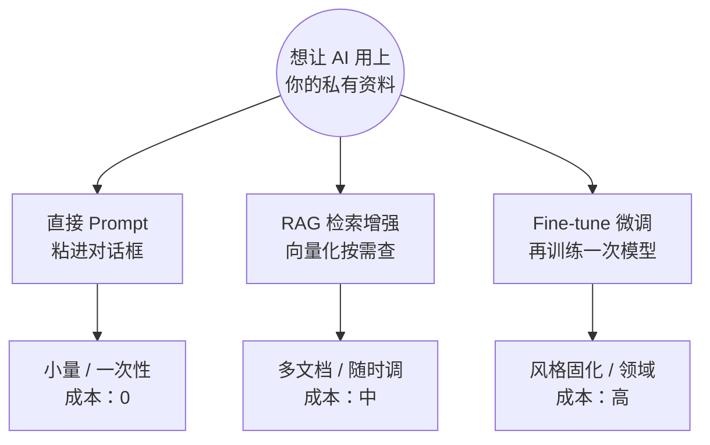
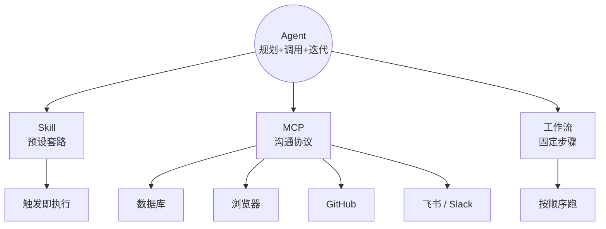

# AI 基础概念

> 🎯
> **这一节读完，你应该能：**
> - 听懂业内人说"大模型 / Prompt / 上下文窗口 / 幻觉"在指什么
> - 理解为啥 AI 有时特别聪明、有时一本正经地胡说
> - 分得清 ChatGPT / Claude / DeepSeek / Gemini 各自的位置
> - 理清 Agent / 工作流 / Skill / MCP 这堆词的关系

## 1. 大模型（LLM）到底是什么

LLM = Large Language Model（大语言模型）。本质是一个超大的概率预测器——给它一段开头，它会预测下一个最有可能出现的"字"。重复这个过程，就拼出一段完整的回答。

> 🧠
> 类比一下：你手机输入法看见"今天天气"会猜"不错 / 很好 / 挺冷"。大模型做的是同一件事，区别只是它的"输入法"读过几乎所有人类写过的东西。

### 三个最关键的参数

| **概念** | **是什么** | **实战意义** |
|-|-|-|
| 参数量 | 模型里有多少可学习的"连接" | GPT-3 是 175B，Claude Opus 估算 200B+，但参数大≠一定更聪明 |
| 上下文窗口 | 一次能"看到"多少 token | Claude 4 / Gemini 2.5 是 200K+，决定它能不能一次"读完"你给的整本书 |
| Token | 模型处理的最小单元 | 约 0.75 个中文字 / 0.7 个英文单词，API 费用按这个算 |

## 2. 上下文窗口：为什么 AI 会"忘"前面说过的话

新手最常被坑的点。你跟 AI 聊得越长，越容易碰到它"忘"了开头讲过什么。不是它笨，是物理限制——超出上下文窗口的内容会被丢掉。

> 💡
> **实战建议：**
> 1. 长对话超过 50 轮就开新会话，别死磕
> 2. 关键信息放最新一句的开头或结尾，别埋在对话中段
> 3. 真要 AI 长期记住的，应该放进 系统提示词 / Skill / 记忆插件

## 3. Prompt：跟 AI 沟通的真正"接口"

很多人以为 Prompt 就是"问的问题"，其实它是一套完整的指令结构。一条好 Prompt 一般包含四样东西：

### 同样的问题，Prompt 差在哪

| **写法** | **AI 给你什么** |
|-|-|
| "帮我写个朋友圈" | 万金油，不知道写啥就编一段 |
| "帮我写一条朋友圈，主题是周末烤肉，轻松随意、带点自嘲，不超过 50 字，附 3 个 emoji" | 能直接发的成品 |

这就是 Prompt Engineering（提示词工程）作为一个职业还在存在的原因。

## 4. 幻觉（Hallucination）：为什么 AI 会一本正经地胡说

AI 给你的每一个回答，本质上都是"概率最优解"——不是"事实最优解"。当它不知道答案时，它不会自动说"我不知道"，而是按"看起来最像答案"的方向编一个。

> 💡
> **减少幻觉的 4 个手段：**
> 1. 给它确切的上下文，不要让它"自己想"
> 2. 用 RAG 把外部资料喂进来作为依据
> 3. 在 Prompt 里明确要求"不知道就直接说不知道"
> 4. 关键事实 / 数字 / 引用，自己交叉验证一遍

## 5. ChatGPT / Claude / DeepSeek / Gemini 怎么分工

| **模型** | **特长** | **短板** | **典型场景** |
|-|-|-|-|
| Claude（Anthropic） | 写文、长上下文理解、Agent 工具调用 | 偶尔过度拒绝、国内不稳 | 写作、长文档分析、Coding |
| ChatGPT（OpenAI） | 通用对话、生态最全 | 免费版能力受限 | 日常问答、多模态 |
| Gemini（Google） | 1M 超大上下文、原生多模态 | 风格偶尔不稳定 | 视频 / 图像理解 |
| DeepSeek | 开源、性价比、推理链路清楚 | 速度比闭源慢 | 大陆稳定可用、Coding |

## 6. 让 AI 用上你的私有资料：三条路对比

这是新手最常问的："怎么让 AI 用我的资料回答？"实际上有三条不同方向的路：

| **方案** | **怎么做** | **适合** | **成本** |
|-|-|-|-|
| 直接 Prompt | 把资料粘进对话框 | 一次性、几千字以内 | 0 |
| RAG（检索增强） | 把资料向量化存数据库，按需检索 | 多文档、要随时调 | 中（建索引+API） |
| Fine-tune（微调） | 用你的数据再训练一次模型 | 风格固化、领域专家 | 高（要 GPU 训练） |

## 7. Agent / 工作流 / Skill / MCP：让 AI 不只是聊天

这一组词是 2025-2026 年最热的，但常常被混着用。理清它们的关系，你就能看懂大部分 AI 工具在卷什么。

| **概念** | **一句话定义** | **典型例子** |
|-|-|-|
| Agent（智能体） | 能自己规划任务、调用工具、循环迭代到完成的"主体" | Claude Code、Codex、AutoGPT |
| 工作流（Workflow） | 预先定义好步骤的固定流程 | n8n、Coze、Dify |
| Skill | Agent 学会的"套路"，遇到对应场景自动触发 | Claude Code Skills、Cursor Rules |
| MCP | Model Context Protocol，Agent 跟外部工具沟通的协议 | MCP server: GitHub / Postgres / Lark |

> 💡
> **Agent vs 工作流的最核心差别：**工作流是你写死流程，Agent 是你描述目标让它自己规划怎么干。前者可预测、好调试；后者更灵活，但更难控制。

---

## 延伸阅读

- [AI Skill 到底是什么？搞懂这个，AI 才算真的用上了](../02｜AI%20工具与大模型/AI%20工具教程/AI%20Skill%20到底是什么？搞懂这个，AI%20才算真的用上了.md) — Skill 概念深入
- [高强度实测 6 大 AI 模型：Claude 写文最强，但我写代码不选它](../02｜AI%20工具与大模型/工具测评/高强度实测%206%20大%20AI%20模型：Claude%20写文最强，但我写代码不选它.md) — 模型对比实战
- [越用越强不是广告语：拆解 Hermes Agent 的三层学习机制](../03｜AI%20编程与智能体/智能体应用案例/越用越强不是广告语：拆解%20Hermes%20Agent%20的三层学习机制.md) — Agent 进阶

---

> 来源：飞书 · AI Spark 知识库 ｜ 原文（最新版）：<https://lcnniolukk80.feishu.cn/wiki/ZDXGwkB7NiaPr6kbDPicgLFHnif> ｜ 归档：2026-06-04
