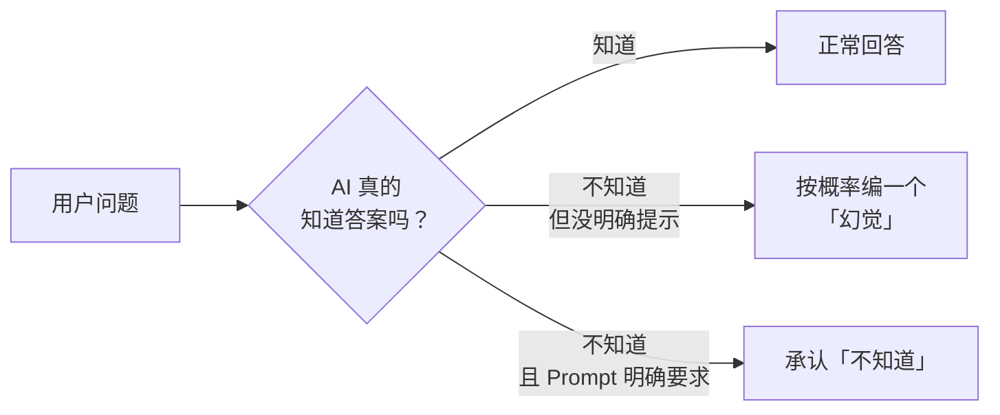
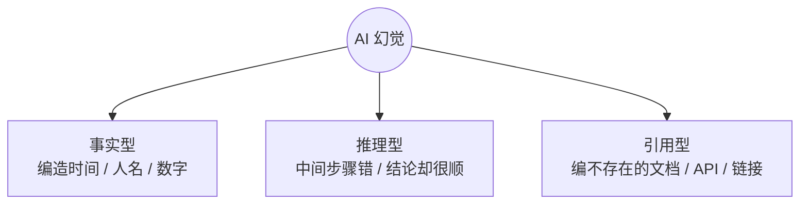
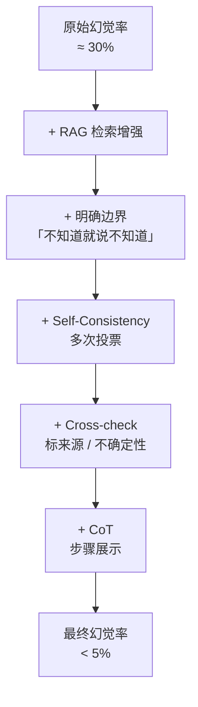

# AI 幻觉：为什么会胡说 + 5 个减幻招式

> 🎯
> **这一篇读完，你应该能：**
> - 理解 AI 幻觉的根本机制（不是 bug，是设计本身）
> - 分得清"事实型 / 推理型 / 引用型" 三种幻觉
> - 掌握 5 个减幻招式，叠加用能砍掉 80%+ 错答
> - 知道哪些场景下幻觉代价最大、必须额外防

## 1. 幻觉的本质：概率最优 ≠ 事实最优

AI 给你的每一个回答，本质上都是"概率最优"——它在算"在这上文之后，最可能出现的下一段话是什么"。当它训练时见过类似问题、答案高频，就答得准；没见过、训练数据有偏、问题太边缘，它依然会按"看起来最像答案"的方向编一个出来。它不会主动说"我不知道"，这是模型架构决定的，不是"AI 不够诚实"。

> 💡
> 类比一下：一个嘴硬的实习生。你问他"这个 API 怎么调用？"他没看过文档，但为了不显得不会，就编一个看起来很合理的答案给你。AI 默认就是这个嘴硬实习生。

## 2. 三种典型幻觉

| **类型** | **表现** | **例子** |
|-|-|-|
| 事实型 | 编造不存在的事实 | "Anthropic 成立于 2019"（实际 2021） |
| 推理型 | 过程错但结论说得很顺 | 算数题中间一步算错，最终答案错得理直气壮 |
| 引用型 | 编出不存在的文献、链接、API | "参考 React 官方文档 useAsyncEffect"（这 API 根本不存在） |

## 3. 为什么会发生：4 个根本原因

1. **训练数据空缺**——问得太冷门，模型见过的样本不够
2. **时效失效**——训练数据有截止日期，问到截止后的事情就开始编
3. **领域错配**——拿通用模型问极专业问题（医疗 / 法律 / 特定 API）
4. **问题歧义**——你的问题本身有多种解读，AI 顺着一个就走

## 4. 减幻 5 招（叠加用效果好）

| **招式** | **怎么做** | **大致砍幻效果** |
|-|-|-|
| RAG 检索增强 | 把权威资料喂给 AI 作为回答依据 | 40-60% |
| 明确边界 | Prompt 里加"不知道就直接说不知道，不要猜" | 15-25% |
| 自一致性 Self-Consistency | 同一问题问 3-5 次，多数投票 | 10-20% |
| Cross-check | 让 AI 自己给的事实标"来源 / 不确定性" | 15-25% |
| 步骤展示 CoT | 让 AI 把推理过程写出来，错容易看出来 | 10-20% |

> ⚡
> **叠加效果：**5 招齐上，复杂任务的事实错误率可以从原来的 30% 砍到 5% 以下。最 ROI 高的两招是 **RAG + 明确边界**。

## 5. 这些场景必须警惕幻觉

- **医疗 / 法律 / 财务**——错答可能造成真实伤害，一定要交叉验证
- **API / 库函数**——AI 经常编不存在的函数名，写代码时跑一遍才知道真假
- **引用 / 出处**——AI 编的论文 / 链接看起来非常真实，但常常根本不存在
- **数字 / 日期 / 价格**——这类数据 AI 错的概率很高，所有数字回到原始来源验证
- **组合判断**——"A 在 B 时候做了什么"这类问题容易把两件事拼错

---

## 延伸阅读

- [01.1｜AI 基础概念](../AI%20基础概念.md) — 回到本章总览
- [Token 和上下文窗口](Token%20和上下文窗口：为什么%20AI%20会「忘」前面说过的话.md) — 信息丢失也会触发幻觉
- [高强度实测 6 大 AI 模型](../../02｜AI%20工具与大模型/工具测评/高强度实测%206%20大%20AI%20模型：Claude%20写文最强，但我写代码不选它.md) — 各模型幻觉表现差异

---

> 来源：飞书 · AI Spark 知识库 ｜ 原文（最新版）：<https://lcnniolukk80.feishu.cn/wiki/E914wrridiL2TOk2ScgcKwdcnDd> ｜ 归档：2026-06-04
