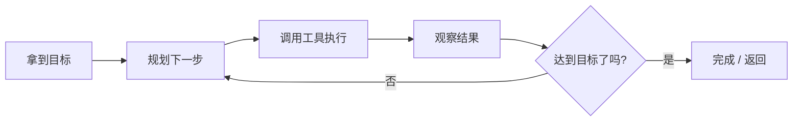
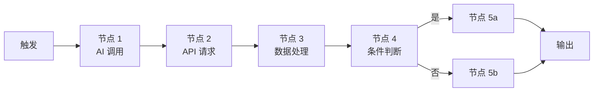
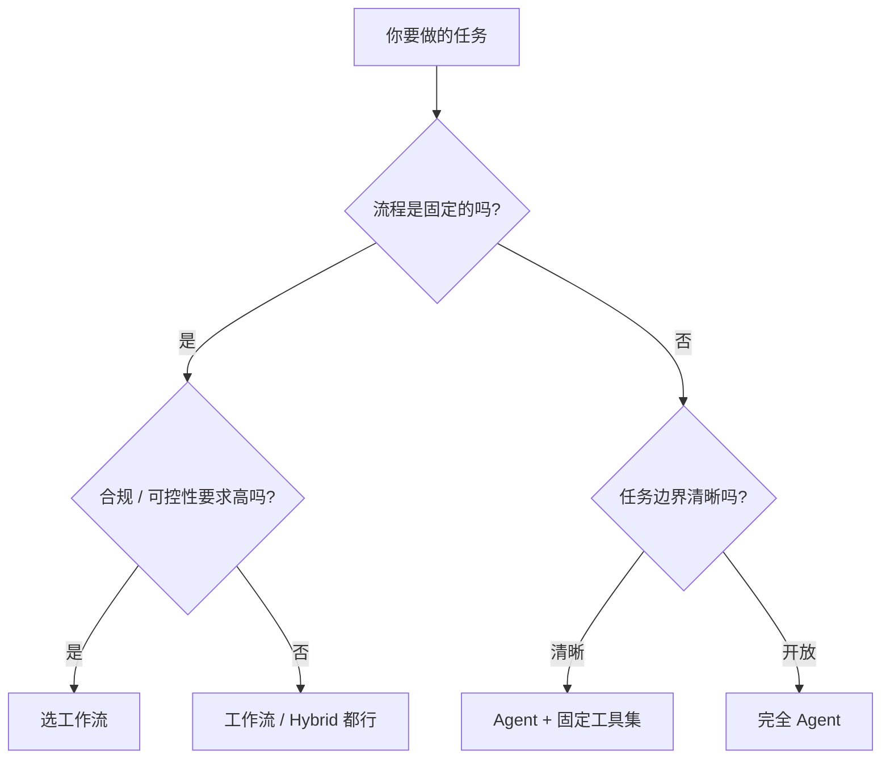

# Agent vs 工作流：你到底在用哪种 AI 应用

> 🎯
> **这一篇读完，你应该能：**
> - 一句话说清两者最核心的差别：决策权归谁
> - 看懂 Agent 的"规划 → 执行 → 观察 → 调整"循环
> - 判断你的场景该选 Agent 还是工作流
> - 理解 Hybrid 模式：什么时候两个都要

## 1. 最核心的差别：决策权归谁

这是理解一切的钥匙：

- **工作流**：开发者决定流程，AI 只是流程中的一个节点
- **Agent**：开发者只给目标和工具，AI 自己决定怎么干

> 💡
> 类比一下：工作流是流水线（每个工人按固定动作做），Agent 是项目经理（你告诉他目标，他自己拆任务、调资源、判断进度）。

## 2. Agent：循环到完成

Agent 的核心是一个循环：拿到目标 → 规划要做什么 → 调用工具执行 → 看结果是不是达到目标 → 没达到就继续规划下一步。

这种结构灵活但难控制。AI 可能：

- 规划出意料之外的路径（好处：能应付没预料到的场景）
- 陷入死循环或反复试错（坏处：成本失控）
- 调用错误工具或参数（坏处：结果不可预测）

## 3. 工作流：固定步骤

工作流是开发者预先画好的有向无环图（DAG）。每个节点是固定动作（可以是 AI 调用，也可以是普通代码 / API），节点之间的连线是固定流向。

> ⚡
> 典型工作流工具：n8n、Coze、Dify、Make（前身 Integromat）、Zapier。它们的共同点是"画布上拖拽节点"——你画完流程，工具按你画的跑。

## 4. 选型对比表

| **维度** | **工作流** | **Agent** |
|-|-|-|
| 可控性 | 高（你画啥跑啥） | 低（AI 自己决定） |
| 灵活性 | 低（流程固化） | 高（应对意料外场景） |
| 调试难度 | 低（步骤可见） | 高（每次跑路径可能不同） |
| 成本可预测 | 高（步骤固定） | 低（AI 可能反复重试） |
| 适合场景 | 明确的、重复的、合规要求高的 | 开放的、探索式的、研究类 |
| 典型工具 | n8n / Coze / Dify / Make | Claude Code / Codex / AutoGPT |

## 5. 决策树：你的场景该选哪种

## 6. Hybrid 模式：用 Agent 做规划，用工作流执行

实际生产里最稳的是 Hybrid——上层用 Agent 拆解任务，拆出的每个子任务交给固定工作流执行：

- Agent 决定"先做 A 再做 B 还是反过来"
- A / B 各自是固定的工作流节点（API 调用、数据库写入等）
- 每个节点结果反馈给 Agent，让它继续规划下一步

> 💡
> **实战理解：**Claude Code 就是这个模式的代表——用户给目标（"改这个 bug"），Agent 决定要看哪些文件、改什么、跑什么命令；每个具体动作（Read / Edit / Bash）是固定工作流。这就是为啥它既灵活又能在工程项目里稳定使用。

---

## 延伸阅读

- [01.1｜AI 基础概念](../AI%20基础概念.md) — 回到本章总览
- [Hermes Agent 三层学习](../../03｜AI%20编程与智能体/智能体应用案例/越用越强不是广告语：拆解%20Hermes%20Agent%20的三层学习机制.md) — Agent 进阶架构
- [AI Skill 到底是什么？](../../02｜AI%20工具与大模型/AI%20工具教程/AI%20Skill%20到底是什么？搞懂这个，AI%20才算真的用上了.md) — Agent 里的 Skill 触发机制

---

> 来源：飞书 · AI Spark 知识库 ｜ 原文（最新版）：<https://lcnniolukk80.feishu.cn/wiki/OPs0wdSqHiozxHkJxFjcnv8Un8e> ｜ 归档：2026-06-04
