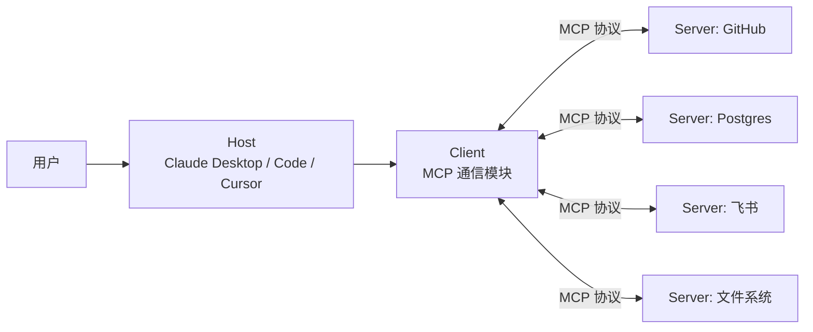
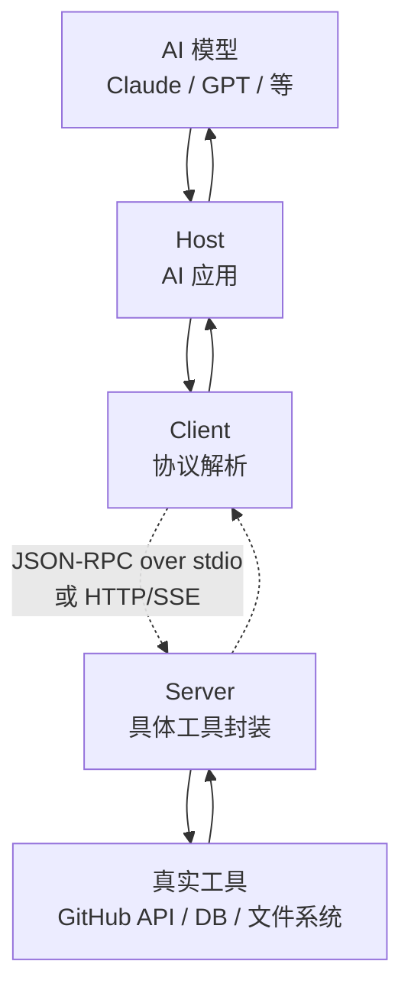
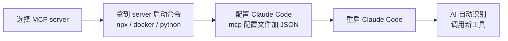

# MCP 是什么：让 AI 接入外部工具的协议

> 🎯
> **这一篇读完，你应该能：**
> - 解释 MCP 是 Anthropic 提出的"AI 时代的 USB-C"
> - 理清 Host / Client / Server 三个角色
> - 看懂 Claude Code、Cursor 装 MCP server 在做什么
> - 知道 MCP 跟 OpenAI Function Calling 是什么关系

## 1. MCP 是什么

MCP 全称 Model Context Protocol（模型上下文协议）。Anthropic 在 2024 年提出，目标很直白：让所有大模型用同一套协议跟外部工具（数据库、浏览器、GitHub、文件系统等）沟通，不要每家都自己造一套。

> 💡
> 类比一下：MCP 是"AI 时代的 USB-C"。以前每个工具厂商都自己一套接口（OpenAI 的 Function Calling、Anthropic 的 Tool Use、Google 的 Function Calling），开发者要写 3 套适配；MCP 一统接口，写一次到处用。

## 2. 为什么需要 MCP

- **痛点 1：**每家 AI 接工具的协议都不一样，工具厂商要适配 3-5 家
- **痛点 2：**AI 应用想换底层模型，配套工具要重写
- **痛点 3：**用户自定义工具难分发——你写的工具只能你自己的客户端用

MCP 把"工具能力"标准化成 Server，"AI 客户端"标准化成 Host，中间用同一个协议跑。一个 MCP server 写一次，所有支持 MCP 的客户端（Claude Code、Cursor、Claude Desktop、Cline 等）都能直接装。

## 3. 三个角色：Host / Client / Server

| **角色** | **是谁** | **例子** |
|-|-|-|
| Host（宿主） | 用户实际操作的 AI 应用 | Claude Desktop / Claude Code / Cursor |
| Client（客户端） | Host 里负责跟 MCP server 通信的模块 | Host 自带，开发者一般不直接碰 |
| Server（服务端） | 一个具体工具的封装 | github / postgres / lark / filesystem 等 |

## 4. 当前 MCP 生态

截止 2026 年中，已经能直接用的 MCP server（不完全列表）：

- **开发类**：GitHub、GitLab、Postgres、SQLite、Filesystem、Memory（持久化记忆）
- **办公类**：Slack、飞书 / Lark、Notion、Google Drive、Linear
- **浏览器自动化**：Puppeteer、Playwright
- **搜索 / 检索**：Brave Search、Tavily、Exa
- **云服务**：AWS、Cloudflare、Stripe

## 5. 怎么装一个 MCP server（以 Claude Code 为例）

三步搞定（以装 GitHub MCP server 为例）：

1. 找到 MCP server 仓库（多数在官方 modelcontextprotocol/servers 集合里）
2. 把配置写进 Claude Code 的 mcp 配置文件（一段 JSON：server 名 / 启动命令 / 环境变量）
3. 重启 Claude Code，对话里直接说"帮我看下 xxx 仓库的 issue" → AI 自动调用 GitHub server

## 6. MCP vs Function Calling

| **维度** | **Function Calling** | **MCP** |
|-|-|-|
| 提出者 | OpenAI（2023） | Anthropic（2024） |
| 层级 | API 单次调用层 | 协议 / 生态层 |
| 能力分发 | 开发者自己包装到应用里 | Server 形式可独立分发 |
| 跨厂商 | 各家各一套 | 设计目标就是跨厂商 |
| 当前生态 | 每家自己的应用内 | 多个客户端共享同一个 server |

> 💡
> **实战理解：**Function Calling 是"模型有调用工具的能力"，MCP 是"工具被标准化成可分发的服务"。两者不冲突——MCP server 内部一样用 Function Calling 跟模型沟通。

---

## 延伸阅读

- [01.1｜AI 基础概念](../AI%20基础概念.md) — 回到本章总览
- [AI Skill 到底是什么？](../../02｜AI%20工具与大模型/AI%20工具教程/AI%20Skill%20到底是什么？搞懂这个，AI%20才算真的用上了.md) — Skill 是另一种工具封装方式
- [Claude Code 安装教程](../../02｜AI%20工具与大模型/AI%20工具教程/Claude%20Code%20安装教程：Mac、Windows、Linux%20从%200%20到跑通.md) — MCP server 在 Claude Code 里实战

---

> 来源：飞书 · AI Spark 知识库 ｜ 原文（最新版）：<https://lcnniolukk80.feishu.cn/wiki/DAiywh26Ri5J4tkGwUDcFm7KnVc> ｜ 归档：2026-06-04
