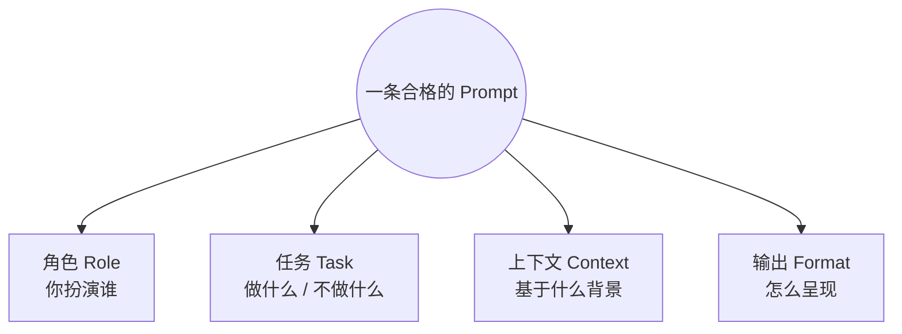
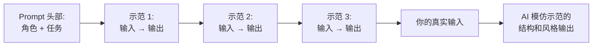
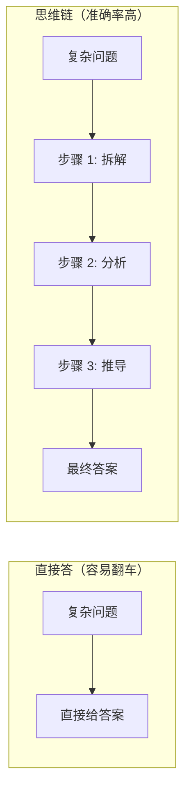

# Prompt 怎么写才管用：四要素 + 反例对比

> 🎯
> **这一篇读完，你应该能：**
> - 看懂为什么"帮我写一个 XX"几乎从来给不出好结果
> - 把任何模糊需求拆成"角色 / 任务 / 上下文 / 输出"四要素
> - 用 Few-shot 把 AI 准确率从 60% 拉到 90%+
> - 识别 6 种一看就废的 Prompt 写法

## 1. Prompt 不是问句，是一份结构化指令

大多数人写 Prompt 的方式像"问问题"——"帮我写个朋友圈"、"翻译一下这段"。这种写法对简单任务还行，但稍微复杂一点就崩——AI 不知道你要什么风格、给谁看、长度多少、有没有禁区。

把 Prompt 当成"给实习生写的工作交底"，效果立刻不同。一份合格交底通常有四样东西：你的角色、任务是什么、基于什么上下文、要交付什么样的成品。

## 2. Prompt 四要素拆解

| **要素** | **作用** | **例子** |
|-|-|-|
| 角色（Role） | 给 AI 设定"扮演谁"，定调子 | "你是一位 10 年经验的 Python 后端工程师" |
| 任务（Task） | 它要做什么、不要做什么 | "重构这段代码，让它支持并发；不要改函数签名" |
| 上下文（Context） | 基于什么背景判断 | "这是一个高 QPS 的支付接口，单机 RT 必须 < 50ms" |
| 输出（Format） | 怎么呈现给我 | "先给方案对比表，再贴重构后的代码，最后说踩坑点" |

> 💡
> 四要素不必每条都写满。简单任务带 1-2 个就够；复杂任务 4 个都要齐。判断标准：你能不能把同一个 Prompt 直接复用给另一个 AI，结果差不多？能 → 写得够清楚。不能 → 还缺要素。

## 3. Few-shot：用例子教 AI 比说话更有效

Few-shot 的意思是：在 Prompt 里直接给 1-3 个"输入 → 输出"的示范，让 AI 模仿。这是单点投入回报最高的一招——通常能把准确率从 60% 拉到 90%+。

| **写法** | **AI 输出** |
|-|-|
| "帮我把这些公司名归类成行业" | 分类逻辑混乱，行业粒度不统一 |
| "帮我把这些公司名归类成行业，参考：阿里巴巴 → 电商；字节跳动 → 内容；宁德时代 → 制造" | 所有公司按同一颗粒度分类，可直接用 |

## 4. 思维链（CoT）：让 AI 先想再答

对推理类问题（数学、逻辑、复杂判断），加一句"先把思考过程写出来，再给最终答案"，准确率会显著提升。这就是 Chain of Thought（思维链）。原理：让 AI 把中间步骤显式化，避免它一步跳到错答案。

> ⚡
> **实战触发词：**Let's think step by step / 让我们一步步推理 / 先分析再下结论。简单加这一句对推理题准确率提升非常显著。

## 5. 反例：6 种一看就废的 Prompt 写法

| **反例** | **问题** | **改进** |
|-|-|-|
| "帮我写个 XX" | 没角色、没上下文、没输出要求 | 四要素补齐 |
| "尽量好"、"专业一点" | AI 不知道你的"好"是什么 | 给可量化的指标（字数 / 结构 / 风格） |
| "详细介绍 XX" | 详细到哪种程度？给谁看？ | "500 字以内、写给完全小白、带 2 个真实例子" |
| 负面指令为主（"不要 XX, 不要 YY"） | AI 不知道要做什么，只知道不做什么 | 正面指令为主，负面指令限 1-2 条 |
| 把 5 个任务塞一条 Prompt | AI 容易漏 / 互相干扰 | 分多轮，或明确编号"任务 1 / 任务 2" |
| "按你最擅长的方式回答" | 主动放弃控制权 | 明确要求格式 / 结构 |

## 6. 实战 5 招

1. **角色 + 任务 + 输出格式**是最低组合，少一个就模糊
2. **给 1 个反例**比写 3 条"不要"管用——"不要像广告"不如"避免：终极秘密、超惊艳"
3. **把 Prompt 当代码维护**——好的 Prompt 应该可以复用到下一次任务
4. **难任务先 CoT**——加一句"先分析"几乎只有好处没有坏处
5. **反复跑同样的 Prompt 看稳定性**——同一个 Prompt 跑 3 次结果都差不多 = Prompt 写到位了

---

## 延伸阅读

- [01.1｜AI 基础概念](../AI%20基础概念.md) — 回到本章总览
- [Token 和上下文窗口](Token%20和上下文窗口：为什么%20AI%20会「忘」前面说过的话.md) — Prompt 太长会被丢的边界
- [AI Skill 到底是什么？](../../02｜AI%20工具与大模型/AI%20工具教程/AI%20Skill%20到底是什么？搞懂这个，AI%20才算真的用上了.md) — 把成熟 Prompt 固化成 Skill

---

> 来源：飞书 · AI Spark 知识库 ｜ 原文（最新版）：<https://lcnniolukk80.feishu.cn/wiki/IOWawSbaPi0hhNkSBlFcJR3fnYr> ｜ 归档：2026-06-04
