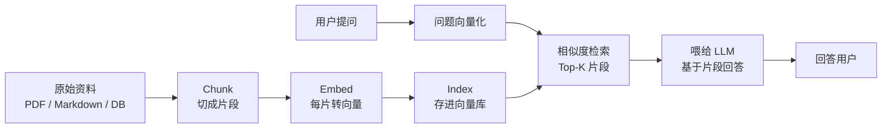
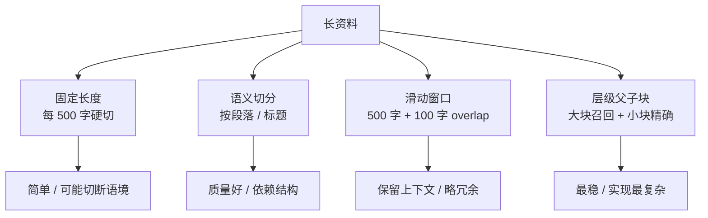
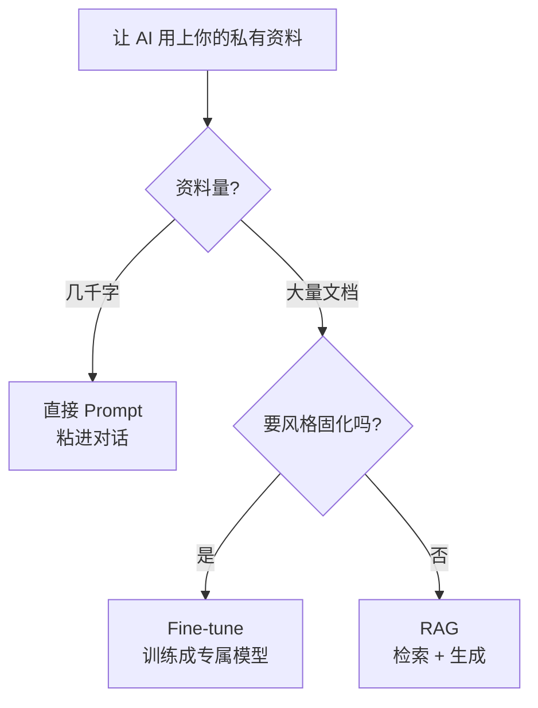

# RAG 入门：让 AI 用上你的私有资料

> 🎯
> **这一篇读完，你应该能：**
> - 说清楚 RAG 是检索 + 生成 两步组合，不是单一技术
> - 理清 Embed / Index / Retrieve / Generate 四步骤
> - 知道 Chunking 是 RAG 质量的命门，不是细节
> - 判断你的场景该走 RAG、Fine-tune 还是直接 Prompt

## 1. RAG 是什么

RAG 全称 Retrieval-Augmented Generation（检索增强生成）。本质是把"传统搜索引擎"和"大模型生成"叠加起来——先在你的资料库里检索出相关片段，再让 AI 基于这些片段回答。

> 💡
> 类比一下：闭卷考试改成开卷。模型本身的知识量没变，但回答问题时手边随时有一本对应的书，幻觉率立刻砍一大半。

## 2. RAG 工作流：四步骤

| **步骤** | **做什么** | **关键挑战** |
|-|-|-|
| 1. Chunk | 把长资料切成小片段 | 切得太大召回不准，太小丢失语境 |
| 2. Embed | 每个片段转成向量（数字数组） | 选模型（OpenAI / Cohere / bge / m3e 等） |
| 3. Index | 向量存进数据库，建索引 | 选 Chroma / Qdrant / Pinecone / pgvector |
| 4. Retrieve + Generate | 查询向量化 → 找相似片段 → 喂给 AI 回答 | Top-K 取多少、相关性阈值 |

## 3. Chunking 是 RAG 质量的命门

很多人以为 RAG 选 LLM 是关键——实际上 Chunking 才是。切得不好，召回不到关键片段；切得太碎，AI 拿不到完整语境。

| **策略** | **怎么切** | **适合** |
|-|-|-|
| 固定长度 | 每 500 字一段，强制切 | 资料结构混乱、纯文本 |
| 语义切分 | 按段落 / 标题 / 句号边界 | 结构化文档（Wiki / Markdown） |
| 滑动窗口 + 重叠 | 500 字 + 100 字 overlap | 怕切断关键语境的场景 |
| 层级 / 父子块 | 大块召回 + 小块精确 | 长篇技术文档、法律条文 |

## 4. 向量数据库选型

| **数据库** | **特点** | **适合** |
|-|-|-|
| Chroma | 本地起、Python 友好 | 原型 / 小数据量 |
| Qdrant | 开源、Rust 写、性能好 | 自部署生产 |
| Pinecone | 托管、零运维 | 不想管基建 |
| pgvector | Postgres 扩展，跟现有库一起用 | 已经有 PG 的项目 |

## 5. 检索质量怎么评估

- **Recall@K**：前 K 条结果有没有包含正确答案，比如 Recall@5 = 80% 意思是 80% 的查询能在前 5 条里找到对的
- **NDCG**：相关性排序得分，越相关的排越前，分越高
- **实战做法**：做一份 50-100 条的"问题 + 正确片段" 评估集，每次改 chunking / embedding 后跑一遍

## 6. 什么时候不用 RAG

> 💡
> **三种情况优先选别的方案：**
> 1. 资料就几千字 → 直接 Prompt 粘，省事
> 2. 要的是"风格固化"（特定文风、领域行话）→ Fine-tune
> 3. 资料每天大量更新且要立刻生效 → RAG 索引更新成本高，可能要重新评估

---

## 延伸阅读

- [01.1｜AI 基础概念](../AI%20基础概念.md) — 回到本章总览
- [Token 和上下文窗口](Token%20和上下文窗口：为什么%20AI%20会「忘」前面说过的话.md) — Chunking 的物理边界来自这
- [Hermes Agent 三层学习](../../03｜AI%20编程与智能体/智能体应用案例/越用越强不是广告语：拆解%20Hermes%20Agent%20的三层学习机制.md) — 记忆层是 RAG 的进阶形态

---

> 来源：飞书 · AI Spark 知识库 ｜ 原文（最新版）：<https://lcnniolukk80.feishu.cn/wiki/Up5iwhVgAiAUHwkGdNjcYyBWnKb> ｜ 归档：2026-06-04
