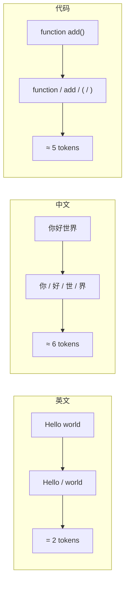
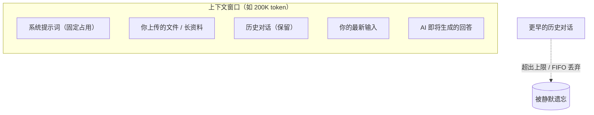
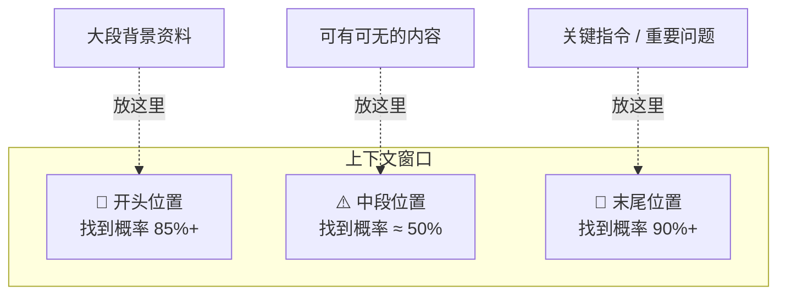

# Token 和上下文窗口：为什么 AI 会「忘」前面说过的话

> 🎯
> **这一篇读完，你应该能：**
> - 解释清楚 token 到底是什么（不只是"字"）
> - 看 API 账单时知道钱花在哪
> - 理解 AI 为什么聊久了会"忘"——不是它笨，是物理限制
> - 用三招实战手段把上下文用出 2 倍效果

## 1. Token 到底是什么

所有大模型在算的时候都不是按"字"算的，而是按 **token** 算的。一个 token 介于"一个字母"和"一个完整单词"之间——是模型自己定义的"最小处理单元"。

> 💡
> 类比一下：英文输入法的自动联想是按"前缀"在猜，比如 "stra" → "strategy / strange / straight"。token 就是模型给自己定的"前缀单位"。常见的英文单词是一个 token；不常见的可能被拆成 2-3 个。

### 不同语言的 token 怎么算

| **语言 / 内容** | **大约 token 数** | **举例** |
|-|-|-|
| 英文单词 | ≈ 0.75 token / 单词 | "Hello world" ≈ 2 token |
| 中文字符 | ≈ 1.5 token / 汉字 | "你好世界" ≈ 6 token |
| 代码 | 变动很大，平均 ≈ 0.5 token / 字符 | 缩进、标点也算 token |
| 表情 / 特殊符号 | 1-3 token 不等 | "🎯" 可能拆成 3 个 token |

> 💰
> **实战意义：**同样的内容，中文比英文贵 2 倍左右。所以拿 API 处理大量中文文档时，token 预算要按字数 × 1.5 算。

## 2. 上下文窗口：模型的"工作记忆"

上下文窗口（Context Window）= 模型一次最多能处理多少 token。这里包含**你输入的 + 它生成的**两部分，合起来不能超过窗口上限。

2026 年主流模型的窗口大小，差距大到吓人：

| **模型** | **窗口大小** | **大约能塞多少东西** |
|-|-|-|
| GPT-3.5 | 16K token | 10 张 A4 中文（5 千字） |
| Claude 4 Sonnet | 200K token | 一本 200 页的中文小说 |
| Claude 4 Opus | 500K token | 一本 500 页的技术手册 |
| Gemini 2.5 Pro | 1M token | 整个仓库的代码 + 文档 |
| GPT-5 | 400K token | 一本 400 页的书 |

## 3. 超出窗口会发生什么

当你跟 AI 聊得很长、内容超出上限时，**最早的对话会被静默丢弃**。AI 不会主动告诉你它已经"忘"了，所以你会突然发现它前后矛盾——其实是它读不到原始信息了。

> 💡
> **常见误解：**"我对话还没多少，怎么会满？" 注意：系统提示词、你上传的所有文件、之前每一轮的对话，都在累计占用窗口。一份 5 万字的文档塞进去，已经吃掉 7.5 万 token，再聊几轮就接近上限了。

## 4. 上下文不是越大越好

这是 2025 年研究界的重要发现——叫 **"Lost in the Middle"**（中间迷失）：把信息放在超长上下文的中部，模型经常找不到它。

| **信息位置** | **模型找到的概率** |
|-|-|
| 窗口开头 | 高（85%+） |
| 窗口中段 | 低（50% 左右） |
| 窗口末尾（最近输入） | 最高（90%+） |

> 🎯
> **实战手段：**把**关键指令放最后一句**。如果要让 AI 基于一份长资料回答，"资料贴前面 → 问题放最后"比反过来效果好得多。

## 5. 实战：把上下文用出 2 倍效果

### 省 token 三招

1. **用英文写系统提示词**。英文 token 效率比中文高 50%，跟模型沟通的指令用英文写，可以省下 1/3 预算
2. **长对话定期清缓存**。超过 30-50 轮就开新会话，把上轮的关键结论复制到新会话开头
3. **批量任务一次喂完**。一次给 10 个任务比分 10 次每次给 1 个省 token，因为每次都要重新铺设系统提示词

### 避免被"丢弃"两招

1. **重要信息要么最早要么最近**。中段最容易丢
2. **用 Skill / 系统提示词固化长期信息**。每次对话都要带的，别每次都重新粘

---

## 延伸阅读

- [01.1｜AI 基础概念](../AI%20基础概念.md) — 回到本章总览
- [AI Skill 到底是什么？](../../02｜AI%20工具与大模型/AI%20工具教程/AI%20Skill%20到底是什么？搞懂这个，AI%20才算真的用上了.md) — 怎么把长期信息固化进 Skill
- [高强度实测 6 大 AI 模型](../../02｜AI%20工具与大模型/工具测评/高强度实测%206%20大%20AI%20模型：Claude%20写文最强，但我写代码不选它.md) — 各家模型实测对比

---

> 来源：飞书 · AI Spark 知识库 ｜ 原文（最新版）：<https://lcnniolukk80.feishu.cn/wiki/HfzSwaeWZiWmyjkWyGZc8ezVn5g> ｜ 归档：2026-06-04
