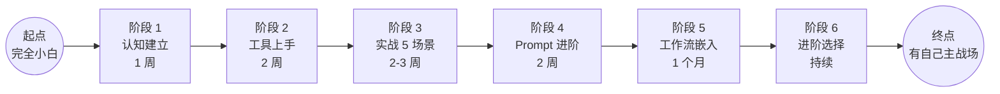
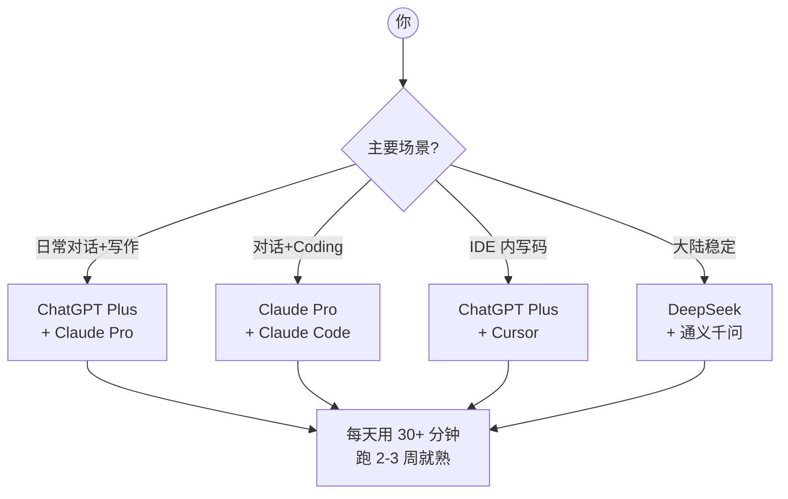
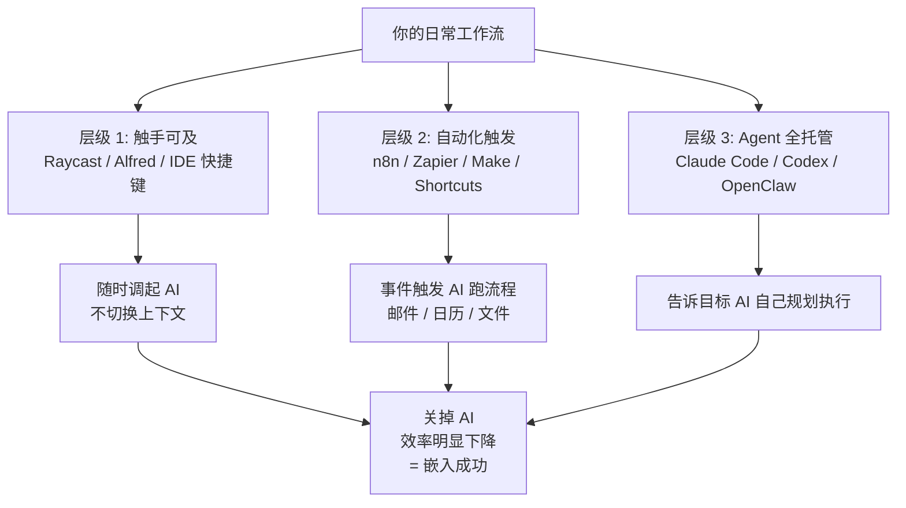
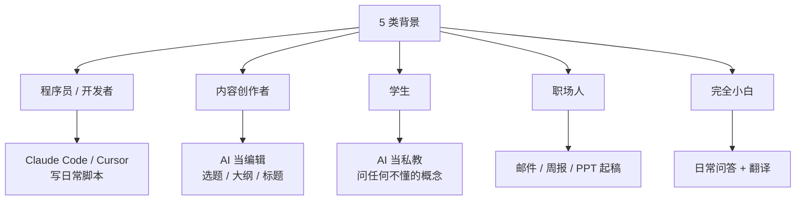
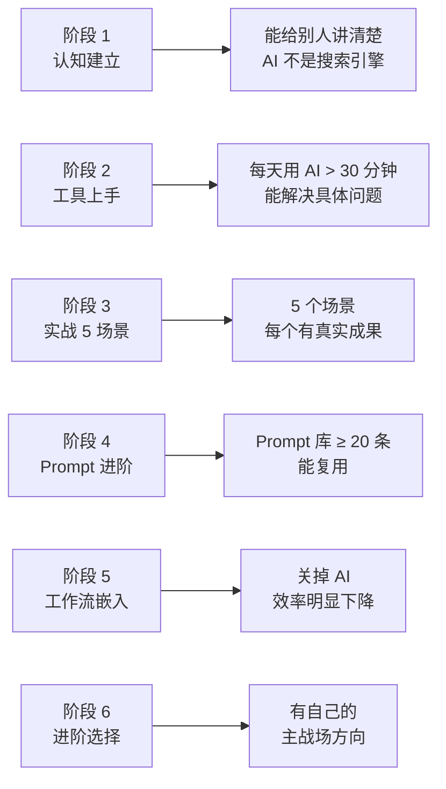
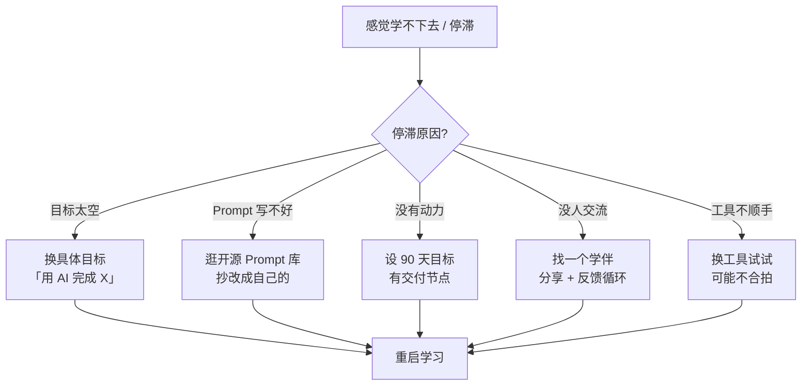

# 新手学习路径

> 💡
> **这一章解决一个新手最常问的问题：「我从 0 开始，到底该怎么学 AI？」给你的不是泛泛书单，而是一份能照着走的路线图：**
> - 6 阶段路径地图（认知 → 工具 → 实战 → Prompt → 工作流 → 进阶）
> - 每阶段做什么、用多久、过关标志是什么
> - 不同背景（程序员 / 内容创作者 / 学生 / 职场人 / 完全小白）各自的切入点
> - 学不下去、卡壳、迷茫时的自救手册
> - 从中级跨到高级的 4 个真实转折点

## 1. 总览：从 0 到能用 AI 干活的 6 阶段

大多数人学 AI 学不下去，是因为「不知道下一步该学什么」。这张图给你定锚——你现在在哪、下一步去哪、最终要到哪。

| **阶段** | **核心目标** | **建议时长** | **过关标志** |
|-|-|-|-|
| 1. 认知建立 | 知道 AI 是什么 / 不是什么 | 1 周 | 能给别人讲清楚「AI 不是搜索引擎」 |
| 2. 工具上手 | 装好 / 用好 1-2 个主流 AI 工具 | 2 周 | 每天用 AI > 30 分钟，且能解决具体问题 |
| 3. 实战 5 场景 | 覆盖写文 / 写码 / 学习 / 翻译 / 总结 | 2-3 周 | 5 个场景每个都有 1 个真实成果 |
| 4. Prompt 进阶 | 写出能复用 + 稳定输出的 Prompt | 2 周 | 有自己的 Prompt 库 ≥ 20 条 |
| 5. 工作流嵌入 | 把 AI 嵌入日常工作流 | 1 个月 | 关掉 AI 后觉得效率明显下降 |
| 6. 进阶选择 | 决定专攻 Coding / Agent / 自动化 / 训练 | 持续 | 有自己的"主战场"方向 |

## 2. 阶段 1：认知建立（第 1 周）

这一周不动手，只建立正确认知。绝大多数后期踩的坑，根源都在这一周认知没建好。

> 📚
> **这一周要搞懂的 7 个概念：**
> 1. 大模型（LLM）是什么、不是什么
> 2. Token / 上下文窗口的物理边界
> 3. Prompt 不是"问问题"是"结构化指令"
> 4. 幻觉的本质：概率最优 ≠ 事实最优
> 5. Agent / 工作流 / Skill / MCP 概念区分
> 6. RAG vs Fine-tune vs 直接 Prompt 三条路
> 7. ChatGPT / Claude / DeepSeek / Gemini 分工

**推荐学习方式：**把 01.1 章节 7 篇文章读一遍。每篇 10-15 分钟，一周读完，每天读 1-2 篇足够。

## 3. 阶段 2：工具上手（第 2-3 周）

第 1 周建好认知，第 2-3 周要把工具用熟。新手最常见的错误是「装了 10 个工具但每个都没深用」——这个阶段重点是聚焦 1-2 个。

| **首选组合** | **覆盖场景** | **月成本** |
|-|-|-|
| ChatGPT Plus + Claude Pro | 日常对话 + 长上下文 + 写作 | $40 |
| Claude Pro + Claude Code | 对话 + Coding 自动化 | $20-100 |
| ChatGPT Plus + Cursor | 对话 + IDE 写码 | $40 |
| DeepSeek 网页 + 通义千问 | 大陆稳定使用 | $10-20 |

## 4. 阶段 3：实战 5 个场景（第 4-6 周）

把 AI 套到 5 个真实场景里跑一遍。每个场景都要拿出实实在在的"成果"——不是"我试过了"，是"我用 AI 完成了 XX"。

| **场景** | **具体任务建议** | **过关标志** |
|-|-|-|
| ① 写作 | 写 1 篇 2000 字的文章 / 报告 / 简历 | 有成品能发出去 |
| ② 编程 | 用 AI 写 / 调一段实用脚本（自动化日常任务） | 脚本跑通且自己看懂 |
| ③ 学习 | 让 AI 当你某个新领域的"私教" | 能跟 AI 进行 30 分钟深度对话 |
| ④ 翻译 / 摘要 | 翻译 / 总结 5 篇英文资料 | 输出质量稳定可用 |
| ⑤ 创意 / 头脑风暴 | 用 AI 做选题 / 命名 / 方案比稿 | 有 1 个 AI 提供过关键灵感的成果 |

## 5. 阶段 4：Prompt 进阶（第 7-8 周）

到这一步，你已经能用 AI 解决问题了，但每次都重新摸索 Prompt 写法。这个阶段重点：把"跑通的 Prompt"沉淀成可复用资产。

> 💡
> **这一阶段要建立的 3 件事：**
> 1. **个人 Prompt 库**：跑通的就存起来（Obsidian / Notion / 一份 markdown 都行），按场景分类
> 2. **Prompt 复用习惯**：同类任务直接复用，再改 30%，比每次重写省 10 倍时间
> 3. **Prompt 评测意识**：同一个 Prompt 跑 3 次，结果都差不多 → 写到位了

## 6. 阶段 5：把 AI 嵌入工作流（第 9-12 周）

前 4 个阶段都是"找 AI 帮忙"。阶段 5 反过来——AI 嵌进你的工作流，每个流程自动调用 AI。

> 🔧
> **嵌入工作流的 3 个层级：**
> 1. **触手可及**：浏览器 / IDE / 终端里随时调起 AI（Raycast / Alfred / Cmd+K）
> 2. **自动化触发**：邮件 / 日历 / 文件 / 消息触发 AI 跑流程（n8n / Zapier / Make / Apple Shortcuts）
> 3. **Agent 全托管**：AI 自己规划 + 执行整个任务（Claude Code / Codex / OpenClaw）

## 7. 阶段 6：进阶选择（第 4 个月+）

到这一步你已经是熟练用户。下一步是选一个方向深入——不可能样样精通。下面 4 个方向选 1-2 个。

| **方向** | **适合谁** | **典型成果** |
|-|-|-|
| AI Coding 深度 | 程序员 / 开发者 | 用 AI 主导项目，效率 5x |
| Agent / 自动化 | 运营 / 产品 / 工程师 | 搭建自己的 AI 工作流系统 |
| 内容 / 创作 AI | 写作者 / 自媒体 / 营销 | 建立 AI 辅助的内容生产管线 |
| 模型训练 / 微调 | 算法 / 数据 / 研究者 | 跑通 Fine-tune / RAG / 私有部署 |

## 8. 不同背景的入门切入点

每个人起点不一样，最适合切入的场景也不同。下面这张图给 5 类典型用户的"前 2 周该干嘛"建议。

| **背景** | **最适合的首战场景** | **避开什么** |
|-|-|-|
| 程序员 / 开发者 | 装 Claude Code / Cursor，让 AI 写日常脚本 | 避开"先理论后实战"，先动手 |
| 内容创作者 | 写选题 / 大纲 / 标题，AI 当编辑用 | 避开把 AI 当代笔，会失语 |
| 学生 | 当私教问任何不懂的概念 | 避开让 AI 帮你代写作业，会废掉 |
| 职场人 | 邮件 / 周报 / PPT 让 AI 起稿 | 避开敏感数据直接粘进去 |
| 完全小白 | 日常问答和翻译先用起来 | 避开追新太快，先把一个用熟 |

## 9. 每个阶段过关的"硬标志"

过关不是"觉得自己学到了"，是有客观能产出的成果。下面这张图给 6 阶段每个"过关"必须有的硬证据。

## 10. 学不下去时怎么救

大多数人在 3-6 周时遇到"瓶颈"——感觉没进步、用不出花样、不知道下一步。这是常态，下面 5 种自救策略按顺序试。

> 🚑
> **5 种"学不下去"自救：**
> 1. **换一个具体目标**——不是"学 AI"，是"用 AI 完成 X"
> 2. **看别人的 Prompt 库**——开源 Prompt 仓库逛一圈
> 3. **找一个 90 天目标**——给自己一个"年底要做出什么"
> 4. **找一个学伴**——AI 学习需要"分享 + 反馈"循环
> 5. **换工具试试**——可能你跟现在用的工具就是不合拍

## 11. 中级到高级的 4 个转折点

| **转折点** | **什么意思** | **过了之后** |
|-|-|-|
| ① 从用 Prompt 到设计工作流 | 不再单点用 AI，开始组合多步 | 能搭出小型自动化系统 |
| ② 从用云端到混合本地 | 开始部署本地模型 / 处理敏感数据 | 合规 / 隐私问题解决 |
| ③ 从消费到生产 | 从"用 AI"到"做 AI 产品 / Skill / Agent" | 开始反向输出 |
| ④ 从单模型到多模型协同 | 不同任务调不同模型 / 同任务多模型对比 | 结果质量稳定且成本可控 |

## 12. 这一章子文章导览

下面 5 篇是这章的深度展开，每篇专攻路径里的一个关键节点：

- **30 天 AI 入门实战计划**——每天 30 分钟，照表执行
- **5 类背景的不同切入点**——程序员 / 创作者 / 学生 / 职场 / 小白
- **AI 学习资源精选**——书 / 课 / 频道 / 社群分级推荐
- **从「听过」到「会用」**——5 个练习场景手把手
- **3 个学习心理坎**——为什么人会卡住，怎么过

---

## 延伸阅读

- [01.1｜AI 基础概念](AI%20基础概念.md) — 阶段 1 认知建立必读
- [01.3｜新手避坑清单](新手避坑清单.md) — 学的过程中避坑参考
- [Prompt 怎么写才管用](AI%20基础概念/Prompt%20怎么写才管用：四要素%20+%20反例对比.md) — 阶段 4 Prompt 进阶
- [Agent vs 工作流](AI%20基础概念/Agent%20vs%20工作流：你到底在用哪种%20AI%20应用.md) — 阶段 5 工作流嵌入
- [高强度实测 6 大 AI 模型](../02｜AI%20工具与大模型/工具测评/高强度实测%206%20大%20AI%20模型：Claude%20写文最强，但我写代码不选它.md) — 阶段 2 工具上手参考

---

> 来源：飞书 · AI Spark 知识库 ｜ 原文（最新版）：<https://lcnniolukk80.feishu.cn/wiki/SUGqwyesei8DOAkvbxQcfHT5n4c> ｜ 归档：2026-06-04
