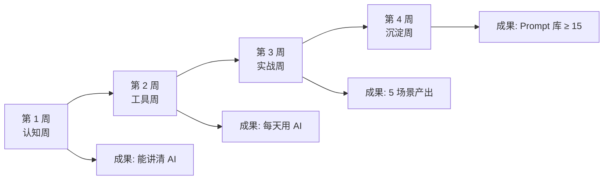
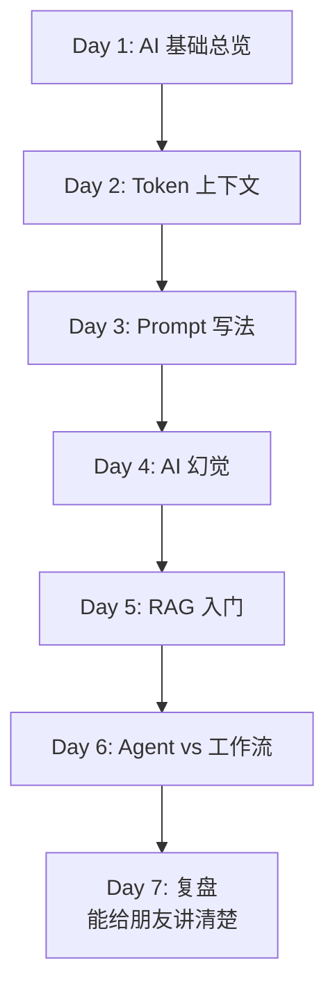
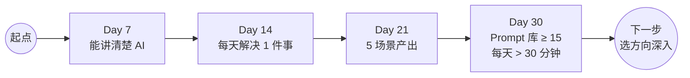

# 30 天 AI 入门实战计划：每天 30 分钟，照表执行

> 📅
> **这一篇是 01.2 新手学习路径 的 30 天可执行版。读完你能：**
> - 按周 / 按天知道每天该干什么（不用自己规划）
> - 每周有明确成果验证学到了
> - 30 天后达到「能用 AI 干活」的能力
> - 知道 30 天后下一步该往哪走

## 1. 30 天总览

这是给你定锚的：第几周该做什么、产出什么、卡在哪。

| **周** | **主题** | **每天 30 分钟做什么** | **周末成果** |
|-|-|-|-|
| 第 1 周 | 认知周 | 读 1 篇基础概念文章 + 试一个对应小问答 | 能用一段话讲清 AI 是什么 |
| 第 2 周 | 工具周 | 用 1 个主工具完成 1 个真实小任务 | 每天都用 AI 解决 1 件事 |
| 第 3 周 | 实战周 | 5 场景每天跑 1 个 | 5 个场景每个有产出 |
| 第 4 周 | 沉淀周 | 把跑通的 Prompt 整理 + 复用 | 个人 Prompt 库 ≥ 15 条 |

## 2. 第 1 周：认知周

**目标：**把 AI 是什么 / 不是什么彻底想清楚。这一周不动手不行动，重点是建立正确认知。

| **天** | **30 分钟做什么** |
|-|-|
| Day 1 | 读 01.1 AI 基础概念 总览，理解 7 个核心概念框架 |
| Day 2 | 读 Token 和上下文窗口，试着算自己平时对话占多少 token |
| Day 3 | 读 Prompt 怎么写才管用，按四要素重写你最近的一条 Prompt |
| Day 4 | 读 AI 幻觉 5 招，故意问 AI 一个它会编的问题验证 |
| Day 5 | 读 RAG 入门，理解为什么 AI 不能直接用你的私有资料 |
| Day 6 | 读 Agent vs 工作流，理解 Claude Code / Cursor 这类工具属于哪种 |
| Day 7 | 周末复盘：用一段话给朋友讲清楚 AI 是什么 |

## 3. 第 2 周：工具周

**目标：**装好 + 用熟 1-2 个主工具。重点是"熟"，不是"装得多"。

| **天** | **30 分钟做什么** |
|-|-|
| Day 8 | 开通 Claude Pro 或 ChatGPT Plus（二选一） |
| Day 9 | 用主工具把日常一个真实问题解决（不是「试一下」） |
| Day 10 | 装一个客户端/插件（Raycast / Alfred / 浏览器插件，让 AI 触手可及） |
| Day 11 | 解决日常第 2 个问题，注意 Prompt 优化 |
| Day 12 | 对比同一个问题在 Claude / ChatGPT / DeepSeek 上的回答 |
| Day 13 | 找一个会用的"老手"，看他怎么用 AI（视频 / 直播 / 实操） |
| Day 14 | 周末成果：写下"我每天能用 AI 解决的 5 类问题" |

## 4. 第 3 周：实战周

**目标：**5 个真实场景每个都有产出。一个场景跑通 = 你掌握了一类能力。

| **天** | **场景 + 产出** |
|-|-|
| Day 15-16 | 写作：完成 1 篇 1500 字以上的文章 / 报告 / 简历 |
| Day 17-18 | 编程：用 AI 写 1 个解决日常任务的脚本（哪怕只有 50 行） |
| Day 19-20 | 学习：让 AI 当某个新领域的私教，1 小时连续对话 |
| Day 21 | 翻译/总结：用 AI 处理 3 篇英文资料，输出可读中文摘要 |

## 5. 第 4 周：沉淀周

**目标：**把前 3 周跑通的 Prompt 沉淀成你自己的资产。

> 💡
> **具体动作：**
> 1. 建一份 markdown 笔记，按场景分类（写作 / 编程 / 学习 / 翻译 / 头脑风暴）
> 2. 每条 Prompt 写清：场景、Prompt 原文、典型输出、改良记录
> 3. 同一类任务下次直接复用，再改 30% 即可
> 4. 每周末扫一次库，淘汰用不上的、加入新的

## 6. 30 天里程碑节点

| **里程碑** | **什么算到** |
|-|-|
| 第 7 天 | 能给朋友讲清楚 AI 是什么不是什么 |
| 第 14 天 | 每天至少用 AI 解决 1 件实际问题 |
| 第 21 天 | 5 个场景每个都有真实产出 |
| 第 30 天 | 有个人 Prompt 库 ≥ 15 条，每天用 AI 时间 > 30 分钟 |

## 7. 30 天跑完，下一步去哪

- **感觉刚摸到门：**把 30 天再跑一遍，重点深化第 3-4 周
- **感觉游刃有余：**开始进入 01.2 路径里的阶段 5（嵌入工作流）
- **对某个方向特别感兴趣：**选 Coding / Agent / 内容 / 微调一个方向深入

---

## 延伸阅读

- [01.2｜新手学习路径](../新手学习路径.md) — 回总览
- [01.1｜AI 基础概念](../AI%20基础概念.md) — 第 1 周认知周读这一章
- [Prompt 怎么写才管用](../AI%20基础概念/Prompt%20怎么写才管用：四要素%20+%20反例对比.md) — 第 4 周沉淀重点

---

> 来源：飞书 · AI Spark 知识库 ｜ 原文（最新版）：<https://lcnniolukk80.feishu.cn/wiki/UIcDwTDKDiPuGmk8vfXcQ1mKneA> ｜ 归档：2026-06-04
