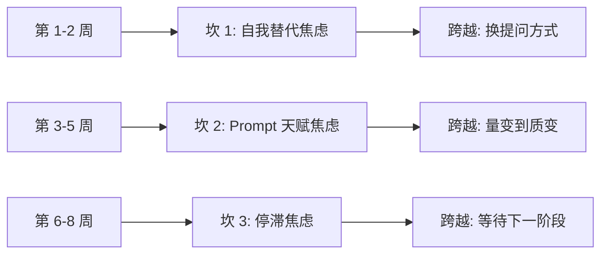
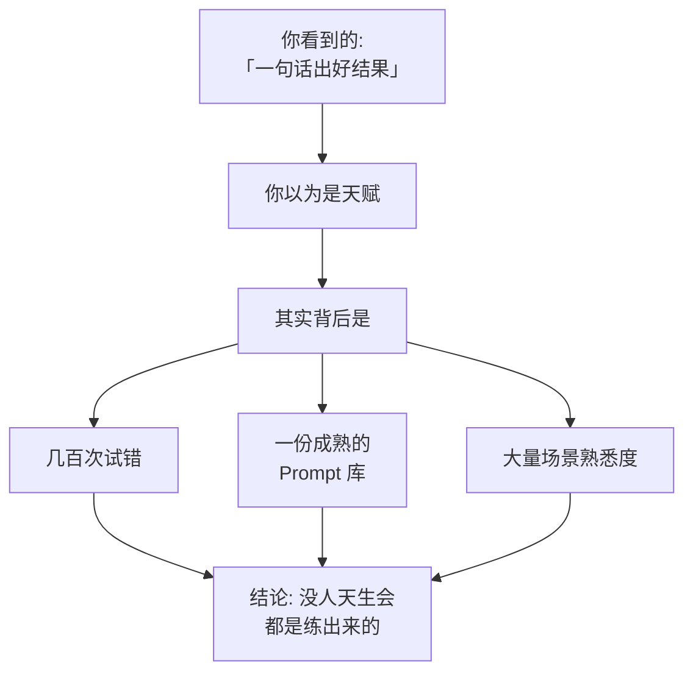
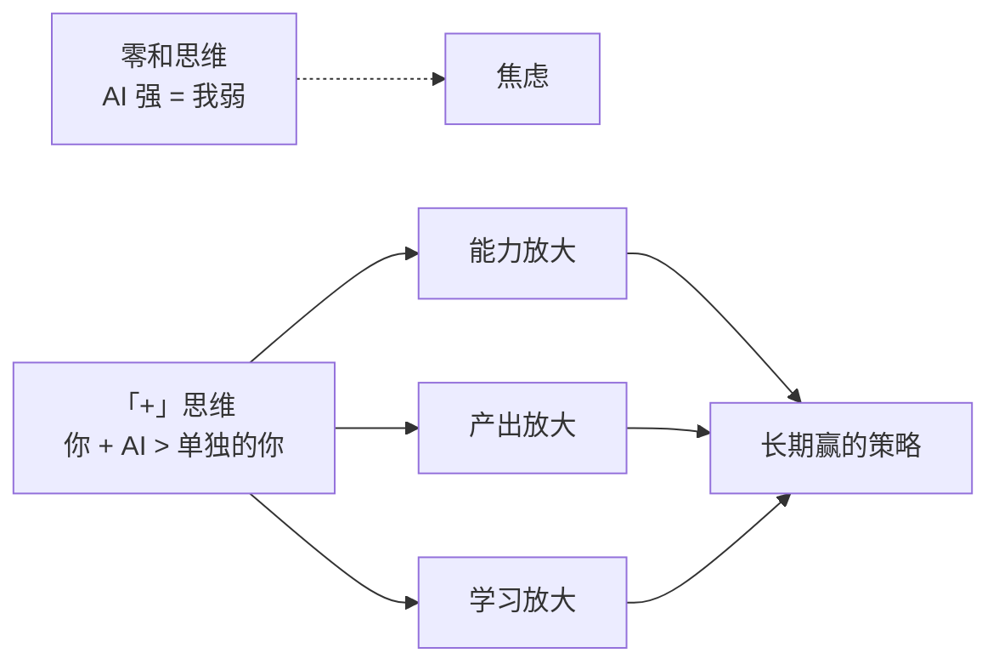

# AI 学习的 3 个心理坎 + 怎么过

> 🧗
> **这一篇专治"我学不下去"。读完你能：**
> - 识别自己卡在哪个心理坎
> - 明白这些坎都是正常的，不是你的问题
> - 有 3 个跨越方法，按需挑
> - 建立长期跟 AI 共处的健康心态

## 1. 3 个心理坎都长什么样

| **坎** | **典型表现** | **出现时机** |
|-|-|-|
| ① 自我替代焦虑 | "AI 都能写文章了，我学这个还有用吗？" | 第 1-2 周高发 |
| ② Prompt 天赋焦虑 | "别人写 Prompt 一句话就出好结果，我写半天还废" | 第 3-5 周高发 |
| ③ 停滞焦虑 | "学了一段时间感觉没进步，但又说不出哪儿没进步" | 第 6-8 周高发 |

## 2. 心理坎 1：自我替代焦虑

**典型想法：**"AI 都能写文章 / 写代码 / 翻译了，我学这个干嘛？我会不会被 AI 替代？"

**这种焦虑的根：**把 AI 看成"对手"，而不是"工具"。在历史上，每一次工具升级（从笔到键盘、从马到车）都有人焦虑被替代，最终被替代的不是会用新工具的人，而是不会用的人。

> 💡
> **跨越方法：**换提问方式——不再问"AI 会不会替代我"，改问"我会不会被那些会用 AI 的人替代"。这个问题答案非常清晰：会，除非你也会。

## 3. 心理坎 2：Prompt 天赋焦虑

**典型想法：**"别人写一句话 AI 就给出好结果。我写了 10 行还是垃圾。我是不是没这方面天赋？"

**真相：**没人是天生会写 Prompt 的。看起来"一句话出好结果"的人，背后是几百次试错 + 一份成熟的 Prompt 库 + 大量场景熟悉度。你看到的是冰山一角。

> 📈
> **跨越方法：**
> 1. 不要拿自己的"第 5 次试"对比别人的"第 500 次"
> 2. 开始建自己的 Prompt 库（参考 Prompt 怎么写才管用）——量变到质变
> 3. 看别人的 Prompt 抄改，而不是从 0 写
> 4. 计时：每天花 30 分钟写 / 改 Prompt，连续 4 周，必有手感

## 4. 心理坎 3：停滞焦虑

**典型想法：**"我学了 2 个月，感觉没什么进步。但又说不出哪没进步。"

**真相：**学 AI 是阶梯式进步，不是斜坡。你以为停滞的那段，往往是在"准备进入下一阶段"。常见停滞节点：

- 第 6 周：完成 5 场景实战后，不知道再做什么
- 第 10 周：Prompt 写得差不多了，不知道怎么再上一个台阶
- 第 16 周：开始接触 Agent / 自动化，但又不知道在哪用

## 5. 跨越坎的 3 个通用心态

> ⚡
> **3 个跨坎心态：**
> 1. **把 AI 当人合作，不是当工具用**——你不会怪键盘没让你"成为程序员"，但很多人会怪 AI 没让自己"成为高手"
> 2. **把目标定具体，不要"学好 AI"**——"我要用 AI 完成 X" 这种目标永远好过"我要精通 AI"
> 3. **把节奏定长，不是"30 天精通"**——半年扎实远好过 30 天速成。AI 这个领域 6 个月足够你成为身边人里的 top 10%

## 6. 长期心态：人 + AI 不是赢就是输

很多焦虑来自"零和"思维——AI 强 = 我弱。这是错的。看待 AI 应该是"+"思维：

- 你 + AI 的能力 > 你单独的能力
- 你 + AI 的产出 > 别人单独的产出
- 你 + AI 的学习速度 > 你单独学习速度

> 🎯
> **未来 5 年的现实：**"会用 AI 的人" vs "不会用 AI 的人"差距会被拉到极大。但"会用 AI 的人之间"差距比想象的小——因为大家都能用同样的工具。所以现在投入学习，性价比极高。

---

## 延伸阅读

- [01.2｜新手学习路径](../新手学习路径.md) — 回总览
- [01.3｜新手避坑清单](../新手避坑清单.md) — 卡住时的具体避坑

---

> 来源：飞书 · AI Spark 知识库 ｜ 原文（最新版）：<https://lcnniolukk80.feishu.cn/wiki/WJ31wL3LDixHbYktv86cjDdunyb> ｜ 归档：2026-06-04
