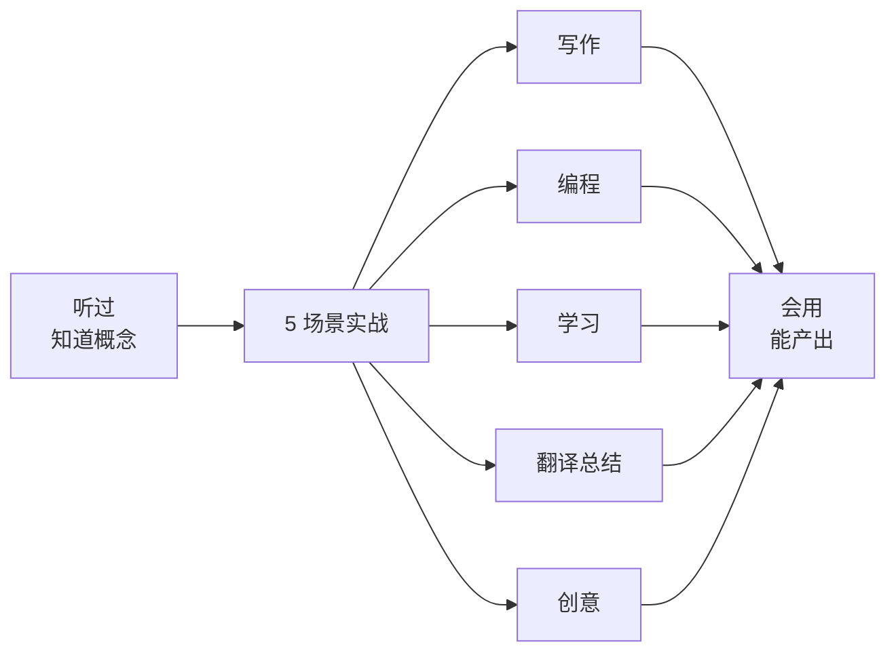
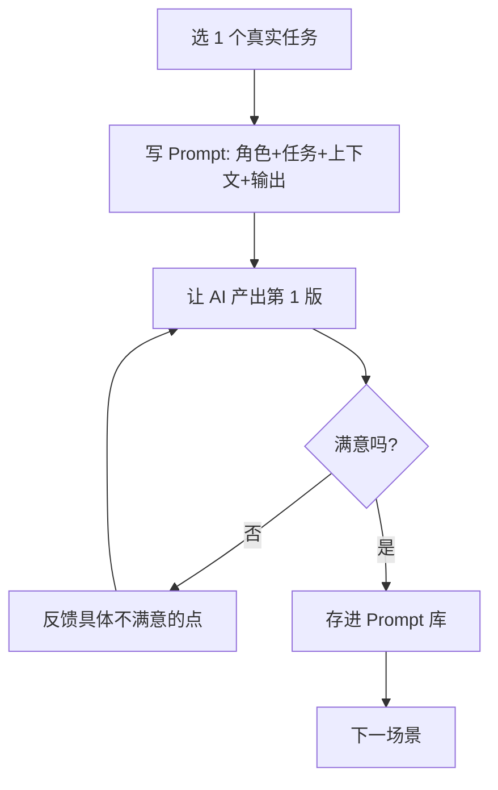
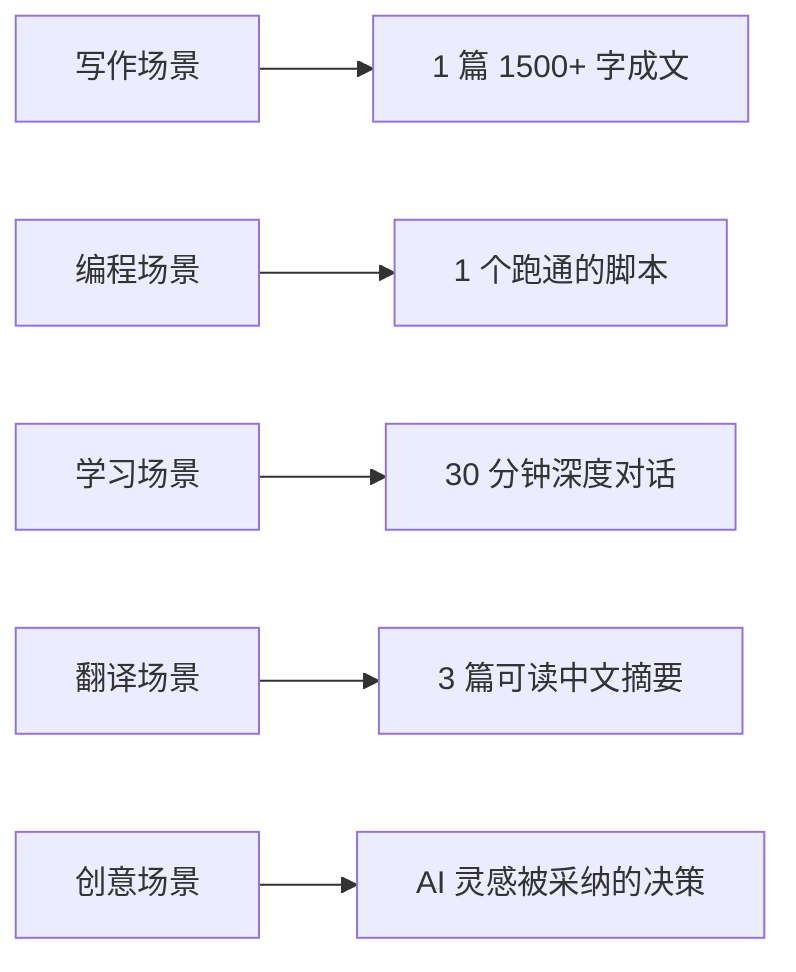

# 从「听过」到「会用」：5 个练习场景手把手

> 🎯
> **这一篇是从"听说过 AI"到"会用 AI 干活"的转换器。5 个场景每个手把手讲：**
> - 具体任务怎么定义
> - Prompt 怎么写
> - 结果质量怎么判断
> - 什么算"会了"的过关标志

## 1. 为什么"听过"和"会用"差这么远

很多人花一两周看了大量 AI 内容，但一打开对话框还是不知道写啥。原因：所有"听过"的知识都是描述性的，而"会用"是动作性的，二者之间隔着"动手实战"。

> 💡
> **关键差别：**"听过"是被动接收，"会用"是主动产出。5 个场景每个走完一次，你就从 0 跨到 1。

## 2. 场景 1：写一篇完整文章

**任务：**选一个你近期要写但还没动笔的话题，AI 协作完成全文。

| **步骤** | **Prompt 模板** |
|-|-|
| ① 出 5 个选题角度 | "我要写一篇关于 X 的文章，给我 5 个不同切入角度，每个角度 1 句话说清楚" |
| ② 选 1 个角度出大纲 | "按这个角度展开，给我一份 4 部分大纲，每部分 1 个核心观点" |
| ③ 分段写 | "展开第 1 部分，500 字，举 1 个真实例子" |
| ④ 校对 | "通读全文，找 3 个可以再优化的句子" |

**过关标志：**有 1 篇 1500+ 字的成文，自己满意能发出去。

## 3. 场景 2：写自动化脚本

**任务：**找一个你现在手动做的小任务，让 AI 帮你写脚本自动化。

> 💻
> **示例任务：**
> - 每天定时下载 X 上某个账号的最新推文
> - 把当月信用卡账单 PDF 解析成 Excel
> - 批量重命名文件夹里的 100 张照片
> - 每周自动汇总 Notion 数据库变化

**Prompt 模板：**"用 Python 写一个脚本：[任务描述]。输入是 [输入]，输出是 [输出]。运行环境是 macOS / Linux / Windows。给我完整代码 + 怎么跑。"

**过关标志：**有 1 个脚本能在你机器上跑起来，自己看懂每一行做什么。

## 4. 场景 3：当私教学新领域

**任务：**找一个你一直想搞懂但没敢碰的领域，让 AI 当 1 小时私教。

| **对话阶段** | **关键 Prompt** |
|-|-|
| ① 设定背景 | "你是 X 领域的资深专家。我完全是小白，请用零基础的方式解释" |
| ② 主题确定 | "我想搞懂 [具体话题]。先帮我列 5 个最基础的概念，每个 1 句话" |
| ③ 深入提问 | "概念 X 我没懂，能换一个类比说一遍吗？" |
| ④ 验证理解 | "我用我自己的话讲一遍，你判断有没有理解错" |
| ⑤ 延伸 | "我学到这一步，下一步该问什么问题" |

**过关标志：**能跟 AI 进行 30 分钟以上的深度对话，没"卡住"或"应付"的感觉。

## 5. 场景 4：翻译 + 总结英文资料

**任务：**找 3 篇英文文章 / 视频字幕 / 论文摘要，让 AI 翻译 + 总结。

**Prompt 模板：**

> 🌐
> 翻译："把以下英文翻成中文，保留专业术语原文，语气贴近原文风格："
> 总结："给我这篇文章的 3 段总结：① 核心论点 1 句话；② 3 条关键论据；③ 我应该记住什么"

**过关标志：**有 3 篇可读的中文摘要，你能给别人讲清楚原文讲什么。

## 6. 场景 5：头脑风暴 + 创意

**任务：**用 AI 帮你做选题 / 命名 / 方案比稿。

| **任务类型** | **Prompt 模板** |
|-|-|
| 选题 | "我做 X 行业，最近要做 5 个内容主题，按「话题热度 / 我的优势 / 长尾价值」三维度给我推 10 个候选" |
| 命名 | "给我一个 [产品 / 文章 / 项目] 起 10 个名字，分类：直接型 / 比喻型 / 反差型 / 中性" |
| 方案比稿 | "我有 2 个方案 A 和 B。给我对比表 + 各自最大风险 + 我应该问自己什么问题决策" |

**过关标志：**至少 1 次真实决策里，AI 给的灵感比你自己想的更好。

## 7. 5 场景完成后的能力

> ⚡
> **5 场景跑完，你具备这 5 个能力：**
> 1. 结构化产出（写作）
> 2. 问题自动化（编程）
> 3. 持续学习（私教）
> 4. 跨语言信息处理（翻译总结）
> 5. 决策辅助（创意 / 比稿）
> 这 5 个能力覆盖 80% 知识工作者的日常。下一步是把它们嵌入工作流。

---

## 延伸阅读

- [01.2｜新手学习路径](../新手学习路径.md) — 回总览
- [Prompt 怎么写才管用](../AI%20基础概念/Prompt%20怎么写才管用：四要素%20+%20反例对比.md) — 5 场景的 Prompt 基础

---

> 来源：飞书 · AI Spark 知识库 ｜ 原文（最新版）：<https://lcnniolukk80.feishu.cn/wiki/HDE3wk1AMid7QWkYpT8crsCtn1d> ｜ 归档：2026-06-04
