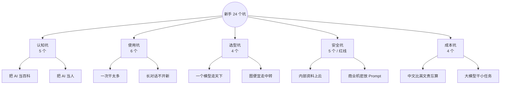
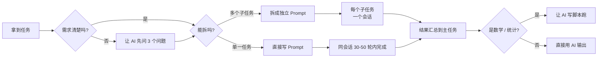
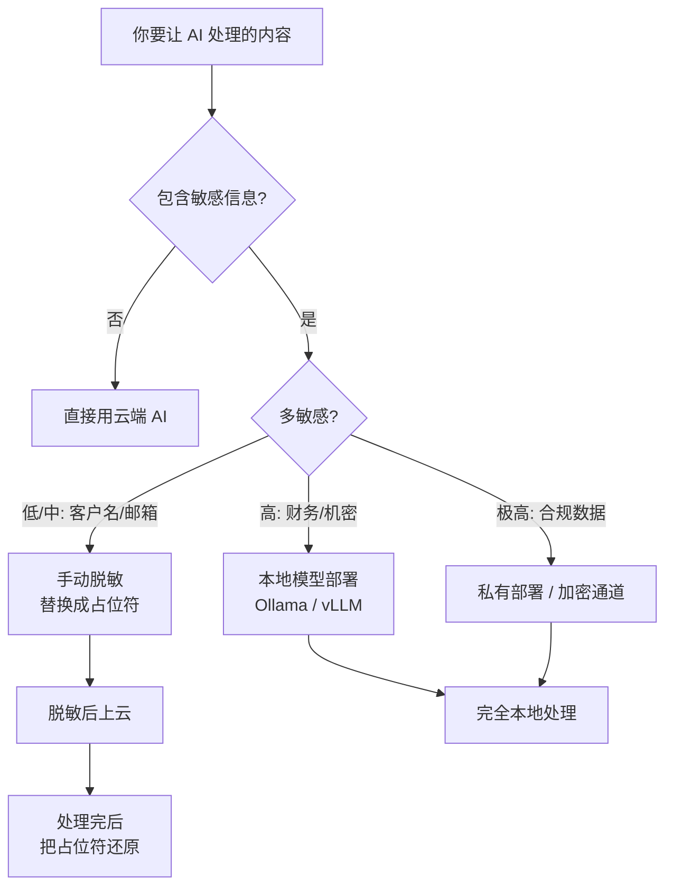
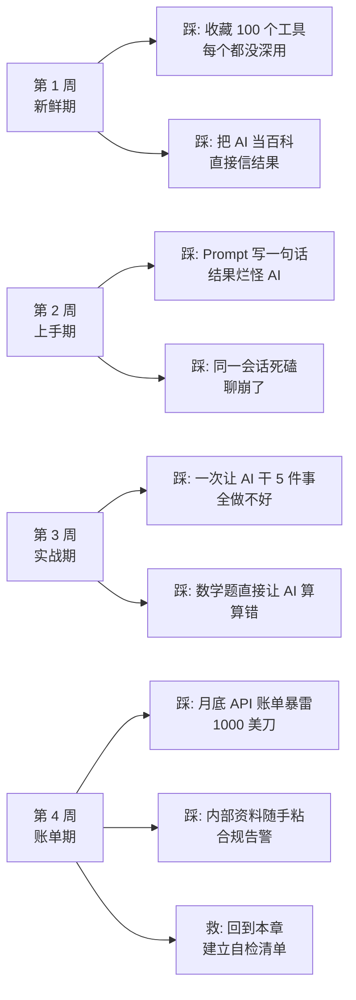
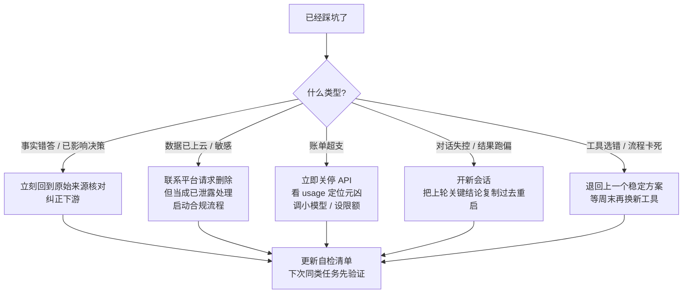

# 新手避坑清单

> 🚧
> **这一章帮你避开什么：**
> - 新手最常踩的 24 个具体坑（认知 / 使用 / 选型 / 安全 / 成本五大类）
> - 每个坑都给「为什么会踩」+「怎么避开」+「踩了怎么救」三段
> - 一份打印出来贴桌子上的「用 AI 前自检 10 条」
> - 新手 30 天最典型的踩坑路径地图，按月份对照

## 1. 五类最常踩的坑：先看分类

新手踩的坑虽然形式各异，根上能归到五类。理解分类比记每条具体坑更重要——因为新坑会出现，但根因不变。

| **类别** | **常见数量** | **代价** | **修复难度** |
|-|-|-|-|
| 认知坑 | 5 个高频 | 低（浪费时间） | 低（看完一篇就能改） |
| 使用坑 | 6 个高频 | 中（结果质量差） | 中（要练手感） |
| 选型坑 | 4 个高频 | 中（多花钱拿差结果） | 中（要试多个模型） |
| 安全坑 | 5 个高频 | 极高（合规 / 隐私事故） | 事后不可逆 |
| 成本坑 | 4 个高频 | 高（月底账单暴雷） | 中（要建预算监控） |

## 2. 认知坑：5 个最高频的错误理解

| **坑** | **为什么会踩** | **怎么避** |
|-|-|-|
| 把 AI 当百科全书 | AI 答得太自信，看起来像在查资料 | 所有事实 / 数字 / 引用都当"待验证"，回到原始来源核对 |
| 认为 AI 输出都是对的 | 没养成 verify 习惯，AI 错答看起来跟对答一样顺 | 关键决策前问自己"如果这句话是错的，代价是什么" |
| 觉得 Prompt 越长越好 | 误以为"信息越多越准" | 关键信息浓缩成 200 字内的指令，长上下文反而稀释注意力 |
| 认为模型越贵越好 | 把"参数大"等同于"全方位强" | 分场景选模型，日常任务用便宜模型，难任务才上顶配 |
| 觉得 AI 能"想清楚" | 把人脑思考过程投射到 AI 上 | AI 是概率预测器，不是"思考者"。需要思考的任务先让它写步骤 |

> 💡
> **最大的认知坑：**把 AI 当人。它不是助理，也不是搜索引擎——它是个超大概率预测器。理解这一点，前面 4 个坑会自动避开。

## 3. 使用坑：6 个最高频的操作错误

| **坑** | **具体表现** | **怎么避** |
|-|-|-|
| 同一会话聊太久 | 对话超 50 轮还在死磕，AI 开始前后矛盾 | 每 30-50 轮开新会话，把上轮关键结论复制到新会话开头 |
| 一次让 AI 干太多 | "帮我写文章 + 配图 + 起标题 + 想 SEO" | 拆成独立步骤，每个 Prompt 一个明确任务 |
| 给 AI 算数 / 统计 | "帮我算下这 100 个数的平均值" | 数学 / 统计交给代码（让 AI 写脚本跑），别让它直接算 |
| 不会让 AI 主动问 | 需求模糊时直接让 AI 开始，结果方向跑偏 | 开头加一句"如果有不确定的，先问我 3 个问题再开始" |
| 长任务不分段 | 让 AI 一口气写 5000 字技术文档，质量后半段塌方 | 分章节让它写，每段 1000-1500 字 |
| 不会保留好 Prompt | 每次重新摸索同一类任务的写法 | 建一份「Prompt 库」，跑通的就存起来复用 |

## 4. 选型坑：4 个最高频的工具 / 模型选错

| **坑** | **具体表现** | **怎么避** |
|-|-|-|
| 一个模型走天下 | 什么任务都丢给 ChatGPT 4o | 写文 Claude、写码 Codex / Claude Code、日常 GPT，分场景 |
| 追新太快 | 每出新模型就换，工作流刚搭好就拆 | 给新模型至少 1 周观察期，确认稳定再切换主力 |
| 追新太慢 | 还在用 GPT-3.5 干 2025 年的任务 | 每月看一次主流模型评测，老模型差距大就该换 |
| 不分 API 和订阅 | 买了订阅又开 API，重复付费 | 个人日常用订阅，要批量 / 自动化用 API |

> 💡
> **中转站特别提醒：**低价中转站经常用魔改限速 / 偷偷换模型 / 计费虚高。便宜 50% 的中转站可能背地里给你换成 GPT-3.5 假装 GPT-5。除非你能监控计费明细，不然别图便宜走中转。

## 5. 安全坑：5 个不能踩的红线

| **红线** | **具体表现** | **替代方案** |
|-|-|-|
| 内部资料直接喂 | 把公司文档原文粘进对话框 | 脱敏后再用，或部署本地模型（Ollama / vLLM） |
| 客户数据上云 | 客户姓名 / 手机 / 身份证粘进 Prompt | 替换成占位符（"客户 A"）再让 AI 处理 |
| 商业机密放 Prompt | 把没公开的财务 / 产品规划丢给 AI 改 | 本地模型 / 走私有部署 / 走加密 API |
| 密钥写代码 | 让 AI 写示例代码时把 API key 写死 | 所有密钥走环境变量，AI 写的代码先扫一遍 |
| 账号绑错 | 工作账号开通的订阅绑私人邮箱 / 手机 | 账号严格分离，订阅按归属选邮箱 |

> 💡
> **安全坑的特点：**事后不可逆。资料一旦上云就当成已泄露处理。这一类一定要"事前预防"，事后处理 99% 没用。

## 6. 成本坑：4 个让账单暴雷的原因

| **坑** | **具体表现** | **怎么避** |
|-|-|-|
| 中文比英文贵忘算 | 按英文 token 预算，跑中文超支 2 倍 | 中文项目预算 × 1.5 起步 |
| API 跑大模型小任务 | 分类 / 抽取这种小任务也用 Claude Opus | 小任务用 Haiku / GPT-4o-mini，省 10 倍 |
| 包月没算清 | 买了 200 块包月，结果月用量也就 50 块 | 先按量跑 2 个月，看真实用量再决定包不包 |
| 跑长任务忘断点 | 一次任务跑 100 万 token 没分段，跑失败重头来 | 每 10K token 切一段，存中间结果 |

## 7. 新手 30 天典型踩坑路径

把上面所有坑按"普通新手会按什么时间顺序踩"画一遍。这张图基本就是 80% 新人前 30 天的真实路径。

## 8. 「用 AI 前自检」10 条清单

> ✅
> **每次开新任务前过一遍，能避掉 80% 常见坑：**
> 1. 这事是 AI 真的擅长，还是我觉得它该会？
> 2. 有没有敏感信息？粘进去前脱敏没？
> 3. 这个任务该用哪个模型？不是哪个最贵
> 4. Prompt 有没有交代清楚：角色 / 任务 / 上下文 / 输出？
> 5. 结果是事实类的吗？怎么验证？
> 6. 我有没有时间核对它给的关键数字 / 引用？
> 7. 同样的任务我是不是已经有现成的 Prompt 可用？
> 8. 这一轮对话累计 token 是不是快超窗口？
> 9. 这一轮 API 费用大概多少？我月预算还剩多少？
> 10. 如果 AI 这次答错了，下游会有什么损失？

## 9. 踩坑后的自救：决策树

已经踩了坑，先按这棵树定位严重程度，再决定怎么救。

## 10. 避坑工具汇总

| **场景** | **工具 / 做法** |
|-|-|
| 预算 / 用量监控 | 各家 API 后台都有 usage 页，每天看一次；超阈值告警 |
| 敏感信息脱敏 | 手动替换关键字段成占位符，或用本地脱敏脚本 |
| 模型对比试用 | OpenRouter / Poe 一个界面试多个模型 |
| Prompt 库管理 | Obsidian / Notion 建一份 markdown 库，按场景分类 |
| Token 计算 | OpenAI Tokenizer 网页版 / tiktoken Python 库 |
| 本地模型部署 | Ollama（最简单）/ LM Studio（带 GUI）/ vLLM（生产） |

---

## 延伸阅读

- [01.1｜AI 基础概念](AI%20基础概念.md) — 理解概念能避开认知类坑
- [Token 和上下文窗口](AI%20基础概念/Token%20和上下文窗口：为什么%20AI%20会「忘」前面说过的话.md) — 成本和长对话相关坑都在这
- [Prompt 怎么写才管用](AI%20基础概念/Prompt%20怎么写才管用：四要素%20+%20反例对比.md) — 使用类坑大半跟 Prompt 写法相关
- [AI 幻觉：5 个减幻招式](AI%20基础概念/AI%20幻觉：为什么会胡说%20+%205%20个减幻招式.md) — 事实类错答的根因和救法
- [高强度实测 6 大 AI 模型](../02｜AI%20工具与大模型/工具测评/高强度实测%206%20大%20AI%20模型：Claude%20写文最强，但我写代码不选它.md) — 选型坑实战参考

---

> 来源：飞书 · AI Spark 知识库 ｜ 原文（最新版）：<https://lcnniolukk80.feishu.cn/wiki/Aq7FweDT3iRXt5kOjvhcCqdTnCg> ｜ 归档：2026-06-04
