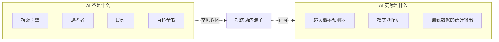
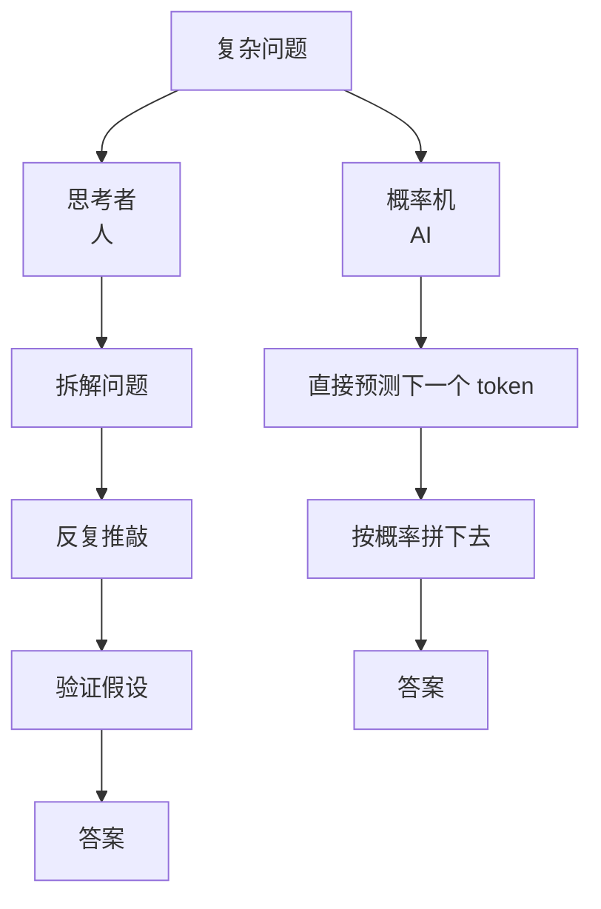
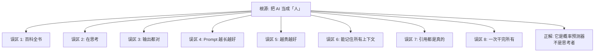

# 8 个认知误区：AI 不是百科全书，它是概率机

> 🧠
> **这一篇深挖 8 个新手最常见的 AI 认知误区。每个误区给：**
> - 典型表现（你是不是中招了？）
> - 为什么会这么想（心理根源）
> - 正确理解 + 实战手段

## 1. 误区 1：把 AI 当百科全书

**表现：**有问题就问 AI，把它的答案当查到的"事实"。

**根因：**AI 答得太自信，看起来像"知道"。但 AI 本质是概率预测器——它在算"什么样的回答最可能"，不是"什么样的回答是对的"。

**正解：**所有具体事实（日期、数字、人名、引用）都当作"待验证"，回原始来源核对。

## 2. 误区 2：以为 AI 在"思考"

**表现：**问完一个复杂问题等 AI 给"思考后"的答案。

**根因：**把人脑思考过程投射到 AI 上。实际上 AI 是"一次生成一个 token"，没有真正意义上的"思考-反思-再回答"的过程。

**正解：**需要思考的问题，明确要求 AI 把"步骤"写出来（思维链），它的"思考"才被显式化了。

## 3. 误区 3：AI 输出都是对的

**表现：**看到 AI 答得很顺，就跳过 verify 直接用。

**根因：**错答和对答看起来都同样"流畅"——这是 LLM 的副作用。

**正解：**关键决策前问自己"如果这句话是错的，代价是什么"，代价高就必须 verify。

## 4. 误区 4：Prompt 越长越好

**表现：**为了"信息充分"，把超长背景塞进 Prompt。

**根因：**误以为"信息越多越准"。实际相反——长 Prompt 让 AI 注意力分散，关键指令容易被稀释。

**正解：**关键指令浓缩到 200 字内，背景资料放最前面（让 AI 读完后看到指令）。

## 5. 误区 5：模型越贵越好

**表现：**所有任务都丢给最贵的旗舰模型。

**根因：**把"参数大"等同于"全方位强"。事实是不同模型在不同任务上各有专长。

**正解：**分场景选——写文 Claude，写码 Codex / Claude Code，日常 GPT，分类抽取用 Haiku。

## 6. 误区 6：AI 能记住所有上下文

**表现：**同一会话聊 100 轮，期待 AI 还记得开头说的话。

**根因：**没意识到上下文窗口是物理限制。超出窗口的对话会被静默丢弃。

**正解：**长对话超过 30-50 轮开新会话，把上轮关键结论复制到新会话开头。

## 7. 误区 7：AI 给的代码 / 数字 / 链接都是真的

**表现：**AI 给一个函数名 / API / 论文引用，直接复用。

**根因：**不知道 AI 编引用 / 编 API / 编数字的频率有多高。

**正解：**所有 AI 给的"具体可执行的东西"都跑一遍 / 查一遍：代码跑，链接点，数字核。

## 8. 误区 8：让 AI 一次干完所有事

**表现：**"帮我写文章 + 配图 + 起标题 + 想 SEO + 发出去"。

**根因：**看到 AI 强大，就想最大化使用。但任务越多越杂，每项质量都塌方。

**正解：**拆成独立子任务，每轮一个 Prompt 一件事。

## 9. 8 个误区的共同根源

> 💡
> **共同根源：**把 AI 当成"人"在用。它不是助理，不是搜索引擎，不是"思考者"。它是一个超大的概率预测器。理解这一点，前面 8 个误区会自动避开。

---

## 延伸阅读

- [01.3｜新手避坑清单](../新手避坑清单.md) — 回到本章总览
- [01.1｜AI 基础概念](../AI%20基础概念.md) — 概念基础
- [AI 幻觉：5 个减幻招式](../AI%20基础概念/AI%20幻觉：为什么会胡说%20+%205%20个减幻招式.md) — 误区 3 / 7 的根因和救法

---

> 来源：飞书 · AI Spark 知识库 ｜ 原文（最新版）：<https://lcnniolukk80.feishu.cn/wiki/C75pwxXkmiYmljkryA4c0Y8vntc> ｜ 归档：2026-06-04
