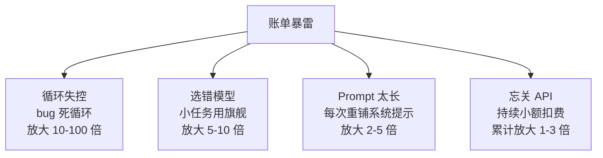
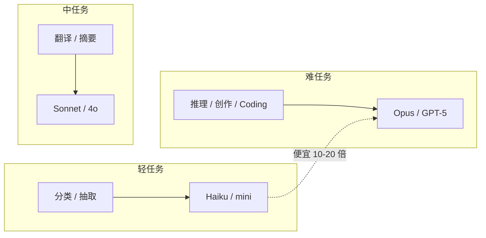
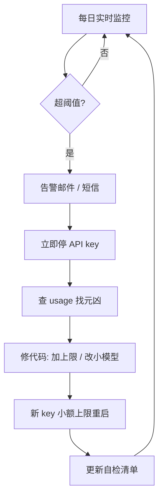

# AI 时代的成本陷阱：怎么用不烧光预算

> 💰
> **这一篇深挖 AI 工具的"账单暴雷"机制。读完你能：**
> - 识别成本暴雷的 4 个典型路径
> - 理解 token 计价为什么中文这么贵
> - 设计大小模型分工方案
> - 建立月度成本监控 + 紧急刹车流程

## 1. 成本暴雷的 4 条典型路径

| **路径** | **典型场景** | **放大倍数** |
|-|-|-|
| 循环失控 | 脚本调 API 没设上限，bug 死循环 | 10-100 倍 |
| 选错模型 | 小任务也用旗舰模型 | 5-10 倍 |
| Prompt 太长 | 每次都重新铺设超长系统提示词 | 2-5 倍 |
| 忘关 API | 跑完测试忘记关，每天扣费 | 1-3 倍但持续 |

## 2. Token 计价：中文为什么这么贵

大模型按 token 计费。中文一个汉字 ≈ 1.5 token，英文一个单词 ≈ 0.75 token。同样意思的文本，中文 token 是英文的 2 倍左右。

> 💡
> **实战意义：**跑中文项目，预算按英文项目 × 1.5-2 估。如果是技术文档（大量代码混中文），可能 × 2.5。

## 3. 大模型 / 小模型怎么分工

| **任务类型** | **推荐模型** | **大约价差** |
|-|-|-|
| 分类 / 抽取 / 简单改写 | Claude Haiku / GPT-4o-mini | 比旗舰便宜 10-20 倍 |
| 翻译 / 摘要 / 一般问答 | Claude Sonnet / GPT-4o | 中等 |
| 复杂推理 / 创作 / Coding | Claude Opus / GPT-5 | 最贵但效果最稳 |

> ⚡
> **分工原则：**能用小模型的绝不用大的。把"分类 → 抽取 → 改写"这种轻任务全部下沉到 Haiku / mini，账单立刻砍掉 70-80%。

## 4. 订阅 vs API 怎么选

- **个人月用量 < 500 万 token：**订阅最划算（20 美刀包月）
- **开发 / 批量 > 500 万 token：**API 更经济，但要管预算
- **混合：**日常用订阅，批量任务走 API，账户严格分离

## 5. 闲置成本和遗忘成本

> 💡
> **4 种常见"忘记"成本：**
> 1. 开了 API 测试没关，每天小额扣费持续累计
> 2. 买了订阅没用，自动续费几个月才发现
> 3. 开了向量数据库 / 云函数没关，月底账单暴雷
> 4. 多个 AI 服务月费叠加（ChatGPT + Claude + 中转 + 各种小工具），总额失控

## 6. 月度成本监控 + 紧急刹车

**三层监控机制：**

1. **实时层：**API 平台设硬上限（hard cap），超过自动停服务
2. **每日层：**每天看一次 usage 页面，超阈值发邮件 / 短信告警
3. **每月层：**月底统一对账，识别"花得不值"的服务砍掉

**紧急刹车流程（已经超支）：**

1. 立即停掉所有 API key（最快的止血手段）
2. 查 usage 找出元凶（哪个模型 / 哪个时段 / 哪个 IP）
3. 修代码：加上限、加 retry 控制、缩小模型
4. 重新签 API key，先以小额上限重启
5. 更新自检清单，避免下次同样的坑

---

## 延伸阅读

- [01.3｜新手避坑清单](../新手避坑清单.md) — 回到本章总览
- [Token 和上下文窗口](../AI%20基础概念/Token%20和上下文窗口：为什么%20AI%20会「忘」前面说过的话.md) — token 计费的根
- [高强度实测 6 大 AI 模型](../../02｜AI%20工具与大模型/工具测评/高强度实测%206%20大%20AI%20模型：Claude%20写文最强，但我写代码不选它.md) — 选模型实战

---

> 来源：飞书 · AI Spark 知识库 ｜ 原文（最新版）：<https://lcnniolukk80.feishu.cn/wiki/J73owwF8niB5lLkhCqRc3k7EnRp> ｜ 归档：2026-06-04
