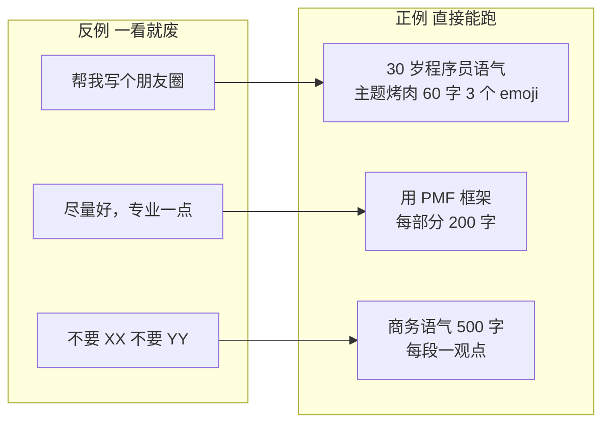
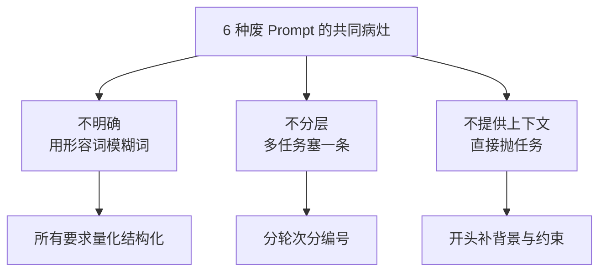

# Prompt 反面教材：6 种一看就废的写法

> 🚫
> **这一篇是 Prompt 怎么写才管用 的反面版。读完你能：**
> - 识别 6 种一看就废的写法
> - 看到自己的 Prompt 立刻知道哪儿不对
> - 掌握"病因诊断 + 处方"的修复流程
> - 分清 6 种废写法的共同病灶

## 1. 反例 1："帮我写个 XX"

**原文：**"帮我写个朋友圈"。

**病灶：**没角色、没上下文、没输出要求。AI 默认按最广泛、最 generic 的方式回答。

**处方：**角色 + 任务 + 上下文 + 输出 四要素至少补 2-3 个。"帮我以一个 30 岁程序员的语气写一条朋友圈，主题是周末烤肉翻车，自嘲风，60 字内，3 个 emoji"。

## 2. 反例 2："尽量好"、"专业一点"

**原文：**"帮我写一份产品方案，尽量专业"。

**病灶：**"好"和"专业"是没有客观标准的形容词。AI 不知道你的"专业"是什么样子。

**处方：**把抽象要求拆成可量化指标——"用 PMF 框架展开，每部分 200 字，附 1 个真实公司案例"。

## 3. 反例 3：负面指令为主

**原文：**"不要太啰嗦、不要用 emoji、不要太口语化、不要太正式"。

**病灶：**AI 只知道不要做什么，不知道要做什么。负面指令越多越不知道答什么。

**处方：**正面指令为主，负面指令限 1-2 条作为补充。"用专业商务语气、500 字、每段一个观点；避免用感叹号"。

## 4. 反例 4：5 个任务塞一条

**原文：**"帮我写文章 + 配图提示词 + 起 3 个标题 + 想 5 个 SEO 关键词 + 检查语法"。

**病灶：**任务越多 AI 越容易漏、互相影响、质量塌方。

**处方：**拆成独立轮次，每轮一件事。或者明确编号"任务 1: xxx；任务 2: yyy"让 AI 一项项做。

## 5. 反例 5："按你最擅长的方式回答"

**原文：**"用你最擅长的方式给我写一份分析"。

**病灶：**主动放弃控制权。AI"擅长"什么是它说的，每次都不一样，结果完全不稳定。

**处方：**明确告诉它结构。"分三部分：现状 / 问题 / 建议；每部分 200 字；用 H2 标题分段"。

## 6. 反例 6：不提供上下文

**原文：**"帮我把这段代码重构一下"（直接粘代码）。

**病灶：**AI 不知道这段代码是什么场景的、有没有约束、要保留什么。

**处方：**开头补一段背景——"这是一个支付接口的核心逻辑，单机 RT 必须 < 50ms，不能改函数签名。请重构成可并发的，保留所有现有测试通过"。

## 7. 6 种废写法的共同病灶

| **共同点** | **具体表现** | **核心修复** |
|-|-|-|
| 不明确 | 用形容词 / 模糊词 / 让 AI 自由发挥 | 所有要求量化、结构化 |
| 不分层 | 多任务塞一条、多类指令混杂 | 分轮次、分编号、分类型 |
| 不提供上下文 | 直接抛任务，不交代背景 | 开头一段背景，把约束写清楚 |

> 💡
> **修复流程：**看到不顺的 AI 输出，先回头检查 Prompt——99% 的"AI 不行"其实是"Prompt 不行"。

---

## 延伸阅读

- [01.3｜新手避坑清单](../新手避坑清单.md) — 回到本章总览
- [Prompt 怎么写才管用](../AI%20基础概念/Prompt%20怎么写才管用：四要素%20+%20反例对比.md) — 正面教材
- [Token 和上下文窗口](../AI%20基础概念/Token%20和上下文窗口：为什么%20AI%20会「忘」前面说过的话.md) — 关键指令位置怎么影响 AI

---

> 来源：飞书 · AI Spark 知识库 ｜ 原文（最新版）：<https://lcnniolukk80.feishu.cn/wiki/YcRewuYGTiAutBkcCwhckBk6ntb> ｜ 归档：2026-06-04
