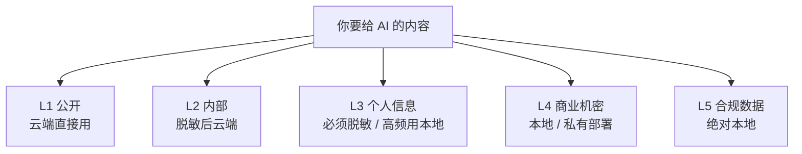
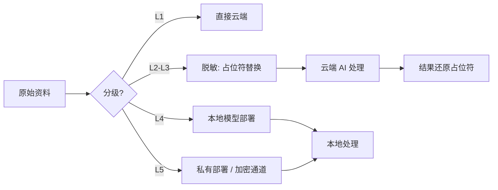
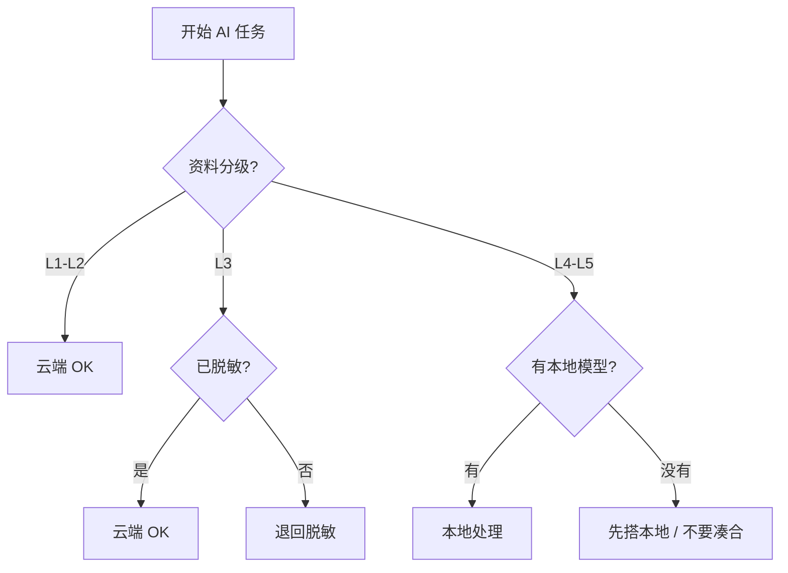

# 敏感信息脱敏指南：哪些信息绝对不能粘进对话框

> 💡
> **这一篇专治"随手把内部资料粘进 AI 对话框"。读完你能：**
> - 把任何信息按 5 级分级，立刻判断能不能上云
> - 知道脱敏的 4 种实战手段
> - 会选本地模型部署方案（Ollama / vLLM / LM Studio）
> - 用一份合规检查清单走完每次 AI 任务

## 1. 数据上云后会去哪

把内容粘进 ChatGPT / Claude 对话框时，数据流是这样的：你的输入 → API 服务器 → 可能进训练数据 → 可能被工程师查看（debug 时） → 可能进缓存。各家政策不同，但"不进训练"和"绝对不被人看"是两回事。

> 💡
> **关键认知：**"勾选不用于训练"≠"不被任何人接触"。客服 / 工程师 / 合规审查仍可能访问。所以敏感数据上云一律按"已泄露"处理。

## 2. 5 类敏感信息分级

| **级别** | **例子** | **处理方式** |
|-|-|-|
| L1 公开 | 公开网页 / 已发布文章 / 开源代码 | 云端 AI 直接用 |
| L2 内部 | 公司流程 / 一般业务文档 | 脱敏后云端用 |
| L3 个人信息 | 客户姓名 / 邮箱 / 手机 | 必须脱敏；高频用本地模型 |
| L4 商业机密 | 未公开财务 / 战略 / 客户合同 | 本地模型 / 私有部署 |
| L5 合规数据 | 医疗 / 金融 / 身份证 / 银行卡 | 绝对本地处理，禁止任何云端 AI |

## 3. 脱敏的 4 种实战手段

| **手段** | **怎么做** | **适合** |
|-|-|-|
| 占位符替换 | "张三 13800138000" → "客户 A {手机}" | 个人信息批量处理 |
| 类别抽象 | "工商银行" → "国有大行" | 不影响 AI 理解结构的场景 |
| 哈希 / 加密 | 身份证号 MD5 后再粘 | 只需要 AI 区分但不需要还原 |
| 切片处理 | 长文档只把不敏感段落抽出来 | 大部分内容公开、只有几段敏感 |

## 4. 本地模型怎么选

| **方案** | **难度** | **能力** | **适合** |
|-|-|-|-|
| Ollama | 极低（一行装好） | 跑 Llama / Qwen / DeepSeek 7B-70B | 个人 / 小团队、Mac M 系列 |
| LM Studio | 低（带 GUI） | 同上但有可视化界面 | 不熟命令行的人 |
| vLLM | 中（要懂 Python / Docker） | 生产级推理服务 | 企业内部 AI 服务 |
| 私有部署 API | 高（合同 + 工程） | 跟主流模型对齐的能力 | 合规要求极严的金融 / 医疗 |

## 5. 合规检查清单：每次 AI 任务前过一遍

> ✅
> **问自己 5 个问题：**
> 1. 这份资料是 L1 / L2 / L3 / L4 / L5 哪一级？
> 2. L3 以上：有没有脱敏？脱敏程度够吗？
> 3. L4 以上：有没有签云端 AI 的合规协议？没有的话改本地
> 4. L5：是否走完合规流程？敢不敢让法务看见这次操作？
> 5. 事后能不能审计追溯？（保留 Prompt 记录的合规要求）

## 6. 已经粘了敏感信息怎么办

1. 立刻在该平台请求删除会话记录（多数平台支持）
2. 但按"已泄露"处理——不要假设删除就万事大吉
3. 如果是 L4 / L5 数据：启动公司合规流程，通报相关方
4. 更新自检清单和团队规范，避免下次同样的人 / 同样的场景再踩

---

## 延伸阅读

- [01.3｜新手避坑清单](../新手避坑清单.md) — 回到本章总览
- [Claude Code 在大陆怎么稳定用](../../02｜AI%20工具与大模型/AI%20工具教程/Claude%20Code%20怎么稳定用：我用%20cc-switch%20接%20MiniMax%20跑通了一套替代方案.md) — 本地化部署实战参考

---

> 来源：飞书 · AI Spark 知识库 ｜ 原文（最新版）：<https://lcnniolukk80.feishu.cn/wiki/ELFuwTzgtiqJNskfAIrc1NnZn6e> ｜ 归档：2026-06-04
