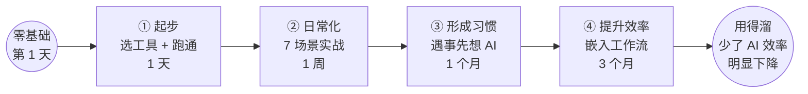
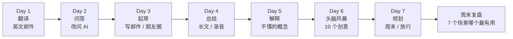
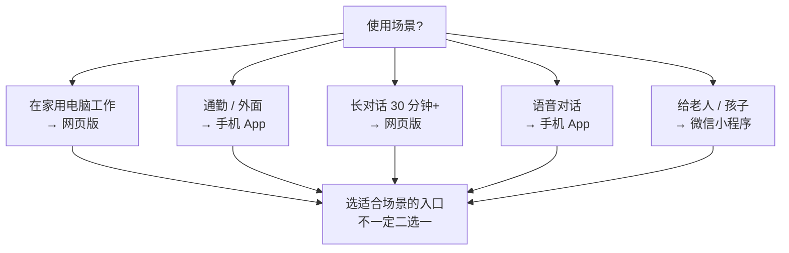
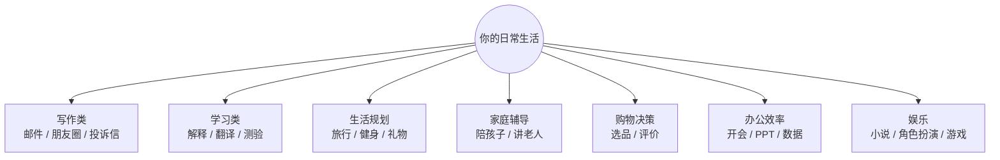
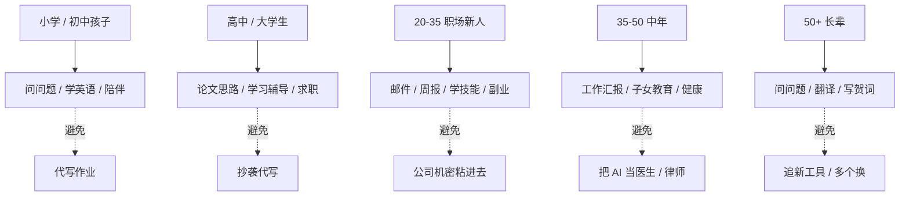
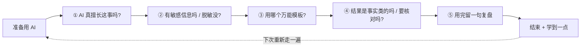

# 普通人如何开始用 AI

> 🎒
> **这一章专门写给"完全没基础、不写代码、对 AI 一知半解"的普通人。读完你能：**
> - 5 分钟选好第一个 AI 工具（不会再纠结）
> - 第一天就能用 AI 解决一个真实问题
> - 第一周每天 1 个场景，30 天养成习惯
> - 不写 Prompt 也能用：5 个万能模板套着用
> - 知道哪些事该用 AI、哪些事别用
> - 0 成本就能开始，什么时候该掏钱也讲清楚
> - 能给爸妈 / 朋友 / 同事讲清楚 AI 是什么

## 1. 这一章帮你回答的 7 个问题

1. 我应该用 ChatGPT / Claude / DeepSeek 还是别的？
2. 必须装 App 还是用网页就行？
3. 必须花钱才能用得好吗？
4. 我不会写 Prompt 是不是用不了？
5. 用 AI 会不会泄露我的隐私？
6. AI 答错了我看不出来怎么办？
7. 我家里老人 / 孩子能用吗？

## 2. 3 个月零基础 → 用得溜的总路径

| **阶段** | **核心动作** | **时长** | **过关标志** |
|-|-|-|-|
| ① 起步 | 选 1 个 AI 工具，5 分钟跑通 | 1 天 | 跟 AI 完成 1 次有用对话 |
| ② 日常化 | 第一周 7 个真实场景套用 | 1 周 | 每天用 AI 解决 1 件事 |
| ③ 形成习惯 | 遇到事先想"AI 能帮吗" | 1 个月 | 不主动想都会用 AI |
| ④ 提升效率 | 把 AI 嵌入手机 / 工作流 | 3 个月 | 少了 AI 觉得效率明显下降 |

> ⚡
> **最重要的建议：**不要纠结"选最好的"，选一个用熟比选最好的更关键。哪怕开始用的不是"最好"的那个，也比一直犹豫不开始强 10 倍。

## 3. 第一周：7 天 7 个场景

选好工具后第一周不要"随便玩"，按下面 7 个真实场景每天 1 个。每天 15-30 分钟。

| **天** | **场景** | **具体任务** |
|-|-|-|
| Day 1 | 翻译 | 翻译 1 篇英文邮件 / 文章 / 视频字幕 |
| Day 2 | 问答 | 把今天本来要"百度"的问题改问 AI |
| Day 3 | 起草 | 让 AI 帮你写一封邮件 / 短信 / 朋友圈 |
| Day 4 | 总结 | 把一段长文章 / 会议录音 / 长聊天让 AI 总结 |
| Day 5 | 解释 | 问 AI 一个你一直不懂的概念，让它用小学生能听懂的方式讲 |
| Day 6 | 头脑风暴 | 请 AI 帮你想 10 个 [任何东西] 的创意 |
| Day 7 | 规划 | 让 AI 帮你做一份周末 / 旅行 / 学习计划 |

## 4. 手机版还是网页版

很多人开始时纠结"是不是该装 App"。看下面这张图按你的使用场景选。

| **场景** | **推荐** |
|-|-|
| 在家用电脑工作 | 网页版（屏幕大、复制粘贴方便） |
| 通勤 / 在外面 | 手机 App（随时调起） |
| 对话长（> 30 分钟） | 网页版（看得清） |
| 语音对话 | 手机 App（语音输入更快） |
| 给老人 / 孩子用 | 微信小程序（最简单的入口） |

## 5. 不会写 Prompt：5 个万能模板

普通人不需要学复杂的 Prompt 工程。下面 5 个模板套着用，能解决 80% 日常场景。

> 📋
> **模板 1（求帮忙）：**"我要做 [任务]，[背景]。你帮我 [具体动作]。要求：[长度 / 风格 / 格式]。"
> **模板 2（求解释）：**"用小学生能听懂的方式解释 [概念]。给 2 个生活中的例子，不要用专业术语。"
> **模板 3（求建议）：**"我遇到 [情况]，纠结 [问题]。从 [3-5 个角度] 给我建议，每个角度 1 句话，最后说你最推荐哪个。"
> **模板 4（求改写）：**"把这段话改成 [新风格]，保留原意，长度差不多。"
> **模板 5（求列表）：**"列出 10 个 [类型]。要求：[筛选标准]。每个加 1 句话说明。"

## 6. 日常生活哪些事 AI 能干

下面这张地图把日常生活按"AI 能不能帮"画了一遍。打勾的都能用 AI 提速 2-5 倍。

| **类别** | **具体能用 AI 的事** |
|-|-|
| 写作类 | 邮件 / 短信 / 朋友圈 / 工作总结 / 演讲稿 / 投诉信 |
| 学习类 | 解释概念 / 整理笔记 / 出测验题 / 翻译文章 |
| 生活规划 | 旅行计划 / 健身计划 / 学习计划 / 节日礼物建议 |
| 家庭辅导 | 陪孩子做作业（先问 AI 思路自己想再做）/ 给老人讲解新事物 |
| 购物决策 | 选品对比 / 配件搭配 / 评价分析 |
| 办公效率 | 开会要点 / PPT 大纲 / 数据分析思路 |
| 娱乐 | 小说续写 / 角色扮演 / 游戏攻略 / 桌游解说 |

## 7. AI 帮你省的时间该用来干啥

> ⏰
> **这个问题比"AI 怎么用"更重要。**用 AI 后多出来的时间不该只是刷视频。建议：
> 1. 用 30% 学新东西（AI 可以反过来当老师）
> 2. 用 30% 陪人（家人 / 朋友）
> 3. 用 20% 思考 / 复盘（AI 干完的事你要还能讲清楚）
> 4. 用 20% 创造 / 输出（AI 替代不了你的"风格"）

## 8. 不同年龄段的入门策略

| **年龄段** | **首先用 AI 干的事** | **避开** |
|-|-|-|
| 小学 / 初中孩子 | 问问题 / 学英语 / 当陪伴 | 避免直接代写作业 |
| 高中 / 大学生 | 论文思路 / 学习辅导 / 求职辅导 | 避免抄袭 / 代写正式作业 |
| 20-35 职场新人 | 邮件 / 周报 / 学技能 / 副业起步 | 避免把公司机密粘进去 |
| 35-50 中年 | 工作汇报 / 子女教育 / 健康咨询 | 不要把 AI 当医生 / 律师 |
| 50+ 长辈 | 问问题 / 翻译 / 写贺词 | 避免追新工具，选 1 个稳的用 |

## 9. 0 成本 vs 付费版怎么选

很多人以为 AI 必须花钱。其实 2026 年 0 成本能做的事已经覆盖普通人 90% 需求。

| **目标** | **是否要付费** | **推荐方案** |
|-|-|-|
| 日常问答 / 翻译 / 写邮件 | 不要 | DeepSeek / Kimi / Claude 免费版 |
| 每天用 > 1 小时 + 长对话 | 建议付 | Claude Pro $20 / 月 |
| 专业写作 / 工作流 | 付 | ChatGPT Plus + Claude Pro 组合 $40 / 月 |
| 研究 / 处理大文档 | 付 | Gemini Advanced（1M 上下文） |
| 开发 / 自动化 | 付 API | Anthropic / OpenAI API 按量 |

> 💰
> **付费建议：**先用免费版跑 1 个月，确认确实"每天都用"，再考虑付费。很多人冲动付费 3 个月，后面账号都忘了。

## 10. 常见疑问 12 条

| **疑问** | **真实答案** |
|-|-|
| AI 会泄露我的隐私吗？ | 会，所有上云数据按"可能被人看到"处理。敏感信息脱敏或用本地模型 |
| AI 答错了我看不出来怎么办？ | 事实类的（日期 / 数字 / 引用）一律自己核对一遍 |
| AI 会替代我的工作吗？ | 不会被 AI 替代，但会被"会用 AI 的人"替代 |
| 用 AI 写东西算抄袭吗？ | 看场合。学术 / 工作正式场合需要披露；日常协作不算 |
| AI 一直在变，今天学了明天会不会过时？ | 底层逻辑稳定，工具会变。学的是逻辑，不是某个工具的按钮 |
| 电脑老 / 网慢 / 不懂英文也能用吗？ | 都能用。手机 + 中文工具就够普通人 90% 需求 |
| 给小孩用 AI 会让他变笨吗？ | 看怎么用。当老师问问题用 = 变聪明；让它代写 = 变笨 |
| AI 写的东西没"温度"？ | 对。所以人写 + AI 改 比 AI 写 + 人改 效果好得多 |
| AI 会有情绪吗 / 通用智能了吗？ | 没有。它是概率预测器，不是"思考者" |
| AI 能炒股 / 预测彩票吗？ | 不能。它对未来不可知事件没有特别能力 |
| 多个 AI 对比哪个最好？ | 没有"最好"，分场景选。写文 Claude，问答 GPT，中文 DeepSeek |

## 11. 半年后你能达到什么水平

认真照本章走半年的人，大概能到：

- 每天用 AI 至少 30 分钟
- 有自己的 5-10 个万能 Prompt
- 解决日常问题第一反应是"问 AI"
- 能给身边人介绍 AI 该用什么
- 知道哪些事 AI 帮不上忙，避免无效使用
- 不太在意"今天又出了什么新工具"——稳得住

## 12. 给身边人讲 AI 的 5 句话

> 💡
> **用这 5 句话能让长辈 / 朋友 / 同事快速听懂 AI：**
> 1. "它不是搜索引擎，更像一个能聊天的图书管理员"
> 2. "它会答错，所以重要事情你要自己再查一遍"
> 3. "它不知道今年发生的事，因为它的知识有截止日期"
> 4. "你问它就像问一个聪明实习生，问得越清楚答得越好"
> 5. "现在不用学也行，但 1 年后不会用就跟不会用手机一样"

## 13. 一份给自己贴桌子上的"用 AI 自检清单"

> ✅
> **每次用 AI 前过一遍：**
> 1. 这事 AI 真的擅长吗？
> 2. 有敏感信息吗？脱敏了吗？
> 3. 我用 5 个万能模板中的哪个？
> 4. 结果是事实类的吗？要不要核对？
> 5. 用完之后，能不能给自己留一句复盘？

## 14. 这一章子文章导览

- **第一天就能用上：5 分钟上手 AI 完全指南**——从注册到第一次对话手把手
- **手机上的 AI：3 个最佳方案 + 怎么选**——iPhone / Android / 微信版分别讲
- **5 个万能 Prompt 模板**——不用学就能套用
- **教爸妈 / 长辈用 AI 的 10 句话术**——让长辈 5 分钟上手
- **0 成本免费方案 + 付费升级阶梯**——钱花在刀刃上

---

## 延伸阅读

- [01.1｜AI 基础概念](AI%20基础概念.md) — 想懂得更深就读这章
- [01.2｜新手学习路径](新手学习路径.md) — 系统学习版
- [01.3｜新手避坑清单](新手避坑清单.md) — 避开新手 24 个坑
- [Prompt 怎么写才管用](AI%20基础概念/Prompt%20怎么写才管用：四要素%20+%20反例对比.md) — Prompt 进阶版
- [Token 和上下文窗口](AI%20基础概念/Token%20和上下文窗口：为什么%20AI%20会「忘」前面说过的话.md) — 为什么 AI 会"忘"

---

> 来源：飞书 · AI Spark 知识库 ｜ 原文（最新版）：<https://lcnniolukk80.feishu.cn/wiki/Kh0pwB80oiZ5MXkCXYBcVcTDnmc> ｜ 归档：2026-06-04
