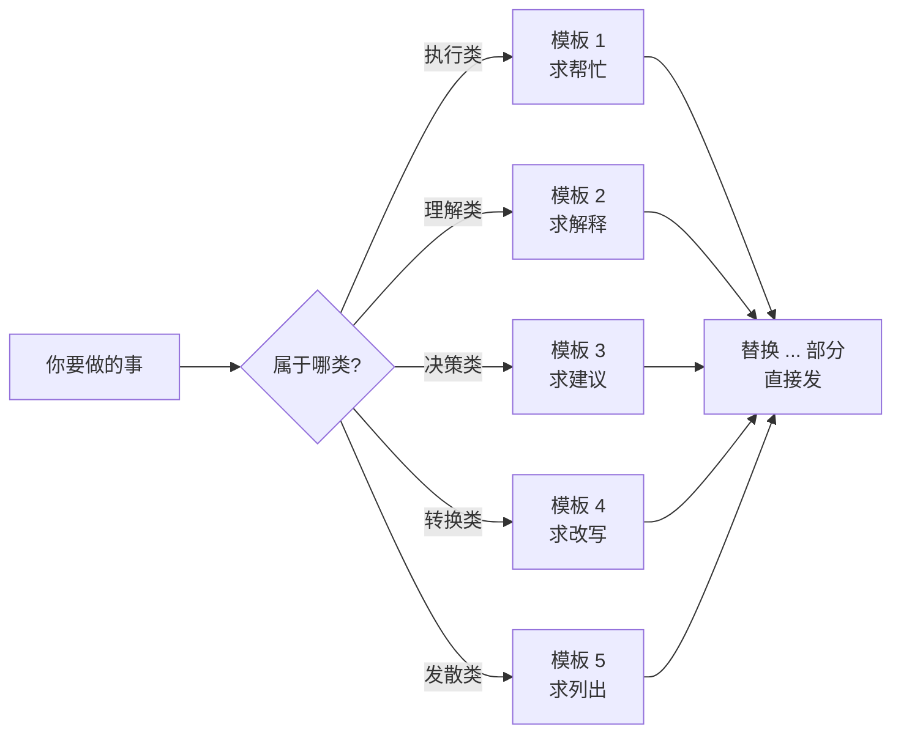
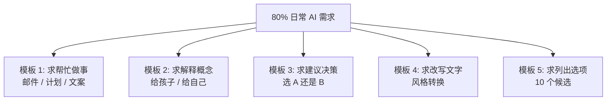
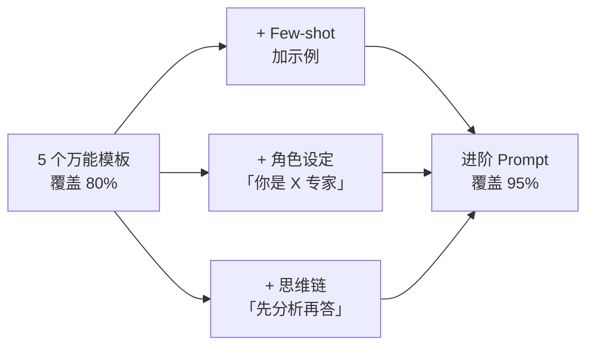

# 5 个万能 Prompt 模板（不用学就能用）

> 📋
> **这一篇给你 5 个直接套用的 Prompt 模板。读完你能：**
> - 不学复杂 Prompt 工程就能用好 AI
> - 5 个模板覆盖 80% 日常场景
> - 每个模板有 3 个实战例子，照搬就行
> - 等熟练后知道怎么再升级到进阶 Prompt

## 1. 为什么"模板"比"自由发挥"管用

很多人第一次写 Prompt 头一片空白——不知道写什么、怎么写。其实 80% 日常需求都能套到 5 类模板里。模板不是限制，是脚手架。

> 💡
> **模板的核心好处：**不用每次想"该怎么开头"。把 [...] 部分换成你的具体内容，直接发出去。

## 2. 模板 1：求帮忙做一件事

**模板：**"我要做 [任务]，[背景]。你帮我 [具体动作]。要求：[长度 / 风格 / 格式]。"

| **实战例子** |
|-|
| "我要写一封感谢面试官的邮件，刚刚面完一家科技公司。帮我写正式但不僵硬的版本，150 字左右。" |
| "我要做一份周末旅行计划，去成都两天。帮我安排经典景点 + 美食路线，按时间段排。" |
| "我要给同事过生日想一个祝福语，男同事 35 岁。帮我写 3 个版本：正式 / 调侃 / 走心。" |

## 3. 模板 2：求解释一个概念

**模板：**"用小学生能听懂的方式解释 [概念]。给 2 个生活中的例子，不要用专业术语。"

| **实战例子** |
|-|
| "用小学生能听懂的方式解释什么是区块链。给 2 个生活中的例子。" |
| "用小学生能听懂的方式解释为什么飞机能飞。给 2 个生活中的例子。" |
| "用小学生能听懂的方式解释复利效应。给 2 个生活中的例子。" |

## 4. 模板 3：求建议 / 帮你决策

**模板：**"我遇到 [情况]，纠结 [问题]。从 [3-5 个角度] 给我建议，每个角度 1 句话，最后说你最推荐哪个。"

| **实战例子** |
|-|
| "我遇到要不要换工作，纠结现在公司稳定但成长慢、新机会有挑战但风险高。从职业发展 / 经济 / 家庭 / 健康 4 个角度给我建议，每个角度 1 句话，最后说最推荐哪个。" |
| "我打算买台 1 万元以内的笔记本，纠结 MacBook Air 还是 Windows 高配。从生产力 / 软件兼容 / 续航 / 升级空间 4 个角度建议。" |
| "父母想旅游但身体一般，纠结去日本还是西安。从体力 / 文化 / 花费 / 风险 4 个角度建议。" |

## 5. 模板 4：求改写 / 优化文字

**模板：**"把这段话改成 [新风格]，保留原意，长度差不多。原文：[你的内容]"

| **实战例子** |
|-|
| "把这段话改成正式商务风格，保留原意，长度差不多。原文：[你的草稿]" |
| "把这段话改成自媒体小红书风格，加 3 个 emoji，长度差不多。原文：[你的文案]" |
| "把这段技术解释改成对外行的版本，保留核心信息，长度差不多。原文：[技术段落]" |

## 6. 模板 5：求列出选项

**模板：**"列出 10 个 [类型]。要求：[筛选标准]。每个加 1 句话说明。"

| **实战例子** |
|-|
| "列出 10 个适合中年人开始学的副业。要求：投入低、不用辞职、能在家做。每个加 1 句话说明。" |
| "列出 10 部豆瓣 8.5 分以上的悬疑电影。要求：剧情烧脑、不血腥、有反转。每个加 1 句话说明。" |
| "列出 10 本最适合 0 基础学心理学的书。要求：通俗、有案例、不超过 300 页。每个加 1 句话说明。" |

## 7. 5 个模板的覆盖关系

> 📊
> **每个模板能干什么类型的事：**
> - 模板 1：执行类（要 AI 帮你做）
> - 模板 2：理解类（要 AI 教你）
> - 模板 3：决策类（要 AI 帮你想）
> - 模板 4：转换类（要 AI 改写）
> - 模板 5：发散类（要 AI 列选项）
> 80% 日常需求落在这 5 类里。

## 8. 模板熟了之后怎么升级

用熟 5 个万能模板之后，你会自然想升级。升级的 3 个方向：

1. **加示例（Few-shot）**：在模板里加 1-2 个"我希望的输出长这样"
2. **加角色**：在开头加"你是 [某领域专家]"
3. **加思维链**：在结尾加"先分析再回答"

这些升级请看下面延伸阅读里的 Prompt 怎么写才管用。

---

## 延伸阅读

- [01.4｜普通人如何开始用 AI](../普通人如何开始用%20AI.md) — 回总览
- [Prompt 怎么写才管用](../AI%20基础概念/Prompt%20怎么写才管用：四要素%20+%20反例对比.md) — Prompt 进阶版（四要素 + Few-shot + CoT）
- [AI 幻觉 5 个减幻招式](../AI%20基础概念/AI%20幻觉：为什么会胡说%20+%205%20个减幻招式.md) — 用模板时配合减幻招式

---

> 来源：飞书 · AI Spark 知识库 ｜ 原文（最新版）：<https://lcnniolukk80.feishu.cn/wiki/FfHnwVFf6i46g0kWL2OcMXk3ndg> ｜ 归档：2026-06-04
