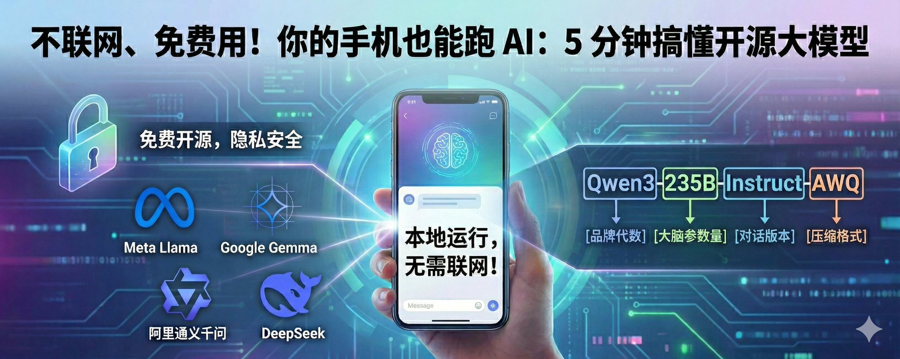
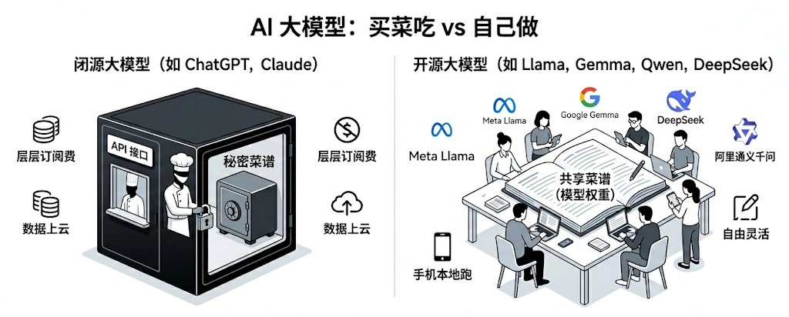
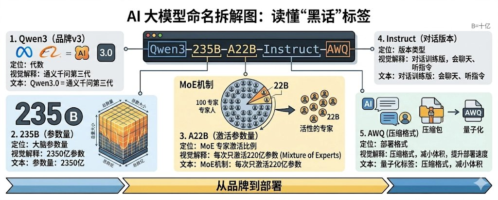
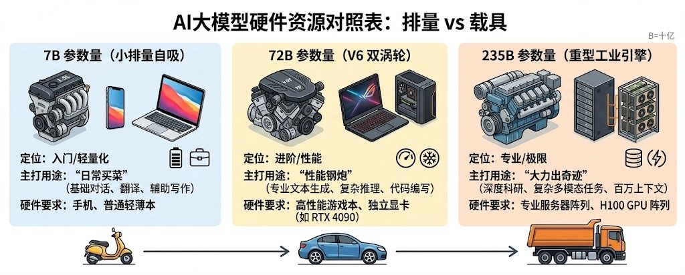
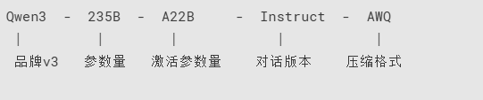
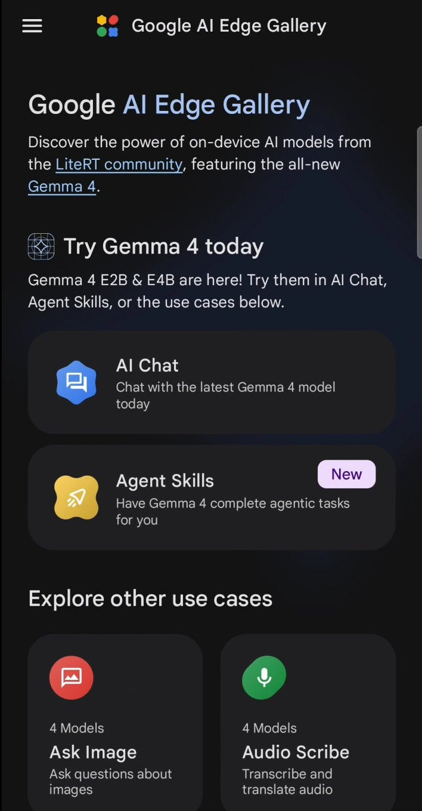

# 不联网、免费用！你的手机也能跑 AI：5分钟搞懂开源大模型

你平时用 AI 的时候，有没有遇到过这些尴尬瞬间：写着核心汇报文档，死活不敢复制进外部 AI 怕泄露公司机密；在高铁上没信号，想让 AI 帮个忙却集体罢工；更别提每个月动辄上百块的层层订阅费了。

## 你的手机，也能跑 AI 了

提到 AI，大多数人第一反应也是 ChatGPT——必须联网、必须注册、必须付费。

但你可能不知道，现在有些 AI 模型已经可以**直接装在手机上运行**了。不用联网，不用交订阅费，你和 AI 的对话完全留在手机里，一个字都不会传到云端。

Google 最近开源的 Gemma 4 模型就是其中的代表——专门针对手机和个人设备做了优化，安卓手机装上就能用。

这不是科幻，这是**开源大模型**正在做到的事。

而且不只是 Google，现在有一大批免费、开放、任何人都能用的 AI 大模型，能力已经非常接近甚至在某些方面超过了顶级商业模型。

## 到底什么是"开源大模型"？

打个比方：

- ChatGPT 就像一家高级餐厅，你只能点菜吃饭，不知道厨房里怎么做的。
- 开源大模型就像**把菜谱直接公开**——任何人都能看、都能照着做，甚至可以根据自己口味改良。

技术上说，就是这些公司把训练好的 AI 模型（包括代码和"大脑"）完全公开，免费下载。你可以在自己的电脑上运行，数据完全不用交给任何人。

## 现在都有谁在做？

开源大模型不是小作坊在搞，而是全球顶级科技公司在下场：

**Llama（Meta / Facebook）—— AI 界的“安卓系统”** 扎克伯格亲自推动的项目。最新的 Llama 4 采用了 MoE（混合专家）架构，分为 Scout、Maverick、Behemoth 三个版本，全球大量公司直接拿它来做自己的 AI 底座。

**Qwen / 通义千问（阿里巴巴）—— 最懂中国语境的“国产之光”** 迭代速度飞快，最新的 Qwen 3.6-Plus 支持百万级上下文窗口，中文能力一流，如果你要处理国内特色文案，它是绝对首选。

**DeepSeek（深度求索）—— 惊艳全球的“理科状元”与性价比之王** 2024-2025 年最大的黑马。一家中国创业公司，用更少的资源训练出了媲美顶级模型的效果，擅长代码与深度逻辑推理，直接震动了整个行业。最新的 DeepSeek-V3.2 论文和模型全部开源，连训练方法都告诉你。

**Gemma（Google）**🔥 —— 手机原生 AI 与轻量化王者 最近最火的开源模型之一。Google 把自家 Gemini 技术的精华"浓缩"成了开源版本，采用 Apache 2.0 协议完全开源。最大的亮点是**能在手机上跑**——Gemma 4 提供了专为手机设计的 E2B/E4B 边缘模型，支持 256K 超长上下文，安卓手机上就能离线运行。想象一下：你的手机自带一个不联网的私人 AI 助手，这事正在发生。

**Mistral（法国）—— 以小博大的“欧洲之光”** 欧洲的 AI 代表选手。以"小而精"著称，最新的 Mistral Small 4 支持 256K 上下文和多模态。证明了不一定要烧几十亿美元才能做出好模型。

## 看懂模型名称：那串字母数字到底是什么意思？

你可能在网上见过这样的名字：

> **Qwen3-235B-A22B-Instruct-AWQ**

是不是一脸懵？别慌，其实每一段都有固定含义，就像读一个商品标签一样。我们拆开来看：

品牌名 + 版本号

**Qwen3.6**、**Llama-4**、**DeepSeek-V3.2**、**Gemma-4**……

前面是"品牌"，后面的数字是"第几代"。就像 iPhone 16 一样——数字越大，通常越新越强。

参数量：B = 十亿

**7B**、**72B**、**235B**……

B 是 Billion（十亿）的缩写，代表模型"大脑"里有多少个参数。

- **7B** = 70 亿参数，轻量级，**普通的轻薄本或好一点的手机就能流畅运行**。
- **72B** = 720 亿参数，中等级别，**需要搭配独立显卡的高性能电脑（如游戏本）**。
- **235B** = 2350 亿参数，巨无霸，极其聪明但通常需要专业的服务器阵列。

**简单理解**：参数越多，模型越"聪明"，但也越吃硬件。就像发动机排量——3.0T 比 1.5T 动力更强，但也更费油。

MoE 里的 A 是什么？

有些模型名字里会出现 **A22B** 这样的标注，比如 Qwen3-235B-**A22B**。

这是一种叫 **MoE（混合专家）** 的技术。虽然模型总共有 2350 亿参数，但每次回答问题时只激活其中 220 亿个——就像一家医院有 100 个医生，但你看感冒只需要挂一个科室，不用 100 个医生同时上。

**好处**：模型很大很聪明，但跑起来没那么吃资源。

Instruct / Chat：会聊天的版本

- **Instruct** 或 **Chat** = 经过"对话训练"，能正常和你聊天
- **Base** = 原始版本，只会接话（像自动补全），不太会回答问题

**普通用户永远选 Instruct / Chat 版本**，Base 是给开发者做二次训练用的。

量化标签：模型的"压缩包"

**Q4_K_M**、**AWQ**、**GPTQ**、**GGUF**……

这些是"压缩格式"。原始模型动辄几十上百 GB，量化就是在尽量保持效果的前提下把体积缩小。

- **Q4** = 压缩到 4 位精度，体积约为原来的 1/4，效果损失很小
- **Q8** = 压缩到 8 位精度，体积约为原来的 1/2，效果几乎无损
- **AWQ / GPTQ** = 不同的压缩算法，效果差不多
- **GGUF** = 一种通用格式，主流直接支持

**简单理解**：就像图片有原图和压缩图。压缩后小很多，肉眼看差别不大。

一张图看懂命名

所以下次看到一个模型名字，你就知道了：

- **前面**看品牌和代数
- **中间**看大小（B 越大越强也越重）
- **后面**看是不是 Chat/Instruct 版、有没有压缩

不用全记住，记住这个套路就行。

## 跟我有什么关系？

你可能会想：我又不是程序员，这关我什么事？

关系其实很大：

**1. 免费用，不花钱** 不用订阅、不用付费。很多平台已经把这些开源模型做成了免费产品，直接打开网页就能用。

**2. 隐私更安全** 你和 AI 聊的每一句话，都不需要发送到别人的服务器。敏感的工作内容、私人对话，完全可以在本地处理。

**3. 不怕被"卡脖子"** 开源意味着没有人能突然把它关掉。即使某家公司倒闭了，模型依然存在，社区会继续维护。

**4. 选择更多** 不同模型各有所长——写代码用一个、写文章用一个、翻译用一个。你可以根据需求自由选择，而不是被一家公司锁定。

## 普通人怎么体验？

不需要任何代码背景，现在就能极低门槛地体验：

- **直接网页用（免安装）**：点开大厂官网（如通义千问、DeepSeek）或 HuggingChat，免费注册就能像用百度搜索一样轻松对话。

**想更进一步？把 AI 彻底装进属于自己的设备里：**

- **手机端测试（防劝退神器）**：强烈推荐在应用商店搜索官方带头做的 **Google AI Edge Gallery**（苹果/安卓均可），这款免费 App 已经完全内置了离线聊天和小模型，甚至能调用本地算力做图片识别，直接给你最纯粹的傻瓜式零配置体验。当然你要是不满足，老牌跨平台的 **PocketPal AI** 依然是备选好帮手。
- **电脑端部署（强悍的私人引擎）**：如果你想在电脑上畅快地搞生产力，直接用搜索引擎查 **Ollama** 的官网下载，安装就像装个普通的微信一样简单。完事后只需输入一两条命令，就能唤醒真正属于你自己的无限制本地大模型。

大家不要有任何“实操恐惧”，它们已经被大厂和开源大佬们打包得明明白白了。完全离线、完全免费，事实上的技术门槛比很多人想象的要低得多！

## 最后说两句

AI 的未来不会只属于一两家公司。

开源大模型的爆发，让 AI 从"少数人的特权"变成了"所有人的工具"。就像当年 Android 打破了 iPhone 的垄断一样，开源正在让 AI 变得更便宜、更多元、更自由。

下次有人跟你聊 AI，你可以轻描淡写地告诉他：AI 早就不是只有 ChatGPT 了，用起来门槛比想象的低得多。

> 💡 **互动时间**：你的电脑日常是用什么配置的（比如苹果本、轻薄本还是全大能游戏本）？大家有没有想要亲自在本地跑一个 AI 试试看但又卡在某一步的？欢迎在评论区聊聊你们的硬件环境或者遇到的困难，我会挑几个有代表性的问题手把手帮你出出主意！如果这篇科普真的让你搞懂了开源大模型，记得点赞收藏并分享给身边也想玩 AI 的朋友~

---

> 来源：飞书 · AI Spark 知识库 ｜ 原文（最新版）：<https://lcnniolukk80.feishu.cn/wiki/HwWMwEnMjipzzZkAS9rcizOTnzM> ｜ 归档：2026-06-04
