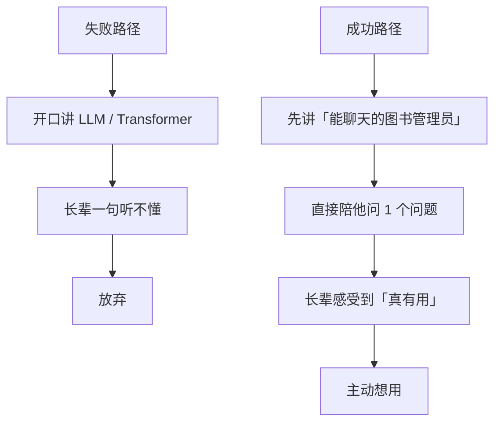
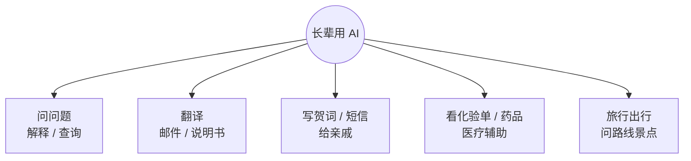
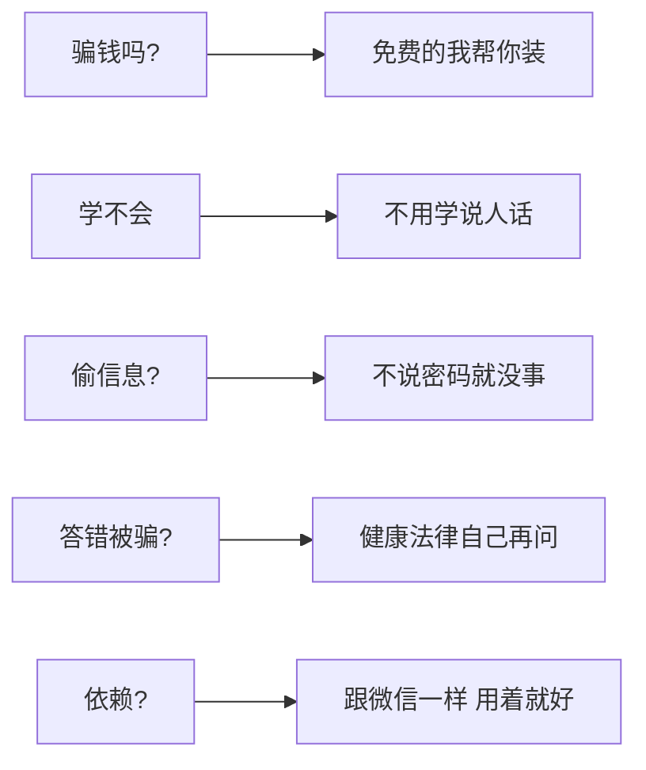

# 教爸妈 / 长辈用 AI 的 10 句话术

> 💡
> **这一篇给你 10 句话术 + 应对长辈最常见的反对。读完你能：**
> - 用 10 句话让爸妈秒懂 AI 是什么
> - 知道 5 个长辈最实用的 AI 场景
> - 应对"AI 是不是骗钱的"等常见反对
> - 3 个月让长辈把 AI 当成日常工具

## 1. 为什么直接讲不通

很多人尝试给爸妈讲 AI 时，开口就是"它是大语言模型，靠 Transformer 架构..."。长辈一句听不懂直接放弃。

> 💡
> **关键认知：**教长辈不是讲清楚"AI 是什么"，是让他们感受到"AI 能帮我什么"。先用，后理解。

## 2. 10 句话术（按场景分类）

| **场景** | **话术** |
|-|-|
| 第一次解释 | 1. "它就是一个能聊天的图书管理员，啥都能问" |
| 第一次解释 | 2. "比百度好用，因为它能直接给你答案，不用自己挑链接" |
| 降低门槛 | 3. "你用过语音输入吗？跟那个差不多，说话就行" |
| 降低门槛 | 4. "你不用学，跟它说人话就好，它能懂" |
| 消除恐惧 | 5. "它不会偷你的信息，跟它聊就像跟微信里的朋友聊" |
| 消除恐惧 | 6. "答错了你别信就行，事关健康 / 钱 / 法律 自己再问别人" |
| 引导上手 | 7. "你试试问问 [今晚做啥菜] / [明天天气]，比百度方便" |
| 引导上手 | 8. "孩子上学问问题，让它讲一遍，比你想着怎么解释方便" |
| 长期价值 | 9. "现在不学也行，2 年后不会用就跟现在不会用智能手机一样" |
| 长期价值 | 10. "我帮你装好放手机里，你随时能问，问完啥事都不留" |

## 3. 长辈最实用的 5 个场景

| **场景** | **具体怎么用** |
|-|-|
| ① 问问题 | "为什么手机说我视频太大不能发？" 长辈问技术问题再也不用问你 |
| ② 翻译 | 看到任何英文内容（邮件 / 说明书）拍照让 AI 翻 |
| ③ 写贺词 / 短信 | 过节给亲戚写祝福、写慰问短信，AI 起草 |
| ④ 医疗辅助（非诊断） | 看不懂的化验单 / 药品说明书，让 AI 解释每个指标 |
| ⑤ 旅行 / 出行 | 问路线 / 景点 / 餐厅 / 时间，比百度方便 |

## 4. 应对 5 种最常见的反对

| **反对** | **应对话术** |
|-|-|
| "这是骗子吧 / 要花钱吗?" | "完全免费，我帮你装好（用 DeepSeek 这种免费的）。不用任何钱" |
| "我学不会" | "不用学，跟它说人话就行。你试试问它今晚做啥菜，我看着" |
| "会偷我信息吧?" | "它不会主动联系任何人。只要你不在里面说密码 / 银行卡，就没事" |
| "答错了我不就被骗了?" | "对，所以涉及健康 / 法律 / 钱别全信。但问做饭 / 写祝福这种它不会错" |
| "我用着用着会有依赖吧?" | "会有，但这是好事。就跟用微信一样，用着用着就离不开" |

## 5. 给长辈装 AI 的 3 步

1. **下载好**：手机下载豆包 / Kimi App（不需要登录的版本）或者把豆包小程序加到微信"我"页面
2. **设大字**：在 App 里把字号调到最大，方便看
3. **第一次陪着用**：你坐他旁边，让他问 1-2 个生活问题，亲眼看到结果

> 🎯
> **关键：**第一次"成功"的体验决定他会不会继续用。第一次最好问的是有明确答案 + 长辈感兴趣的话题（食谱 / 健康 / 子女）。

## 6. 长辈最容易卡住的 3 个地方

| **卡点** | **怎么帮** |
|-|-|
| 不知道问什么 | 给他 5 个"今天可以问"的具体话题贴在手机壳上 |
| 答案太长不想看 | 教他说"再短一点" 或 "用 3 句话说" |
| 语音输入打不准 | 放慢说话速度，靠近麦克风 30 厘米 |

## 7. 长辈用 AI 的边界（讲清楚不会受伤）

> 💡
> **明确告诉长辈这 4 件事不能问 AI 然后就照做：**
> 1. 身体不舒服 → 必须看医生，AI 只参考
> 2. 法律问题 / 合同 → 必须问律师
> 3. 投资 / 理财 → AI 别全信，找你或专业人
> 4. 陌生人发的链接 → 不要拿给 AI 看，可能是钓鱼

---

## 延伸阅读

- [01.4｜普通人如何开始用 AI](../普通人如何开始用%20AI.md) — 回总览
- [01.3｜新手避坑清单](../新手避坑清单.md) — 长辈避坑参考

---

> 来源：飞书 · AI Spark 知识库 ｜ 原文（最新版）：<https://lcnniolukk80.feishu.cn/wiki/Trs6w87Xdi2hAJkp3VqcoNJnnSd> ｜ 归档：2026-06-04
