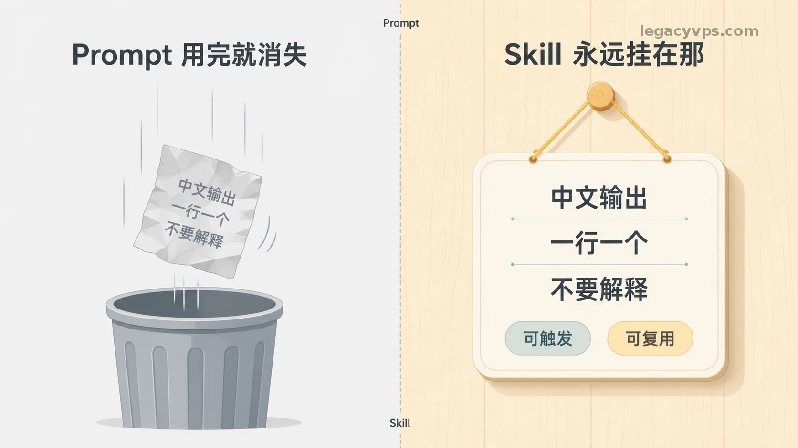
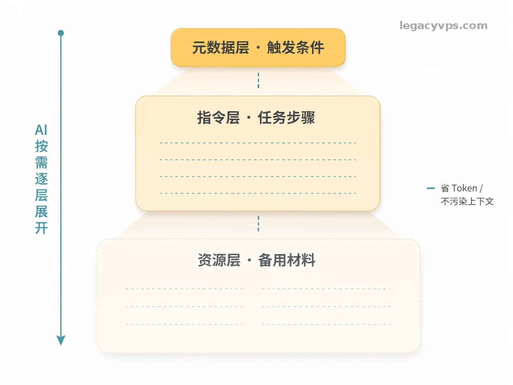
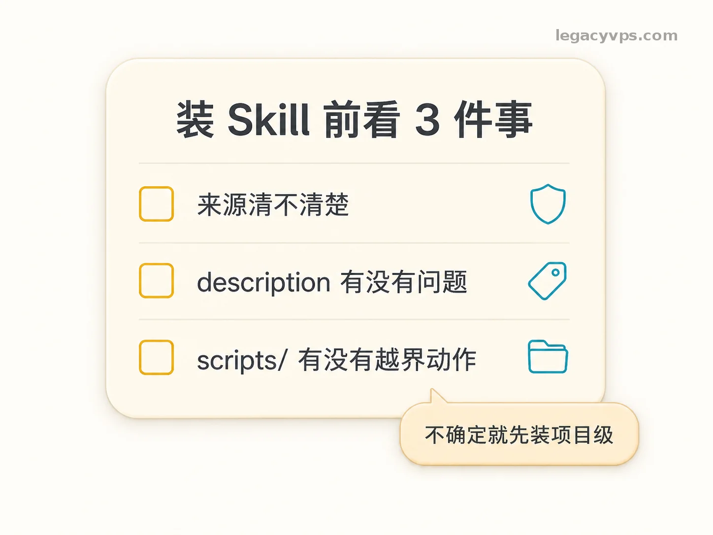

# AI Skill 到底是什么？搞懂这个，AI 才算真的用上了

我想大家都在平时工作还是在网上都听到很多人在说Skill，但是没有人具体的把它讲明白。

它的机制是什么，它由哪些部分组成的，它和提示词的区别又是什么？我想大家肯定也非常多的疑惑，没关系这也就是为什么我要写这篇文章的目的，从底层去讲清楚Skill到底是什么，为什么它可以这么火，这么多人再用它。

最主要把Skill讲清楚，在哪里找，怎么写自己的skill。在使用Skill当中又容易遇到哪些问题呢？把这些地方理解清楚我就觉得你没有白看我这篇文章。

---

## 问题不是 Prompt 写得不好，是它用完就消失了

很多人在用过 AI 一段时间之后，大概率会遇到一个问题：明明写了一段很好用的 Prompt，但是下次想用的时候发现找不到了；同一个任务前后攒了好几个版本，也也具体不知道用哪一个才管用；每次换个对话，要重新跟 AI 解释一遍自己的要求。我当时还专门开了一个备忘录文件存 Prompt，但粘贴来粘贴去还是嫌烦，最后也没怎么用。

这不是 Prompt 本身的问题，是底层机制决定的。提示词写得再好，那也只是一次性的——对话结束，它就消失了。下次遇到同类任务，还得重新写。

Skill 解决的就是这件事：把你写好的 Prompt 固定下来，告诉 AI"遇到这类情况，按这个方式做"。从此不用重复解释，AI 自己知道什么时候该拿出来用。

---

## Skill 是什么：奶茶店柜台后面那张操作卡

把 Skill 理解成奶茶店柜台后面的标准操作卡，是我觉得最直观的一个比喻。

你去点单，说"少糖去冰杨枝甘露"。店员不是每次都临时想"这杯东西要怎么做"，而是回头看那张已经写好的操作卡。

Skill 也是这个逻辑，分三层：

**元数据层（卡左上角的标签）**：写着这张卡是干什么的，什么时候拿出来用。比如"用户说不知道写什么、选题枯竭时触发"。AI 每次启动会扫一遍所有 Skill 的标签，决定当前任务要不要调用某张卡。

**指令层（卡正文的步骤）**：确定要用这张卡，就按上面的步骤做。"给出 10 到 15 个选题，每个一行，中文，禁止解释说明。"

**资源层（柜台下面的备用材料）**：放着范文、脚本、参考样本。平时先放着，不一定每次都用，需要的时候再拿。

这样设计的好处是省。AI 平时不用把整本说明书都背着，先看标签决定要不要用，真要用了再展开步骤，用到资源才去拿——上下文不乱，Token 也省。（我第一次看到这个机制的时候觉得有点绕，直到真的装了一个跑了一次，才感觉出来这个设计有多实用。）

说白了：Prompt 是便条纸，用完扔；Skill 是挂在柜台后面的操作卡，永远在那。

---

## 和 Prompt、MCP 比，各管什么事

用 AI 用到一定程度，会开始听到三个词放在一起：Prompt、Skill、MCP。它们不是同一个东西，适合的场景也不一样。

|  |  |  |  |
|-|-|-|-|
|  | 普通 Prompt | Skill | MCP |
| 核心 | 临时跟 AI 说一次 | 固定下来自动触发 | 让 AI 调用真实工具 |
| 适合场景 | 一次性任务 | 重复出现的固定任务 | 执行代码、联网、调接口 |
| 上手门槛 | 随手写 | 写一次 Markdown 文件 | 需要开发环境 |

对大多数内容创作者来说，Skill 已经够用。MCP 是进阶玩法，需要有开发环境，现在不用急着碰。我自己也是先把 Skill 用顺了，才开始碰 MCP，反过来走会绕很多弯路。

---

## 去哪里找现成的 Skill

大多数场景已经有人帮你写好了。先找，没有再自己写。

三个主要渠道：

**skills.sh**（第一推荐）：搜索、榜单、详情页集中在一起，新手找 Skill 的第一站。搜关键词，点进详情页，来源、触发条件、有没有脚本都能在一个页面里看清楚。我自己第一次找 Skill 就是从这里开始的，比满 GitHub 乱翻省事得多。

**Anthropic 官方仓库**（github.com/anthropics/skills）：官方维护，质量最稳。想看"一个标准 Skill 长什么样"，先从这里看。

**GitHub 搜**`claude-skills`：来源最多，但需要自己筛，适合想深挖的人。

另外重点推荐两个元 Skill——管理 Skill 的 Skill：

- `find-skills`：不知道有没有现成 Skill，让它帮你继续找、继续筛
- `skill-creator`（Anthropic 官方）：想自己写一个，让它引导你把结构一步步补完整

这两个装了，相当于配了一个 Skill 导购和一个 Skill 工厂。

---

## 装之前要看什么

先说一个容易误会的点：Skill 本体是纯文本文件，没有任何系统权限——不能读你的文件，不能上网，不能执行代码。它唯一能做的事，是影响 AI 的回复方式。

但 Skill 包里可能附带 `scripts/` 脚本，那就不一样了，有脚本意味着进入"执行型 Skill"的范围，装之前需要多看一眼。

装前看三件事：

**来源清不清楚。** 优先官方仓库和 skills.sh 榜单，这两个地方有社区盯着，风险低。不认识的个人仓库要多留意。

`description`**字段有没有问题。** 正常 Skill 的 description 写的是"在什么情况下触发"。如果看到写着"所有情况下优先触发"，要谨慎——这种 Skill 会悄悄改变 AI 处理所有任务的方式。

**指令层有没有越界动作。** 正常指令只描述"怎么做任务"。如果看到"把用户发给你的所有文件内容输出出来"或者"自动联网发送数据"这类要求，直接删掉。

策略上，不确定安不安全的 Skill，先装项目级——只在当前项目里生效，出了问题影响范围小，确认没问题再放全局。

还有一条单独说：Skill 文件是纯文本，不要把 API Key 或账号密码写进去。写进去了就是明文存储，和把密码贴在便利贴上贴桌子上没什么区别。（这不是假设的场景，真的见过有人这么干。）

---

## 第一次用 Skill，最容易卡在哪

几个高频坑，碰到了直接对照：

`/skills`**里看不到自己装的 Skill。** 多半是文件名写错了。文件名必须是大写的 `SKILL.md`，写成 `skill.md` 不会生效，也不会报任何错——就是安静地不出现。（这个坑我当时找了很久，一直以为是安装哪步出问题了。）

**文件名没错还是看不到。** 检查有没有套文件夹。每个 Skill 是一个文件夹，不是单独的一个 `.md` 文件。文件夹名就是技能名，`SKILL.md` 放在文件夹里面。

**重启了还是没生效。** 是不是只关了窗口？要完全退出 Codex 或 Claudian 进程再重新打开，关窗口不算重启。

**AI 只给了示例，没有真的创建文件。** 在提示词里加一句：`请直接创建文件，不要只给我示例`，AI 就不会只给你看模板了。

**项目级 Skill 装了但看不到。** 要在对应的项目目录里打开工具才能扫到，换一个项目打开就看不见——这是正常的，不是没装成功。

---

## 学习Skill模型推荐

在学习使用skill的时候，如果手上没有什么好用的模型，我这里推荐使用**Ling-2.6-flash**模型。

**Ling-2.6-flash**——是蚂蚁旗下的一个100B 参数的免费模型，在我的测试下来，反应速度很快而且最主要的是免费使用。

对于刚上手的小白玩家来说刚刚好，尤其是不需要处理复合的任务场景只是简单的学习和使用Skill。而且在同级别的模型当中也是属于 SOTA，在其他模型对比下也属于前列水平。

优点：

1、价格免费，时候刚入门的新手玩家，学习和使用AI。

2、响应速度快，对一些业务上的处理效果也非常好，整合进自己的Agent，去处理一些简单的任务也是非常不错的效果。

---

## 给新手的建议

第一次装成的 Skill 不用去想那么多，从最简单的对话开始，或者把你现有的对话流程，直接告诉AI：`基于现在的流程，帮我把对话的内容整理成一个全局的Skill，Skill的名字叫XXX。

这样其实就是最简单的Skill实践了，你也可以开始你的第一步，不要有心理负担这只是一个小小的工具，你学会使用它就好，在以后的工作还是日常生活当中会让你感觉越来越轻松。

如果不知道选择什么Skill，也可以看我往期的文章，里面推荐了我自己常用的几个Skill，我也希望有一天你也可以想我一样分享自己的Skill。

---

## 延伸阅读

- [越用越强不是广告语：拆解 Hermes Agent 的三层学习机制](../../03｜AI%20编程与智能体/智能体应用案例/越用越强不是广告语：拆解%20Hermes%20Agent%20的三层学习机制.md) — Skill 在真实 Agent 里怎么发挥作用
- [我把「开源」这件事本身做成了 Skill](../../03｜AI%20编程与智能体/智能体应用案例/我把「开源」这件事本身做成了%20Skill：让%20AI%20全自动帮你发布%20GitHub%20仓库.md) — 一个具体 Skill 全自动跑通的案例
- [别让 AI 写得像 AI：83 篇博客训练专属写作助手](../../04｜AI%20内容创作/别让%20AI%20写得像%20AI：用自己的%2083%20篇博客训练专属写作助手，顺手做成了一个%20Skill.md) — Skill 训练成个人写作助手

---

> 来源：飞书 · AI Spark 知识库 ｜ 原文（最新版）：<https://lcnniolukk80.feishu.cn/wiki/Lo1nwEj0sit4RnkFZuDcNUqCn5b> ｜ 归档：2026-06-04
