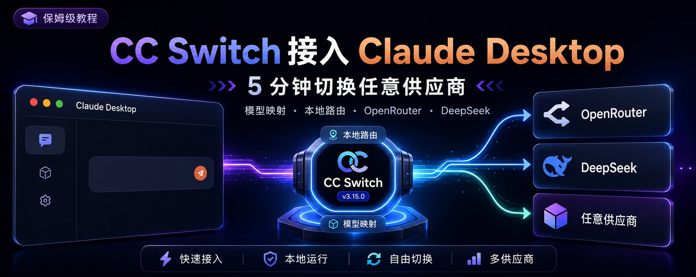
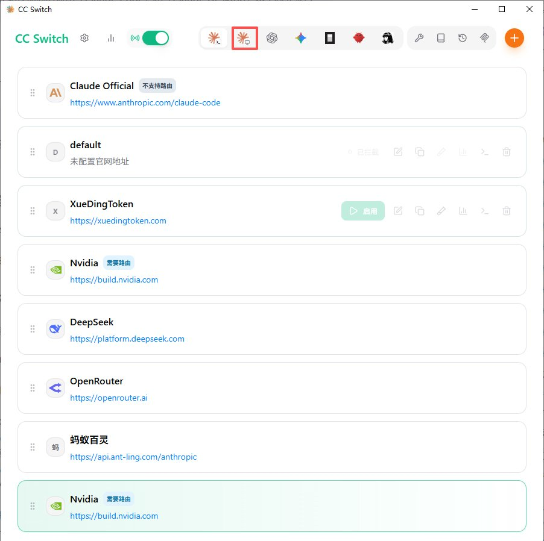
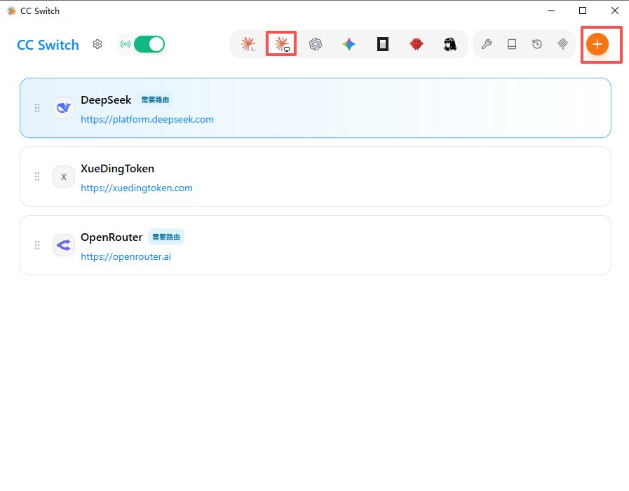
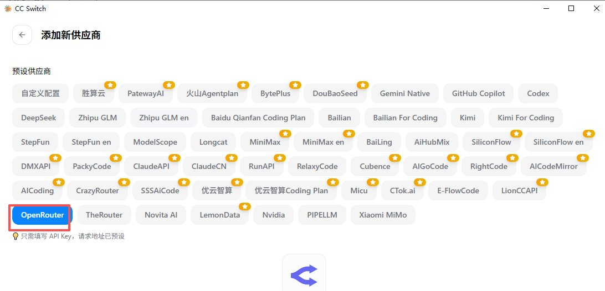
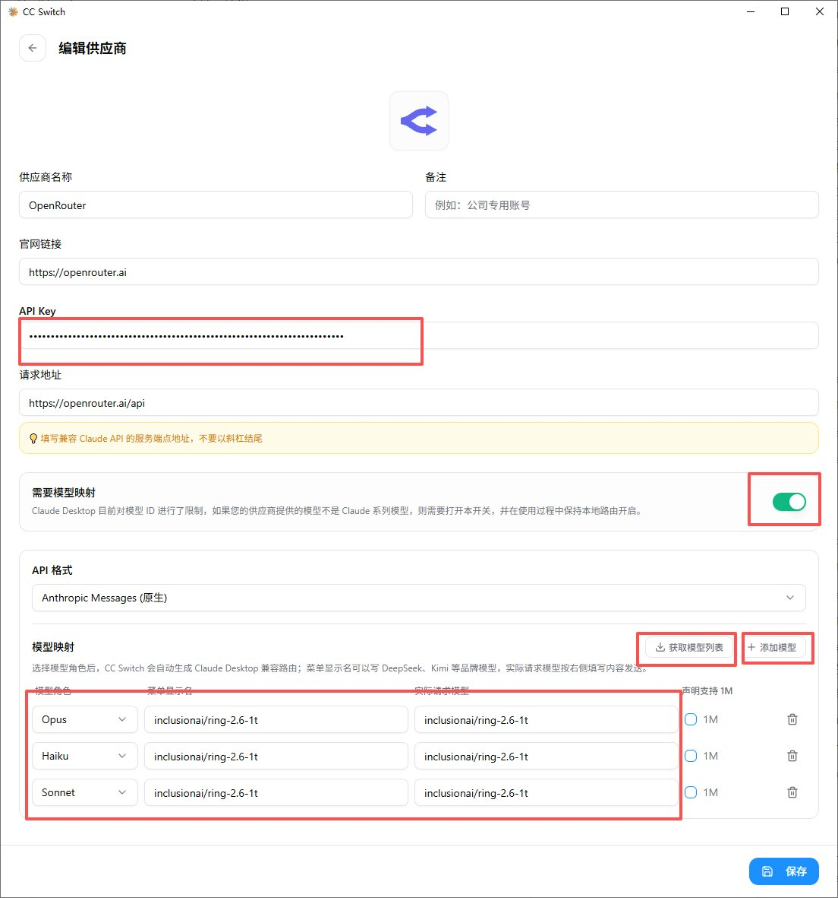
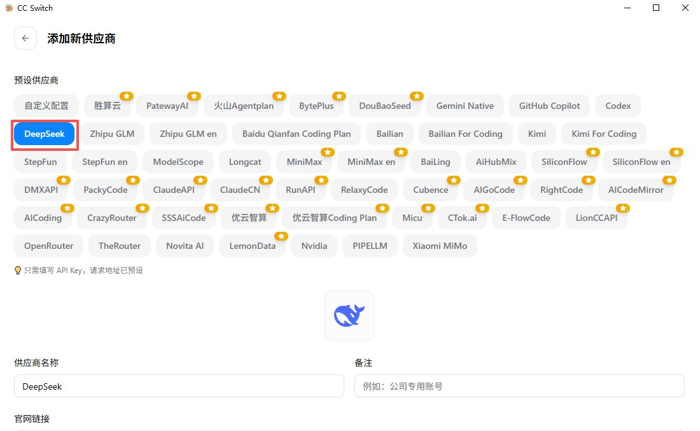
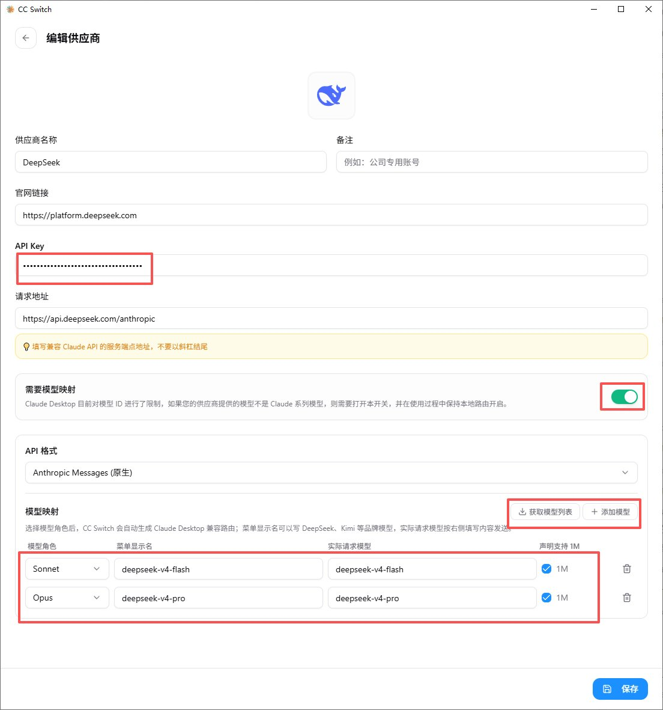
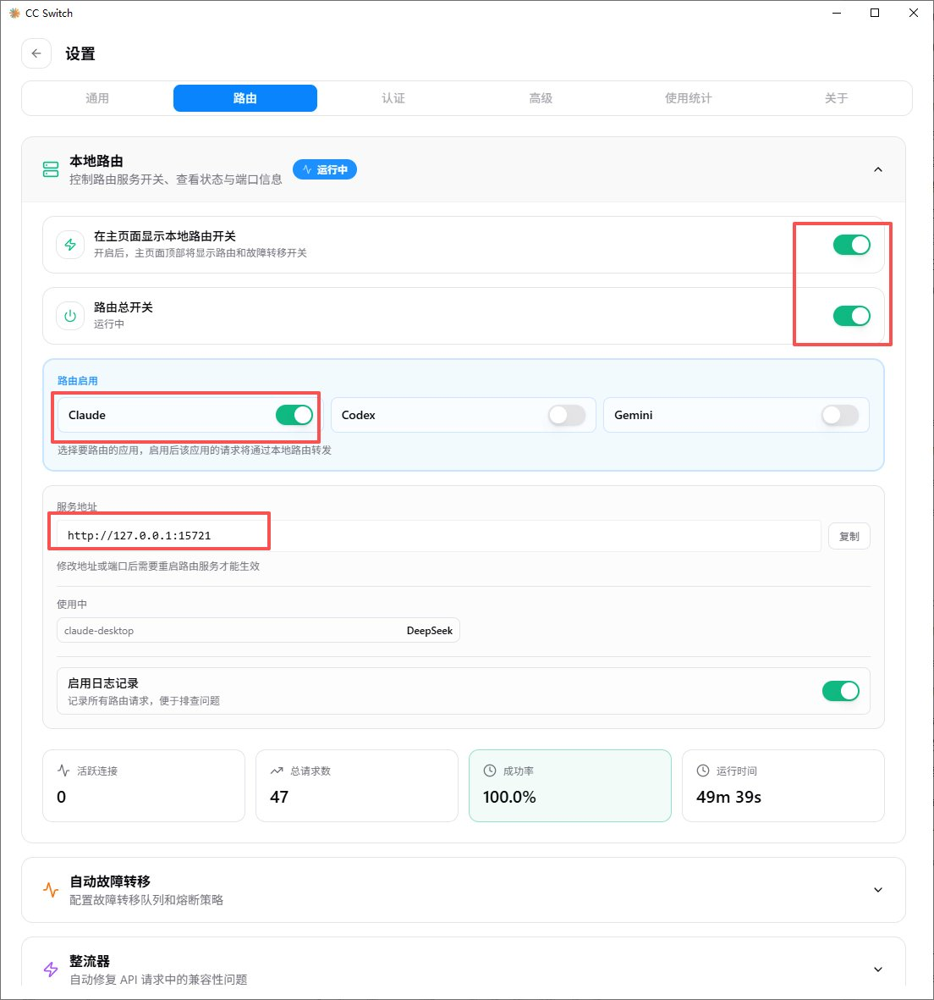
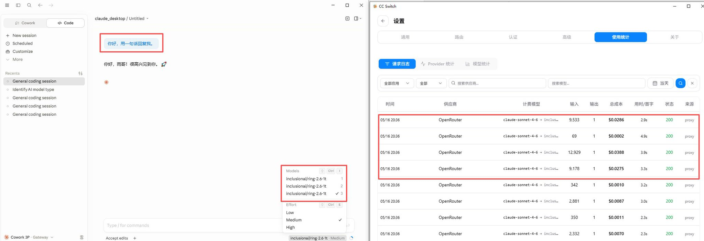
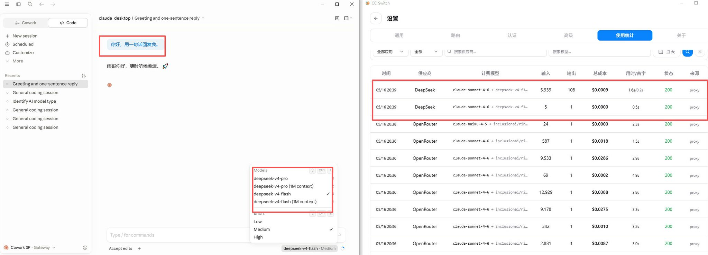

# CC Switch 新版让 Claude 桌面端 5 分钟换上任意供应商

---



CC Switch 今天发布了 v3.15.0，把 Claude 桌面端做成了和 Claude Code 并列的一等管理面板。

多说一句背景。以前想给 Claude 桌面端接第三方供应商是件挺折腾的事：得先在桌面端里开开发者模式（Help → Troubleshooting → Enable Developer mode），进 third-party inference 面板手填 Gateway 地址、API Key、auth scheme，参数稍微填错就连不上，对新手不友好。更麻烦的是 Claude 桌面端目前对第三方推理面板里能配的模型 ID 有限制，只认 Claude 系列的命名，第三方供应商自己的模型名（比如 inclusionai/ring-2.6-1t、deepseek-v4-pro）根本写不进去，兼容性问题一大堆。

CC Switch v3.15.0 这次同时解了两件事：所有参数填写全在 CC Switch 里点几下完成，模型 ID 限制通过「模型映射 + 本地路由」在中间这一层翻译掉。这篇就讲怎么用这个新功能接入，给两套配置例子：OpenRouter 上的 Ring 2.6 1T，和 DeepSeek 官方 V4。

## 原理

```Plain Text
Claude 桌面端 → CC Switch 本地路由 → 第三方供应商

```

CC Switch 在中间做三件事：

- 把 Claude 桌面端发出的请求格式翻译成第三方供应商认的格式
- 把 Claude 桌面端发出的模型角色（sonnet / opus / haiku）映射成供应商实际的模型 ID
- 帮你把配置写进 Claude 桌面端的 3P profile，你不用自己改

## 接入前先搞清这条规则

CC Switch 的编辑供应商页面上有一个「需要模型映射」开关，旁边写着这么一句话：

> Claude Desktop 目前对模型 ID 进行了限制。如果您的供应商提供的模型不是 Claude 系列模型，则需要打开本开关，并在使用过程中保持本地路由开启。

翻译成判断标准：

- **供应商提供的是 Claude 系列模型**（直接认 sonnet / opus / haiku 这种命名，比如 PackyCode、Claude API 中转）→ 不用开映射，也不用开本地路由
- **供应商提供的不是 Claude 系列模型**（比如 OpenRouter 上的 Ring、DeepSeek 自己的 deepseek-v4-pro 等）→ 必须打开「需要模型映射」+ 必须保持本地路由开启

本文两个例子都是非 Claude 系列模型，所以下面都按"开映射 + 开本地路由"来做。

## 准备工作

- CC Switch **v3.15.0 及以上**，唯一官方下载：[https://ccswitch.io](https://ccswitch.io/)（警惕山寨网站收费）
- Claude 桌面端已经装好：[https://claude.ai/download](https://claude.ai/download)
- 一个第三方供应商账号 + API Key（下面两个例子任选其一就够）

## 一、升级 CC Switch 到 v3.15.0

已经装过的走自动更新即可。全新安装：

- Windows：下 CC-Switch-v3.15.0-Windows.msi
- macOS：brew tap farion1231/ccswitch && brew install --cask cc-switch
- Linux：按发行版选 .deb / .rpm / .AppImage

打开 CC Switch，确认 App 切换器里能看到独立的「Claude Desktop」条目，和「Claude Code」并列。这是 v3.15.0 的标志。



## 二、进入 Claude Desktop 面板

在 App 切换器里点「Claude Desktop」，进入新面板。



## 三、添加供应商

点「添加供应商」（Add Provider），从预设里选你要用的供应商，填好 API Key，保存。

下面是两套实测可用的配置，挑一个就行。

## 例子 A：OpenRouter + Ring 2.6 1T

OpenRouter 是聚合多家模型的中转平台，Ring 2.6 1T 性价比高，日常对话和写作辅助够用。

- 注册 OpenRouter：[https://openrouter.ai](https://openrouter.ai/)，进 Keys 页面 [https://openrouter.ai/keys](https://openrouter.ai/keys) 创建 API Key
- 在 CC Switch 添加供应商时选「OpenRouter」预设
- 填：
- **供应商名称**：OpenRouter（预设带出）
- **官网链接**：[https://openrouter.ai](https://openrouter.ai/)
- **API Key**：粘贴刚才创建的 Key
- **请求地址**：[https://openrouter.ai/api](https://openrouter.ai/api)（注意是 /api，不带 /v1；不要以斜杠结尾）
- **API 格式**：选「Anthropic Messages (原生)」（CC Switch 帮 OpenRouter 做了 Anthropic 适配）
- **需要模型映射**：打开（OpenRouter 给的模型不是 Claude 系列，必须开）
- **模型映射**：见下一步

填到这一步，OpenRouter 配置应该长这样：





## 例子 B：DeepSeek 官方（V4 Flash / Pro）

DeepSeek 官方提供 Anthropic 兼容端点，直接接入不绕中转。CC Switch v3.15.0 起内置的 DeepSeek 预设已经切到 V4（flash / pro 两档）。

- 注册 DeepSeek：[https://platform.deepseek.com](https://platform.deepseek.com/)，进 API Keys 页面创建 Key
- 充值（DeepSeek 不送免费额度，最低充值很少）
- 在 CC Switch 添加供应商时选「DeepSeek」预设
- 填：
- **供应商名称**：DeepSeek（预设带出）
- **官网链接**：[https://platform.deepseek.com](https://platform.deepseek.com/)
- **API Key**：粘贴刚才创建的 Key
- **请求地址**：[https://api.deepseek.com/anthropic](https://api.deepseek.com/anthropic)（注意是 /anthropic，不是 /v1，这是 DeepSeek 提供的 Anthropic 兼容端点；不要以斜杠结尾）
- **API 格式**：选「Anthropic Messages (原生)」
- **需要模型映射**：打开
- **模型映射**：见下一步

填到这一步，DeepSeek 配置应该长这样（模型映射区域在下一步细讲）：





## 四、配模型映射 + 开本地路由

## 模型映射

打开「需要模型映射」开关之后，下面的模型映射区域才会生效。每一行映射有四个字段：

- **模型角色**：Claude 桌面端那边的角色，Sonnet / Opus / Haiku 三选一
- **菜单显示名**：在 Claude 桌面端模型菜单里显示的名字（随便起，方便认就行）
- **实际请求模型**：CC Switch 真正发给供应商的模型 ID
- **声明支持 1M**：勾上等于告诉 Claude 桌面端这个模型支持 1M 长上下文

点「+ 添加模型」加新行，点「获取模型列表」可以让 CC Switch 从供应商 API 拉一份可用模型列表帮你选。

下面是两个例子的推荐填法：

**OpenRouter Ring 2.6 1T**（只有一个模型，三个角色都映射到它）：

照下面这三个值，分别加 Sonnet、Opus、Haiku 三行，填法完全一样：

- 菜单显示名：inclusionai/ring-2.6-1t
- 实际请求模型：inclusionai/ring-2.6-1t
- 声明支持 1M：不勾

**DeepSeek V4**（分级用：贵的强的留给 Opus，便宜的给 Sonnet）：

加两行映射：

- **Sonnet 行**：菜单显示名 deepseek-v4-flash，实际请求模型 deepseek-v4-flash，「声明支持 1M」勾上
- **Opus 行**：菜单显示名 deepseek-v4-pro，实际请求模型 deepseek-v4-pro，「声明支持 1M」勾上

DeepSeek 这套分级的好处是：在 Claude 桌面端模型菜单选 Sonnet 时调便宜的 flash，选 Opus 时调强的 Pro，按需切换。

实际配置长什么样，回头看上面那张 DeepSeek 截图——下半部分的「模型映射」区域就是这个样子。

## 本地路由（Local Routing）

模型映射开了之后，本地路由也必须打开。位置在 CC Switch 的「设置 → 路由」tab 里。

要打开的开关有两个：

- **路由总开关**：先打开，状态会变成「运行中」
- **路由启用 → Claude**：勾上，让 Claude 桌面端的请求走本地路由

服务地址默认是 http://127.0.0.1:15721，正常情况下不用动。



如果想让本地路由开关在主页面顶部就能切，把上面的「在主页面显示本地路由开关」一起开了，主面板顶部会出现快捷开关。

本地路由必须在使用 Claude 桌面端期间一直保持运行——关 CC Switch 或关掉总开关都会立刻断流。想让 CC Switch 在后台不打扰可以开 Lightweight Mode（轻量模式），主窗口关掉只保留托盘，本地路由照常跑。

## 五、启用 → 重启 Claude 桌面端 → 测试

在 Claude Desktop 面板里选中刚加好的供应商，点「启用」（Enable）。CC Switch 会自动把配置写进 Claude 桌面端的 3P profile。

**关键一步：必须重启 Claude 桌面端**。Claude Code 能热切换，桌面端不行。

正确的重启方式：

- macOS：command + Q 完全退出，不是关窗口
- Windows：托盘里的 Claude 图标右键 → 退出，不是只关窗口（这是最常踩的坑，关窗口它只是缩到托盘，进程还在）

重新打开 Claude 桌面端，发一句测试：

```Plain Text
你好，用一句话回复我。

```

回复正常就说明通了。回 CC Switch 看代理流量记录，能看到刚才那条请求。





## 常见问题

## 1. 想切回 Claude 官方账号怎么办？

在 Claude Desktop 面板里把启用的第三方供应商关掉（或者切换到 Claude 官方预设），重启 Claude 桌面端就回到原状了。CC Switch 是"最小入侵"设计——哪天连 CC Switch 一起卸载，桌面端也照常用。

## 2. 多个供应商之间怎么切换？

在 Claude Desktop 面板里选另一个供应商点启用，重启 Claude 桌面端。本地路由不用动。

## 3. Claude Code 也能这么接吗？

可以。Claude Code 在 CC Switch 里有独立面板（v3.15.0 之前就支持），用法类似。区别是 Claude Code **支持热切换**，切完不用重启 CLI，比桌面端方便。

## 4. 测试返回报错怎么排查？

按这个顺序看一遍：

- 请求地址有没有带末尾斜杠（必须不带）
- API 格式选对了吗（OpenRouter 和 DeepSeek 都是「Anthropic Messages (原生)」）
- 「需要模型映射」开关有没有打开、映射有没有保存
- 「设置 → 路由」里**路由总开关**和**Claude 应用路由**都开了吗
- 重启 Claude 桌面端的时候，Windows 端的托盘进程退干净了吗

九成报错来自这五项里某一项漏开 / 漏改。

## 5. CC Switch 必须一直打开吗？

只要你用的是非 Claude 系列模型，CC Switch 就要一直在后台跑（本地路由必须运行）。可以开 Lightweight Mode（轻量模式），主窗口关掉只保留托盘，空闲占用接近零，本地路由照常工作。

## 写在最后

CC Switch v3.15.0 这一版补齐了 Claude 桌面端的最后一块拼图。以前桌面端在第三方接入上几乎是封闭的——开发者模式藏得深、参数容易填错、模型 ID 还有限制，普通用户基本碰不了。现在这些都被 CC Switch 在中间这一层接住了。

跟着上面五步走通一遍，Claude 桌面端就变成了一个"按需切供应商的桌面客户端"。想白嫖用免费模型、想稳定用国产 API、想按角色分级配混合策略，都自己说了算。

你现在把 Claude 桌面端接到哪个供应商上了？是国产模型、OpenRouter 上某个免费型号，还是付费的中转？评论区聊聊。

**更多 AI 干货同步更新公众号：雨哥聊AI，关注我** [@xiangxiang103](https://x.com/@xiangxiang103)**带你玩转 AI 时代！**

---

> 来源：飞书 · AI Spark 知识库 ｜ 原文（最新版）：<https://lcnniolukk80.feishu.cn/wiki/IdUIwUKxsiNUUlkt3XkcKiPJnOb> ｜ 归档：2026-06-04
