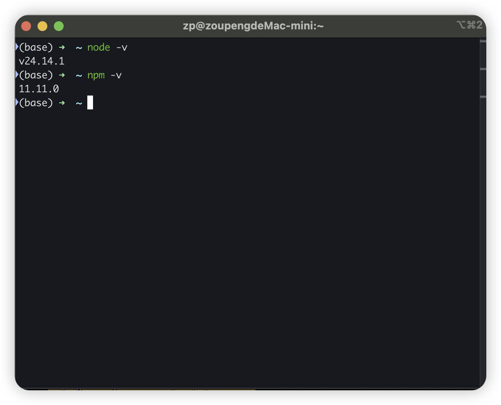
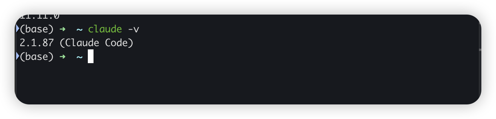
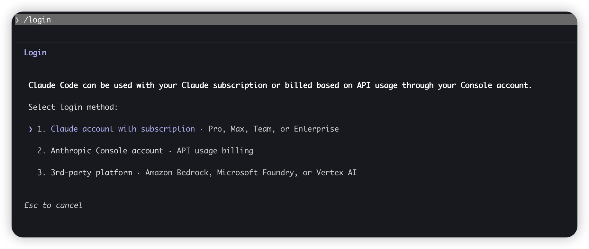

# Claude Code 安装教程：Mac、Windows、Linux 从 0 到跑通


最近 AI CLI 是越来越火了。Gemini 有自己的 CLI，Claude 有 Claude Code，OpenAI 这边也有 Codex 相关工具，御三家这算是都下场了。你现在再看 AI 编程这件事，大家已经不在满足“网页里聊两句代码”那么简单，越来越多人想让 AI 融合进自己的项目里面，创建自己的工作流了。

我自己这段时间也反复折腾过一圈，最后的结论：要用就用最好的，所以这里最推荐 Claude Code。不是因为别家的不好，而是因为 Claude Code配合Claude使用起来还是太强了

先说明一下本文的演示环境：**我手上的设备是 Mac**，所以下面的截图可能会的不一样。如果你用的是 Windows 或 Linux，不要太担心其实核心的安装逻辑、验证方法基本上大同小异。

---

## Claude Code 是什么

再开始之前我还是要先介绍一下，Claude Code是什么？其实Claude Code本质上是 Claude 官方推出的命令行编程助手。你可以直接在项目目录里启动它，让它围着当前仓库、文件结构和终端环境来工作。

它和普通网页聊天最大的区别，它可以按开发现场设计，结合Skill和MCP能有更多的玩法，也能让你的变成思路流程变的更顺畅。

我这篇教程只是最简单的介绍了安装和配置，以及自己会踩得一些坑，如果想深入的学习御三家自己的CLI，我还是更建议先去官方文档里面学习一下基础的命令和概念。

---

## 基础检查

在安装之前，先别着急直接复制我的命令，上手安装。

最低检查最基本的环境要求：

```bash
node -v
npm -v
```

按 Anthropic 官方文档，Claude Code 现在要求 **Node.js 18+**。如果 `node` 或 `npm` 根本不存在，或者版本太老，还是建议先按照基础的环境，再安装 Claude Code。



---

## 安装命令

其实Win、Mac、Linux三家的安装命令大同小异，但是在一些环境和配置上多多少少有一些坑，我也是吃过亏，所以我这里就都记录了下来。

### 通用安装命令

最常见的官方推荐路径是：

```bash
npm install -g @anthropic-ai/claude-code
```

如果你不想碰 npm 全局权限，也可以在 macOS、Linux、WSL 这类环境里试官方原生安装脚本：

```bash
curl -fsSL https://claude.ai/install.sh | bash
```

装完以后先验证：

```bash
claude --version
```

如果能看见返回版本号，说明命令已经装进来了。

> 注意：安装完先验命令，不要直接跳认证和工作流。



### macOS 需要注意什么

Mac 一般最省心。我们可以直接在 Terminal 里装，装完后记得重新开一个 Terminal 窗口，再跑 `claude --version`。

因为很多人装完就在原窗口继续敲，结果提示找不到命令。其实只是终端会话没刷新。别真傻傻的以为没有安装成功，在反复的抓耳挠腮。

### Windows 需要注意什么

Windows 最大的问题通常不是命令本身，而是你把终端环境选乱了。

按 Anthropic 官方文档，Windows 现在支持：

- WSL 1 / WSL 2
- Git for Windows

如果你平时本来就写代码，我更建议直接走 WSL；如果你只是先体验一下，Git Bash 也够用。别一会儿在 cmd 里试，一会儿在 PowerShell 里试，一会儿又切 Git Bash。如果你没选对对应的控制台，很容易出现问题然后把所有问题归结到 Claude Code 身上了。

这里建议Win用户在装完后 `claude` 还是找不到，优先查：

1. 你是不是装在正确的终端环境里
2. 终端有没有完全重启
3. 当前环境里的 Node、npm、claude 是不是同一套

> node环境还是建议使用NVM的插件方式安装，可以多版本控制。

### Linux 需要注意什么

Linux 这边你如果使用的是主流系统比如 Debian、Ubuntu 这类常见发行版。基本上按照命令去巧就可以了，也不会出现什么问题。

但是如果你是 Alpine 这种偏特殊的环境，Anthropic 官方还额外提到原生安装可能需要补依赖，比如：

- `libgcc`
- `libstdc++`
- `ripgrep`

---

## 测试验证

安装完成输出版本号之后，就可以进行使用了，这里建议还是分文件夹和项目去管理claude code里面的项目，这样方便你针对不同项目设计不同的流程和使用不同的插件去完成你的工作。

进入你的项目目录：

```bash
cd your-project
claude
```

> 一般这里会自己跳出验证，如果没有可以输入 /login 命令自己手动登入。

按 Anthropic 官方文档，Claude Code 常见的认证方式包括：

- Anthropic Console
- Claude App 的 Pro / Max 订阅
- Amazon Bedrock
- Google Vertex AI

你这一步只要确认它能正常启动、正常认证、正常进入交互界面，就算成功了。



> 但其实最难的还是claud的账户存活问题，因为A社的封号太诡异了，就没什么规律可行。

---

## 最常见的坑

### 1. 输入 `claude` 提示 command not found

先查 Node 和 npm 是否正常，再看终端是不是刚装完还没重开。Windows 用户再多查一步：是不是切错到了别的 shell。

### 2. 启动后卡在认证或网络

这时候就别再盯着安装命令了，因为安装已经结束了。你该查的是认证方式网络环境有没有问题，还有最担心的一种如果出现，不支持注册国家的字眼，那“恭喜你”，你的账户已经没了等着退款吧😂。

---

## 总结与建议

御三家的CLI其实都还不错，Claude code算是三个里面比较优秀的了，但是最主要的问题还是不稳定，账户容易封禁的问题难以解决。

如果大家实在没办法使用Claude或者被他的风控折磨疯了，不用着急。我下一篇会接着讲，怎么用 `CC Switch` 配合国产模型 `MiniMax` 把Claude Code跑起来，让大家有一个备选的方案。

如果实在不行也就只能退而求其次，使用Codex或者Gemini的CLI了，希望大家的账户都没问题，越用活的越好。

---

## 延伸阅读

- [Claude Code 在大陆怎么稳定用：cc-switch + MiniMax 替代方案](Claude%20Code%20怎么稳定用：我用%20cc-switch%20接%20MiniMax%20跑通了一套替代方案.md) — 装完用不了怎么救
- [别再切屏问 AI！把 Claude、Gemini、Codex 塞进命令行](别再切屏问%20AI%20了！把%20Claude、Gemini、Codex%20塞进命令行的保姆级教程与避坑指南.md) — 三家 CLI 一起装
- [找不到高颜值视频素材？我用 Codex 与 Claude Code 跑通了 HyperFrames](../../03｜AI%20编程与智能体/AI%20编程案例/找不到高颜值视频素材？我用%20Codex%20与%20Claude%20Code%20跑通了%20HyperFrames.md) — 装完拿来跑视频

---

> 来源：飞书 · AI Spark 知识库 ｜ 原文（最新版）：<https://lcnniolukk80.feishu.cn/wiki/VPeewqTA6iMP7jkQvYJcvurbnTf> ｜ 归档：2026-06-04
