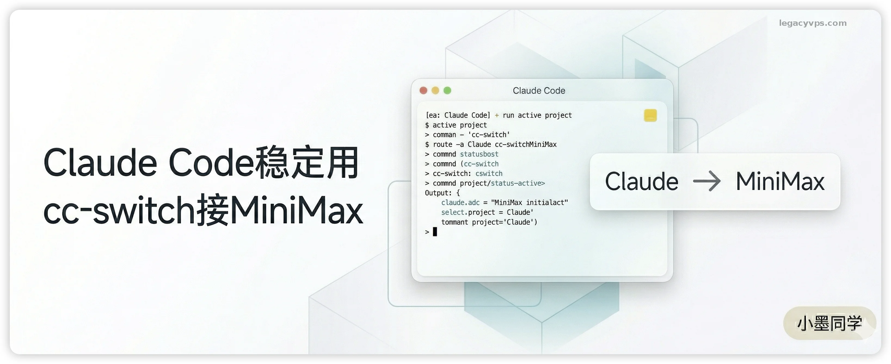
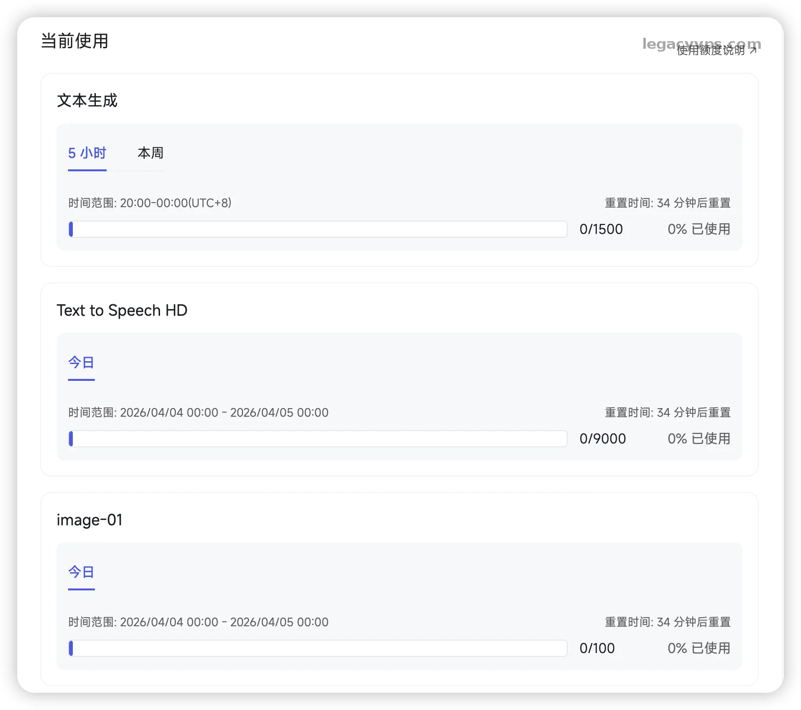
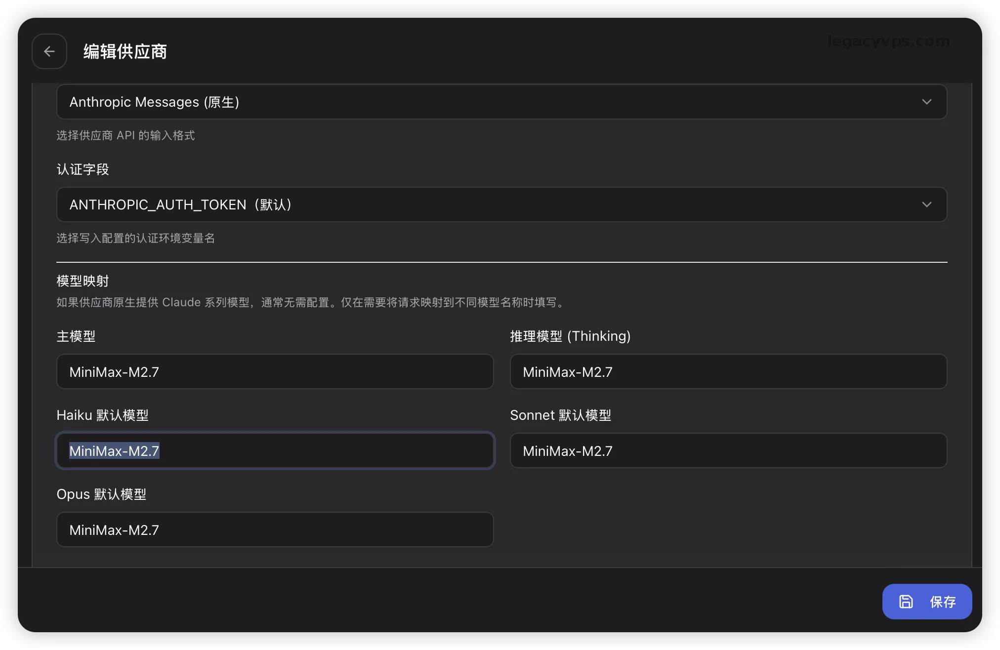
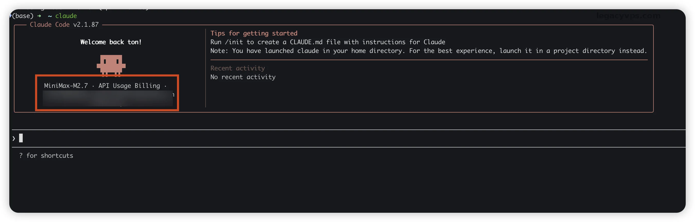

# Claude Code 怎么稳定用：我用 cc-switch 接 MiniMax 跑通了一套替代方案

我想使用了那么多的CLI，不管是GPT的Codex还是谷歌的Gemini的CLI，最后回过头来发现还是A社的Claude Code 是我用过最顺手的 CLI AI 编程工具了，主要还是Claude的硬实力。



但是对于很多兄弟们来说，稳定使用Claude已经是一种奢望了，在加上4月4号A社还发布了，Pro、Max等套餐的额度不在用于第三方的使用，里面点名了最近很多的OpenClaw。

这个问题就很直接了。你如果想稳定使用 Anthropic 官方链路，这件事一定不轻松。再加上第三方路子现在也越来越不稳定，费用也不低还不一定能实现官方的全部功能，最主要的还是不一定稳定。

想来想去就选了一个折中的方案，我直接换思路：不再死磕 Claude 官方，也不再把希望全压在第三方代接服务上，而是保留 Claude Code 的使用方式，底层接口换成兼容 Anthropic 协议的国产模型。这篇我就讲一讲我是怎么使用的：`cc-switch + MiniMax`。


---

## 三方对比

我希望给你一个直观的判断，如果你能接受相关的优缺点，就可以继续使用第三方或者稳定环境继续使用官方的环境，都是没问题的：

|  |  |  |
|-|-|-|
| **路线** | **优点** | **问题** |
| 官方 Claude 链路 | 模型能力最完整，体验最好 | 稳定性一直是问题 |
| 第三方中转 / 代接 | 上手快，社区教程多 | 规则变化快，额外计费也越来越常见 |
| 兼容接口替代 | 可控，能长期自己掌握 | 模型能力不等于原版 Claude |

---

## 为什么选MiniMax

其实就两个点：

1. MiniMax 现在官方就提供了 Anthropic API 兼容接口，而且文档完整接入方便。
2. 价格足够便宜，量大管饱

> 其实我也考虑过GLM，但是需要抢而且很多人说响应慢，我就没选择。直接买了官方Token Plan套餐 98/月，反正试试水。



---

## Claude Code 安装

这一篇不展开讲 Claude Code 安装细节，但最基础的安装命令和验证动作还是给你放在这里。

Mac、Linux、WSL：

```
curl -fsSL https://claude.ai/install.sh | bash
claude --version
```

Windows PowerShell：

```
irm https://claude.ai/install.ps1 | iex
claude --version
```

后面在终端里已经能正常识别 `claude`，就算安装成功了。

你如果想把系统要求、路径问题和不同平台的细节一次看全，再去看这篇正式文章：

> 延伸阅读：[Claude Code 安装教程：Mac、Windows、Linux 从 0 到跑通](https://www.legacyvps.com/archives/claude-code-install-tutorial-mac-windows-linux)

---

## CC-switch安装和对接

MiniMax 官方文档里已经把怎么对接 Claude Code 写的很清楚了，但是这里我还是把我的操作记录了下来，给大家作参考方便大家对比：

1. 先去 MiniMax 控制台创建 API Key。
2. 先清掉旧环境变量： `ANTHROPIC_AUTH_TOKENANTHROPIC_BASE_URL`
3. 安装 `cc-switch`。我更建议直接看它的 [releases 页面](https://github.com/farion1231/cc-switch/releases/latest) 下载对应系统版本。

如果你是 macOS，也可以直接：

```
brew tap farion1231/ccswitch
brew install --cask cc-switch
```

1. 打开 `cc-switch`，新建一个 MiniMax provider，关键几项这样填：

- Provider：`MiniMax`
- API Key：你的 MiniMax Key
- Base URL：`https://api.minimaxi.com/anthropic`（这里你要区分你买的网站是国际站还是国内站，这里有区别）
- API 格式：`Anthropic Messages`
- 模型：`MiniMax-M2.7`



1. 如果你不是走官方账号登录，而是直接改 provider 路线，建议把 `~/.claude.json` 里的 onboarding 状态补掉：{  
"hasCompletedOnboarding": true  
}
2. 别急着上正式项目，先找个空目录执行：claude

如果一切正常，你会看到 Claude Code 正常起来，然后上面显示的模型是MiniMax而不是官方的Claude模型。



> 风险提示：这一步最容易翻车的不是 Key 本身，而是旧配置残留和对接的官方地址，因为有国际和国内两个站点。有的时候看到了界面里看着已经切到 MiniMax，实际请求还在打旧地址，可以退出控制台然后重新进入或者使用`logout` 退出然后重新登入。

---

## 总结和差异

这条路线我自己现在会继续用，但我不会把它吹成“Claude 完美平替”。Claude Code 之所以舒服，一部分是因为 CLI 设计得顺手，另一部分还是得益于 Claude 模型真的强。你现在工具外壳是Claude Code，但底层模型已经换成了 MiniMax。

简单总结：

- 日常代码问答、读文件、改简单逻辑，这条路完全能用
- 想长期稳定开工，这条路比赌官方账号靠谱得多，也是没办法的办法有些公司或者个人没条件只能使用国产的大模型。
- 但碰到复杂仓库理解、长链路推理、特别细的 agent 动作，体验肯定是达不到原本 Claude 应有的高度，这也是我使用下来的体验。

其实我还是想体验试试对接GLM，但是MiniMax的套餐还没有到期，先用着等额度用完了或者有其他的需要再买不迟。主要是我也想体验体验国产大模型的能力到底怎么样。

---

## 延伸阅读

- [Claude Code 安装教程：Mac、Windows、Linux 从 0 到跑通](Claude%20Code%20安装教程：Mac、Windows、Linux%20从%200%20到跑通.md) — 没装的先看这篇
- [小白必看！Opencode 傻瓜式安装教程，把 DeepSeek 接上](小白必看！Opencode%20傻瓜式安装教程，终于把%20DeepSeek%20接上了！.md) — 另一条国产模型替代路
- [高强度实测 6 大 AI 模型：Claude 写文最强，但我写代码不选它](../工具测评/高强度实测%206%20大%20AI%20模型：Claude%20写文最强，但我写代码不选它.md) — MiniMax / DeepSeek 在六家里的真实位置

---

> 来源：飞书 · AI Spark 知识库 ｜ 原文（最新版）：<https://lcnniolukk80.feishu.cn/wiki/DA9zwgqdUi87hWkonVBcMczxnbg> ｜ 归档：2026-06-04
