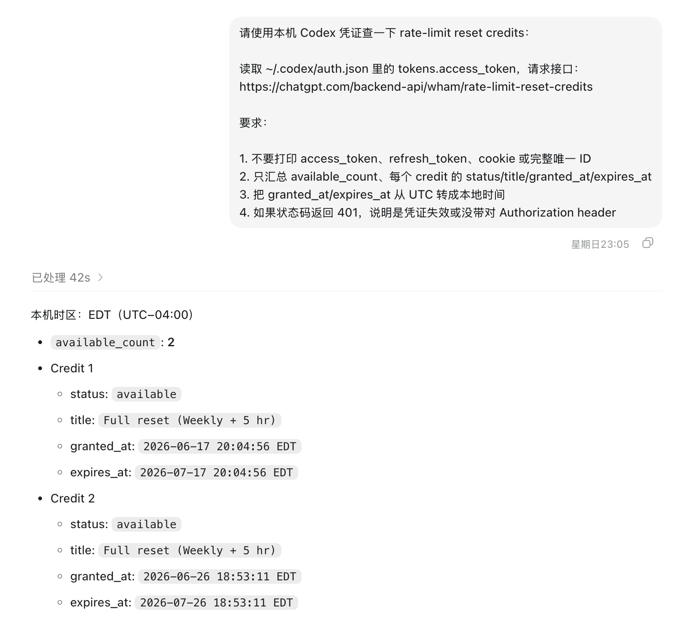

codex 的重置卡，有效期是 30 天。如果你积攒多了 codex 的重置卡，可能会错过有效期。

下面这个简单的方法，可以快速查询你账户下的有多少重置卡，每张卡的有效期。

将下面这个提示词直接发给 codex

```Plain Text
请使用本机 Codex 凭证查一下 rate-limit reset credits：

读取 ~/.codex/auth.json 里的 tokens.access_token，请求接口：
https://chatgpt.com/backend-api/wham/rate-limit-reset-credits

要求：

1. 不要打印 access_token、refresh_token、cookie 或完整唯一 ID
2. 只汇总 available_count、每个 credit 的 status/title/granted_at/expires_at
3. 把 granted_at/expires_at 从 UTC 转成本地时间
4. 如果状态码返回 401，说明是凭证失效或没带对 Authorization header
```

等待一下，返回结果




