# Mac 新机一条 Prompt 搞定 3 个 AI 开发工具：Claude Code + Codex CLI + Gemini CLI

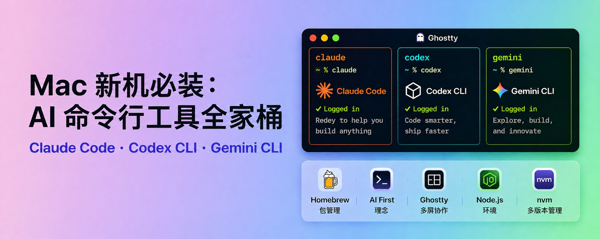

这是这个系列第四篇文章，我会把自己最近从零开始梳理，整理 Mac 使用过程中的经验与步骤记录下来，作为留存与分享。如果拿到一台新的Mac电脑，我最先安装的AI命令行工具肯定是Claude Code了，其实安装也超级简单。

我的Mac使用指南系列文章：

- 1、**[Mac使用指南系列文章：Homebrew软件包管理器从入门到精通](../../05｜AI%20效率提升/个人工具箱与环境配置/Mac使用指南系列文章：Homebrew软件包管理器从入门到精通.md)**
- **2、[Mac使用指南系列文章：从零搭建Codex App桌面端结合GitHub CLI，体验 AI 自动化克隆与提交](../../05｜AI%20效率提升/个人工具箱与环境配置/Mac使用指南系列文章：从零搭建Codex%20App桌面端结合GitHub%20CLI，体验%20AI%20自动化克隆与提交.md)**
- 3、[Mac使用指南系列文章：告别自带终端，Mac装机首选的 AI 友好型终端 Ghostty 配置指南](../../05｜AI%20效率提升/个人工具箱与环境配置/Mac使用指南系列文章：告别自带终端，Mac装机首选的%20AI%20友好型终端%20Ghostty%20配置指南.md)

首先就是在 Mac 电脑上，先安装好Homebrew软件包管理工具（可参考系列第一篇），然后通过Homebrew将Codex App 桌面端安装好（课参考系列第二篇）。

在电脑上安装好第一个AI 客户端之后，就可以践行AI First理念，能让AI来帮我们完成的，就坚决不动手了，除非AI搞不定了，那我们再手动上。

本文内容目录如下，可进行选看

- **一、准备nodejs环境**
- **二、一个提示词一起安装三个AI终端工具**
- **三、三个终端工具分别网页授权登录**
- **四、在Ghostty中一个屏幕一起运行三个终端**
- **五、nodejs多版本管理nvm工具使用**
- **六、最后**

## 一、准备nodejs环境

为什么要装 Node.js？因为 Claude Code、Codex CLI、Gemini CLI 等 AI 命令行工具都是基于 Node.js 开发的，安装和运行它们都需要 Node.js 环境。

直接打开本地的命令行中输入 `node -v` 如果你看到如下的截图，那就说明node还没有安装

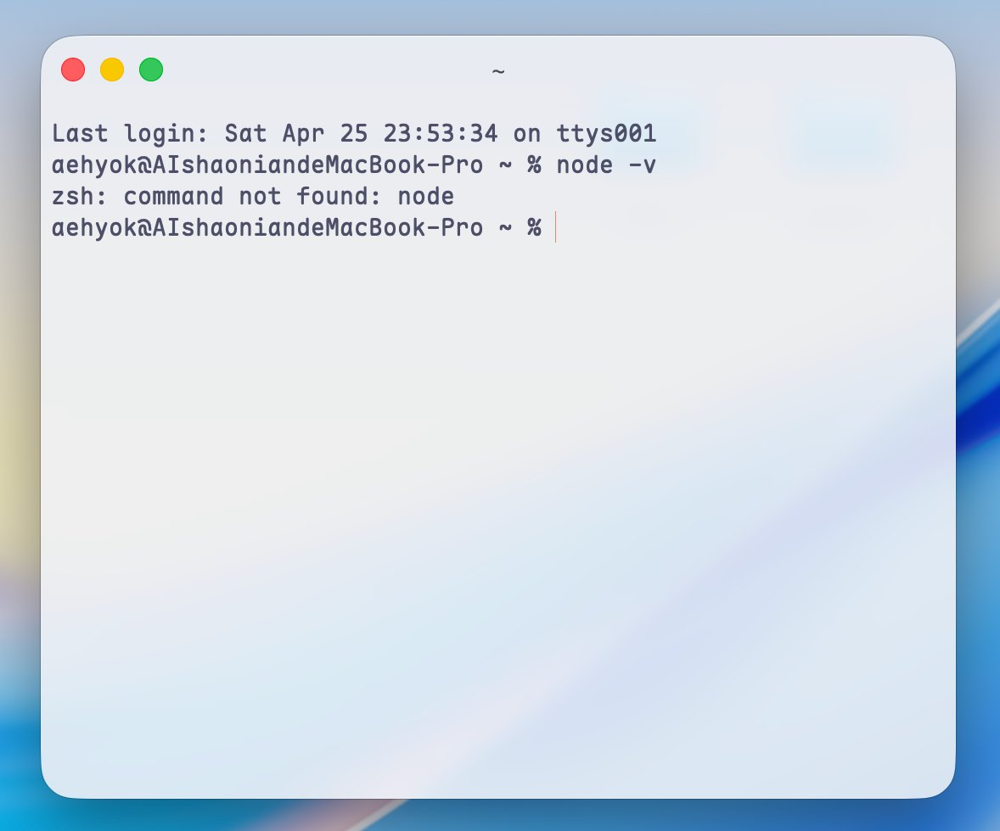

本着AI first的理念，我还是使用Codex App 来安装nodejs。原则就是能用homebrew来安装的尽量就用homebrew来安装，方便统一，。

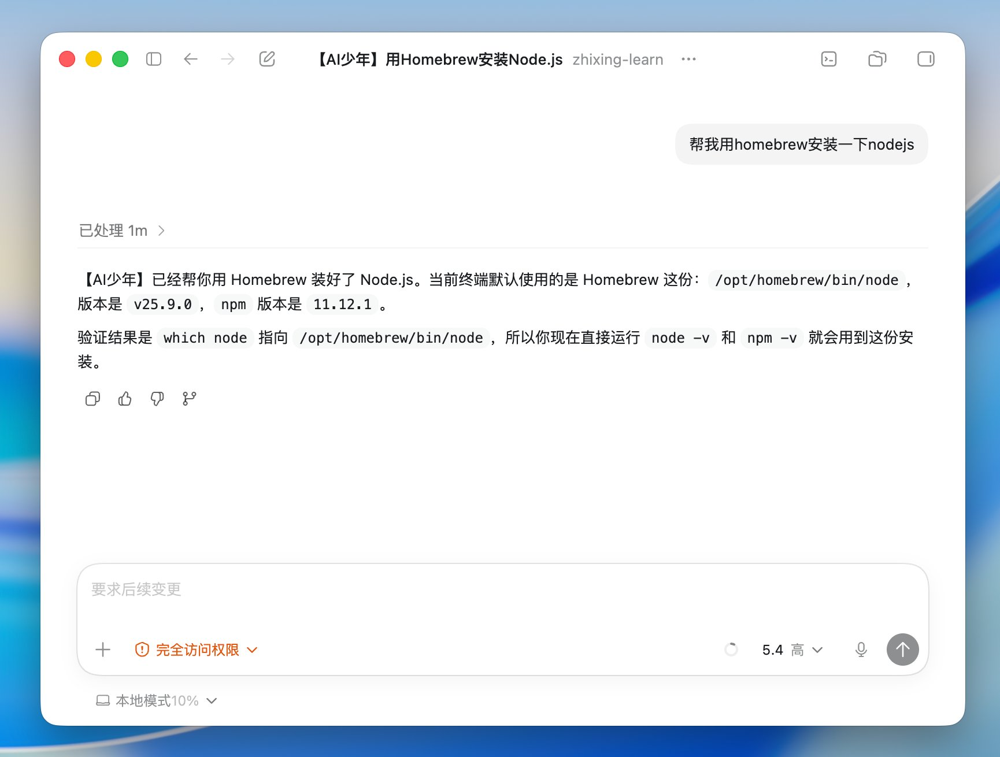

## 二、Codex App下安装Claude Code、Codex CLI、Gemini CLI

看下图就是直接告诉Codex App，“帮我安装Claude Code、 Codex CLI 、 Gemini CLI”。

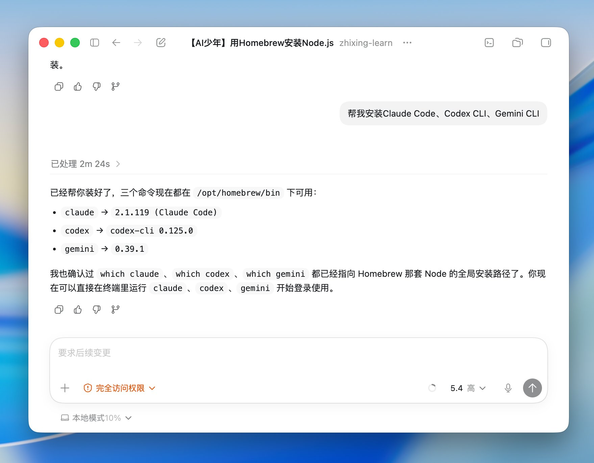

三个直接一起安装好了，其实中间处理过程它就是要先检查环境，再进行检查当前命令行终端是否已经安装，没安装就继续执行，安装了，就跳过进行下一个。然后可以分别继续授权登录使用了。

## 三、网页授权登录

第一个先网页授权登录Claude Code

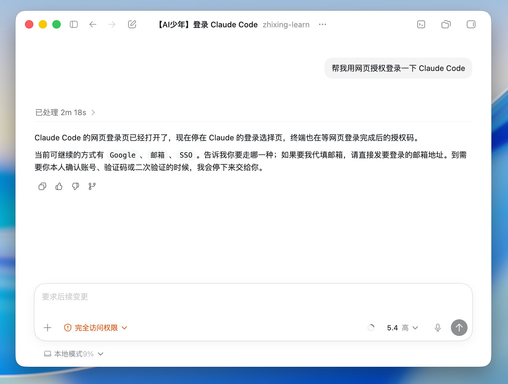

跳转到网页，如果你之前已经在网页登录claude.ai的官网的话，就可以直接点击「授权」就能登录了。

第二个网页授权登录Codex CLI

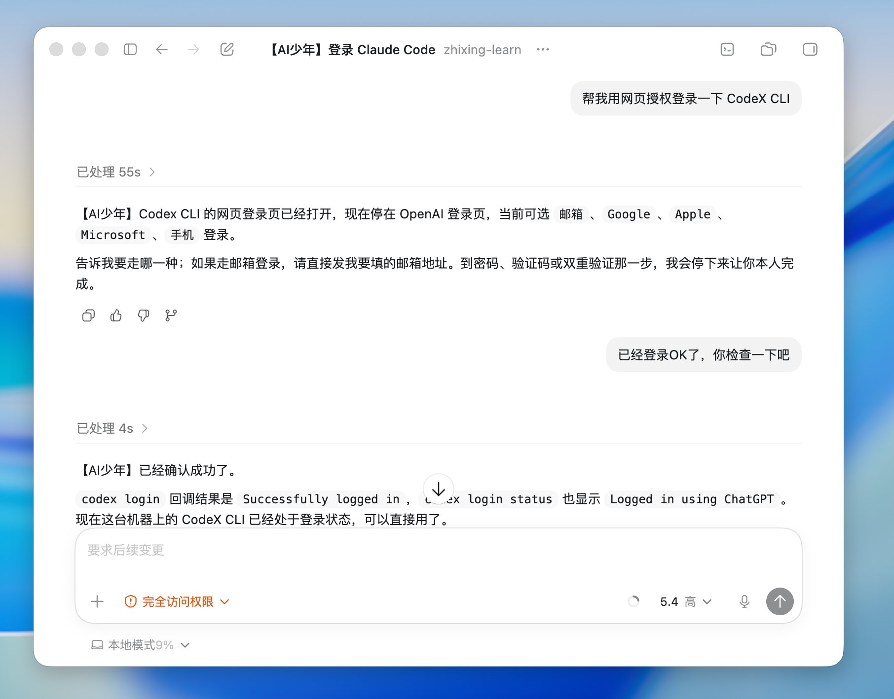

第三个网页授权登录Gemini CLI

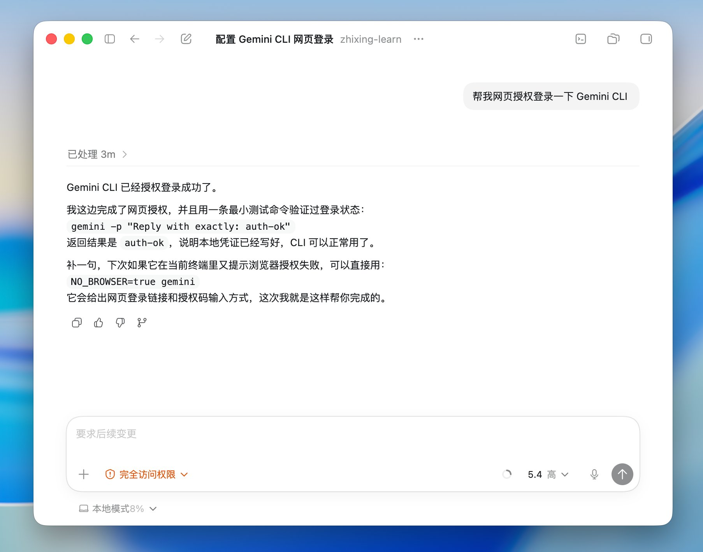

Gemini 网页授权在Codex App 中有一点点奇怪，不过也还好，反正不用自己进行操作Copy ，Codex App会自己进行处理。

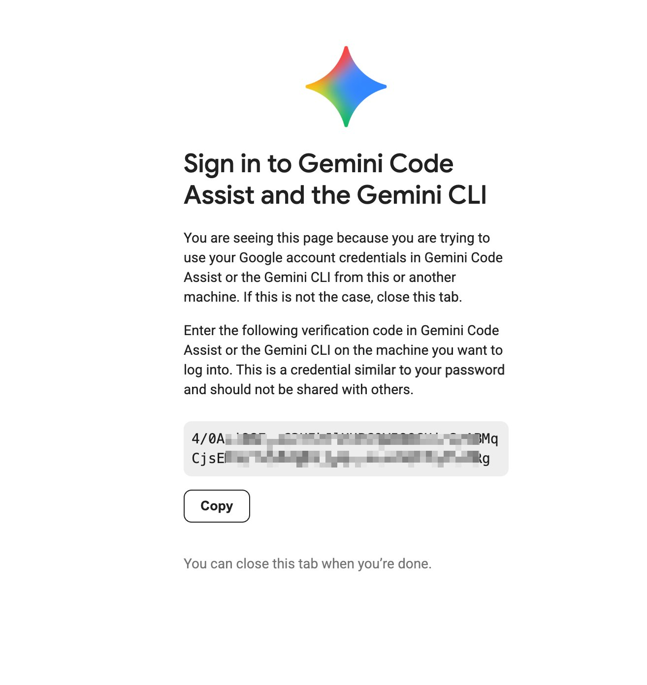

## 四、看终端效果

我本地使用是Ghostty终端。如果你也想安装使用，可以参考我系列文章的第三篇，在开头部分。

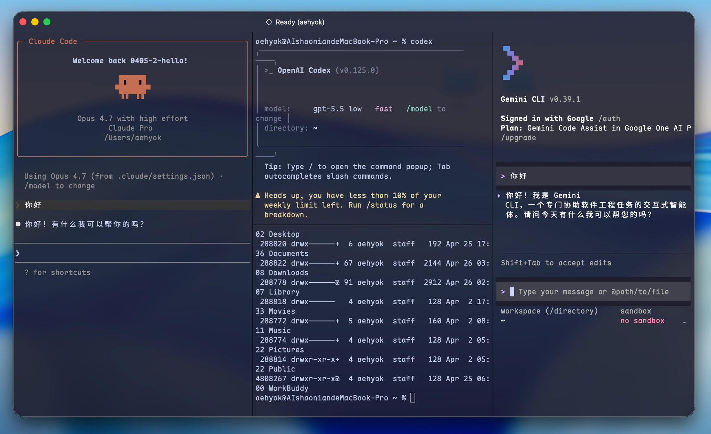

Ghostty一个屏可以并排或者竖排随意组合，如上图就是1:2:1四个终端一起运行。而且切换方便。

## 五、nodejs多版本管理nvm工具使用

这个多版本管理可能大部分人是不需要的，但是像很多开发者有这个需求，比如有些最新的工具可能需要的nodejs版本比较高，但是自己手里有一些比较老的项目，那么nodejs版本可能就比较低。如何进行切换两个nodejs版本，那么nvm这个工具应运而生了。

还是直接在Codex App中询问AI，一般都是先确认一下，然后再让他直接安装

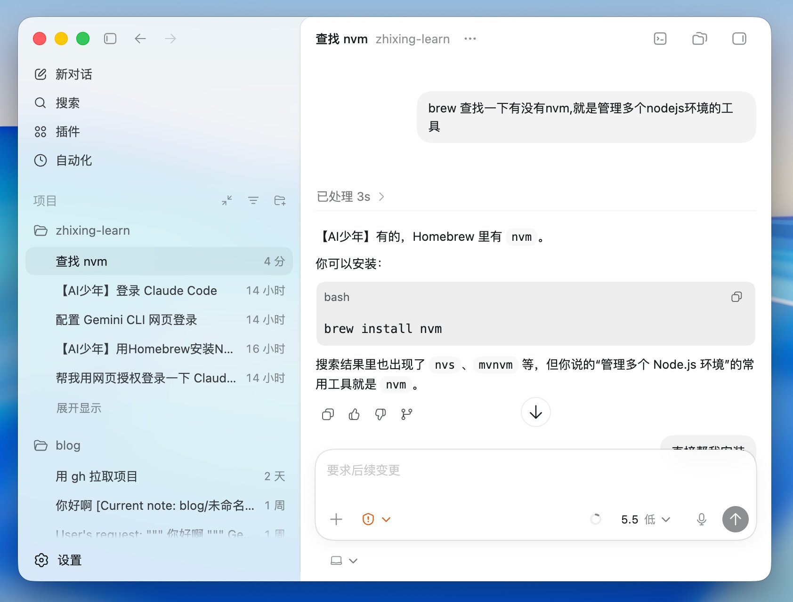

上图就是先简单的确认nvm这个工具。

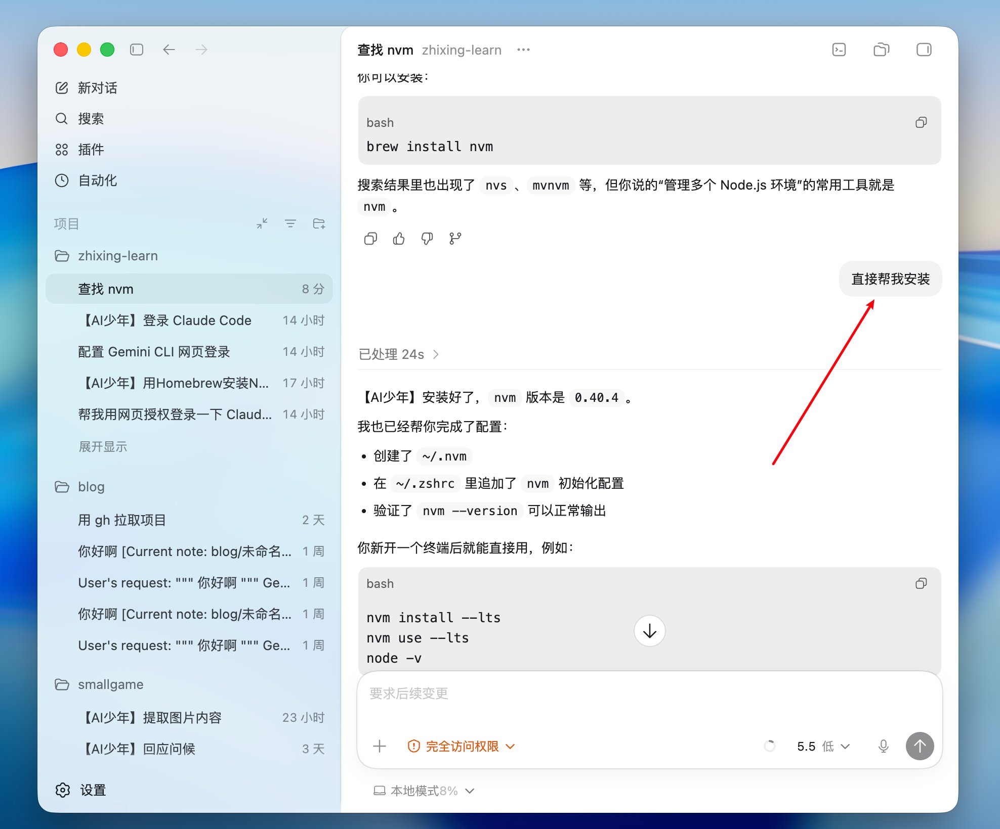

nvm常用指令，可以作为简单的参考，直接问AI它基本都可以帮我直接执行的

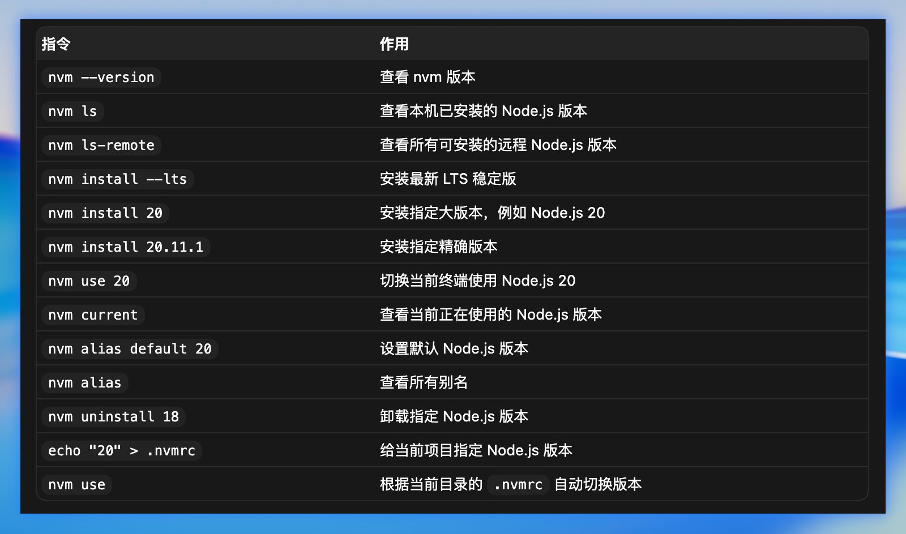

## 六、最后

如果你还想在Claude Code中接入第三方大模型 。

例如蚂蚁百灵目前在OpenRouter上直接免费使用：inclusionai/ling-2.6-1t:free，直接链接：[https://openrouter.ai/inclusionai/ling-2.6-1t:free](https://openrouter.ai/inclusionai/ling-2.6-1t:free) 。

这是马爸爸蚂蚁旗下 百灵 Ling-2.6-1T，万亿参数，推理快，适合Agent场景，在AIME26和SWE-bench上的成绩尚可。

具体在Claude Code对接如下：

先找到这个路径：~/.claude/settings.ling.json（mac），window上可能是C:\\\Users\\\Administrator.claude。

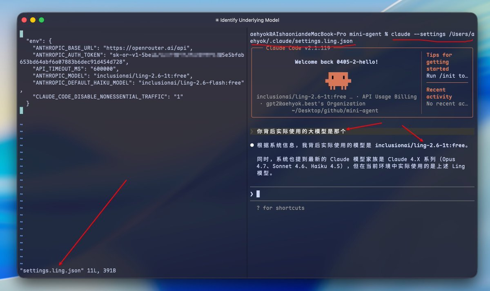

具体配置文件如下

```Plain Text
{

  "env": {

    "ANTHROPIC_BASE_URL": "https://openrouter.ai/api",

    "ANTHROPIC_AUTH_TOKEN": "sk-or-v1-xxxxxxxxxxxxxxxxxxxxxxxx",

    "API_TIMEOUT_MS": "600000",

    "ANTHROPIC_MODEL": "inclusionai/ling-2.6-1t:free",

    "ANTHROPIC_DEFAULT_HAIKU_MODEL": "inclusionai/ling-2.6-flash:free",

    "CLAUDE_CODE_DISABLE_NONESSENTIAL_TRAFFIC": "1"

  }

}


```

这是settings.ling.json中的配置内容，直接复制然后修改成自己的ApiKey就可以使用了。然后就可以直接使用命令

```Bash
claude --settings /Users/aehyok/.claude/settings.ling.json


```

如果觉得敲这个命令有点麻烦可以直接通过alias 设置命令别名，参加下图所示，最终通过cc-ling命令就可以使用，甚至可以更短来呼叫我们的AI终端。

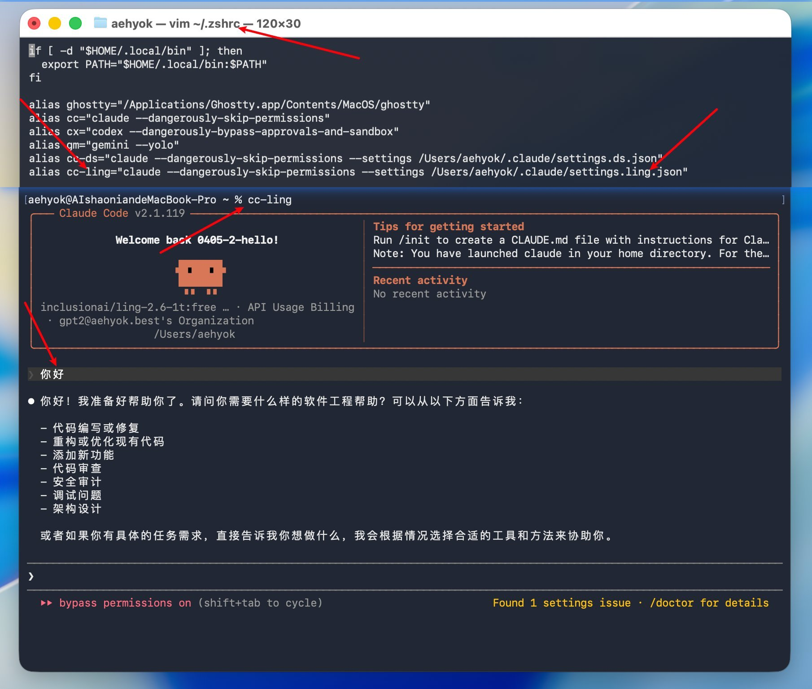

如果不知道如何通过alias来设置永久短别名，可以简单的叫AI帮你设置，使用。

最后在mac下安装AI终端工具，不知道你有没有体会到简单，就是这么so easy。没有那么多的弯弯绕绕，环境配置。让你在搭建AI环境以及后续使用AI的路上更加顺畅。

---

> 来源：飞书 · AI Spark 知识库 ｜ 原文（最新版）：<https://lcnniolukk80.feishu.cn/wiki/AE2AwTWllii3Wqkt4gNcdQeCncf> ｜ 归档：2026-06-04
