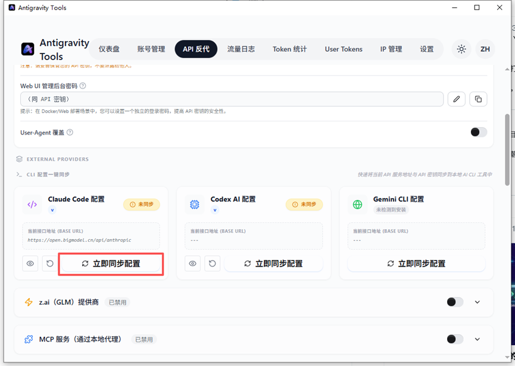
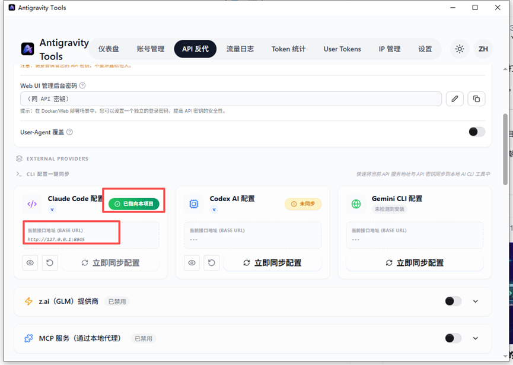
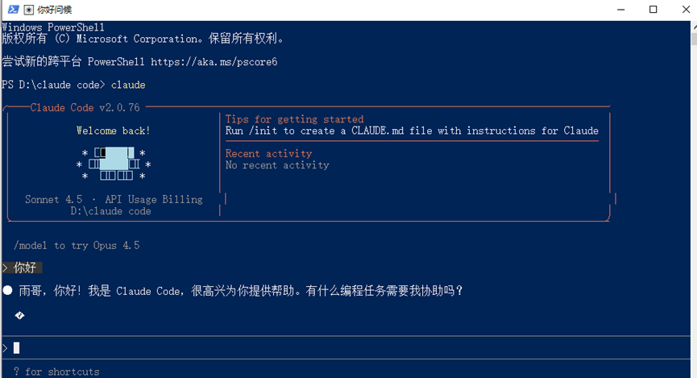

# 一键教你免费开启Claude+Opus 4.5，别再去闲鱼高价买教程了

**确保环境就绪，全程梯子守护**

1、 Antigravity能正常登录使用，不会的可以参考前面的教程

> 2月3日

2、 Antigravity Tools 已启动并开启“API 反代”服务，不会的可以参考前面教程

> 2月4日

3、 官网下载并安装claude code (`npm i -g [@anthropic](https://x.com/@anthropic)-ai/claude-code`)

**一键同步配置**

打开Antigravity Tools找到“**API 反代**”服务，下拉就能看到“**Claude Code 配置**

”面板，点击立即同步配置即可

一键配置完成如下图

打开Claude Code 会自动检测到新配置，询问是否使用，确认使用即可。

**注意如果以前配置了其他模型的api，记得选择新的api选项**

开始使用claude

---

> 来源：飞书 · AI Spark 知识库 ｜ 原文（最新版）：<https://lcnniolukk80.feishu.cn/wiki/YIlawGwsUiEHsnkp7gbcSdPSn1e> ｜ 归档：2026-06-04
