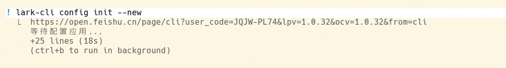
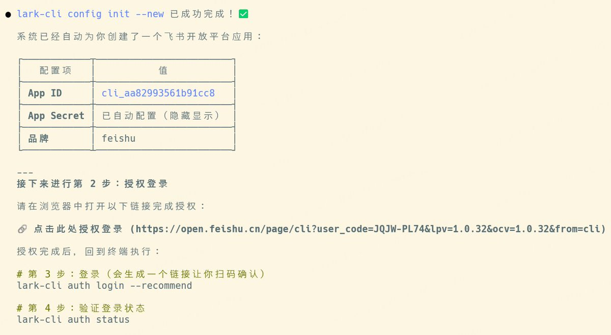
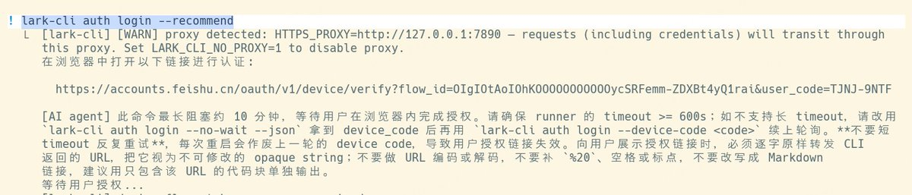
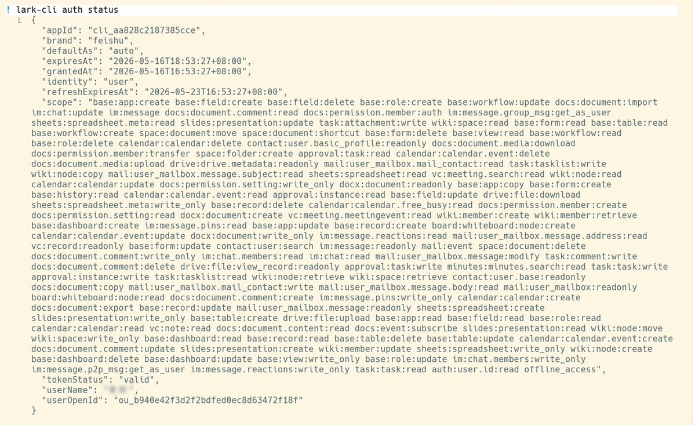
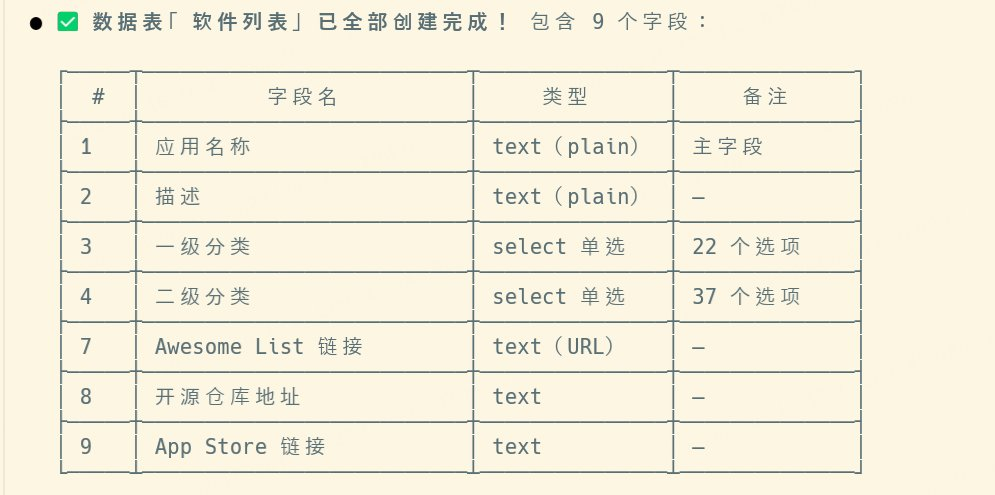
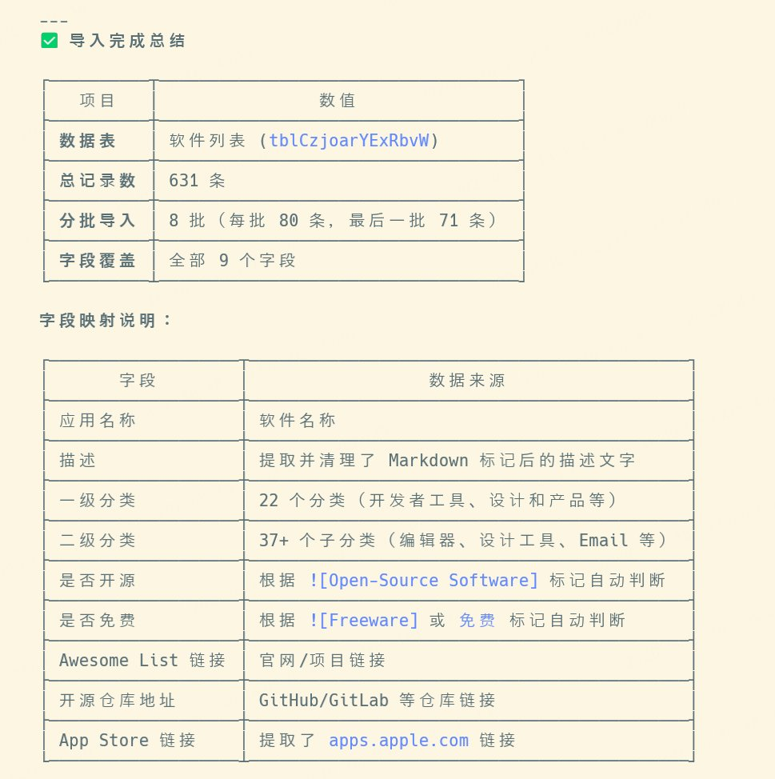
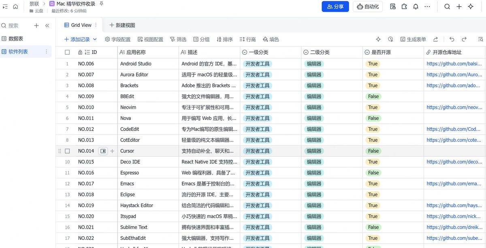

# 别再手动整理了——飞书 cli 让 AI 帮我把 Awesome Mac 搬进多维表格

---

我把 GitHub 上 600+ 软件的 Awesome Mac 文档，变成了一张结构化多维表格。 没有手动整理，没有写脚本。 靠的就是飞书 cli 这个刚开源 45 天破万星的工具。

Github 上有个非常好的项目叫 **Awesome Mac。**

[https://github.com/jaywcjlove/awesome-mac](https://github.com/jaywcjlove/awesome-mac)

这个项目致力于收集优质的 macOS 软件，并按照不同类别进行系统整理，已经收集了大几百个软件。因为罗列的软件非常多，文档非常长，并不是特别方便搜索查找。

正好最近使用飞书的多维表格，多维表格的数据结构性非常强，而且有丰富的视图，如果能从原来的 md 文档，变成结构化数据，它就能被筛选、被聚合、后续我也可以自己继续维护。

如果这个事情要手动完成，无疑工作量巨大，而且很枯燥。这种非常典型的重复劳动，特别适合让 AI 来帮我们完成。

恰好飞书官方开源了lark-cli，45 天达成GitHub 破万星。并且开源了一系列的飞书 skill，当中就有包括操作多维表格的 skill。

把非结构化的 md 文档，变成多维表格，完成这个事情需要的工具有

- Claude code
- 使用的大模型是**蚂蚁百灵正式开源的 Ring-2.6-1T**
- 飞书 cli 和 配套的 skill

下面跟着我一起，看看如何把非结构化的 md 文档，变成飞书的多维表格。

# 🛠️ 第一步：获取 Ring-2.6-1T 的 API Key

Ring-2.6-1T 目前已经在 OpenRouter 上线。

1. 前往 OpenRouter 官网并注册/登录账号。
2. 在后台找到 **Keys** 页面，点击生成一个新的 API Key。
3. **复制并保存好这串 API Key**，我们接下来的步骤会用到它。

# 📥 第二步：在 shell 配置里加个函数

把下面这段加到 **~/.zshrc** 或 **~/.bashrc** (zsh 示例, bash 几乎一样):

```Bash
export OPENROUTER_API_KEY="sk-or-v1-你的key"

# 会话: OpenRouter + inclusionai/ring-2.6-1t
claude-ring() {
  ANTHROPIC_BASE_URL="https://openrouter.ai/api" \
  ANTHROPIC_AUTH_TOKEN="$OPENROUTER_API_KEY" \
  ANTHROPIC_API_KEY="" \
  ANTHROPIC_MODEL="inclusionai/ring-2.6-1t" \
  ANTHROPIC_SMALL_FAST_MODEL="inclusionai/ring-2.6-1t" \
  CLAUDE_CODE_DISABLE_NONESSENTIAL_TRAFFIC=1 \
  claude "$@"
}
```

# 🚀 第三步：在 Claude Code 中起飞！

在终端中，输入 claude-ring 回车，直接跑的是 Ring-2.6-1T。


# 📥 第四步：安装飞书 cli 和 skill

在 Claude code 中使用下面的提示词

```Plain Text
根据这个网页的说明 https://github.com/larksuite/cli/blob/main/README.zh.md         
帮我安装一下，帮我安装飞书的 cli 和操作多维表格的 skill
```


参考下面的说明，继续完成飞书 cli 的配置


## 第一步：初始化配置

在 Claude code 中输入英文 ! ，变成 shell 模式，输入下面的命令

```Bash
lark-cli config init --new
```



终端会返回一个配置链接，拷贝链接到浏览器中打开，提示你创建飞书应用，或者是使用已有的，这里我们选择创建。


点击创建，等待完成。


完成后，回到命令行界面，提示成功完成第一步



## 第二步：授权登录

```Bash
lark-cli auth login --recommend
```

在 Claude code 中执行上面命令后，也会出现一个链接，拷贝到浏览器中打开，建议直接开通所有权限




## 第三步：验证登录状态

继续输入下面的命令

```Bash
lark-cli auth status
```



经过上面三步，飞书 cli 就完全配置好了。

## 第四步：创建多维表格

在 Claude code 中输入下面的 Prompt

```Plain Text
帮我创建一个飞书多维表格，名字是 Mac 精华软件收录
```


浏览中打开链接，能看到，说明创建成功


接下来我们要创建个一个全新的数据表，这个表的数据字段设计如下


因为一级分类和二级分类是 select 字段，它的数据来源是文档，我们先将这些具体选项直接提取出来。使用下面的提示词

```Plain Text
帮我提取 https://github.com/jaywcjlove/awesome-mac/blob/master/README-zh.md 软件的一级分类，和二级分类，两者分开，每个分类下的所有条目直接全部列出，用、分隔。
```


再使用下面的提示词创建数据表

```Plain Text
在「Mac 精华软件收录」这个多维表格中，创建一个数据表。

字段如下（按此顺序）：

1. 应用名称 —— text 主字段（plain）
2. 描述 —— text（plain）
3. 一级分类 —— select 单选，选项：开发者工具、设计和产品、虚拟机、AI 客户端、通信、数据恢复、音频和视频、阅读与写作工具、软件打包工具、下载工具、网盘、输入法、浏览器、翻译工具、安全工具、科学上网、其它实用工具、远程协助、QuickLook 插件、游戏软件
4. 二级分类 —— select 单选，选项：编辑器、开发者实用工具、正则编辑器、API 开发和分析、网络分析、命令行工具、版本控制、版本控制 GUI、版本控制系统、数据库、命令行应用、设计工具、原型流程、作图工具、截图工具、其它工具、无、Email、文件共享、流媒体音乐播放器、音频录制与编辑、日记、Office、RSS、Markdown、笔记、写作、电子书、其他、剪贴板工具、菜单栏工具、待办事项工具、系统相关工具、窗口管理、密码管理、Finder
5. 是否开源 —— select 单选，选项：True、False
6. 是否免费（包含个人使用）—— select 单选，选项：True、False
7. Awesome List 链接 —— text，URL 类型
8. 开源仓库地址 —— text，URL 类型
9. App Store 链接 —— text，URL 类型
```

等待后，数据表创建成功



打开浏览器后验证一下，确实成功了


使用下面的提示词，导入数据

```Bash
从awesome-mac 中文 README文档中，提取数据，通过批量导入的方式，添加到软件列表数据表中
```



在浏览器中查看



多维表格有了数据之后，就可以利用内置的多种视图，方便筛选，查看。

---

> 来源：飞书 · AI Spark 知识库 ｜ 原文（最新版）：<https://lcnniolukk80.feishu.cn/wiki/HhGZwQnLMiOzG4kPLDncPTv8nKc> ｜ 归档：2026-06-04
