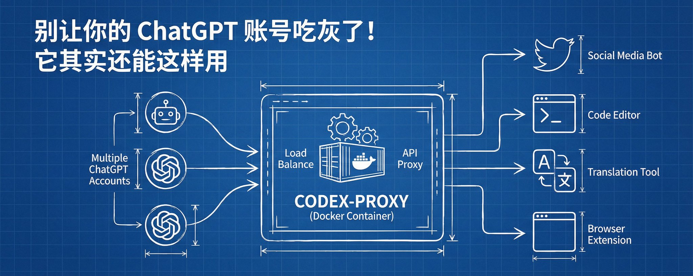
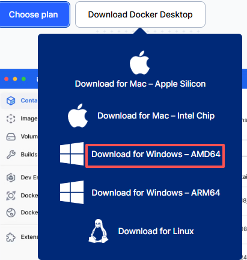
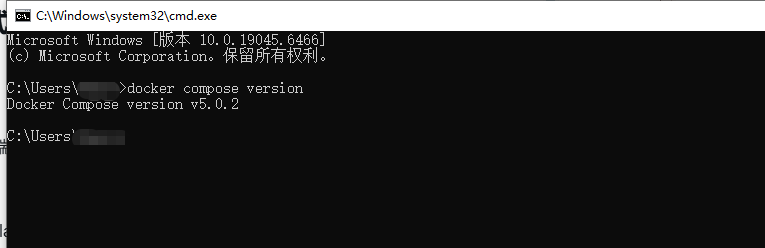
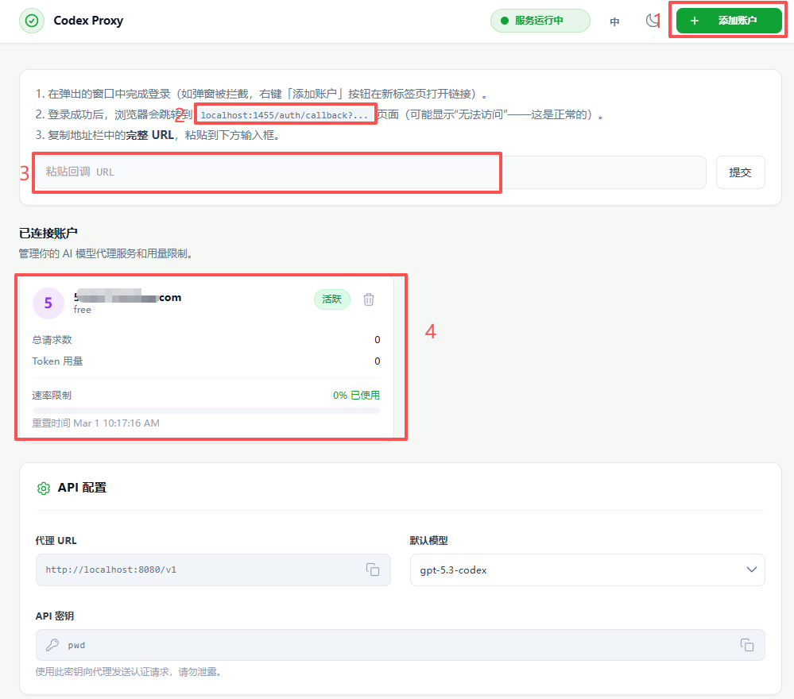
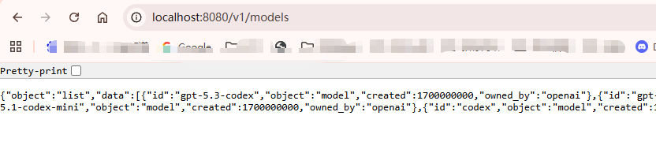
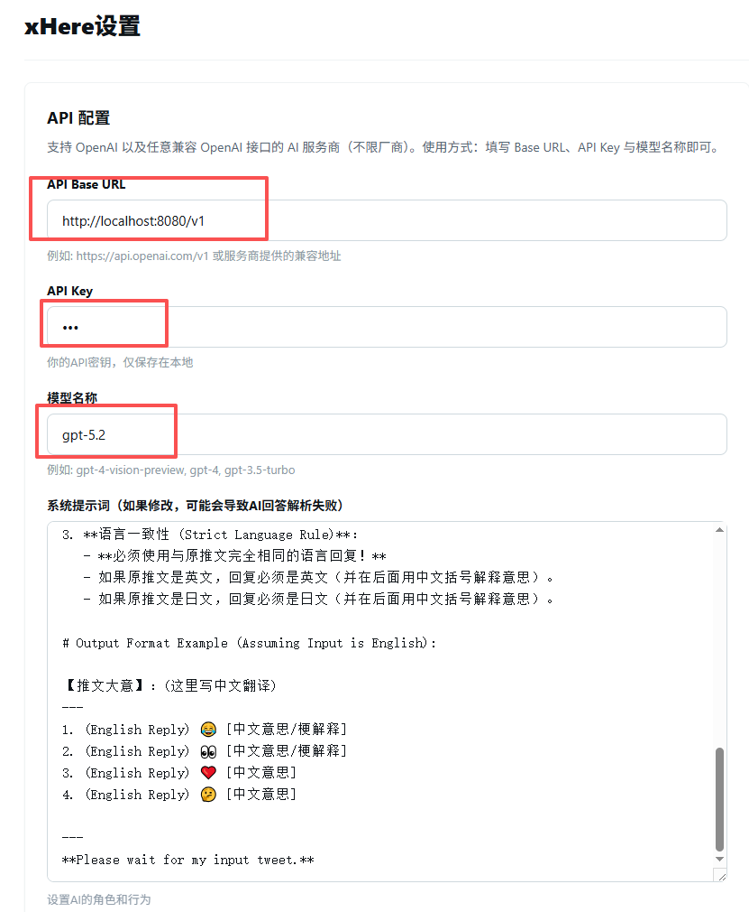

# 别让你的 ChatGPT 账号吃灰了！它其实还能这样用（附保姆级教程）

> 💡 **写在前面：**

> 很多人手里都有 ChatGPT 账号，但除了偶尔上去聊聊天，大部分时间都在“吃灰”。其实，你的账号潜力远不止于此！

> 今天教你一个隐藏玩法：通过一个叫 **codex-proxy** 的小工具，不仅能把你的账号变成万能接口接入各种软件，**还能把好几个账号“绑”在一起轮流用，彻底榨干免费额度！**

> 在 Windows 电脑上部署它完全可行。下面是一条照做就能跑通的最短路径，并帮你把关键的“坑”都标出来了。

## 这篇文章适合谁？

- 手里有（或捡漏了多个）ChatGPT 账号，想最大化利用的人；
- 想在电脑上本地部署 AI 接口，接管各种浏览器插件和写作软件的朋友；
- 最怕遇到环境报错、想要真实截图“手把手带飞”的实操党。

## 简单聊聊：codex-proxy 到底是干嘛的？

用一句话解释：**它能把你网页版的账号能力，转换成大家都在用的标准 OpenAI 接口，而且支持多账号“组队打工”。**

你可以把它想象成一个本地的“包工头”：

- **上游**：它负责去对接官方。
- **下游**：它输出标准的接口格式（/v1/chat/completions）。
- **你怎么用**：你在本机启动它之后，只需要在各种第三方客户端填上 http://localhost:8080/v1 就可以了。

## 这样做有哪四大“开挂”体验？

1. **✨** **杀手锏：多账号轮询（榨干白嫖额度）**：如果你或朋友有多个账号，你可以把它们全登上去。它会自动帮你“洗牌轮询”，这个号请求完了换下一个号，再也不怕单个账号被限制发言频率了！
2. **百搭好用**：市面上几乎所有 AI 插件和工具都支持 OpenAI 协议，有了它，你就能直接接入各类工具（比如推特插件、翻译工具、甚至本地代码编辑器）。
3. **排错方便**：所有的调用过程都在你自己的电脑上，哪一步卡住了，看一眼日志清清楚楚。
4. **无痛迁移**：以后换个客户端软件，只需要填一下本地地址和密码，不需要重新搞一套复杂的设置。就比如我，目前把它直接接进了推特插件里，非常丝滑。

> **补充一个进阶小知识：什么是“协议伪装”？**

> 简单来说，codex-proxy 不只是帮你转发请求，它还会尽量“模仿”官方客户端的行为（比如伪装请求头）。就像是戴上面具通过安检。虽然在 Windows 环境下，它更容易进入“降级模式”（可用但伪装能力较弱）；只有在依赖完整、网络稳定时才更容易拿到完整伪装能力。**我们的策略是：先保证能跑通，以后再追求完美。**

## 为什么强烈建议用 Docker？（而不是直接安装）

很多朋友的第一反应是直接敲代码安装（比如用 npm install）。但在 Windows 上，我劝你直接上 Docker，原因就三个关键词：**稳定、好搬家、容易成功**。

- **不挑环境（稳定）**：Windows 直装容易遇到各种版本冲突、路径报错。Docker 直接把运行环境打包好了，就像买了个精装房，拎包入住。
- **换电脑不愁（可迁移）**：换台电脑，只需敲一行代码 docker compose up -d 就能重新跑起来。
- **拯救 C 盘**：你可以把 Docker 的数据默认存到 D 盘，这样就不用担心它悄悄把你的系统盘吃满了。（建议在 Docker Desktop 设置里把 Disk image location 改到 D 盘）
- **管理省心**：看日志、重启，也就是一行简单命令的事儿。

> **小贴士**：除非你只是想花 5 分钟浅浅试一下，以后再也不用了，否则只要打算长期用，一律推荐 Docker 路线！

## 我们的最终目标

只要你能顺利走完下面这 4 步，就算大功告成：

1. 浏览器能打开 http://localhost:8080
2. 能用 ChatGPT 账号成功登录授权
3. 访问 http://localhost:8080/v1/models 能看到一串模型代码
4. 你的第三方工具（客户端/插件）能成功调用它

准备好了吗？我们开始！

## 🛠️ 前期准备工作

- 一台 Windows 10 或 Windows 11 电脑。
- 已经安装好了 **Docker Desktop**。

- 确认 Docker Compose 可用（随便打开个终端输入 docker compose version，能出来版本号就行）。

## 🚀 正式安装（最短路径）

## 第一步：下载项目代码

打开你的终端（命令行），找个你喜欢的文件夹（比如 D盘的 claude code），输入：

> cd "D:\\\claude code" git clone [https://github.com/icebear0828/codex-proxy.git](https://github.com/icebear0828/codex-proxy.git) cd codex-proxy

## 第二步：准备配置文件

仔细看文件夹里，是不是有个叫 .env.example 的文件？

把它复制一份，重命名为 **.env**。（如果不做这一步，等下会报错说找不到环境文件哦）。

## 第三步：一键启动服务

在终端输入这行魔法代码，然后稍微等它跑一会儿：

> docker compose up -d

## 第四步：浏览器登录（⭐️ 多账号的秘密就在这里）

打开你的浏览器，输入：**http://localhost:8080**

- 点击登录，使用你的**第一个** ChatGPT 账号完成登录。
- **重点来了**：如果你有多个账号，就在这个控制台页面里继续添加登录！添加完之后，系统就会自动帮你把这些账号排好队，每次请求都会智能轮换。

## 第五步：验证是否成功

打开终端，跑一下这两行命令：

> curl http://localhost:8080/health curl http://localhost:8080/v1/models

如果有正常的代码返回，恭喜你，基础服务已经完全跑通啦！🎉

## 💣 真实“踩坑”记录与解决办法

跟着上面的步骤走，你大概率会遇到下面这几个坑。别慌，我都替你踩过并找到解法了。

## 坑 1：Docker Desktop 启动失败，一直转圈圈

**报错现象**：提示 Docker Desktop is unable to start。

**原因**：通常是因为你的 Windows 里的 WSL 组件版本太老了。

**怎么解决**：

打开 PowerShell，输入：

> wsl --update wsl --shutdown

然后**重启电脑**，再打开 Docker Desktop 就好了。

## 坑 2：构建的时候提示 502 网络错误

**报错现象**：看到一长串红字里夹着 apt-get ... 502 Bad Gateway。

**原因**：纯粹的网络抽风。

**怎么解决**：不带缓存重新构建一次：

> docker compose build --no-cache

## 坑 3：报错 403 API 频率限制（最容易卡住的地方）

**报错现象**：提示 setup-curl.ts 报 API rate limit exceeded。

**原因**：在下载“协议伪装”组件时，被 GitHub API 限流。

**怎么解决**：这个报错在默认构建链路里可能会直接导致构建失败，不能简单忽略。我的实操做法是先走“可用优先”路径（跳过该下载步骤，先让服务跑起来），后续再补齐增强伪装能力。

## 🔌 客户端通用配置指南

在你的第三方工具里，照着这样填：

- **API 地址（Base URL）**：http://localhost:8080/v1
- **API 密钥（API Key）**：去项目的 config/default.yaml 文件里找 server.proxyapikey 对应的值。（默认可能是设定的一个密码，比如 pwd）
- **模型名称（Model）**：填 codex 或者gpt-5.3-codex，也可以是chatgpt支持的其他模型

xhere配置参考

xhere应用生效

**拿默认配置举个例子**：

如果是默认的配置文件，你的鉴权（Authorization）信息应该填：pwd

如果大家也是在 Windows 上折腾 codex-proxy，强烈建议优先走 Docker 路线。因为真正的难点往往不是敲那几行命令，而是令人头秃的环境细节：WSL 版本、.env 文件有没有建、网络波动等等。

> **💬** **互动交流**：

> 如果你在部署过程中遇到了其他的报错，欢迎在评论区把报错截图贴出来（记得打码或遮挡个人敏感信息哦），我来帮你看看是卡在哪一层了！祝大家折腾愉快！

---

> 来源：飞书 · AI Spark 知识库 ｜ 原文（最新版）：<https://lcnniolukk80.feishu.cn/wiki/BF2Kw0QxAimq4fkwBZ5cectAn0a> ｜ 归档：2026-06-04
