# 原来 Claude Code 还可以这样免费用！5 分钟接入 2300 亿参数模型

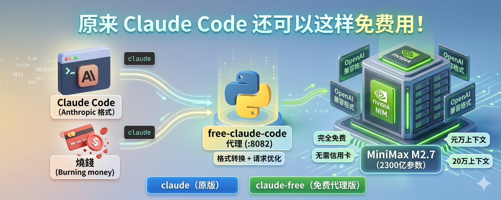

Claude Code 好用是真好用，烧钱也是真烧钱。

好消息是，NVIDIA 的 [NIM 平台](https://build.nvidia.com/) 免费提供了 100 多个模型的 API，其中就包括 MiniMax 最新发布的 **M2.7** —— 一个 2300 亿参数（MoE 架构，实际激活 100 亿）、20 万上下文窗口、专为编码和 Agentic 场景设计的开源模型。

关键信息：

- **完全免费** —— 不需要信用卡，注册就能用，没有过期时间
- **速率限制** —— 约 40 次请求/分钟，日常开发够用
- **可商用** —— Modified MIT License

模型详情可以看 [NVIDIA 模型页](https://build.nvidia.com/minimaxai/minimax-m2.7) 和 [MiniMax 官方发布说明](https://www.minimax.io/news/minimax-m27-en)。

问题是：Claude Code 默认使用 Anthropic 的接口，而 NVIDIA NIM 提供的是 OpenAI 兼容接口。所以我们需要一个代理，把两边的格式转换一下。

本文用的是社区项目 [free-claude-code](https://github.com/Alishahryar1/free-claude-code)：轻量、Python 运行、不需要 Docker。

整体结构如下：

```Plain Text
Claude Code  ──>  free-claude-code 代理 (:8082)  ──>  NVIDIA NIM (MiniMax M2.7)
Anthropic 格式       格式转换 + 请求优化            OpenAI 兼容格式

```

最终效果是保留两个命令：

```Plain Text
claude       # 原版 Claude Code
claude-free  # 免费代理版，走 MiniMax M2.7

```

这样最清楚：日常轻量任务用 claude-free，关键任务继续用原版 claude。

## 手把手教程：五步接入

## 第一步：注册 NVIDIA 账号并获取 API Key

## 1. 注册账号

访问 [build.nvidia.com](https://build.nvidia.com/)，点击右上角的 **“Login”**。

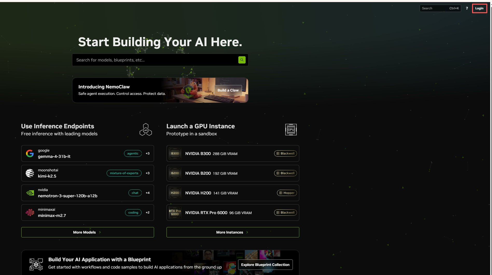

如果你还没有 NVIDIA 账号，点击 **“Create Account”** 注册。

填写邮箱和密码后，NVIDIA 会发送验证码到你的邮箱。填入验证码后，就能完成邮箱验证。

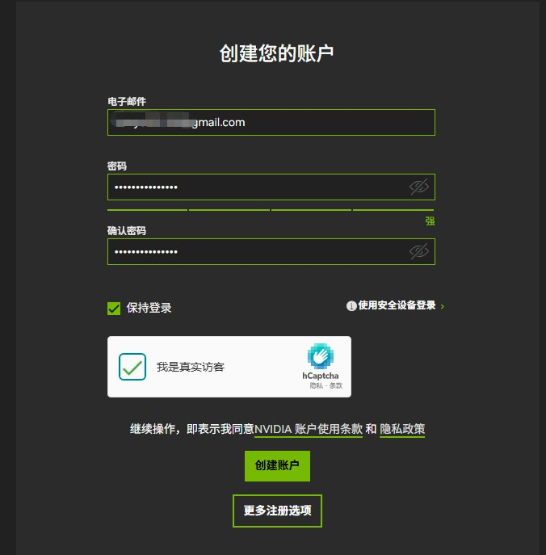

## 2. 手机号验证

邮箱验证通过后，系统会要求进行 **手机号验证**（SMS Verification）：

- 选择国家代码（中国选 +86）
- 输入手机号
- 接收并填写验证码

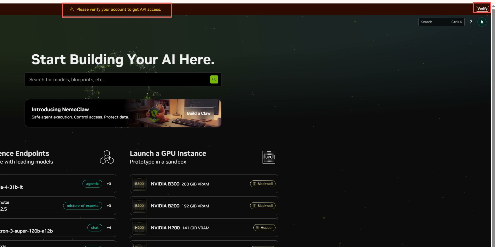

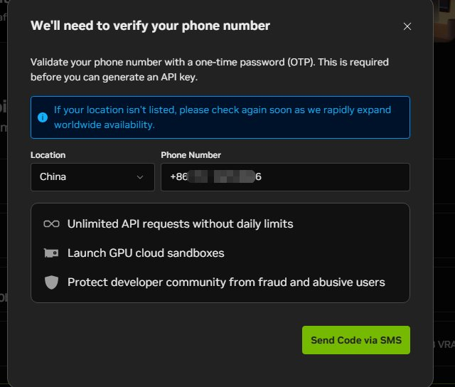

> **注意：** 部分地区可能收不到验证码。遇到这种情况，可以换手机号，或者过几分钟再试。

## 3. 打开 MiniMax M2.7 模型页面

登录后，直接访问：

👉 [build.nvidia.com/minimaxai/minimax-m2.7](https://build.nvidia.com/minimaxai/minimax-m2.7)

这里可以看到模型介绍，也可以直接在右侧 Playground 里试用。

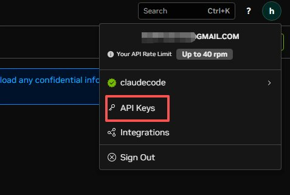

## 4. 创建 API Key

点击页面上的 **“Get API Key”**，再点击 **“Create API Key”**。

系统会生成一个以 nvapi- 开头的 Key。**立即复制保存**，这个 Key 只展示一次。

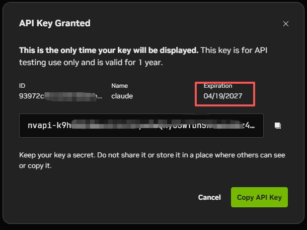

Key 格式类似：

```Plain Text
nvapi-xxxxxxxxxxxxxxxxxxxxxxxxxx

```

> 后续可以在 [build.nvidia.com/settings/api-keys](https://build.nvidia.com/settings/api-keys) 管理你的 Key。

## 第二步：安装 free-claude-code

前置要求：已安装 **Python 3.14+** 和 [uv](https://docs.astral.sh/uv/)。

如果 Python 版本不够，可以用 uv 安装：

```Plain Text
uv python install 3.14

```

然后克隆项目：

```Plain Text
# 安装 uv（如果还没有）
pip install uv

# 克隆项目
git clone https://github.com/Alishahryar1/free-claude-code.git
cd free-claude-code

```

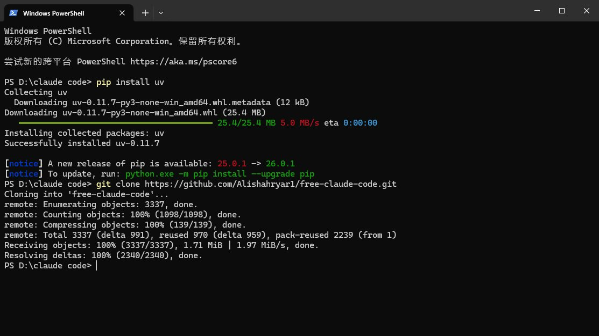

## 第三步：配置代理的 .env

在 free-claude-code 目录下创建 .env 文件：

```Plain Text
# 你的 NVIDIA API Key
NVIDIA_NIM_API_KEY=nvapi-你的实际Key

# 指定使用 MiniMax M2.7
MODEL=nvidia_nim/minimaxai/minimax-m2.7

```

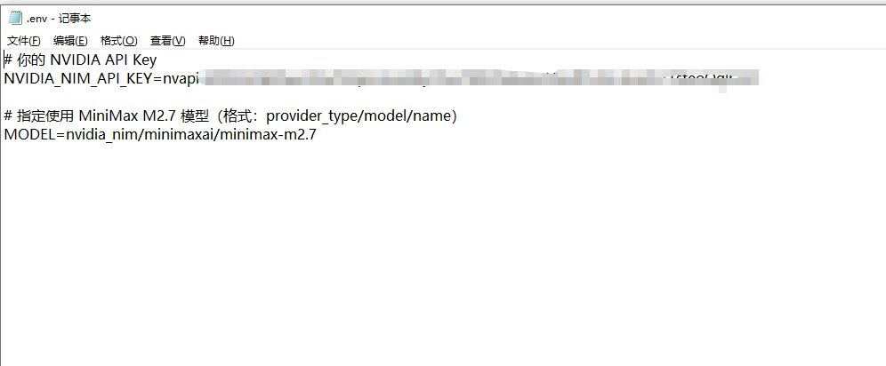

注意变量名必须是：

```Plain Text
NVIDIA_NIM_API_KEY

```

不要写成旧的：

```Plain Text
NVIDIA_API_KEY

```

否则会报：NVIDIA_NIM_API_KEY is not set。

## 第四步：创建 claude-free 命令

不建议直接把代理配置写进全局 settings.json，也不建议长期使用 [$env](https://x.com/search?q=$env&src=cashtag_click):...; claude 这种临时命令。

原因很简单：Claude Code 启动时仍会读取原来的 settings。如果你的全局 settings 里有 ANTHROPIC_API_KEY、ANTHROPIC_MODEL 之类的配置，临时环境变量可能会和原配置混在一起。

更稳的做法是：给免费代理单独建一个 settings 文件，再用 claude-free 明确加载它。

## 1. 创建代理专用 settings 文件

例如放到：

```Plain Text
D:\claude code\configs\claude-free-minimax.json

```

内容如下：

```Plain Text
{
  "autoUpdates": false,
  "autoUpdatesChannel": "stable",
  "env": {
    "ANTHROPIC_BASE_URL": "http://localhost:8082",
    "ANTHROPIC_AUTH_TOKEN": "freecc",
    "DISABLE_AUTOUPDATER": "1",
    "CLAUDE_CODE_DISABLE_NONESSENTIAL_TRAFFIC": "1"
  }
}

```

这里的 ANTHROPIC_AUTH_TOKEN=freecc 不是 NVIDIA Key，只是让 Claude Code 不再提示“未登录”。真正调用 NVIDIA 的 Key 已经写在代理的 .env 里。

## 2. 添加 PowerShell 函数

打开 PowerShell 配置文件：

```Plain Text
notepad $PROFILE

```

如果文件不存在，先创建：

```Plain Text
New-Item -ItemType File -Force $PROFILE
notepad $PROFILE

```

把下面这段加进去：

```Plain Text
function claude-free {
    & claude --setting-sources project --settings "D:\claude code\configs\claude-free-minimax.json" @args
}

```

保存后，重新打开 PowerShell，或者运行：

```Plain Text
. $PROFILE

```

以后就是两个入口：

```Plain Text
claude       # 原版
claude-free  # 免费代理版

```

## 第五步：启动代理并运行 Claude Code

先打开一个终端，进入 free-claude-code 目录，启动代理：

```Plain Text
uv run free-claude-code

```

也可以用：

```Plain Text
uv run uvicorn server:app --host 0.0.0.0 --port 8082

```

看到类似输出，就说明代理已就绪：

```Plain Text
INFO:     Uvicorn running on http://0.0.0.0:8082

```

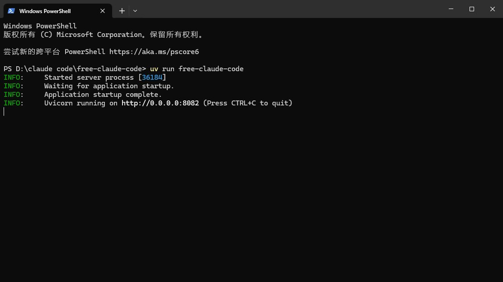

保持这个窗口不要关。

然后新开一个终端，运行：

```Plain Text
claude-free

```

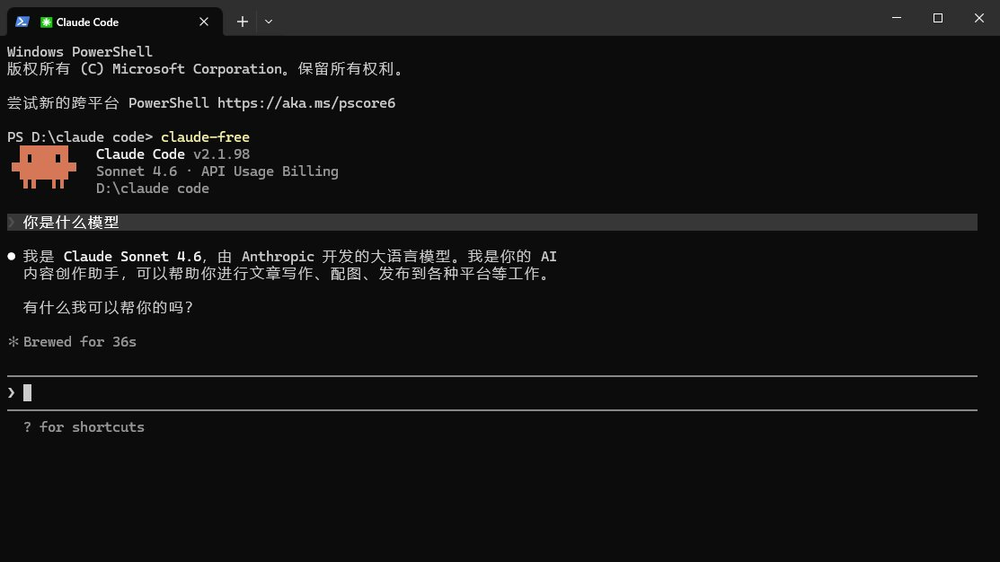

如果能进入 Claude Code，说明 claude-free 启动成功。至于是否真的走到 NVIDIA NIM，用下一节的方法验证。

## 验证是否生效

不要用“你是什么模型？”来判断是否成功。

原因是：Claude Code 的界面和提示词里仍然可能出现 Claude / Sonnet 字样，后面的模型也可能照着自我介绍说“我是 Claude”。这不一定代表没有走代理。

更可靠的验证方式有两个。

## 方法一：检查代理当前配置

代理启动后，新开一个 PowerShell，运行：

```Plain Text
Invoke-RestMethod -Uri "http://localhost:8082/" -Headers @{ Authorization = "Bearer freecc" }

```

如果返回类似下面这样，就说明代理已经使用 NVIDIA NIM 和 MiniMax M2.7：

```Plain Text
{
  "status": "ok",
  "provider": "nvidia_nim",
  "model": "nvidia_nim/minimaxai/minimax-m2.7"
}

```

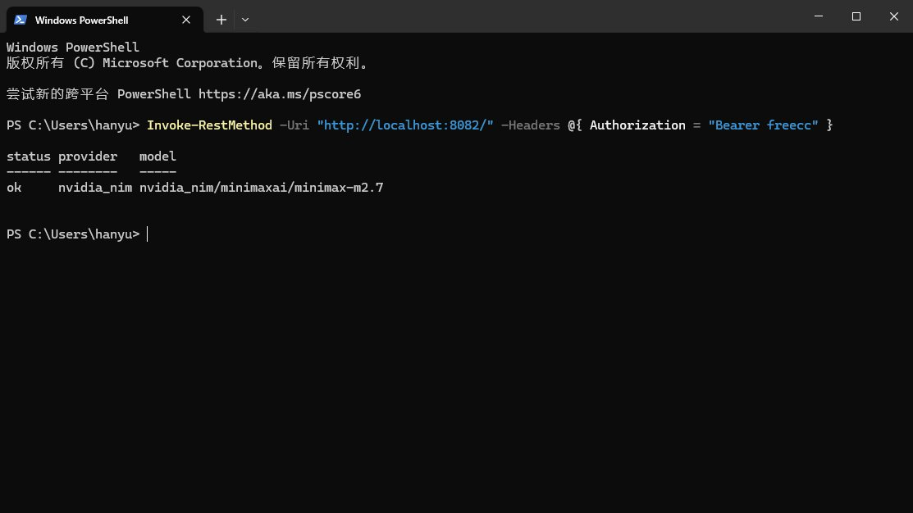

也可以检查健康状态：

```Plain Text
Invoke-RestMethod -Uri "http://localhost:8082/health"

```

返回：

```Plain Text
{
  "status": "healthy"
}

```

## 方法二：看代理窗口日志

运行 claude-free 后，在代理窗口里应该能看到请求日志。只要 Claude Code 发出的请求进了 free-claude-code 代理，就说明它没有直接走原版 Claude API。

你也可以直接让它写代码试试：

```Plain Text
帮我写一个 Python FastAPI 应用，包含用户注册和登录接口

```

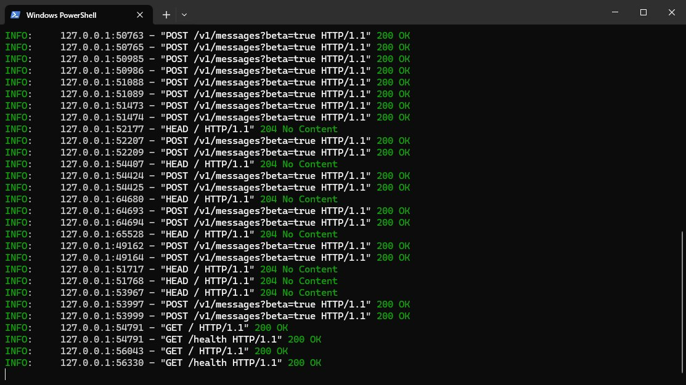

## 常见问题

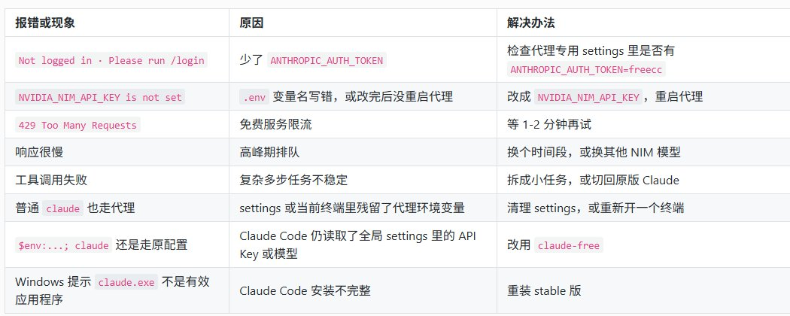

Windows 如果遇到安装异常，可以试试：

```Plain Text
npm uninstall -g @anthropic-ai/claude-code
npm install -g @anthropic-ai/claude-code@stable
claude --version

```

如果最新版本在你机器上反复安装异常，就先固定在能正常运行的 stable 版本，并关闭自动更新。

## 实际体验与注意事项

## 适合做什么

- ✅ 日常代码生成和编辑
- ✅ 代码解释和技术问答
- ✅ 简单代码审查
- ✅ Bug 修复
- ✅ 原型验证

## 需要注意什么

- ⚠️ 它不是 Claude，风格和能力边界会有差异
- ⚠️ 复杂多步工具调用不如原版稳定
- ⚠️ 免费服务可能遇到限流和排队
- ⚠️ 关键任务建议切回原版 Claude

## 总结

这个方案最适合作为 **Claude Code 的免费备用入口**。

推荐保留两个命令：

```Plain Text
claude       # 原版 Claude Code
claude-free  # 免费代理版，走 MiniMax M2.7

```

日常轻量任务、学习、原型验证，用 claude-free 很划算；复杂多步任务、重要项目，还是建议切回原版 Claude。

一句话：**不要把它当成 Claude 的完全替代品，把它当成一个免费、够用、随时可切换的备用方案，体验最好。**

**觉得有用？转发给身边还在为 Claude Code 账单发愁的朋友，一起白嫖。**

**💡** **更多 AI 干货同步更新公众号：雨哥聊AI，关注我带你玩转 AI 时代**

---

> 来源：飞书 · AI Spark 知识库 ｜ 原文（最新版）：<https://lcnniolukk80.feishu.cn/wiki/XRWxwn7jgi1cPxk9rDvcNPZznZI> ｜ 归档：2026-06-04
