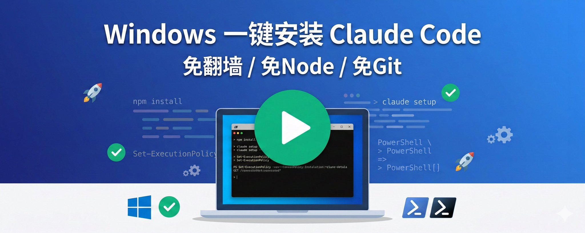
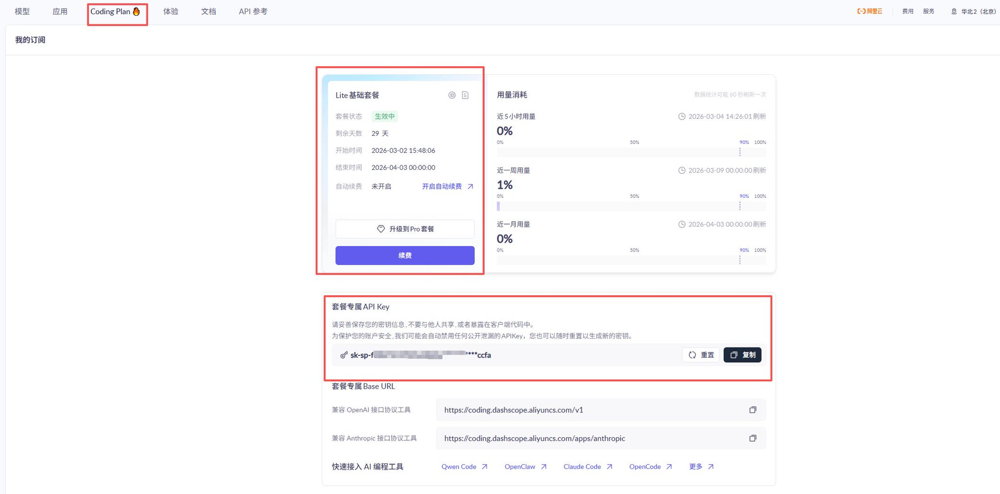
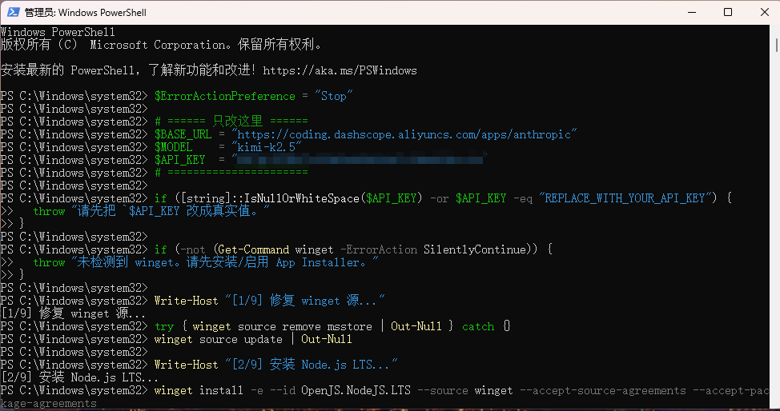
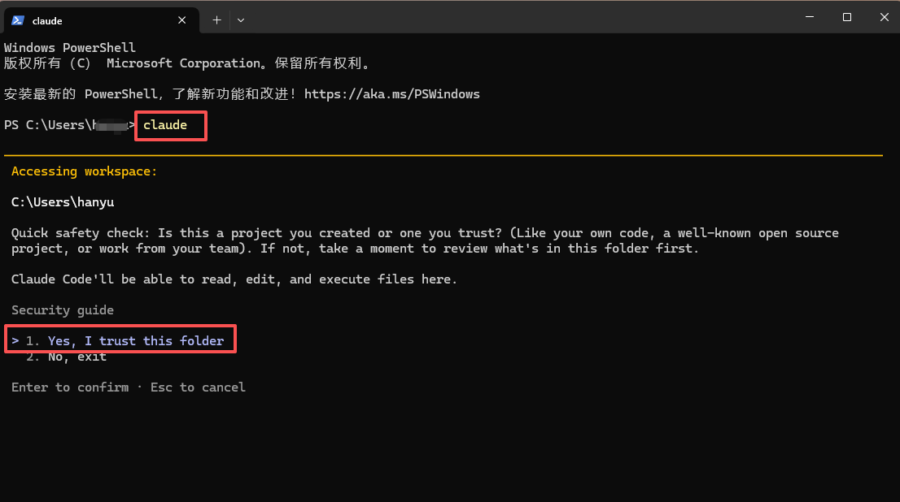
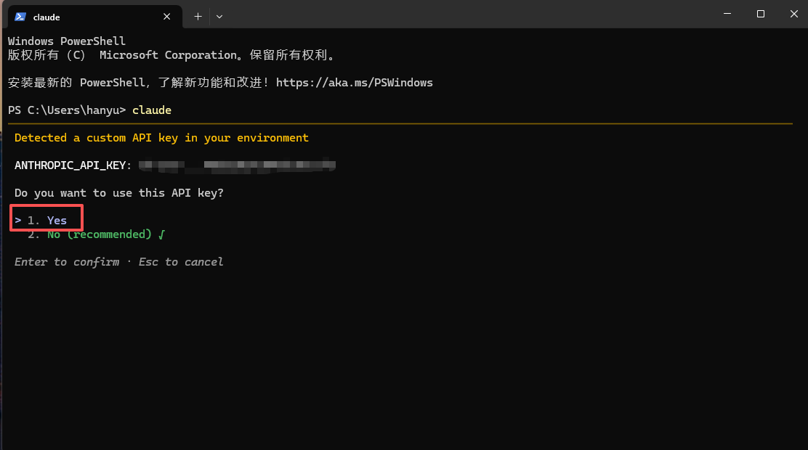
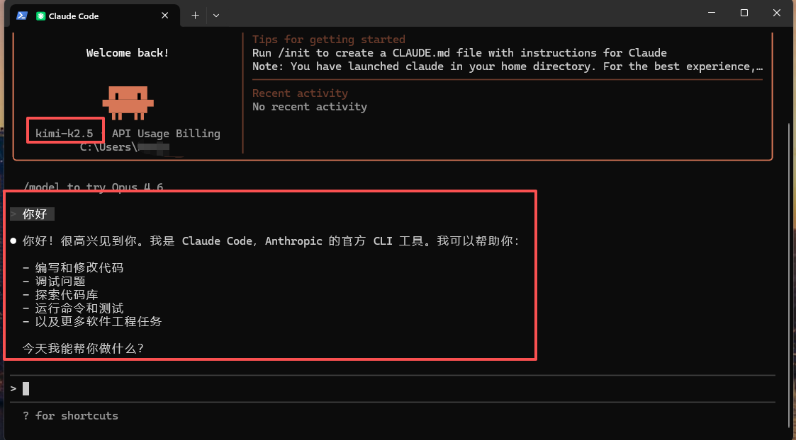

# 告别折腾！Windows 一键极简安装 Claude Code (免翻墙免Node免Git)



Anthropic 旗下的 **Claude Code** 被公认为目前业界最强的 AI 编程助手，很多小伙伴都想在自己的电脑上体验它的彪悍能力。

❌ 需要配置科学上网环境 ❌ 需要手动安装 Node.js 和 npm ❌ 需要安装配置 Git 环境 ❌ 各种环境变量让人头大 ❌ 烦人的初次配置引导

为了让大家都能轻松用上这款神器，我整理了一套**纯血版的 Windows 自动化安装脚本**！

**只需一键运行，上面的问题脚本全帮你搞定！** 没有 Node.js？它帮你装！没有 Git？它帮你配！没有梯子？它自动切国内源和国内代理模型！

## ✨ 这个脚本有多"神奇"？

这套脚本简直是为国内的 Windows 用户量身定制的，它在背后默默做了这些硬核操作：

1. **自带"发电机"**：你的电脑连微软的包管理器 (winget) 都没有？没关系！脚本会自动去微软官网拉取并在后台静默安装，强行拉起环境。
2. **全自动环境搭建**：自动为你安装 Node.js LTS 版本和 Git for Windows，全程静默，不需要你狂点"下一步"。**如果遇到 GitHub 墙连不上报错，它会自动跑去阿里淘宝镜像下载安装 Git 保障流程。由于安装包比较大，国内镜像偶尔也可能有几分钟的下载延迟，这时请不要关闭窗口，耐心等待它跑完！**
3. **完美接驳国内网络**：下载慢？脚本自动将 npm 镜像切换为国内淘宝源。 API 连不上？内置了阿里云百炼 (DashScope) 的代理地址和 kimi-k2.5 模型配置，完美避开网络限制！**这里特别感谢劳总**[@LawrenceW_Zen](https://x.com/@LawrenceW_Zen)**和迈总**[@innomad_io](https://x.com/@innomad_io)**让我知道了阿里云百炼平台首月仅需 7.9 元的羊毛套餐，可以用最便宜实惠的方式体验到强大的 Claude Code 开发助手！**
4. **智能环境变量注入**：不需要重启电脑！脚本装完所需环境后，自动将路径刷新到当前命令行，让你实现真正的"无缝衔接"。
5. **跳过繁琐认证**：直接修改底层配置文件，跳过烦人的网页授权登陆和新手引导，开箱即用。
6. **避坑 Windows 策略拦截**：自动禁用会导致报错的 .ps1 脚本，强制系统使用更安全的 .cmd 启动，彻底防屏蔽！

## 🛠️ 如何使用？(只需两步)

第一步：从阿里百炼平台拿到并修改你的真实 API Key



将下面脚本中的 [$API_KEY](https://x.com/search?q=$API_KEY&src=cashtag_click) = "REPLACE_WITH_YOUR_API_KEY" 这行，把引号里的内容替换成你自己的真实 API Key（比如阿里云百炼的 Key）。

第二步：复制并运行

1. 在你的 Windows 电脑上，点击开始菜单，搜索 **PowerShell**。
2. **右键**点击 Windows PowerShell，选择 **"以管理员身份运行"**（这很重要，因为要安装软件）。
3. 把修改好 API Key 的完整脚本复制，直接在终端里**右键（或 Ctrl+V）粘贴并回车**。

然后，你就可以去泡杯咖啡了 ☕。看着屏幕上的进度条从 [0/10] 跑完到 [10/10]。**注意因为要安装node、node等程序，记得让安全软件放行**



当看到屏幕提示 **"完成。请关闭并重新打开 PowerShell"** 时，说明大功告成！

🎉 启动 Claude Code！

重新打开一个普通的 PowerShell 窗口，直接输入：

```Plain Text
💡 安装完成后，在新打开的 PowerShell 中输入此命令启动 Claude Code

claude

```

选择信任文件夹



选择yes



享受你的 AI 编程之旅吧！



## 💻 完整脚本代码附上

⚠️ 使用前务必将 REPLACE_WITH_YOUR_API_KEY 替换为你的真实 API Key

```Plain Text
$ErrorActionPreference = "Stop"
[Net.ServicePointManager]::SecurityProtocol = [Net.SecurityProtocolType]::Tls12

# 【注意】请将下面的 REPLACE_WITH_YOUR_API_KEY 替换为你真实的 API Key！
$BASE_URL = "https://coding.dashscope.aliyuncs.com/apps/anthropic"
$MODEL = "kimi-k2.5"
$API_KEY = "REPLACE_WITH_YOUR_API_KEY"

if ([string]::IsNullOrWhiteSpace($API_KEY) -or $API_KEY -eq "REPLACE_WITH_YOUR_API_KEY") {
  throw "请先把 API_KEY 改成真实值。"
}

function Get-WingetExe {
  $cmd = Get-Command winget -ErrorAction SilentlyContinue
  if ($cmd) { return $cmd.Source }

  $pkg = Get-AppxPackage -Name Microsoft.DesktopAppInstaller -ErrorAction SilentlyContinue |
    Sort-Object Version -Descending | Select-Object -First 1
  if ($pkg) {
    $exe = Join-Path $pkg.InstallLocation "winget.exe"
    if (Test-Path $exe) { return $exe }
  }
  return $null
}

$winget = Get-WingetExe
if (-not $winget) {
  Write-Host "[0/10] 未检测到 winget，开始安装..."
  $vclibs = Join-Path $env:TEMP "Microsoft.VCLibs.x64.14.00.Desktop.appx"
  $appins = Join-Path $env:TEMP "Microsoft.DesktopAppInstaller.msixbundle"

  Invoke-WebRequest -Uri "https://aka.ms/Microsoft.VCLibs.x64.14.00.Desktop.appx" -OutFile $vclibs
  try { Add-AppxPackage -Path $vclibs } catch {}

  Invoke-WebRequest -Uri "https://aka.ms/getwinget" -OutFile $appins
  Add-AppxPackage -Path $appins

  Start-Sleep -Seconds 2
  $winget = Get-WingetExe
}
if (-not $winget) { throw "winget 安装失败，请检查系统策略后重试。" }

Write-Host "[1/10] 修复 winget 源..."
try { & $winget source remove msstore | Out-Null } catch {}
& $winget source update | Out-Null

Write-Host "[2/10] 安装 Node.js LTS..."
& $winget install -e --id OpenJS.NodeJS.LTS --source winget --accept-source-agreements --accept-package-agreements

Write-Host "[3/10] 安装 Git for Windows..."
& $winget install -e --id Git.Git --source winget --accept-source-agreements --accept-package-agreements
$gitInstalled = (Test-Path "C:\Program Files\Git\cmd\git.exe") -or (Test-Path "C:\Program Files\Git\bin\git.exe") -or (Get-Command git -ErrorAction SilentlyContinue)
if (-not $gitInstalled) {
  Write-Host "Winget 下载/安装 Git 失败 (可能因为 Github 被墙)，尝试从国内镜像下载..."
  Write-Host "由于 Git 安装包较大 (约 60MB)，国内镜像下载可能需要 3~5 分钟，请不要关闭窗口，耐心等待..."
  $gitInstaller = Join-Path $env:TEMP "Git-Setup.exe"
  # 使用阿里的npm镜像站下载 Git Windows 安装包
  Invoke-WebRequest -Uri "https://npmmirror.com/mirrors/git-for-windows/v2.44.0.windows.1/Git-2.44.0-64-bit.exe" -OutFile $gitInstaller
  Write-Host "下载完成，正在静默安装 Git..."
  Start-Process -FilePath $gitInstaller -ArgumentList "/VERYSILENT /NORESTART /NOCANCEL /SP- /CLOSEAPPLICATIONS /RESTARTAPPLICATIONS /COMPONENTS=""icons,ext\reg\shellhere,assoc,assoc_sh""" -Wait -NoNewWindow
}

Write-Host "[4/10] 刷新当前会话 PATH..."
$paths = @(
  "$env:ProgramFiles\nodejs",
  "$env:LOCALAPPDATA\Programs\nodejs",
  "C:\Program Files\Git\bin",
  "C:\Program Files\Git\cmd",
  "$env:APPDATA\npm"
)
foreach ($p in $paths) {
  if ((Test-Path $p) -and ($env:Path -notlike "*$p*")) { $env:Path += ";$p" }
}

$npmCmd = (Get-Command npm.cmd -ErrorAction SilentlyContinue).Source
if (-not $npmCmd) {
  foreach ($c in @("$env:ProgramFiles\nodejs\npm.cmd", "$env:LOCALAPPDATA\Programs\nodejs\npm.cmd")) {
    if (Test-Path $c) { $npmCmd = $c; break }
  }
}
if (-not $npmCmd) { throw "找不到 npm.cmd，请重开 PowerShell 后再执行一次。" }

Write-Host "[5/10] 安装 Claude Code..."
& $npmCmd config set registry https://registry.npmmirror.com | Out-Null
& $npmCmd config set fund false | Out-Null
& $npmCmd config set audit false | Out-Null
& $npmCmd i -g "@anthropic-ai/claude-code" --registry=https://registry.npmmirror.com

Write-Host "[6/10] 配置 Git Bash..."
$bashExe = @(
  "C:\Program Files\Git\bin\bash.exe",
  "C:\Program Files\Git\usr\bin\bash.exe"
) | Where-Object { Test-Path $_ } | Select-Object -First 1
if (-not $bashExe) { throw "未找到 Git Bash (bash.exe)。" }

Write-Host "[7/10] 写入环境变量..."
$vars = @{
  ANTHROPIC_BASE_URL = $BASE_URL
  ANTHROPIC_API_KEY = $API_KEY
  ANTHROPIC_MODEL = $MODEL
  CLAUDE_CODE_GIT_BASH_PATH = $bashExe
}
foreach ($k in $vars.Keys) {
  [Environment]::SetEnvironmentVariable($k, $vars[$k], "User")
  Set-Item "Env:$k" $vars[$k]
}

Write-Host "[8/10] 写入 ~/.claude.json ..."
$cfgPath = Join-Path $env:USERPROFILE ".claude.json"
if (Test-Path $cfgPath) {
  try { $cfg = Get-Content $cfgPath -Raw | ConvertFrom-Json } catch { $cfg = [pscustomobject]@{} }
} else {
  $cfg = [pscustomobject]@{}
}
if ($cfg.PSObject.Properties.Name -contains "hasCompletedOnboarding") {
  $cfg.hasCompletedOnboarding = $true
} else {
  $cfg | Add-Member -NotePropertyName "hasCompletedOnboarding" -NotePropertyValue $true
}
$cfg | ConvertTo-Json -Depth 100 | Set-Content -Path $cfgPath -Encoding UTF8

Write-Host "[9/10] 修复 PowerShell 直接 claude 启动..."
$ps1Shim = Join-Path $env:APPDATA "npm\claude.ps1"
$ps1Bak = Join-Path $env:APPDATA "npm\claude.ps1.disabled"
if (Test-Path $ps1Shim) {
  if (Test-Path $ps1Bak) { Remove-Item $ps1Bak -Force }
  Rename-Item $ps1Shim "claude.ps1.disabled" -Force
}

Write-Host "[10/10] 验证..."
$claudeCmd = Join-Path $env:APPDATA "npm\claude.cmd"
if (-not (Test-Path $claudeCmd)) {
  $claudeCmd = (Get-Command claude.cmd -ErrorAction SilentlyContinue).Source
}
if (-not $claudeCmd) { throw "未找到 claude.cmd。" }

node -v
& $npmCmd -v
& $claudeCmd --version

Write-Host ""
Write-Host "完成。请关闭并重新打开 PowerShell，然后运行："
Write-Host "claude --version"
Write-Host "claude"

```

**📌** **注意事项：** • 如果你之前自己乱折腾过环境导致报错，建议先卸载已有的 Node.js 和旧版 Claude Code 再运行此脚本。 • 脚本默认使用了**阿里百炼平台的 API**，并演示配置了 kimi-k2.5 模型。阿里百炼平台内其实还集成了通义千问等其他强大的国产大模型，你可以随时在后台获取对应模型的代号并修改脚本开头的 [$MODEL](https://x.com/search?q=$MODEL&src=cashtag_click) 变量来切换。如果你本身有中转 API，只需修改开头的 [$BASE_URL](https://x.com/search?q=$BASE_URL&src=cashtag_click) 和 [$MODEL](https://x.com/search?q=$MODEL&src=cashtag_click) 即可。

赶紧分享给身边还在为配环境发愁的小伙伴吧！

---

> 来源：飞书 · AI Spark 知识库 ｜ 原文（最新版）：<https://lcnniolukk80.feishu.cn/wiki/TYSwwu96Ki1v3zk3DVAcrGfynib> ｜ 归档：2026-06-04
