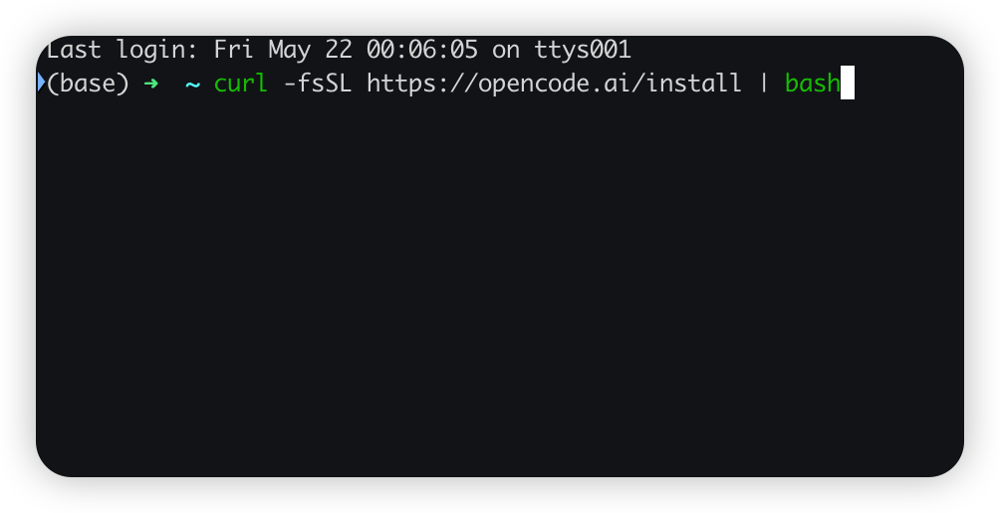
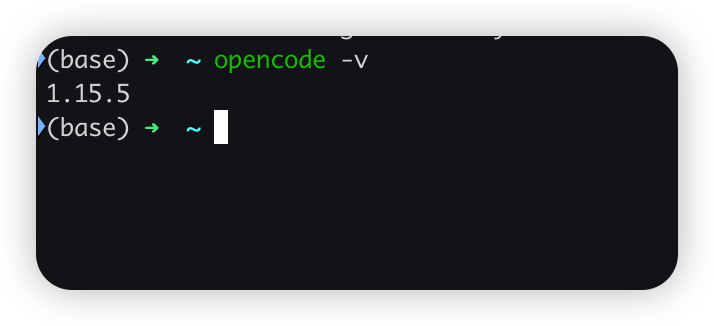
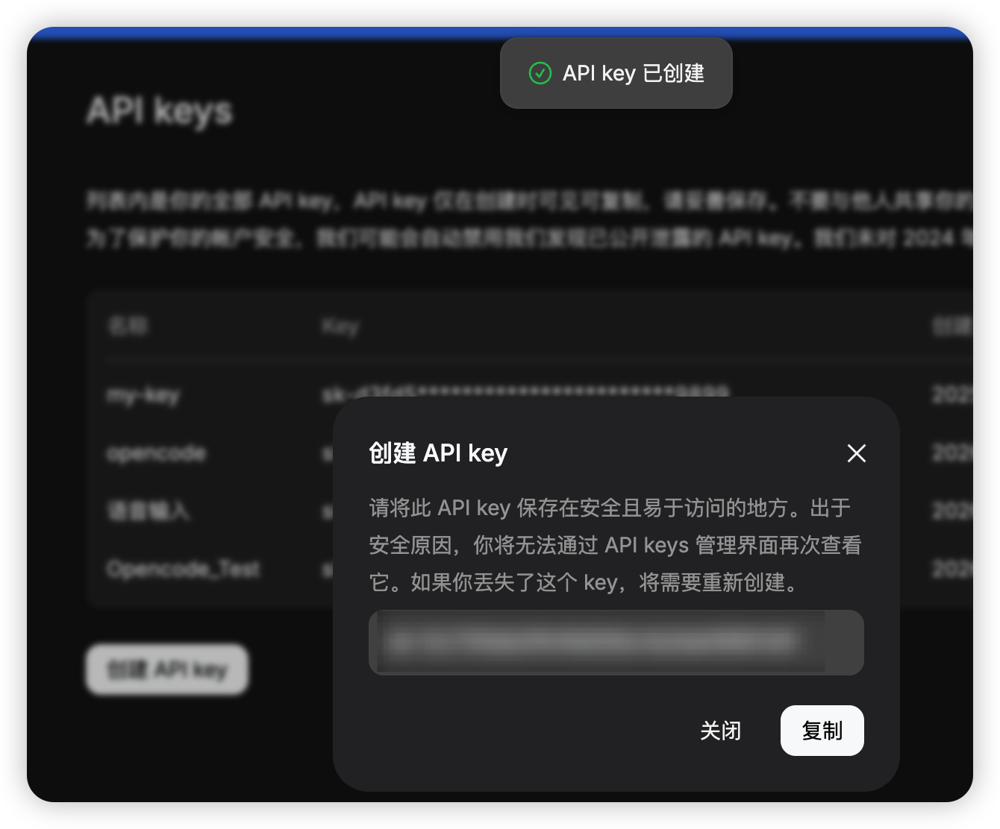
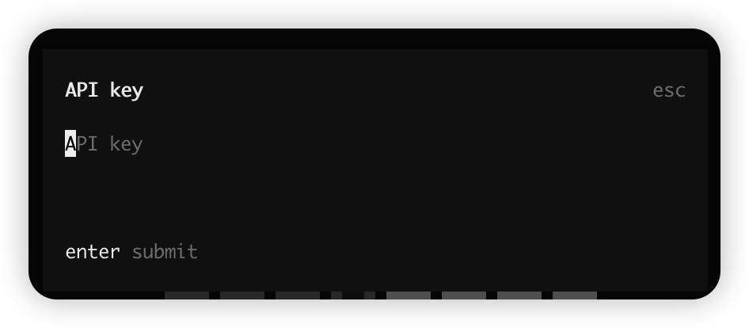
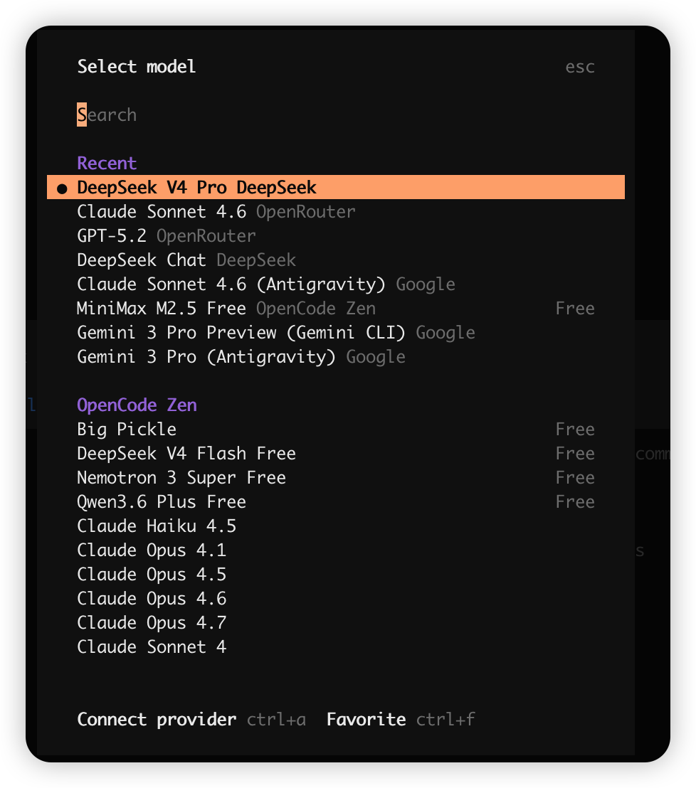
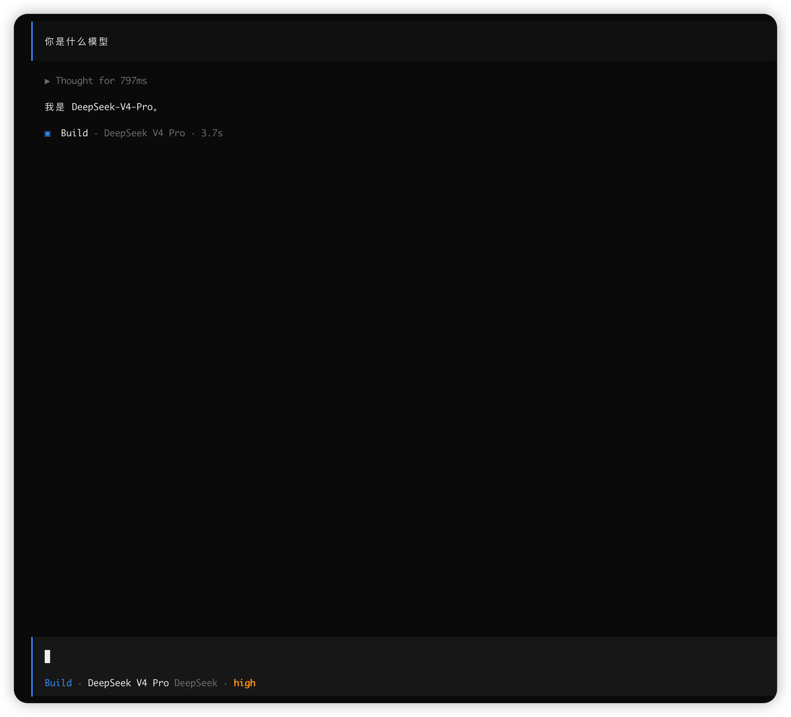

# 小白必看！Opencode 傻瓜式安装教程，终于把 DeepSeek 接上了！

最近因为要做ai课程，所以想起来open code这个软件，其实这个软件最大的特点就是开源，而且是免费可以对接的ai模型也非常多，但是很少有人去讲它的安装和配置，我现在就用一篇教程给你讲透。

opencode 这东西，本身安装并不难，使用下来，其实一行命令就能搞定。但是真正卡小白的是装完到能用之间那一段——安装卡、死命令找不到或者是其他的问题。

我这个为了方便，所以使用的是DeepSeek去做演示，这样方便，大家直接可以使用，不需要解决其他额外的问题。越少的问题，对小白来说，越友好，也方便大家学习。

---

## 先把 opencode 装上，一行命令就够

其实opencode 官方给了好几种装法，如果和我一样是Mac 我最推荐这一条，直接复制粘贴进终端就行：

```bash
curl -fsSL https://opencode.ai/install | bash
```



跑完它会自动把 opencode 下载好、放进系统路径，整个过程不用你管。

> 注意：这条 `curl` 装法（还有下面的 Homebrew）都不需要先装 node。opencode 本身是一个独立的二进制程序，下载下来就能跑。只有用 `npm`、`bun` 这类包管理器装的时候，才需要机器上先有 node 环境。所以别一上来就卡在「我 node 还没装」——大多数人用不到。

我把官方常见的几个安装命令都整理好了，自己可以根据现有的环境去安装：

| 装法 | 命令 | 适合 |
|-|-|-|
| npm | `npm install -g opencode-ai` | 机器上已经有 node |
| bun | `bun install -g opencode-ai` | 平时用 bun 的 |
| Homebrew | `brew install anomalyco/tap/opencode` | Mac 上习惯用 brew |
| Arch Linux | `paru -S opencode-bin` | Arch 用户，注意包名带 `-bin` |
| 桌面版（Beta） | `brew install --cask opencode-desktop` | 想要图形界面、不想全程敲命令 |

最后提一句终端。opencode 是跑在终端里的工具，界面是字符画出来的那种。Mac 自带的 Terminal.app 渲染这种界面有时候会错位、配色发乱，建议换 iTerm2、Ghostty 这类现代终端，我这篇全程用的是 iTerm2。

---

## 装完先验证，顺手说个最常见的坑

装完别急着干别的，先确认它真的装上了。新开一个终端窗口，敲：

```bash
opencode -v
```

我这边返回的是 `1.15.5`：



能看到一个版本号，就说明 opencode 装进来了。这个版本号顺手记一下，后面接 DeepSeek 模型要用到——opencode 得是 v1.14.24 以上才认 DeepSeek V4 系列，我这台 1.15.5 够用。

接下来就是小白最容易撞的第一个坑。不少人装完，直接在原来那个终端窗口敲 `opencode`，结果蹦出来一行：

```
command not found: opencode
```

到这一步很多人会以为是装失败了，开始反复重装、到处翻教程。其实没失败。`curl` 那个脚本已经把 opencode 写进了系统路径，但你当前这个终端窗口是装之前就开着的，它还没重新读取配置，所以暂时找不到。

解决很简单，二选一：

- 关掉当前终端，重新开一个新窗口，再敲一次 `opencode -v`；
- 或者不关窗口，执行一下 `source ~/.zshrc`（Mac 现在默认是 zsh），让它重新加载配置。

command not found 在这里不是装错了，是终端没刷新——这点分清楚，能少走很多弯路。

还有就是如果安装过程中出现网络问题的话，也会卡住非常久，这个时候可以重新刷新一下，更换网络，再重新测试一下。或者自己去github上自己去下载安装包，再解压安装。

---

## 去 DeepSeek 官网拿一把 API key

opencode 装好了，但它现在还是个空壳——你还没给它接模型。opencode 不绑定某一家模型，用哪个由你定，这篇我接的是 DeepSeek V4 Pro。

要接 DeepSeek，先得有一把 API key。打开 DeepSeek 的开放平台：

`https://platform.deepseek.com/api_keys`

登录之后，点「创建 API key」，给它起个名字（随便起，比如就叫 `opencode`，方便以后认出这把 key 是给谁用的），确认，它就会弹出新建好的 key：



这串以 `sk-` 开头的就是你的 key，点「复制」存到一个安全的地方。创建完之后，这把 key 也会出现在 API keys 列表里，能看到它的名字和创建日期，方便管理。

> 注意：完整的 key 一般只在创建的那一下显示，关掉弹窗，列表里就只剩打码的尾号了。所以当场就复制、存好。

DeepSeek API 是按用量付费的。我这里是充值了50块钱，然后用了很久，其实DeepSeek v4调用起来还是很便宜的，前段时间还出了优惠活动。我这里主要选它的原因，还是因为它的价格非常的优惠，而且能力也不差。

如果你有其他模型像gpt啊或者claude也可以去做，像gpt的话，直接就可以用网页授权就可以登录使用了。但是claude就需要使用第三方的API服务了。因为官方的是不支持的。

---

## 回 opencode，把 DeepSeek V4 Pro 接上

key 拿到了，回到终端，把它接进 opencode。

先确认一下版本。前面 `opencode -v` 看到的是 `1.15.5`，opencode 要 v1.14.24 以上才支持 DeepSeek V4 系列，1.15.5 没问题。如果你那台版本偏低，重新跑一遍前面那条 `curl` 安装命令就能升到最新版，再往下走，不然待会儿在模型列表里会找不到 V4。

启动 opencode：

```bash
opencode
```

进去之后，输入 `/connect`。opencode 会让你选 provider，也就是模型来源，输入 `deepseek`，把列表里的 DeepSeek 选中。接着它会弹出一个输入框，让你填 API key：



把刚才在 DeepSeek 官网复制的那串 `sk-` 开头的 key 粘进去，回车。

key 接上之后，再输入 `/models`，opencode 会列出当前能用的模型。在列表里找到 `DeepSeek V4 Pro`，选中它：



到这里，opencode 就已经在用 DeepSeek V4 Pro 了。

---

## 实测一下，确认接的就是 V4 Pro

配是配好了，但口说无凭，发条消息让它自己说。

我直接问了一句「你是什么模型」，它回的是「我是 DeepSeek-V4-Pro。」，opencode 界面底部的状态栏也明明白白写着当前模型是 `DeepSeek V4 Pro`：



模型自己报的名字、状态栏显示的名字，两个对上了，就说明 DeepSeek V4 Pro 真的接通了，不是还在用别的默认模型。

要是没接通，一般卡在这几个地方，对着排查：

- `/connect` 里搜不到 deepseek：多半是 opencode 版本太老，回去升级；
- 发消息报 `401`：API key 不对，或者粘的时候少了几位，回 DeepSeek 官网重新复制一遍；
- 报余额不足、模型不存在：回 DeepSeek 账户看一眼余额，再确认模型选的是不是 V4 Pro。

> 我自己测试了几下还是非常快的，最主要的问题还是不需要解决网络问题，直接可以在国内安全稳定的使用。

只要一步一步的走下来，你一定可以跟我一样把open code安装上，然后把模型接通，其实没有什么难度，最主要的是自己细心。我这篇文章最主要的目的，也就是教小白去安装和配置。

如果大家感兴趣，后面我会继续出open code，优化教程，会让open code可以和Claude Code样好用。

---

## 延伸阅读

- [Claude Code 在大陆怎么稳定用：cc-switch + MiniMax 替代方案](Claude%20Code%20怎么稳定用：我用%20cc-switch%20接%20MiniMax%20跑通了一套替代方案.md) — 另一条国产模型路
- [高强度实测 6 大 AI 模型：Claude 写文最强，但我写代码不选它](../工具测评/高强度实测%206%20大%20AI%20模型：Claude%20写文最强，但我写代码不选它.md) — DeepSeek 在六家里的位置
- [别再切屏问 AI！把 Claude、Gemini、Codex 塞进命令行](别再切屏问%20AI%20了！把%20Claude、Gemini、Codex%20塞进命令行的保姆级教程与避坑指南.md) — 三家 CLI 横向对比

---

> 来源：飞书 · AI Spark 知识库 ｜ 原文（最新版）：<https://lcnniolukk80.feishu.cn/wiki/MwHFwQw6uiosjDkqTNxcid7in5c> ｜ 归档：2026-06-04
