# 我把 Claude 桌面版也白嫖了：还能接入 Claude Code 写代码

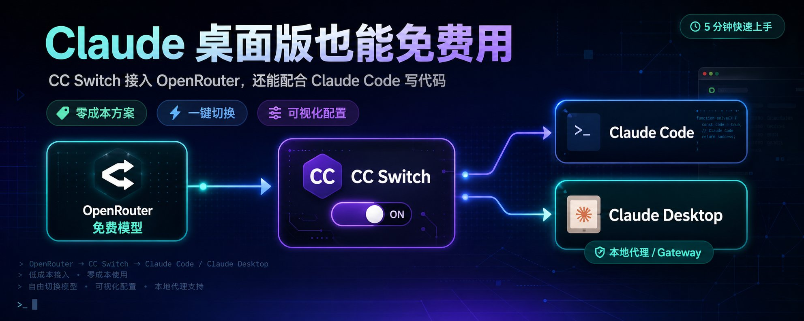

> 本文介绍一种零成本使用 Claude Code 和 Claude Desktop 的方案：通过 OpenRouter 上的免费模型 Ling-2.6-1T，配合 CC Switch 这款可视化管理工具，一键切换 API 提供商，实现完全免费的 AI 编程体验。

## 前言

Claude Code 和 Claude Desktop 是 Anthropic 推出的两款强力工具——一个是终端里的 AI 编程助手，一个是桌面端的 AI 对话应用。但它们默认使用 Anthropic 官方 API，按 token 计费，用起来肉疼。

有没有办法白嫖？有。

核心思路：**OpenRouter 提供了免费模型，CC Switch 让你一键把这些模型接入 Claude Code 和 Claude Desktop**，不用手动改配置文件，全程可视化操作。

## 方案概览

```Plain Text
OpenRouter（免费模型 Ling-2.6-1T）
        ↓
  CC Switch（可视化管理 + 一键切换）
        ↓
  Claude Code / Claude Desktop

```

整个流程分三步：

1. 在 OpenRouter 注册并获取 API Key
2. 安装 CC Switch
3. 在 CC Switch 中添加 OpenRouter 提供商，一键切换给 Claude Code 和 Claude Desktop 使用

## 第一步：注册 OpenRouter 并获取 API Key

## 1. 注册账号

访问 [OpenRouter](https://openrouter.ai/)，使用 Google 账号或邮箱注册。

## 2. 获取 API Key

登录后，进入 **Keys** 页面（[https://openrouter.ai/keys](https://openrouter.ai/keys)），点击 **Create Key**，复制生成的 API Key。

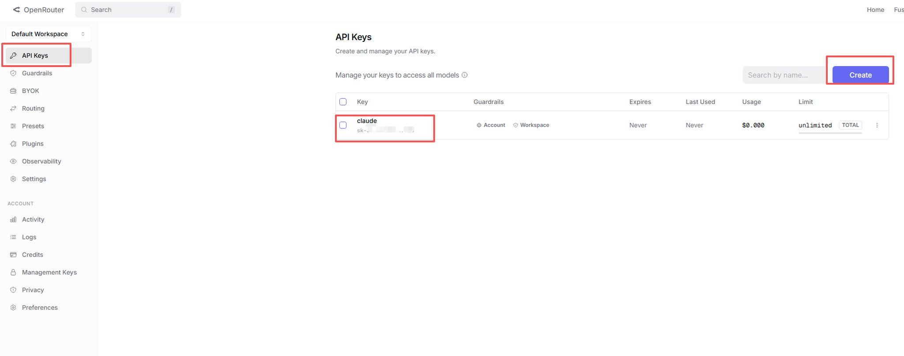

> ⚠️ API Key 只会显示一次，务必保存好。

## 3. 找到免费模型 Ling-2.6-1T

在 OpenRouter 的模型列表中，搜索 ling-2.6。这是一个免费模型（标记为 Free），输入和输出都不计费。

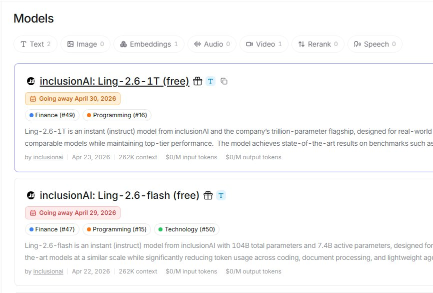

模型 ID 为：

```Plain Text
inclusionai/ling-2.6-1t:free

```

> 💡 OpenRouter 上有不少免费模型，Ling-2.6-1T 是其中表现不错的一个。你也可以根据需要选择其他免费模型。

就算免费期结束，按当前公开价格看，Ling-2.6-1T 也属于很便宜的一档。最近同类模型的价格已经压得很低，后面继续降价也有可能。

## 第二步：安装 CC Switch

[CC Switch](https://github.com/farion1231/cc-switch) 是一款跨平台的桌面应用，专门用来管理 Claude Code、Codex、Gemini CLI、OpenCode、OpenClaw 等 AI 编程工具的 API 提供商。它的核心价值在于：**不用手动编辑配置文件，所有操作都通过可视化界面完成**。

## 主要功能

- **50+ 内置提供商预设** — 包括 OpenRouter、AWS Bedrock 等，填入 Key 即可一键导入
- **一键切换** — 在主界面或系统托盘中直接切换提供商，Claude Code 甚至不需要重启
- **统一 MCP 管理** — 一个面板管理多个工具的 MCP 服务器配置
- **用量追踪** — 跟踪花费、请求数和 token 用量

## 下载安装

前往 [Releases 页面](https://github.com/farion1231/cc-switch/releases) 下载最新版本：

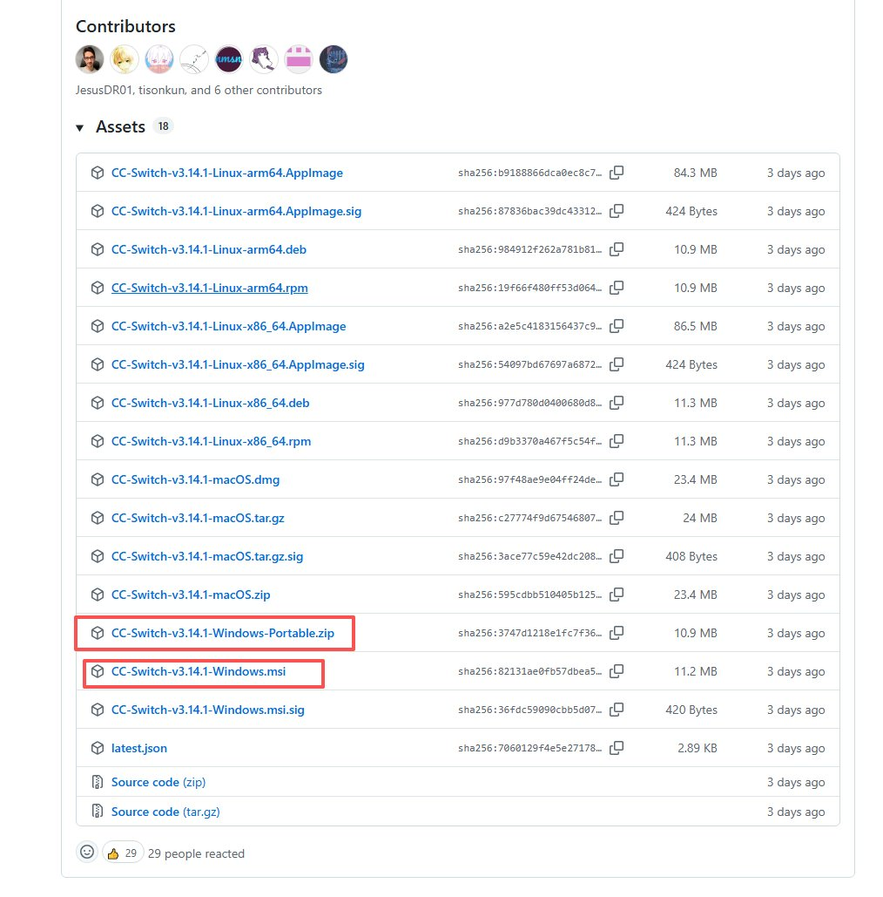

**Windows：**

下载 CC-Switch-v{version}-Windows.msi 安装包，或 CC-Switch-v{version}-Windows-Portable.zip 便携版，双击安装即可。

**macOS（推荐用 Homebrew）：**

```Plain Text
brew tap farion1231/ccswitch
brew install --cask cc-switch

```

**Linux：**

下载对应格式的安装包（.deb / .rpm / .AppImage）。

## 第三步：在 CC Switch 中配置 OpenRouter

安装完成后，打开 CC Switch，按以下步骤操作：

## 1. 添加提供商

点击 **“Add Provider”（添加提供商）**，在预设列表中选择 **OpenRouter**（CC Switch 内置了 50+ 提供商预设，OpenRouter 就在其中）。

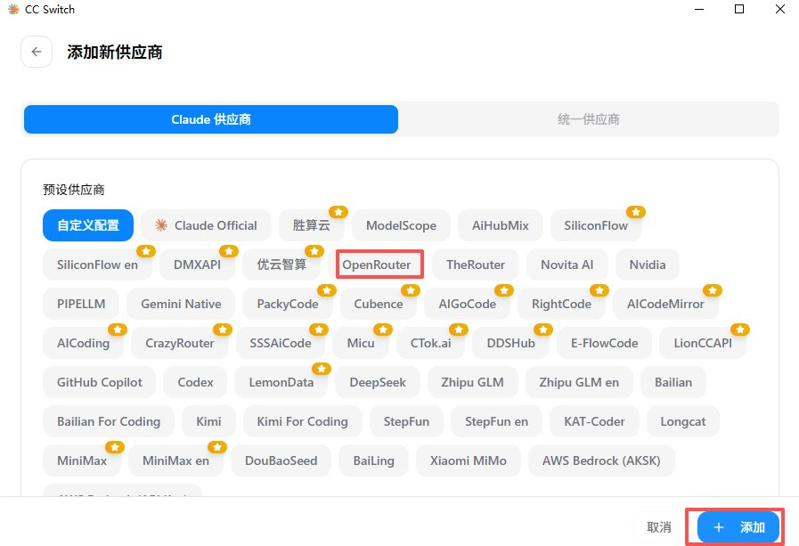

## 2. 填入配置

- **API Key**：粘贴你在第一步获取的 OpenRouter API Key
- **Model**：填入 inclusionai/ling-2.6-1t:free（或你选择的其他免费模型 ID）
- **Base URL**：预设会自动填好 [https://openrouter.ai/api/v1](https://openrouter.ai/api/v1)，无需手动修改

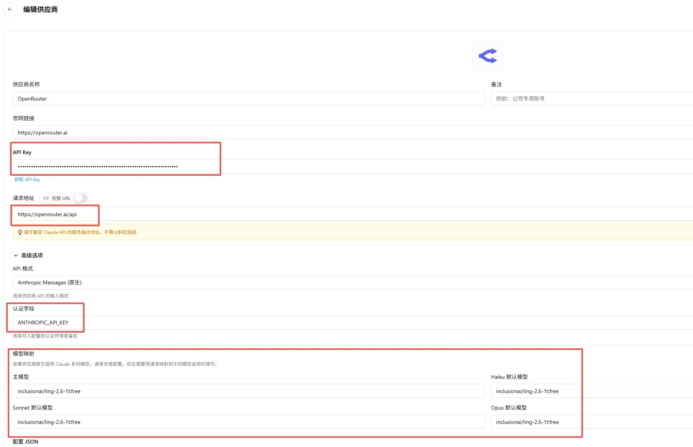

## 3. 启用提供商

配置完成后，在主界面选中刚添加的 OpenRouter 提供商，点击 **“Enable”（启用）**。

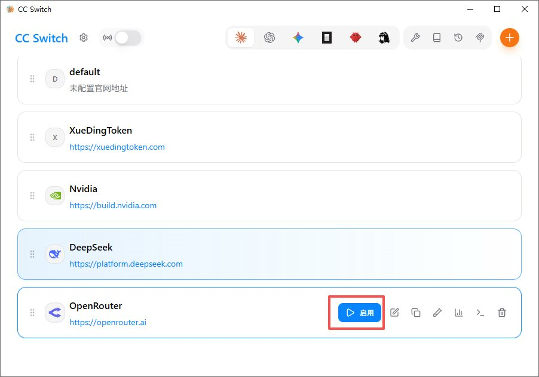

也可以通过 **系统托盘** 快速切换：右键点击托盘图标，直接选择要使用的提供商，即时生效。

> 💡 Claude Code 切换提供商后**不需要重启**，直接生效。其他 CLI 工具可能需要重启终端。

## 在 Claude Code 中使用

CC Switch 启用 OpenRouter 提供商后，Claude Code 会自动使用新的 API 端点和模型。直接在终端中启动：

```Plain Text
claude

```

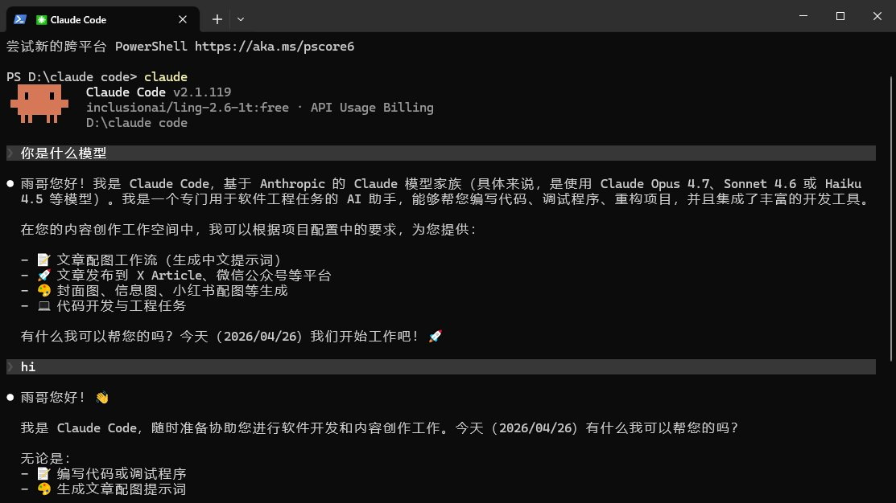

发送一条消息测试，如果正常回复，说明配置成功。此时你使用的是 OpenRouter 的免费模型 Ling-2.6-1T，**完全不产生费用**。

## 在 Claude Desktop 中使用

Claude Desktop 不能像 Claude Code 那样直接被 CC Switch 接管配置，需要通过官方的 **3P Gateway** 功能，把桌面版的请求转发到 CC Switch 的本地代理。这样你在 CC Switch 里切换提供商时，桌面版也会跟着热切换。

## 1. 在 CC Switch 中开启本地代理

打开 CC Switch 的设置，找到**本地代理**开关并开启。开启后会显示本地代理地址，一般是：

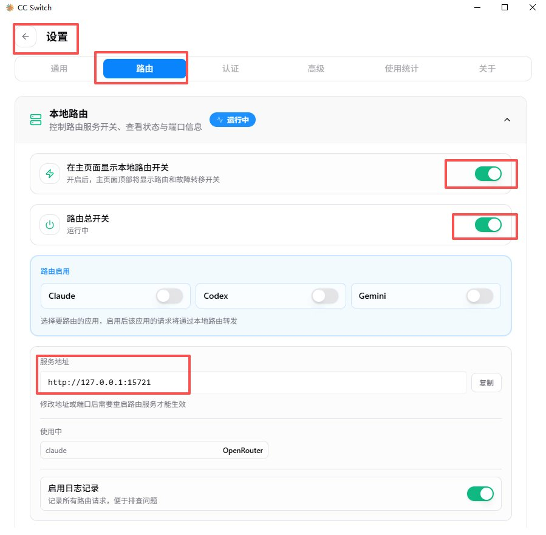

```Plain Text
http://127.0.0.1:15721

```

把这个地址复制下来，后面要用。

> ⚠️ 一定要通过 CC Switch 的本地代理接入，不要直接填某个 provider 的地址。否则你在 CC Switch 里切换提供商时，桌面版不会跟着切换。

## 2. 打开 Claude Desktop 的 3P 设置

在 Claude Desktop 中：

1. 点击左上角菜单（三条横线）
2. **Help → Troubleshooting → Enable Developer mode**
3. **Developer → Configure third-party inference**

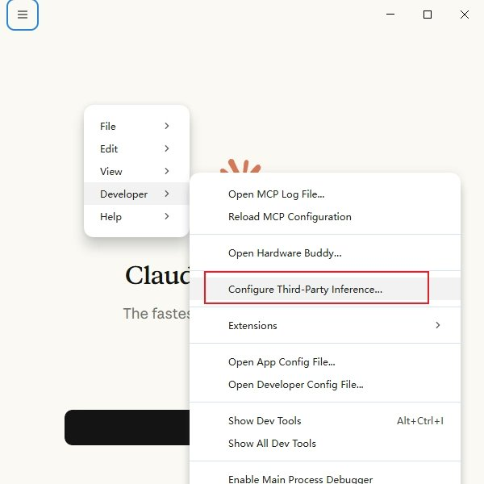

这会打开官方的 3P 配置面板。

## 3. 配置 Gateway 连接

在 Connection 页面选择 **Gateway**，然后填写：

- **Gateway base URL**：http://127.0.0.1:15721（你的本地代理地址）
- **Gateway API key**：PROXY_MANAGED
- **Gateway auth scheme**：bearer
- **Skip login-mode chooser**：建议开启（跳过官方登录，直接走 Gateway）
- 其他字段留空即可
- 点击应用到本地即可

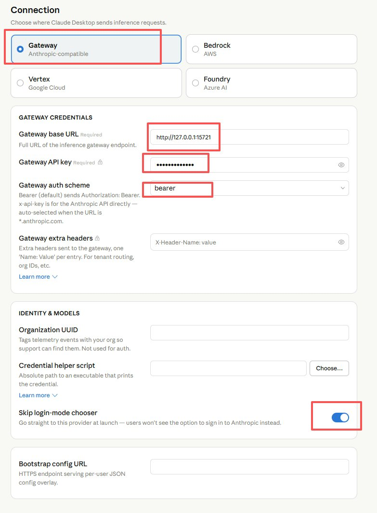

## 4. 重启验证

完全退出 Claude Desktop（包括托盘图标），重新打开，发送消息测试。如果正常回复，说明已经成功通过 CC Switch 代理连接到 OpenRouter 的免费模型了。

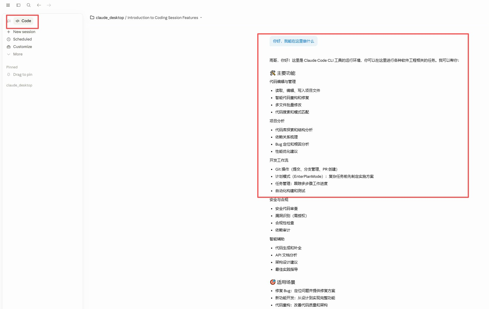

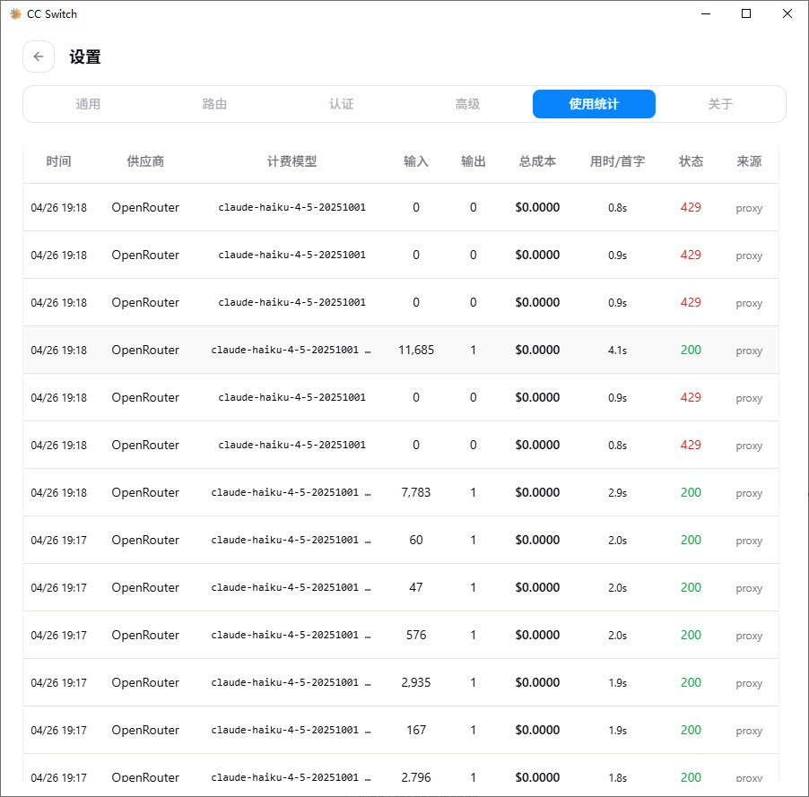

## 注意事项

1. **免费模型的限制**：免费模型通常有速率限制（如每分钟请求次数、每天总 token 数），高频使用可能会被限流。
2. **模型能力差异**：Ling-2.6-1T 并非 Claude 原版模型，能力上会有差异。对于日常编程辅助够用，但复杂推理任务可能不如 Claude 原版。
3. **API 兼容性**：OpenRouter 兼容 OpenAI API 格式，大部分功能可以正常使用，但某些 Anthropic 特有功能可能不支持。
4. **隐私考虑**：你的对话数据会经过 OpenRouter 服务器，注意不要在对话中包含敏感信息。
5. **切换回官方**：想切回 Claude 官方 API？在 CC Switch 中添加一个 “Official Login” 预设，启用后重启 CLI 工具，走官方登录流程即可。

## 总结

1. **注册 OpenRouter** — 注册账号，获取 API Key（2 分钟）
2. **安装 CC Switch** — 下载安装桌面应用（2 分钟）
3. **配置提供商** — 添加 OpenRouter + Ling-2.6-1T，一键启用（1 分钟）

总共不到 5 分钟，你就能拥有一个零成本的 Claude 编程环境。CC Switch 的可视化界面让整个过程告别了手动编辑配置文件的痛苦——添加提供商、切换模型、管理 MCP，全部点点鼠标就搞定。

虽然底层跑的不是 Claude 原版模型，但借助 Claude Code 和 Claude Desktop 优秀的交互体验，日常开发完全够用。

如果你也想低成本把 Claude Code 和 Claude Desktop 跑起来，可以先按这篇试一遍。跑通了的话，也欢迎回来告诉我你用的是哪个模型，实际效果怎么样。

**更多 AI 干货同步更新公众号：雨哥聊AI，关注我带你玩转 AI 时代**

---

> 来源：飞书 · AI Spark 知识库 ｜ 原文（最新版）：<https://lcnniolukk80.feishu.cn/wiki/SaZ1w1Gxni8Qm4kFBXdcVNvlnPd> ｜ 归档：2026-06-04
