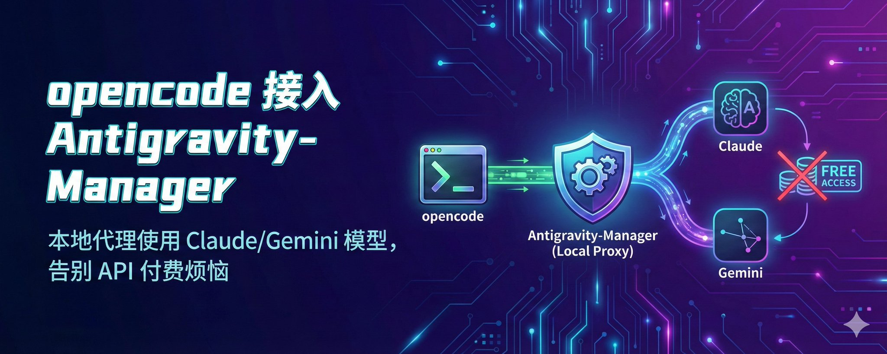
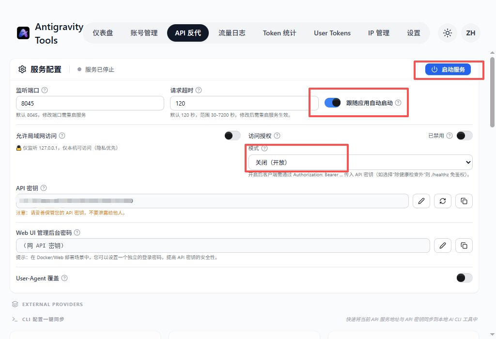
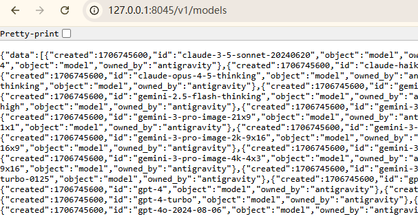
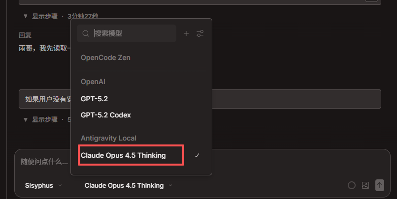

# 我的Opencode终于用上了免费的Claude Opus 4.5（赶紧跟上）



好多朋友一直想用**Claude Opus 4.5**，但是苦于没有好的ip无法订阅Anthropic产品，再就是Anthropic真是一家封号狂魔公司，动不动就把账号封了，也是醉了，算了，不吐槽他了，步入正题。

## 你需要准备什么

- Windows 或者 MAC
- 全程梯子打开
- Antigravity-Manager（务必升级到 4.x 最新版）
- opencode
- 一个已授权的 Google 账号

## Step 1️⃣ 配置 Antigravity-Manager

**添加账号**

账号页面 → 添加账号 → OAuth → 完成 Google 授权

不会的可以参考：

**开启反代**

API 反代页面 → 启动服务

- 端口：8045
- 自启动：跟随应用自启动
- 访问授权：关闭
- 局域网访问：按需



**验证**

浏览器访问 http://127.0.0.1:8045/v1/models

看到 JSON 模型列表 = 成功



---

## Step 2️⃣ 配置 opencode

Opencode按照默认路径安装即可

下载地址：<https://opencode.ai/>

找到配置文件添加Opus 4.5以及其他Gemini3模型：

```
C:\Users\你的用户名\.config\opencode\opencode.json
```

替换为以下内容：

```json
{
  "$schema": "https://opencode.ai/config.json",
  "provider": {
    "antigravity-local": {
      "npm": "@ai-sdk/openai-compatible",
      "name": "Antigravity Local",
      "options": {
        "baseURL": "http://127.0.0.1:8045/v1",
        "apiKey": "not-needed"
      },
      "models": {
        "claude-opus-4-5-thinking": {
          "name": "Claude Opus 4.5 Thinking"
        },
        "claude-sonnet-4-5": {
          "name": "Claude Sonnet 4.5"
        },
        "gemini-3-flash": {
          "name": "Gemini 3 Flash"
        },
        "gemini-3-pro-high": {
          "name": "Gemini 3 Pro High"
        }
      }
    }
  }
}
```

---

## Step 3️⃣ 开始使用

1. 确保 Antigravity 反代已开启
2. 启动 opencode
3. 模型选择器 → Antigravity Local → 选择模型
4. 开聊！



---

## 常用模型速查

| 模型 | 用途 |
|------|------|
| claude-opus-4-5-thinking | 深度思考，复杂任务 |
| claude-sonnet-4-5 | 日常对话，性价比高 |
| gemini-3-flash | 快速响应 |
| gemini-3-pro-high | 高质量输出 |
| gemini-3-pro-image | 图像生成 |

---

## 踩坑指南

**429/503 错误？**

→ 升级 Antigravity 到最新版（版本号问题是大坑）

→ 刷新账号配额 + 清除限流记录

**连接被拒绝？**

→ 检查 Antigravity 是否启动

→ 检查反代服务是否开启

**找不到 Antigravity Local？**

→ 检查 JSON 格式

→ 重启 opencode

**想开鉴权？**

把 apiKey 改成你的真实密钥即可

---

## 总结

核心就三步：

1. Antigravity 开反代
2. opencode 配 provider
3. 选对模型开聊

---

> 来源：飞书 · AI Spark 知识库 ｜ 原文（最新版）：<https://lcnniolukk80.feishu.cn/wiki/StamwxG9niYrVsk7hNic4XsQnTd> ｜ 归档：2026-06-04
