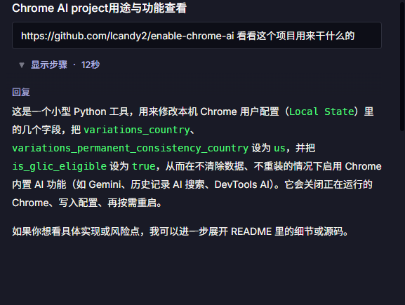
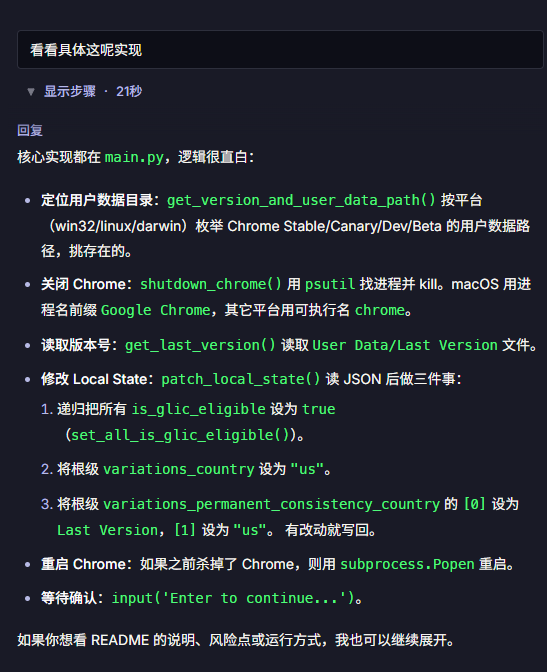
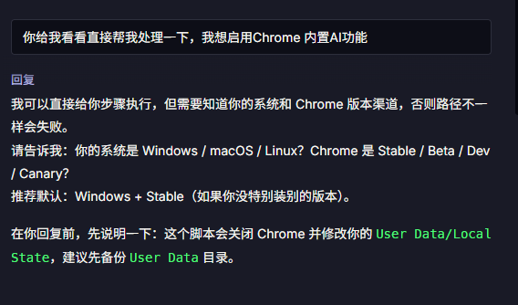
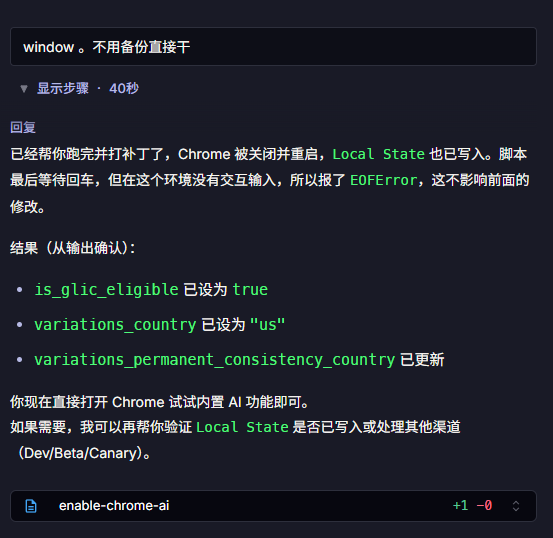
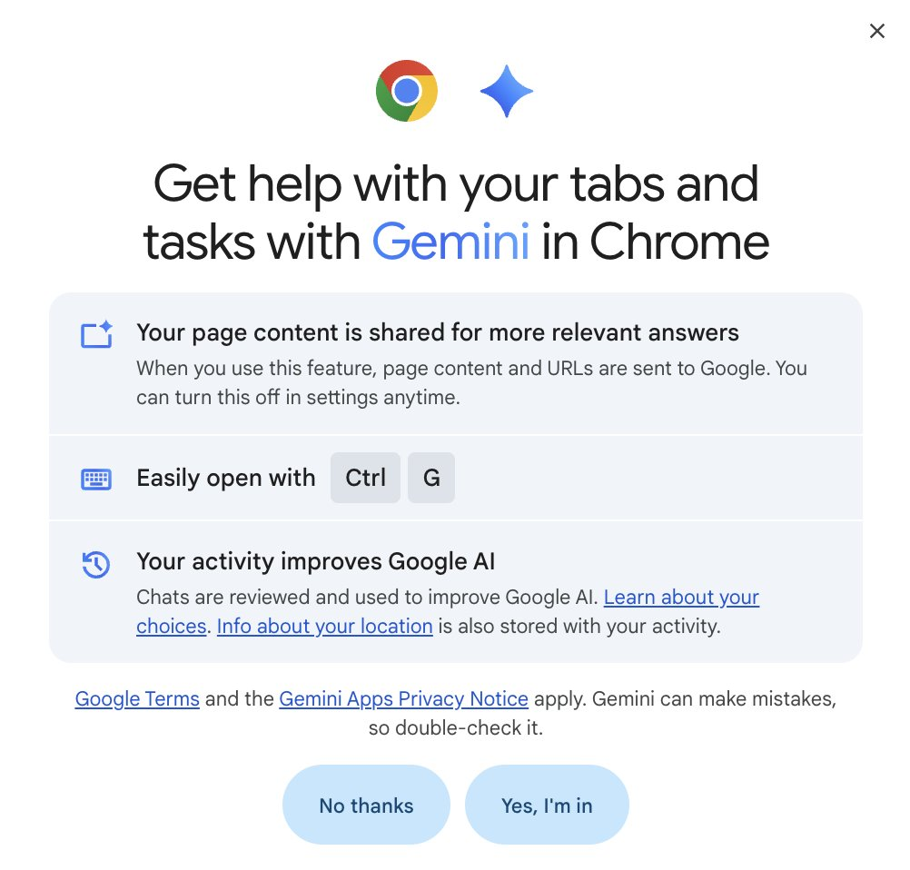
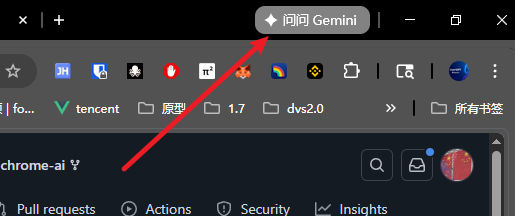
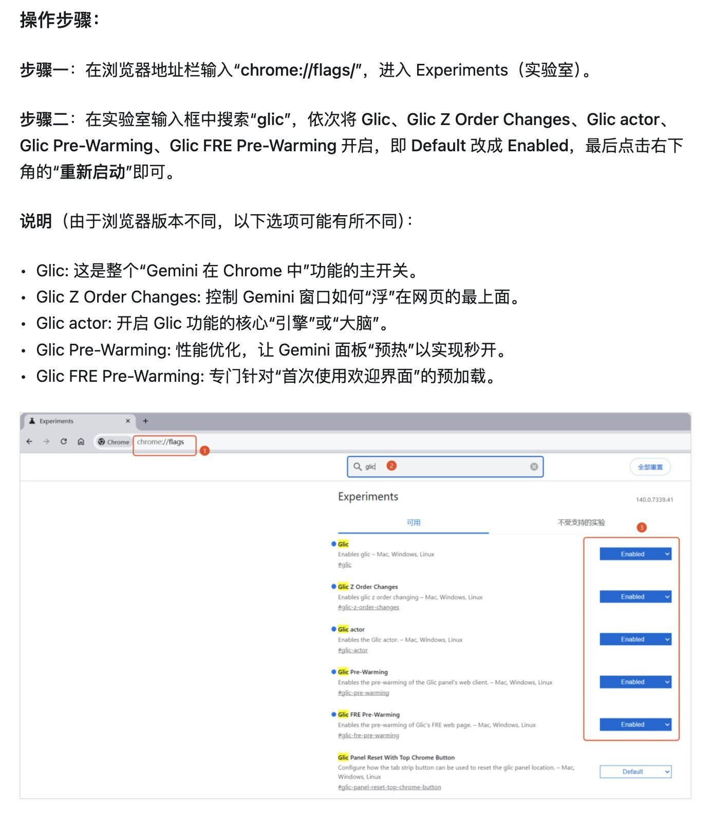
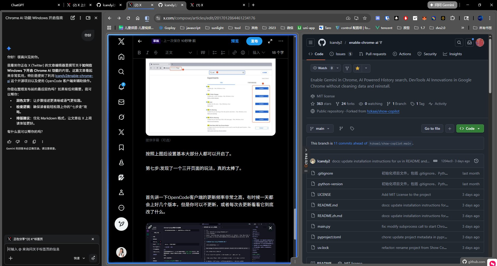
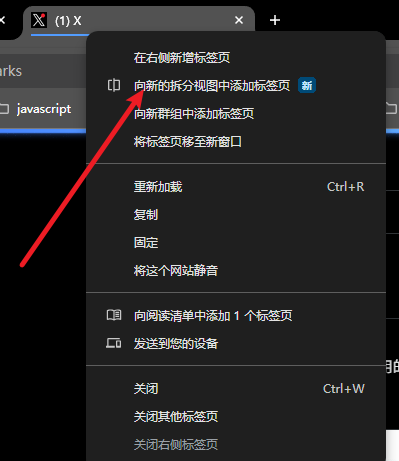
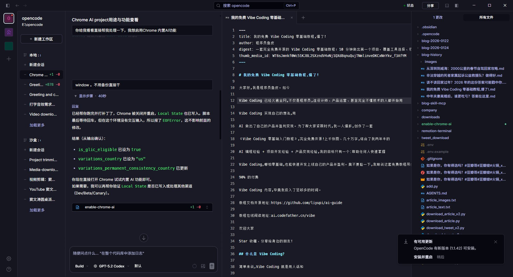

# 教你在Window下轻松启用Chrome  Gemini AI功能（胆大者用）

我看很多AI 教父们，折腾了好久都没成功的。由于最近我算是重度使用OpenCode这个客户端，所以我抱着试试的态度继续打开了OpenCode。

[https://github.com/lcandy2/enable-chrome-ai](https://github.com/lcandy2/enable-chrome-ai) ,首先你可以去看看这个开源项目，然后跟着步骤一步一步操作，应该也是可以开启的。

但我是这么做的，打开OpenCode客户端叫他来帮我完成。当然有个前提哈，你如果在国内那么你尽量使用美国的IP哈。

简单通过几轮回话就轻松搞定开启功能，可以看看我下面的对话过程。

第一步：先问问他这个开源项目用来干什么的

第二步:看看开源项目具体做了哪些实现

第三步：告诉他我准备开启

他告诉我步骤，想让我自己干，还建议我先备份。

第四步：我告诉他是window系统，你直接开干就完事了。

如果顺利的话，你会像我一样再次打开Chrome浏览器就看到成功的界面

然后浏览器的右上角也能看到和使用Gemini了。

第五步：如果你上面没成功也没关系，放大招

按照上图后设置基本大部分人都可以开启了。

第七步:发现了一个三开页面的玩法，真的太棒了。

也不清楚它什么时候更新的，反正好用，如何开启呢？

选中Tab 右键中有选项

以后Gemini不用单开Tab 这个体验真的非常棒，好了本文主要内容暂时就到这里了。

你成功开启了吗？

最后在说一下OpenCode我平常用的也蛮多的，尤其是客户端。我也看到它的更新频率非常之高，有时候一天都会上好几个版本，但是你可以不更新，或者每次去更新看看它到底改了什么。

现在比半个月前应该完善了很多了。希望国产OpenCode继续保持战略前线，保持好现有的优势。我是怎么开启的呢

---

> 来源：飞书 · AI Spark 知识库 ｜ 原文（最新版）：<https://lcnniolukk80.feishu.cn/wiki/Lb89wEMX5iufMrk9Z8ccK3DOnNh> ｜ 归档：2026-06-04
