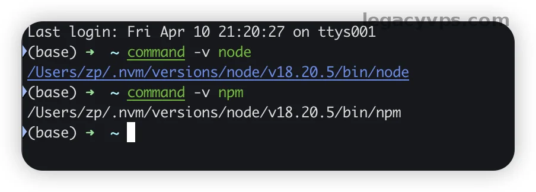
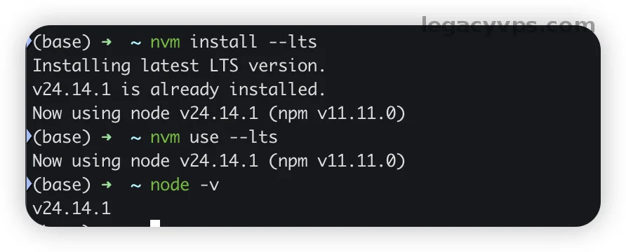
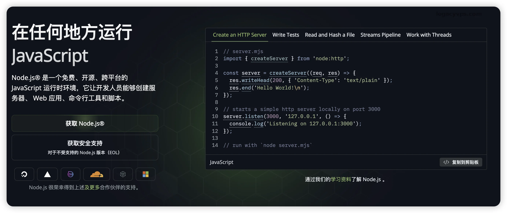
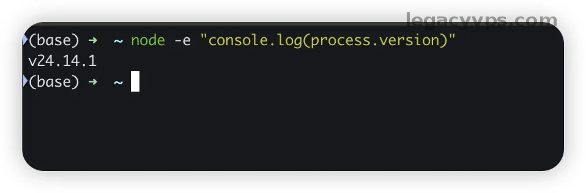

# 玩转本地 AI 的「第 0 步」：Node.js 环境保姆级安装教程


我看现在很多本地 AI 教程，工具安装的教程满天飞，每个细节也非常到位，但是都忽略了真正的小白的痛点，那就是Node环境。基本上所有的AI相关的工具都是基于 `Node.js` 环境去做安装和扩展的，如果不把地基打牢后面很多 `skills`、`MCP`、CLI 工具连跑起来的资格都没有。

这也是我为什么把这篇叫“第 0 步”的原因。你如果连 `node -v` 都还没正常出来，后面再去折腾各种工具，基本就是一边装一边猜，最后连自己到底是卡在工具，还是卡在本地环境都傻傻的分不清。

知识提要：我查的是 2026 年 4 月 10 日的官方资料，`nodejs.org` 现在最新的 `LTS` 版本是 `v24.14.1`。这篇我不准备讲 Node 原理，也不讲 AI 工具或者其他的MCP或者Skills，我只讲Node环境的安装和高级玩法`nvm`的安装教程。

---

## 先别装，先看你电脑现在是什么状态

我不建议你上来就复制安装命令。其实最怕的不是小白“不会装”，而是你没有了解过你的电脑环境，比如有的人电脑明明以前装过，但是不知道电脑系统里还残着旧版 `Node`、旧 PATH、旧全局包，如果你当全新的电脑环境去安装就会出大问题了。

先来一轮电脑摸底。

### macOS / Linux 先跑

```bash
node -v
npm -v
command -v node
command -v npm

```

### Windows 先跑

```powershell
node -v
npm -v
where node
where npm

```

如果运行命令的时候这里已经报 `command not found`，或者 `where node` 指向一堆你根本不认识的目录，那其实是好事。至少问题说明两个问题，电脑是纯净没安装过的或者告诉你电脑已经安装，告诉你安装的位置。



> 注意：  
> `npm` 通常会跟着 `Node.js` 一起装，不用单独先装一遍。后面还是推荐使用`nvm` 来做node的版本管理工具 。

---

## 我为什么更建议先走 nvm 这条路

官方的 `npm` 文档其实也写的很清楚：更推荐你用版本管理器来装 `Node.js` 和 `npm`，而不是直接装系统级安装包。原因也很现实，版本管理器更容易做到：全局权限、版本切换、全局包冲突等，基本上可以把一些常见问题给避免掉，如果你是前端工程师你就知道我所说非虚。

如果把这件事放到本地 AI 上就更加明显了。你今天装一个 CLI 可能没事，明天换另一个工具，要求的 Node 版本不一样，或者你要同时保留 `LTS` 和更新版本，这时候没有 `nvm`，很快你就会发现自己的电脑一堆node的版本，根本不知道使用的是哪个node版本，跟别说相关的依赖和包管理了。

我自己的建议是这样：

1. `macOS` 和 `Linux`：优先装 `nvm`
2. `Windows`：优先装 `nvm-windows`
3. 只有你特别确定自己就要一套固定版本，而且不准备折腾版本切换，才考虑直接用官网安装包

---

## macOS 和 Linux：先把 nvm 装上，再装 Node

这里我建议直接按 `nvm-sh/nvm` 官方仓库来。很多第三方的教程虽然把命令都没有问题，但是后面的验证和坑点却没有讲清楚。

先跑安装脚本：

```bash
curl -o- https://raw.githubusercontent.com/nvm-sh/nvm/v0.40.3/install.sh | bash

```

如果你机器上没有 `curl`，也可以用：

```bash
wget -qO- https://raw.githubusercontent.com/nvm-sh/nvm/v0.40.3/install.sh | bash

```

这个脚本做的事其实也不复杂，就是把 `nvm` 装到你用户目录下，然后尝试把加载配置写进 `~/.zshrc`、`~/.bashrc`、`~/.bash_profile` 或 `~/.profile`。

装完以后，先别急着使用。这里很多人最容易手快，装完就直接敲下一条，结果后面一看 `nvm: command not found`，又以为刚才安装脚本没跑成。

### zsh 用户

```bash
source ~/.zshrc

```

### bash 用户

```bash
source ~/.bashrc

```

然后验证 `nvm` 有没有真的生效：

```bash
command -v nvm

```

这里正常的话，终端会输出 `nvm`。如果你习惯用 `which nvm`，这里很容易把自己绕进去，因为官方 README 也专门提醒了，`nvm` 是 shell function，不是普通可执行文件，所以 `which nvm` 不一定靠谱。

接着装 `LTS` 版本的 Node：

```bash
nvm install --lts
nvm use --lts

```



再检查版本：

```bash
node -v
npm -v

```

你如果后面想把当前 `LTS` 设成默认版本，可以再补一条：

```bash
nvm alias default lts/*

```

这一步做完，新的 shell 默认就会先吃你设置好的 `LTS` 版本。

> 注意：  
> 你如果是 `Linux` 服务器、远程 VPS、WSL 这类环境，走 `nvm` 往往比直接装系统包更省事。尤其是你后面还要切版本、回滚版本的时候，差别就会更加非常明显了。

---

## Windows：别混着装，优先走 nvm-windows

Windows 这边别照搬 `macOS` / `Linux` 的 `nvm`，因为不是同一套东西。官方 `nvm` 仓库自己也写了，它主要是给 POSIX shell 用的；Windows 一般要安装的版本是 `coreybutler/nvm-windows`。这一步千万别混，混了以后排错会很烦。

Windows 这里我会先看旧版 Node 有没有清干净，尤其是 `%ProgramFiles%\\nodejs` 这种目录还在不在。`nvm-windows` 官方 README 反复提的一类坑，就是旧 Node 还挂在 PATH 里，结果你跑了 `nvm use`，表面没报错，版本却根本没切过去。

安装步骤：

1. 去 `nvm-windows` 官方 release 下载 `nvm-setup.exe`
2. 安装完成后，重开 `PowerShell` 或 `CMD`
3. 先跑 `nvm version` 看工具在不在
4. 再安装 `LTS`

关键命令：

```powershell
nvm version
nvm install lts
nvm use lts
node -v
npm -v

```

检查 PATH 有没有冲突，可以跑：

```powershell
nvm debug

```

这个命令对 Windows 新手很有用。Windows 最大的问题不是命令不会敲，而是旧 Node 还在你的店里面活着，新的 `nvm` 又没完全安装成功，最后看着都装好了，终端里面生效的还是旧路径。

> 风险提示：  
> `nvm-windows` 官方文档提到，执行 `nvm install` 和 `nvm use` 时，Windows 往往需要管理员权限来处理 symlink。你如果发现命令没报错，但版本就是没切过去，先别怀疑工具坏了，先看是不是管理员 shell。

---

## 如果你就是不想折腾 nvm，还有一条更省脑的路

那就是直接走 Node 官网安装包。



这一条适合两类人：

- 你就一台本机，短期内只想跑起来
- 你不准备切多个版本

`macOS` 和 `Windows` 可以直接去 Node 官网下载 `LTS` 安装包，`npm` 会一起装进去。Linux 这边，`npm` 文档更推荐用 NodeSource 这类路线，不建议自己东拼西凑。

比如 Debian / Ubuntu 系常见做法就是：

```bash
curl -fsSL https://deb.nodesource.com/setup_22.x | sudo bash -
sudo apt-get install -y nodejs

```

但这里我还是多说一句：你如果是为了本地 AI 环境打底，我还是更偏向 `nvm`。后面真遇到版本兼容问题，这条路回头更轻。

---

## 装完别急着关终端，先做这几步验证

很多人教程抄到这里就停了，我不建议。因为“装完”和“能用”中间还差一层验证。

我一般至少做这 4 步。

1. 看 Node 版本

```bash
node -v

```

1. 看 npm 版本

```bash
npm -v

```

1. 看当前命令到底指向哪里

macOS / Linux：

```bash
command -v node
command -v npm

```

Windows：

```powershell
where node
where npm

```

1. 跑一个最小安装动作

```bash
npm install -g npm@latest

```

这条命令不一定是必须升级，而是顺手验证一下全局安装、网络、权限、PATH 这一串是不是通的。你如果这里直接报权限问题，后面很多 CLI 也大概率会在全局安装时一起报。

你也可以再补一个最小执行验证：

```bash
node -e "console.log(process.version)"

```

能正常打印版本，说明 Node 本体已经能跑。



---

## 这几个坑最常见，而且都很像“装好了”

### 1. 终端里还是 `command not found`

这个最常见。尤其是刚装完 `nvm`，但你没重开终端，也没刷新配置文件配置 `source ~/.zshrc` / `source ~/.bashrc`。我自己总结的经验就是看到这种报错，第一反应都不是重装，而是先看 shell 配置到底有没有刷新进配置，系统有没有生效。

先查：

- 当前 shell 是不是新开的
- shell 配置文件里有没有正确加载 `nvm`
- 你是不是把配置写进了错误的 profile

### 2. Windows 明明切版本了，`node -v` 还是旧版本

这类问题优先怀疑旧版 Node 没卸干净，或者 `%ProgramFiles%\\nodejs` 还占着原来的路径。

先查：

- `where node`
- `nvm debug`
- 原来的 Node 安装目录是不是还在

### 3. `nvm` 看起来装了，但 `which nvm` 没结果

这不一定是坏了。`nvm` 官方自己就写了，验证应该用：

```bash
command -v nvm

```

不要把 `which nvm` 当唯一判断标准。

### 4. `npm install -g` 报权限错误

这类问题在直接装系统级 Node 时更常见。`npm` 官方不太推荐直接走 installer，一部分原因就是它更容易把全局权限问题一起带出来。

你如果已经踩到了：

- `macOS` / `Linux` 优先改走 `nvm`
- 不要第一反应就全局 `sudo npm install -g ...`

后者短期能过，后面经常会把权限和缓存搞得更乱。

### 5. IDE 里一个版本，终端里另一个版本

这也很烦。尤其是你装完以后，VS Code 终端、系统终端、远程终端各自不一样。很多人会在这里误判成“这个 AI 工具有问题”，其实环境先没对齐。

先别急着怪 AI 工具不稳定，先在你真正要使用它的那个终端里跑：

```bash
node -v
npm -v

```

你最终要相信的是“当前执行环境里跑出来的版本”，不是你印象里装过什么。

---

## 我现在的建议很简单

你如果只是想把本地 AI 跑起来，不需要一上来就研究十个工具的安装细节。先把 `Node.js` 这个地基打牢固，后面你在玩AI相关的基础设施，很多事情都会顺利很多。

主路线：

- `macOS` / `Linux`：先装 `nvm`，再装 `LTS`
- `Windows`：先装 `nvm-windows`，再装 `LTS`
- 装完以后：先跑版本检查，再做一次最小安装和执行验证

备选路线就是直接走官网安装包。但是你如果深度是使用和折腾AI相关的内容： `skills`、`MCP`、AI CLI，那我还是建议你直接一步到位直接安装 `nvm` 。可能你现在省的是 10 分钟，后面就是依赖版本火葬场了，到时候花费的时间就不止10分钟了。

## 官方资料

- Node.js 下载页：[https://nodejs.org/en/download](https://nodejs.org/en/download)
- npm 安装说明：[https://docs.npmjs.com/downloading-and-installing-node-js-and-npm](https://docs.npmjs.com/downloading-and-installing-node-js-and-npm)
- nvm 官方仓库：[https://github.com/nvm-sh/nvm](https://github.com/nvm-sh/nvm)
- nvm-windows 官方仓库：[https://github.com/coreybutler/nvm-windows](https://github.com/coreybutler/nvm-windows)
- nvm-windows 安装 Wiki：[https://github.com/coreybutler/nvm-windows/wiki](https://github.com/coreybutler/nvm-windows/wiki)

---

## 延伸阅读

- [Claude Code 安装教程：Mac、Windows、Linux 从 0 到跑通](Claude%20Code%20安装教程：Mac、Windows、Linux%20从%200%20到跑通.md) — Node 装完下一步跑这个
- [小白必看！Opencode 傻瓜式安装教程，把 DeepSeek 接上](小白必看！Opencode%20傻瓜式安装教程，终于把%20DeepSeek%20接上了！.md) — 另一个需要 Node 的工具
- [找不到高颜值视频素材？我用 Codex 与 Claude Code 跑通了 HyperFrames](../../03｜AI%20编程与智能体/AI%20编程案例/找不到高颜值视频素材？我用%20Codex%20与%20Claude%20Code%20跑通了%20HyperFrames.md) — Node 22+ 实战场景

---

> 来源：飞书 · AI Spark 知识库 ｜ 原文（最新版）：<https://lcnniolukk80.feishu.cn/wiki/WF3cwAPyIiSlizkJ2qRcj6zSnKb> ｜ 归档：2026-06-04
