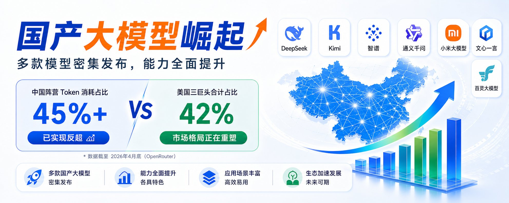
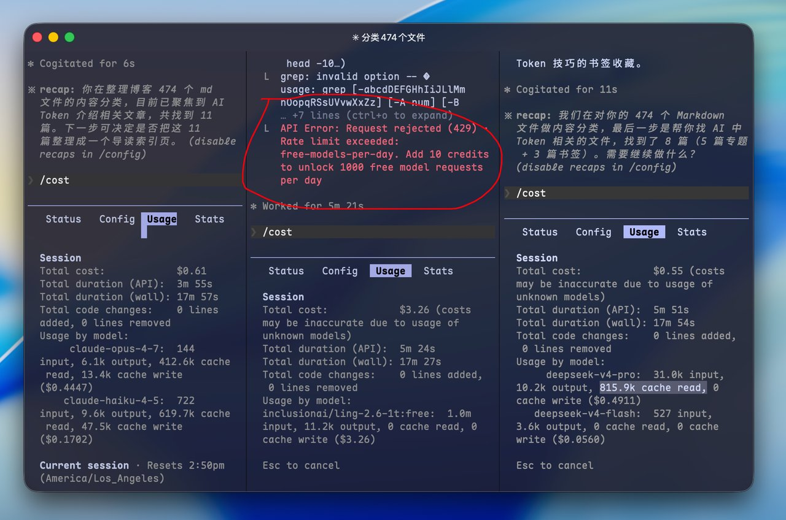
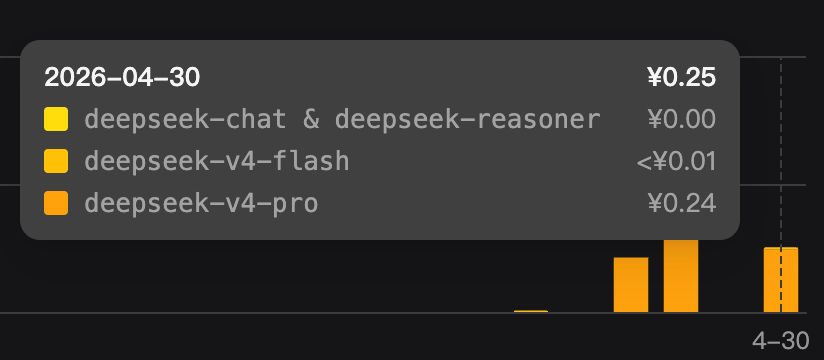
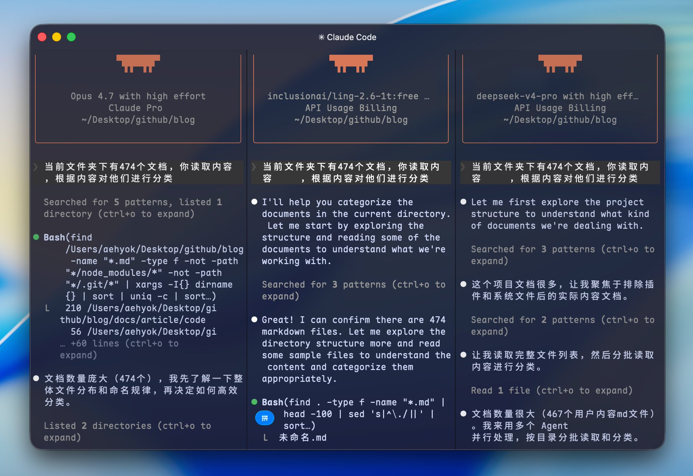
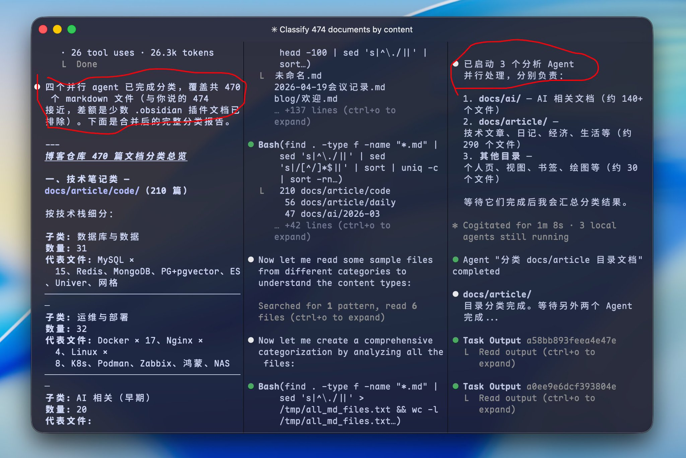
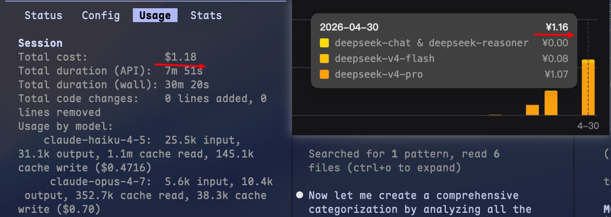
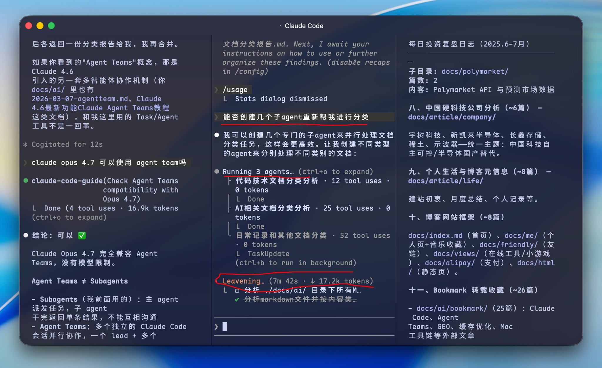
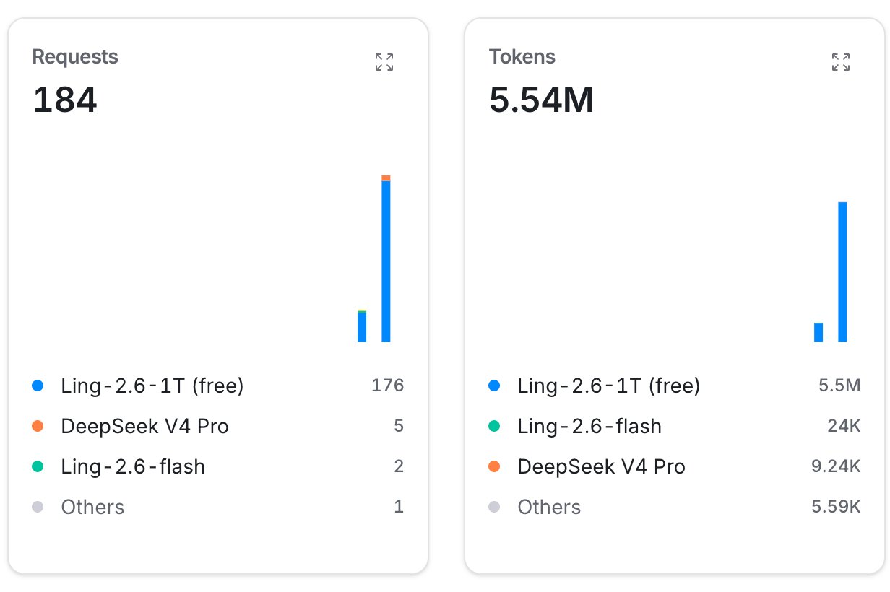

# 在Claude Code中使用两大国产模型与世界顶级模型Claude Opus 4.7的火力比拼

上个月发生了一件令我非常振奋的事情，而且持续了整整一个月。这一个月中国AI各大厂商，无论是黑马小米、Kimi和智谱以及千问、甚至期待已久的DeepSeek、还有昨天霸榜 在LMArena 文本领域成为国内第一的百度文心，最后还有加入的蚂蚁集团百灵大模型 以及等等我没关注到的。在这大致一个多月的时间，都密集发布了自己的大招，能力和性能各方面确实都有了长足的进步和提升，真是令人欣慰。

而且截止2026年4月底，OpenRouter上的AI厂商们token消耗市场份额正在发生剧变，中国阵营主要厂商token消耗已经占比超过45%，而美国的三巨头（Anthropic + Google + OpenAI）合计约42%。中国模型token消耗量彻底实现了反超，也就是有超级多的老外也在使用我们的国产AI，而且份额很大。

当然论整体能力可能还不能完全于美国三大巨头匹敌，但是从目前看，能力各方面也已经确实很能抗打了，而且在日常使用，甚至自主编码都有长足的进步。

接下来就开始正文的内容，本文内容目录如下

- 1、**选择两个国产模型**
- 2、稍微了解一下OpenRouter平台
- 3、在Claude Code中比对三个模型的使用情况
- 4、充值后重新测试474个文件看看
- 5、总结

## 1、选择两个国产模型

就像开头，我看到国产模型发展势头如此迅猛，于是特意找出两款，拿来跟Claude Opus 4.7在文档处理方面比拼比拼。

一个就是国之骄傲万众期待的DeepSeek，近期终于发布的DeepSeek-V4-Pro。

另一个就是前天最新开源的蚂蚁百灵大模型 **Ling-2.6-1T (free)，主打万亿参数不再是炫技，而是为了解决具体的业务问题。**

## 2、稍微了解一下OpenRouter

上面选择的蚂蚁百灵大模型，api接口使用的是OpenRouter.ai平台。Ling-2.6-1T (free) 模型在这个平台免费体验截止时间到5月7日，有兴趣的可以抓紧试玩一波，应该是注册个账号就可以免费体验了。

直达链接：[https://openrouter.ai/inclusionai/ling-2.6-1t:free](https://openrouter.ai/inclusionai/ling-2.6-1t:free)

开源直达链接：

[https://modelscope.cn/models/inclusionAI/Ling-2.6-1T](https://modelscope.cn/models/inclusionAI/Ling-2.6-1T)

上图就是我在测试的过程中突然出现了错误。我左侧使用的是Claude Opus 4.7、中间是ling-2.6-1t:free，而右侧是DeepSeek-V4-Pro。

中间红色的意思就是：我超出了每天针对免费模型50次的请求限额，添加 10个积分之后，即可解锁每日 1000 次免费模型请求。于是我就绑定了一下。貌似多了20倍，还是很香的，偶尔想测试一个新模型的长任务应该是绰绰有余了，有兴趣的可以去绑定一下。

## 3、在Claude Code中比对三个模型的使用情况

再来看看三个模型的消耗情况，其实还是上面那张图。

- 左一由于只是文本处理，而且Claude Code会自主根据任务进行选择模型，所以相对来说消耗并不大，0.61*7=4.2元。
- 中间蚂蚁百灵模型没有识别出model，所以他估算的价格可能也不准。
- 而DeepSeek 我使用的国内官网的，而且我去看了消耗如下图是0.25，简直跟不要钱一样，所以针对Claude Code中的非Claude 模型「cost指令」应该仅供参考一下而已，当然可能有其他插件可以适配各种模型的真实消耗吧。

因为我上面处理了474个md文档，而且对话次数触发中间蚂蚁百灵50次的限制，我查看DeepSeek官网请求次数是22次。蚂蚁百灵与DeepSeek初步比较也就是有些任务，蚂蚁百灵需要与AI多很多轮的会话交互。

我主要问了以下几个小问题：

- “你好”
- “当前项目中有多少个md文档”
- “帮我将这些md文档进行分类”（它主要根据文件名进行处理了）
- “然后将文档根据内容再进行一次分类”

我中间查看了三大模型每轮对话处理的效果，单论这四个问题的话，其实效果都还算可以，只是有的回答侧重点略有差异。所以日常任务蚂蚁百灵1T大模型也是完全可以应付，而且很多情况下又快又好不还能省token。

## 4、充值后重新测试474个文件看看

为了继续测试，我就绑定了一番，然后果不其然，接口又可以继续调用了，真香啊。

同样的左侧还是Claude Opus 4.7，中间是蚂蚁百灵1T大模型，右侧是DeepSeek-V4-Pro。

继续让三个模型同时处理同一个问题，如上图所示

最终结果跟我预想的一样：中间蚂蚁百灵率先完成，总共调用大模型次数大概是30次。最终给我的分类结果效果也非常不错。

而Claude Opus 4.7，竟然也就比蚂蚁百灵慢了20秒的时间，但是DeepSeek确实慢了很多，可能是DeepSeek-V4-Pro思考过程确实很慢的原因?

上图可以看到Claude Opus 4.7 自己创建了四个并行的子Agent去分析内容整理分类，右侧DeepSeek自己也创建了三个子Agent去完成分析，就是确实慢了很多大概8分钟才完成整个任务。

我也仔细查看蚂蚁百灵，它处理过程并没有创建子Agent，直接自己独立Agent就全部搞定了，而且速度和质量都非常好好。

花费大致统计

- 左侧Claude显示消耗：1.18美元*7=大致8元
- 右侧DeepSeek官网显示：1.16-0.25=0.91元（上一次0.25）
- 中间蚂蚁百灵：只知道消耗次数了，大致30次

然后我突然想试试，告诉蚂蚁百灵，“能否创建子agent来重新帮我梳理”

蚂蚁百灵也是可以创建子agent进行处理的，但是很明显确实也慢了非常多的时间，消耗的token也多了很多，原来50次请求，现在多了134次左右，三个子agent各自都独立的上下文吧。

所以蚂蚁百灵自己选择的方式可能是更好的，又快效果相对来说更好，而且可能更省token。

## 5、总结

经过一晚上的初步折腾，还是非常有收获的。

便宜模型用对了地方，比Claude Opus 4.7 这种顶级模型又快又便宜, 但是用错了地方的话，可能就乱来了，所以还是得花时间不断尝试。

国产模型初步来看，有进一步崛起的可能，虽然暂时还不能与三大巨头相媲美，至少又有了很大的进步。

DeepSeek V4 1.6T激活参数49B，Ling-2.6-1T激活参数63B。Ling-2.6-1T这两天已经开源这63B的激活参数 ，又会极大地刺激下游的微调与后训练生态。

今年下半年中国大模型仍然会有更大的潜力，DeepSeek也在灰度多模态的能力了，真是利好太多了，继续拭目以待。

---

> 来源：飞书 · AI Spark 知识库 ｜ 原文（最新版）：<https://lcnniolukk80.feishu.cn/wiki/Nkq7wW378iJ7RAk9ESxccC3Knlh> ｜ 归档：2026-06-04
