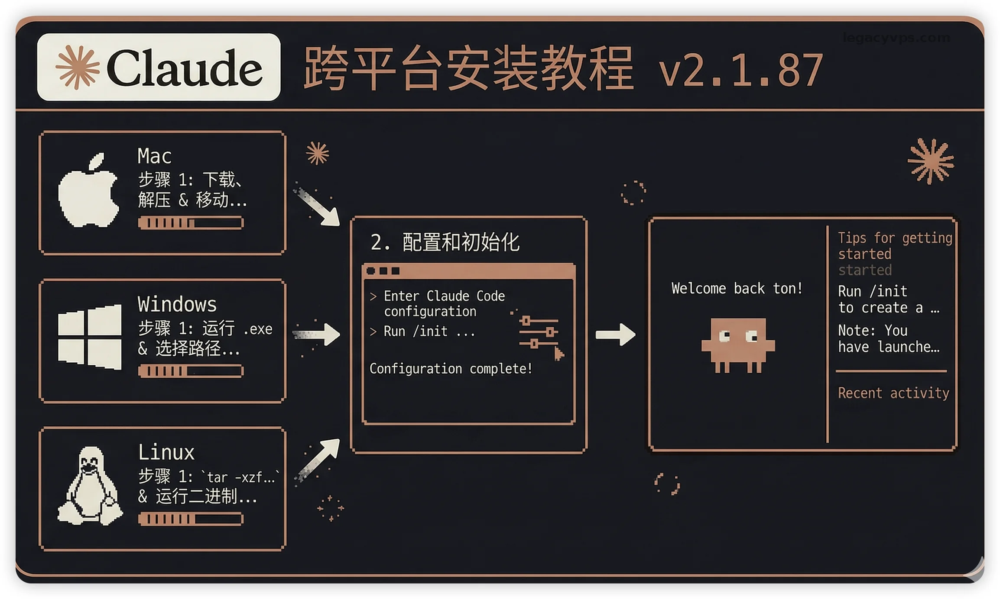
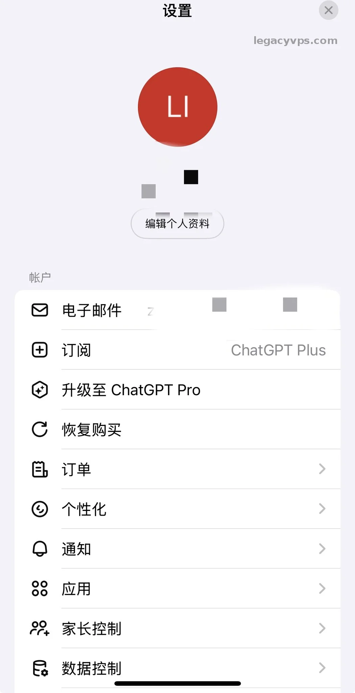
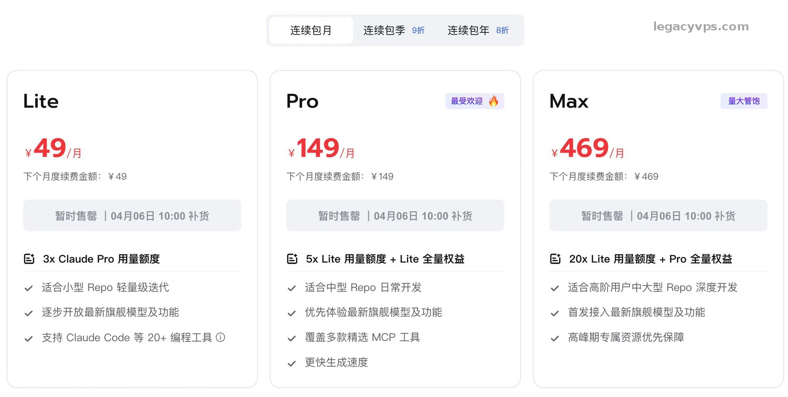
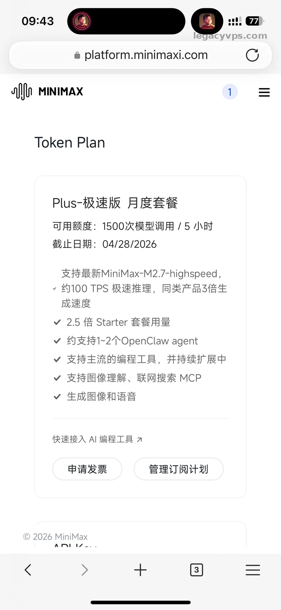

# 高强度实测 6 大 AI 模型：Claude 写文最强，但我写代码不选它

最近刚刚好把国产模型都玩了一遍，包含GLM、MiniMax、Kimi。国外的Gemini、Claude、Codex我也在高强度使用。

感觉大家都很感兴趣，所以才写下了这篇文章，在这里我不聊跑分，也不聊什么万能模型。我只结合我的使用感受和在不同领域下的使用体验来给大家好好说道说道。

这里我也会补充一点我自己的观点和看法，对应套餐方面我也会结合我的套餐使用情况。针对不同的情况给出一些建议，希望大家在考虑开套餐的时候可以作为一些参考。

---

## 先说结论

我实际使用下来的体感排序，按照功能分很简单：

|  |  |
|-|-|
| **场景** | **我的排序** |
| 文学创作 | Claude > Gemini = Codex > GLM > Kimi > MiniMax |
| 代码编写 | Codex > Claude > Gemini > GLM > Kimi > MiniMax |
| 日常任务理解 | Claude > Codex = Gemini > GLM > Kimi > MiniMax |

在写代码方面我可能和大部分人不一样。我没有把Claude放在第一位，不是Claude不够好，只能说Codex给的太多。

---

## 写文章这件事，还得看Claude

在写文章或者艺术创作这一块，我使用下来Claude是当之无愧的第一，也和很多博主或者大家反馈的使用体验是一致的。如果你主要的需求是：写博客、写长段说明、写经验稿，无脑选Claude就可以了不会错的 。它最舒服的地方，不只是语感好，更重要的是真人感。

Gemini 和 Codex 不是说不强，在使用体验上面还是有细微的差别。Gemini很多时候会有一种谄媚的感觉，总是讨好的语气。但是Gemini 在提示词整理、图片生成方面还是很好的。

Codex 在写脚本，归纳数据、整理步骤方面更强，文章创作上面“小红书的味道”太重了，不是不好我调试很多时候也只有Claude百分之80左右，对比Claude的ROI显得就没有性价比了。

在国产的三家里面，不管是代码编写还是内容创作我都比较看好 GLM。多方面能力是我使用下来最强的，但是主要问题就是算力有限。很多时候买不到套餐而且请求速度不是很稳定。

Kimi 在以前本来领先地位的，但最近没什么大更新，体感就往后掉了。MiniMax 写文就别指望太多了，能用，但我不会把它放到这种活上。

---

## 代码这件事，我会选择 Codex

在写代码方面，我更喜欢使用Codex完成代码编写的工作。很多人肯定有疑问，不是说Claude的编码能力很强吗？为什么我不使用Claude去选择Codex呢？

其实没那么多弯弯绕绕，最主要的还是两方面：

1. 额度量大管饱，可以随意使用都不容易触发限额，而且还有单独的review代码的额度。可以放心的使用，Claude 如果只是Pro套餐其实是不太够的没用几下就没有了。
2. 在写后端的时候，Codex大部分时间都可以精确定位，但是Claude在写代码的使用会为了你思考一样，加入一些自己的设计或者实现，这方面我不是很喜欢。

> 注意： 我这里说的“代码更常用 Codex”，不是说它全维度都压过 Claude。我只是把自己最常碰到的活拆开以后，发现 在代码方面 Codex 更适合做我的主力工具。

---

## 国产模型总结和推荐

如果一定要给国内三大模型排一个顺序，我的排序会是 GLM 第一，Kimi 第二，MiniMax 第三。

GLM 现在面临最大的问题其实是供给问题。你真把它当主力，很快就会遇到一个现实问题：就是你不一定能买得到，因为国内的官网经常缺货。

> 如果你能接受高一点的价格，可以考虑国际站。价格会高一点，但是供给更稳定，至少你能买到，国内你就只能蹲点抢购了。

Kimi 让我最可惜的地方，本来是领先地位的，但最近这段时间新模型消息不多，整体体感就慢慢被拉开了。最主要的是模型的计费有点问题，最低档的套餐基本上是不够用的用没几下就没了，如果要开我建议使用99元那一档位的套餐。

MiniMax 给我的感觉，能干活但是不太聪明的感觉。能力上它和其他模型还是有明显差距的，但是它有两个点太明显了：

1. 量大管饱
2. 反应还快

但是如果你和我一样有养小龙虾的需求，那把它放在小龙虾上面就是绝配了。我买的是高速档里面的98元每月的套餐，有低速档位29元一个月的，这个就看着的财力去决定了。

> 如果都想体验一下，可以选择阿里的code plan套餐，可以使用国内市面上绝大部分的模型，但是价格也不便宜，200元每个月。

---

## 明确分工选择很简单

我现在体验下来，分工就很明确：

- 写文章、整理长内容，闭着眼睛选Claude
- 写代码、做 review、查 bug，主力用 Codex
- 提示词整理、图片生成、一些杂活，我会想到 Gemini
- 国产模型里，GLM 留给我想认真试能力的时候
- MiniMax 接简单任务和高频小活

你如果在这么多海内外模型里面不知道怎么选，你可以参考我的工作类型去选择你觉得相匹配的模型，虽然不确保一定是和我的体验结果一致但是也具有参考意义。

我也很期待国内的模型会越来越强，至少慢慢的拉低和海外模型的差距，我也希望快一点有能和Claud比肩的模型，毕竟“世界苦Claud久已”封号太难以捉摸了，没办法稳定使用Claud就是它最大的问题。

---

## 延伸阅读

- [找不到高颜值视频素材？我用 Codex 与 Claude Code 跑通了 HyperFrames](../../03｜AI%20编程与智能体/AI%20编程案例/找不到高颜值视频素材？我用%20Codex%20与%20Claude%20Code%20跑通了%20HyperFrames.md) — Codex vs Claude 一个真实对照
- [越用越强不是广告语：拆解 Hermes Agent 的三层学习机制](../../03｜AI%20编程与智能体/智能体应用案例/越用越强不是广告语：拆解%20Hermes%20Agent%20的三层学习机制.md) — 多模型组合在 Agent 里怎么用
- [Claude Code 在大陆怎么稳定用：cc-switch + MiniMax 替代方案](../AI%20工具教程/Claude%20Code%20怎么稳定用：我用%20cc-switch%20接%20MiniMax%20跑通了一套替代方案.md) — Claude 用不了怎么办

---

> 来源：飞书 · AI Spark 知识库 ｜ 原文（最新版）：<https://lcnniolukk80.feishu.cn/wiki/J0PawoCwsirGI4kbbSfcu6c0ncb> ｜ 归档：2026-06-04
