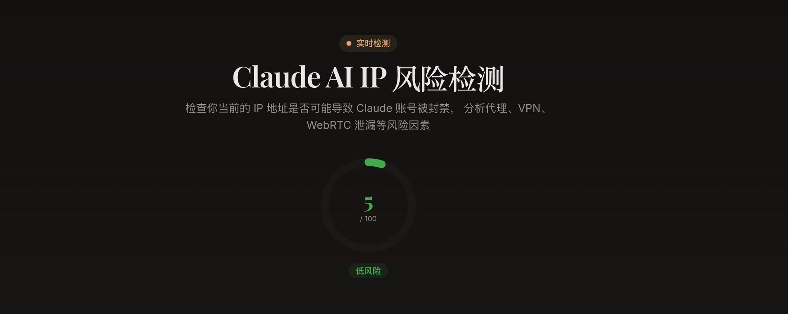
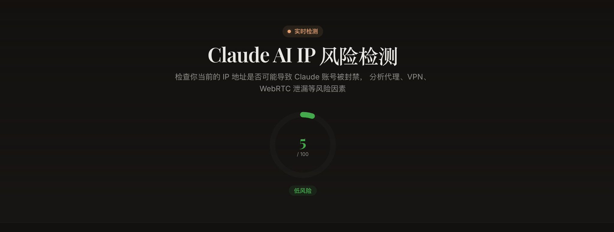
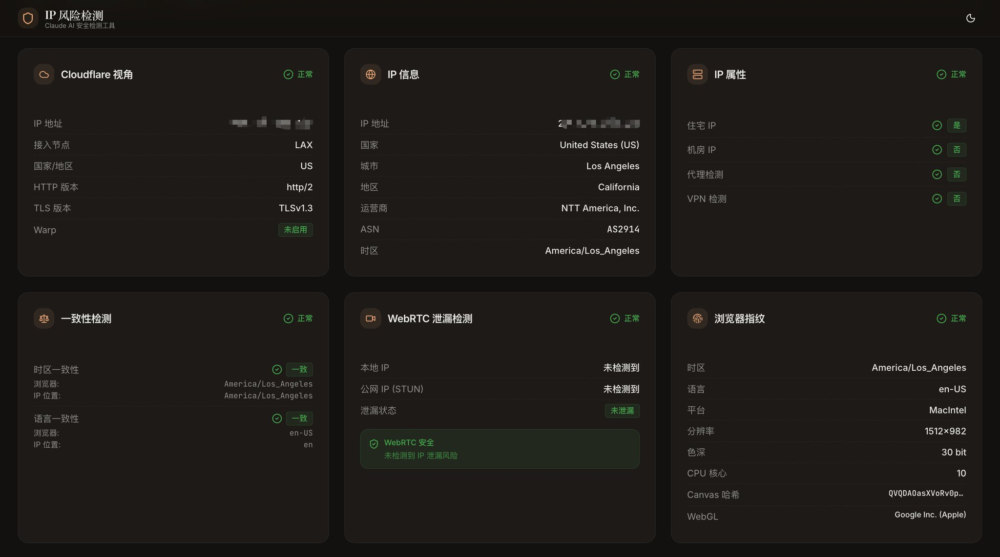
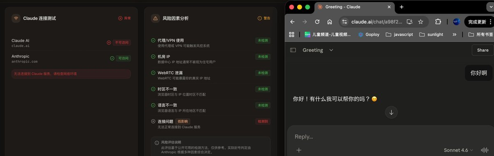

# 想使用Claude的朋友们，可以来看看这个IP 风险检测网站辅助工具

早上看到不滑锅发的一个短贴蛮有意思，于是自己尝试了一下，把风险降低到了5%，理论上风险应该是0了。应该说是可以来参考降低风险，并不是说做到100%就万事大吉了。

首先打开这个网站 [https://cc.mastersgo.cc](https://cc.mastersgo.cc/)，看这就是下面我优化完的结果了。

我优化完已经达到只有5%的风险了，去看风险第三张图，其实我也能够访问Claude的，所以这个作为一个参考，还是非常不错的。

针对我的电脑我主要优化了以下几个事项：

- 1、静态住宅IP最好是要要的，稳定性就很强了
- 2、设置了我的mac电脑系统时区为北美太平洋夏季时间
- 3、Chrome浏览器设置Location->右上角三个点->更多工具->开发者工具->Command(ctrl) +Shift +P-> Show Sensors-> Location-> 选择一个美国的地点，或者自己单独添加合适的定位
- 4、下载Chrome扩展禁用WebRTC来防止真实IP地址泄漏：**WebRTC Leak Prevent**
- 5、浏览器设置定位尽量与电脑时区和静态住宅IP地址保持相对一致

暂时就想到这么多分享一下,最后想要注册账号的可以参考一下我刚写的文章

> 4月13日

---

> 来源：飞书 · AI Spark 知识库 ｜ 原文（最新版）：<https://lcnniolukk80.feishu.cn/wiki/O2gQwh61Mi79u3kvNTpcDgoWnze> ｜ 归档：2026-06-04
