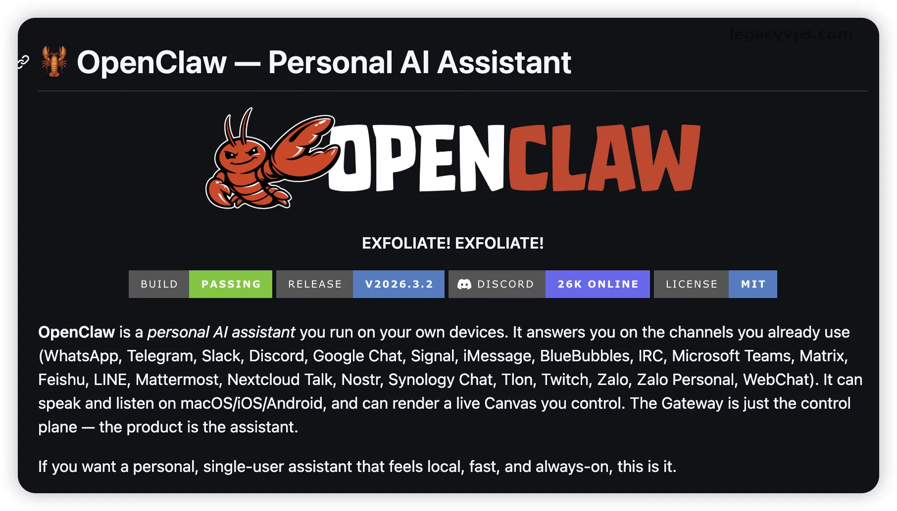
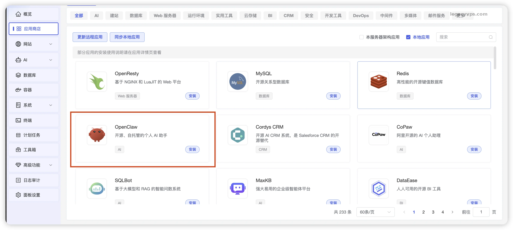
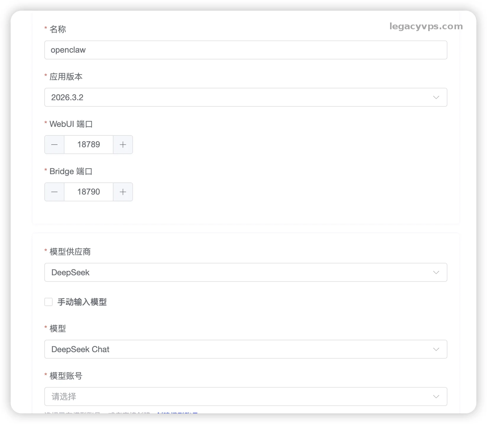
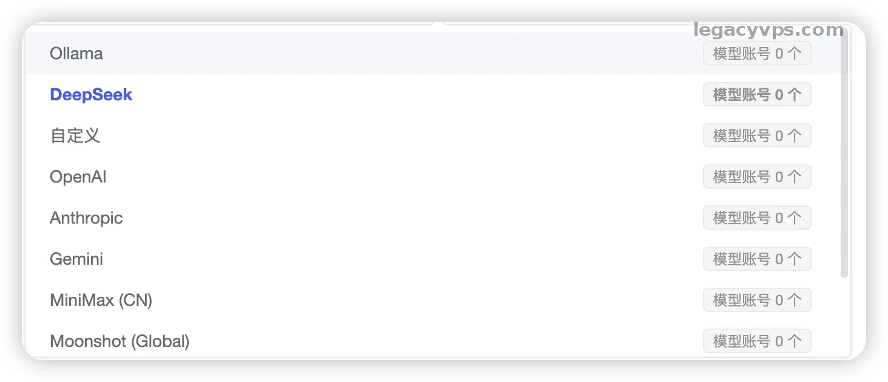
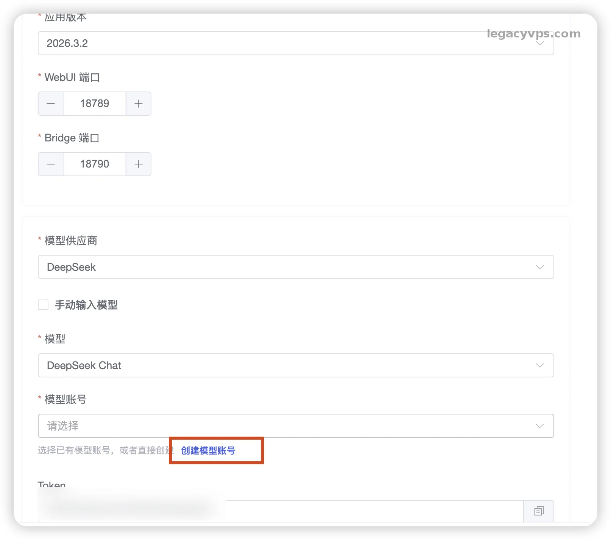
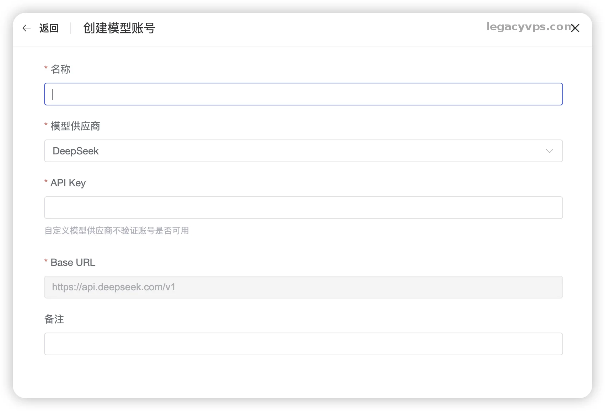
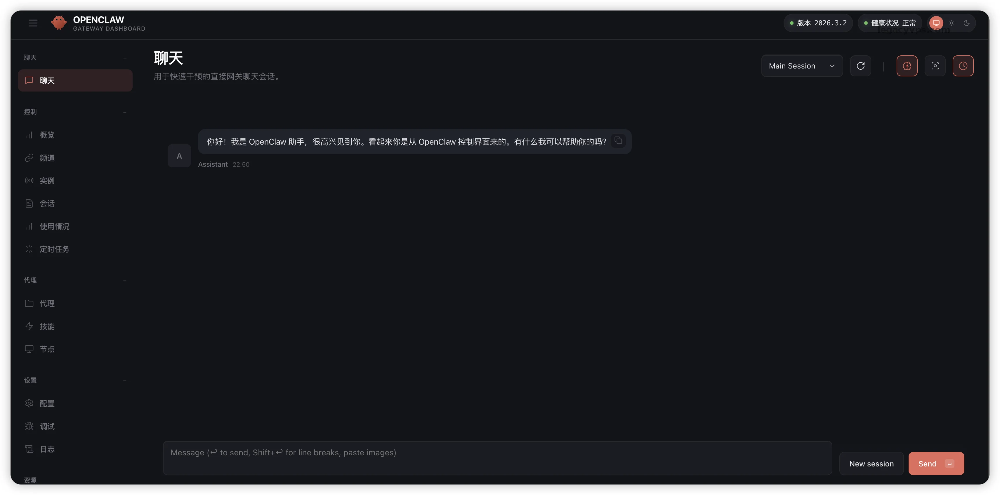
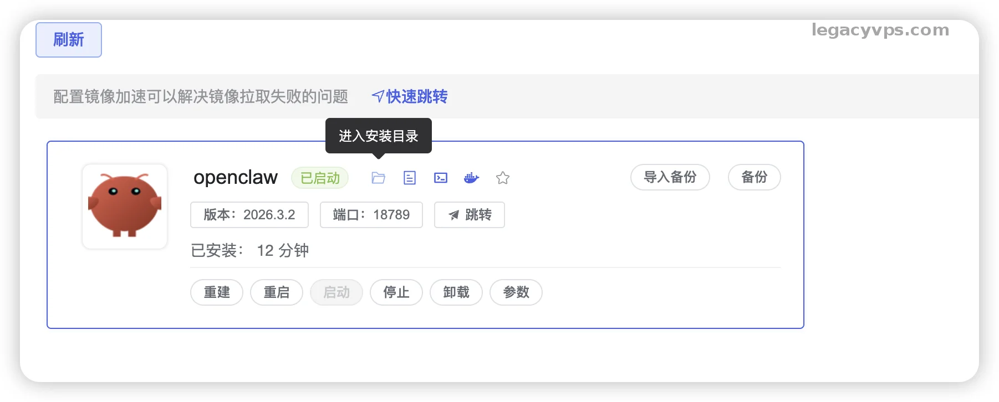
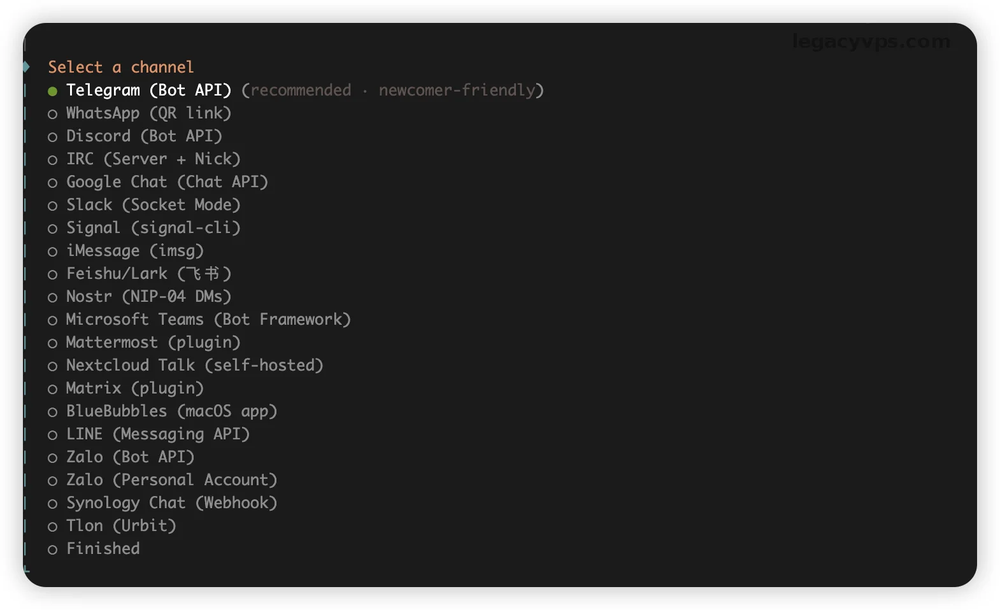
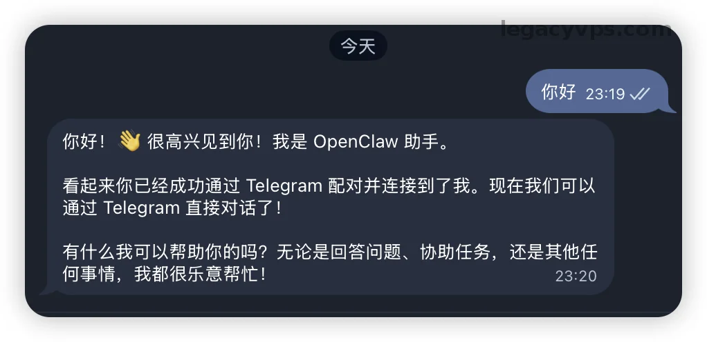

# 1Panel 上部署 OpenClaw：配合 DeepSeek 打造属于你的全渠道“贾维斯”

正是openclaw的爆火，我们既然已经安装了1Panel 面板搭好了，如果不跑点好玩的容器岂不是浪费？今天我就带大家玩个大的——**在自己的 VPS 上部署一个私人 AI 助理：OpenClaw。**

## 什么是 OpenClaw？

简单说，它就是你梦想中的 **“低配版的贾维斯” (Jarvis)** 原型。

[**项目地址**](https://github.com/openclaw/openclaw)

在以前传统的AI 我们只能在网页或者APP上跟它聊天，或者想opencode一样在命令行聊天，但是openclaw的体验完全不一样。**OpenClaw** 的牛逼之处在于，它可以连接你所有的社交软件——\*\*Telegram、WhatsApp、Slack、Discord。

部署好之后，它就是一个 24 小时在线的私人助理。你可以直接在 Telegram 里问它问题，让它帮你总结群聊消息，甚至通过 API 调用工具。最重要的是，**数据掌握在自己手里，速度快，还不用看别人的脸色。**

## 准备工作

1. **一台装好 1Panel 的 VPS**
2. **DeepSeek 的 API Key**（其他的模型也可以）。

> 我这里使用的是一台RackNerd的2.5GB内存的机器，我测试下来最低2GB就可以部署，但是如果需要使用浏览器或者其他软件配合最好内存在8GB左右会更合适。

---

## 第一步：在应用商店“一键安装”

这就是我为什么推荐新手用 1Panel 的原因，部署这种复杂的应用，根本不需要写 Docker Compose 文件。

1. 登录你的 1Panel 面板。
2. 点击左侧菜单的 **「应用商店」**。
3. 在搜索框输入 `OpenClaw`。
4. 点击 **“安装”**。

## 第二步：配置参数

点击安装后，会弹出一个配置窗口。这里有几个需要注意的地方，大家跟着我填，别填错了：

- **名称**：默认 `openclaw` 即可。
- **版本**：选 `latest` 或者最新的版本号。
- **端口**：保持默认（WebUI 18789），除非你的端口被占用了。
- **模型提供商**：下拉选择 **DeepSeek**（模型供应商很多选择自己喜欢的就好）。

- **模型**：填入 `DeepSeek Chat`。

- **设置模型账户**：点击`创建模型账号`
- **API Key**：把你从 DeepSeek 后台申请的 `sk-xxxx` 开头的密钥填进去，名称随意填写你能记住的就可以，添加好后选择你的账户。
- [DeepSeek API申请地址](https://platform.deepseek.com/)
- **Token / 令牌**：这里会自动生成，自己保管好，登入的时候需要使用。

- **端口外部访问**：**一定要勾选**，否则你进不去后台。

确认无误后，点击 **“确认”** 开始安装，经过一阵跑码之后等待安装完成（可能时间有点久需要耐心一点）。

## 第三步：登录

**如何访问后台？**

OpenClaw 为了安全，不允许直接访问 IP:端口，必须带上 Token。 你的访问地址格式应该是： `http://你的VPS_IP:18789?token=刚才复制的Token`

你如果怕忘记可以把这串地址保存到你浏览器的书签里面去，下次就可以直接打开了。

## 第四步：链接聊天软件（可选操作）

如果你是想在浏览器上使用，这一步就可以不需要了，你的 AI 已经在运行了，但是如果你想让它对接聊天软件，我们需要还需要给他对接聊天软件比如Telegram。

1Panel 的强大之处又来了，我们不需要 SSH 连服务器敲命令，直接在网页上搞定。

1. 在 **“已安装应用”** 找到 OpenClaw。
2. 点击顶部的 **“进入安装目录”**。
3. 看到文件列表顶部那个 **“终端”** 按钮

1. 在弹出的黑色框框里，输入下面这行命令（以连接 Telegram 为例）：
2. docker compose -f docker-compose-cli.yml run --rm openclaw-cli channels add

**接下来的交互流程：**

1. 系统会问你选择哪个 Channel？用键盘上下键选择 `Telegram`。

1. 它会问你要 `Bot Token`。

   - *去 Telegram 找 @BotFather 申请一个机器人，把 Token 粘贴进来。*
2. 设置完成！

> 如果没生效，可以重启一下openclaw，然后在尝试一下。

现在，打开你的 Telegram，找到你的机器人，给它发一句“你好”，看看是不是 DeepSeek 在回复你？

---

## 总结

到这里，你就已经拥有了一个运行在自己服务器上的小龙虾了，你可以随时在手机控制它，随时随地的操作玩耍了。 其实很多厂商已经内置了openclaw的镜像系统了，但是我更喜欢自己折腾一下，去捣鼓一下。1Panel也出了官方的openclaw安装教程但是不够全面，在这里我就添加了一下自己的设置和踩坑的过程。

如果有需要后续我也会更新更多openclaw高级玩法的教程。