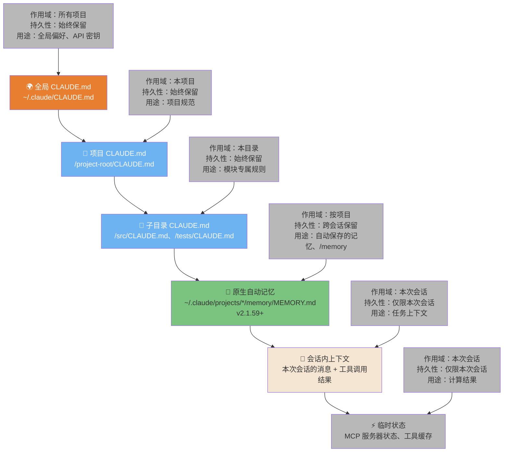
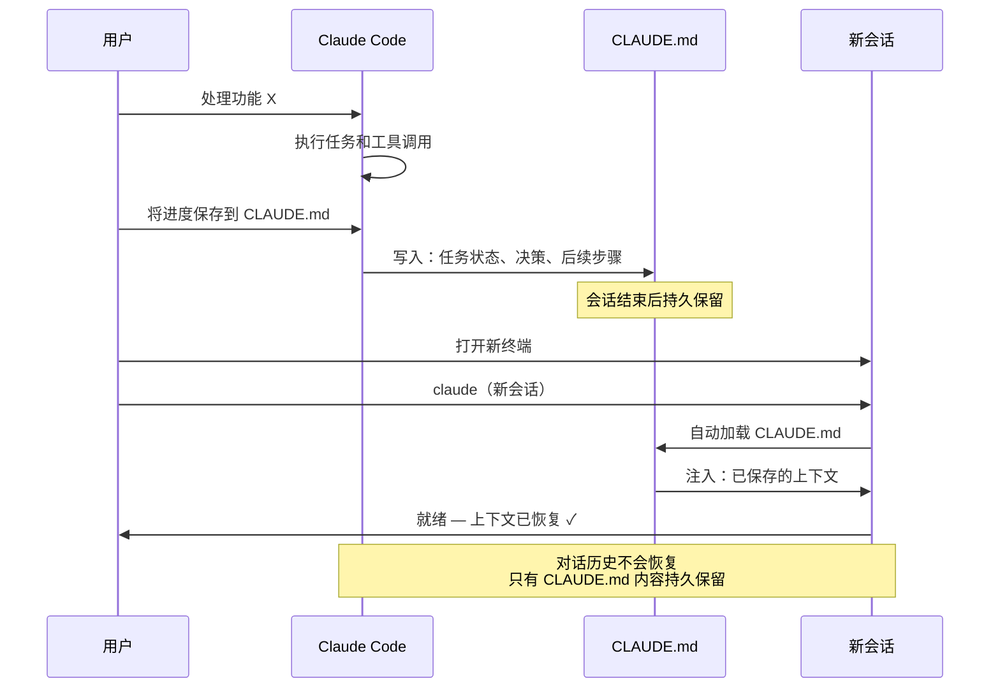
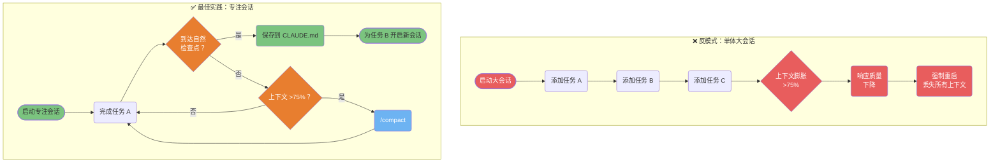

# 上下文与会话

Claude Code 如何在工作中管理上下文、记忆和会话。

---

### 上下文管理区域

你的上下文窗口有 4 个不同区域，每个区域需要不同的策略。了解自己所在的区域可以防止上下文膨胀，并在长时间会话中保持响应质量。


ASCII 版本

```Plain Text
0%──────50%──────75%──85%──100%
│  绿色  │  蓝色  │ 橙色 │ 红色│
│ 全部   │ 正常   │ 建议  │ 自动│
│ 访问   │ 监控   │ 压缩  │ 压缩│
│        │        │ 减少  │ 仅必│
│        │        │ 冗余  │ 要  │

```

> **来源**：「上下文管理」 — 第 ~1335 行

---

### 记忆层级 — 6 种类型

Claude Code 有 6 种不同的记忆类型，作用域和持久性各不相同。了解每种信息该使用哪种记忆类型，是高效会话的关键。



ASCII 版本

```Plain Text
永久 ──────────────────────────────────── 仅限会话

~/.claude/CLAUDE.md                    会话内上下文
      │                                      │
/project/CLAUDE.md                    临时 MCP 状态
      │
/subdir/CLAUDE.md
      │
自动记忆（MEMORY.md）← 跨会话、按项目

越高 = 作用域越广，始终保留
越低 = 作用域越窄，重启后仍保留
自动记忆 = 跨会话保留，按项目作用域

```

> **来源**：「记忆系统」 — 第 ~3160 行 & ~3986 行 | 自动记忆：v2.1.59+（v3.30.0）

---

### 会话连续性 — 保存与恢复状态

会话不会自动在不同终端之间持久化上下文。此图展示如何保存状态并在新会话或新终端中恢复，从而支持异步工作流。



ASCII 版本

```Plain Text
会话 1                    CLAUDE.md          会话 2
──────                    ─────────          ──────
处理任务                      │               打开终端
     │                        │                    │
保存进度 ──────────────►  写入              加载 CLAUDE.md
                           状态、          ◄── 自动注入
                           决策、
                           后续步骤

```

> **来源**：「会话管理」 — 第 ~9477 行

---

### 新鲜上下文——反模式 vs 最佳实践

长时间会话会积累噪声，导致响应质量下降。此图展示了退化模式，以及维持性能的推荐"专注会话"方法。



ASCII 版本

```Plain Text
差：一个大会话
任务 A → 任务 B → 任务 C → 上下文膨胀 → 质量下降 → 重启 → 丢失！

好：专注会话
任务 A ──► 检查点？──是──► 保存 CLAUDE.md ──► 为 B 开启新会话
           │
           否
           │
         上下文 >75%？──是──► /compact ──► 继续
           │
           否
           │
         继续任务

```

> **来源**：「上下文最佳实践」 — 第 ~1525 行

---

## 相关文章

- [上下文工程](上下文工程.md)
- [记忆系统深度解析](../记忆系统深度解析.md)
- [记忆与配置](../../零到精通：七步上手路径/记忆与配置.md)

---

> 来源：飞书 · AI Spark 知识库 ｜ 原文（最新版）：<https://lcnniolukk80.feishu.cn/wiki/S7IqwyritiRUK9kmCaJccmnTnjc> ｜ 归档：2026-06-04
