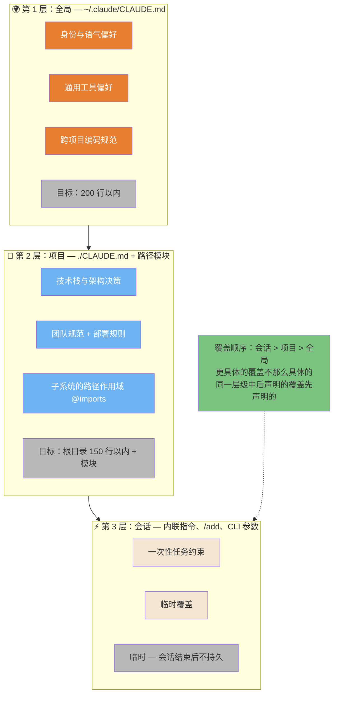
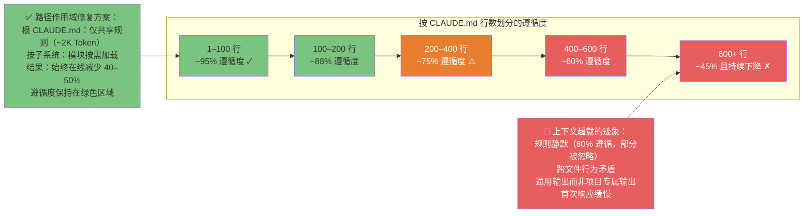
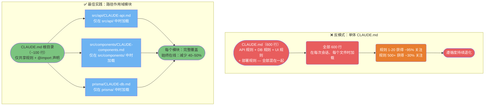
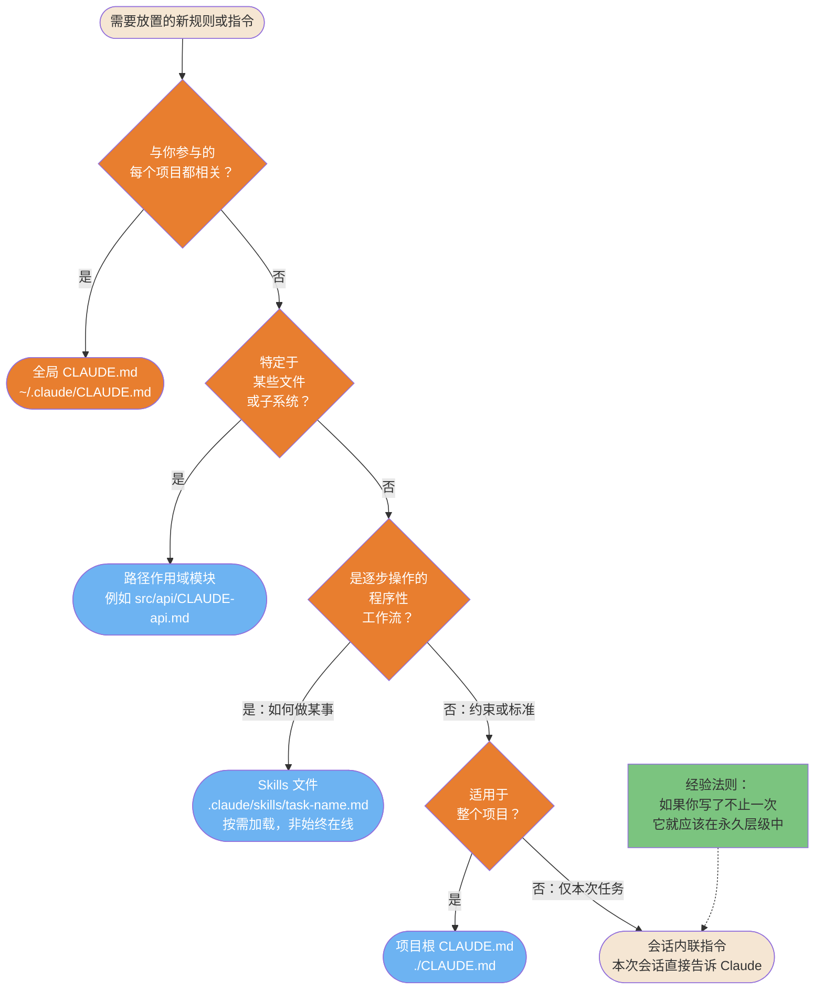

# 上下文工程

如何在正确的时间将正确的信息填充到 Claude 的上下文窗口中——以及架构选择如何决定 Claude 是否能持续遵循你的规范。

> "上下文工程是一门艺术，目标是在正确的时间将正确的信息填充到上下文窗口中。" — Andrej Karpathy

---

### 3 层上下文系统

上下文工程跨越 3 个不同层次，各有不同的作用域和持久性。理解该使用哪一层，可以避免最常见的错误：将所有内容都塞进一个文件。



ASCII 版本

```Plain Text
全局 ~/.claude/CLAUDE.md     → 身份、通用工具、跨项目规范（<200 行）
    │ 被以下覆盖 ↓
项目 ./CLAUDE.md + 模块       → 技术栈、架构、团队规则、路径作用域 @imports（根目录 <150 行）
    │ 被以下覆盖 ↓
会话 内联 / /add / 参数       → 一次性约束、临时覆盖（临时）

覆盖顺序：会话 > 项目 > 全局
同一层级中更具体的覆盖不那么具体的

```

> **来源**：「上下文工程 — 配置层级」

---

### 上下文预算与遵循度退化

随着文件大小增长，对 CLAUDE.md 规则的遵循度会有规律地退化。超过约 150 条规则后，模型开始选择性地忽略指令。路径作用域是主要的修复手段——它可以在不减少覆盖范围的前提下，将始终在线的上下文减少 40-50%。



ASCII 版本

```Plain Text
CLAUDE.md 行数     遵循度     状态
──────────────     ─────────  ──────
1 – 100            ~95%       ✓ 绿色区域
100 – 200          ~88%       ✓ 可接受
200 – 400          ~75%       ⚠️ 注意
400 – 600          ~60%       ✗ 退化
600+               ~45% ↓     ✗ 危急

修复方案：按子系统路径作用域 → 根 CLAUDE.md 保持 <150 行
结果：始终在线上下文减少 40-50%，遵循度回到绿色区域

```

> **来源**：「上下文预算」 — 遵循度数据：HumanLayer 生产数据（结构化上下文提升 15-25%）

---

### 单体 vs 模块化架构

单体 CLAUDE.md 是团队场景中最常见的失败模式。路径作用域模块通过仅加载当前任务相关内容来修复这一问题。



ASCII 版本

```Plain Text
差：CLAUDE.md（600 行，所有内容混在一起）
  → 每次会话加载全部 600 行
  → 规则 500+ 仅获得 ~30% 的注意权重
  → 遵循度持续退化

好：根 CLAUDE.md（~100 行，仅共享内容）
  + src/api/CLAUDE-api.md      ← 仅在编辑 API 文件时加载
  + src/components/CLAUDE-*.md ← 仅在编辑组件时加载
  + prisma/CLAUDE-db.md        ← 仅在编辑 DB 文件时加载

结果：始终在线 Token 减少 40-50%，每个子系统覆盖完整

```

> **来源**：「模块化架构」 — 路径作用域模式

---

### 规则放置决策树

每条新指令或规范都需要落在正确的层级。放置错误会浪费 Token（过于全局化）或降低覆盖率（作用域过窄）。这个决策树让选择变得明确。



ASCII 版本

```Plain Text
需要放置的新规则
│
与每个项目都相关？──是──► 全局 CLAUDE.md（~/.claude/CLAUDE.md）
│ 否
特定于某些文件/子系统？──是──► 路径作用域模块（src/area/CLAUDE-area.md）
│ 否
逐步操作的程序性？──是──► Skills 文件（.claude/skills/）[按需加载]
│ 否
适用于整个项目？──是──► 项目根 CLAUDE.md（./CLAUDE.md）
│ 否
└──► 会话内联指令（临时）

经验法则：如果你说了不止一次，就将其提升到永久层级。

```

> **来源**：「规则放置」 — 第 3 节决策树

---

## 相关文章

- [上下文工程](上下文工程.md)
- [记忆系统深度解析](../记忆系统深度解析.md)
- [配置参考手册](../配置参考手册.md)
- [智能体框架工程](../智能体框架工程.md)

---

> 来源：飞书 · AI Spark 知识库 ｜ 原文（最新版）：<https://lcnniolukk80.feishu.cn/wiki/ArtwwRCSJi1QdNk3gR7cW2Alnec> ｜ 归档：2026-06-04
