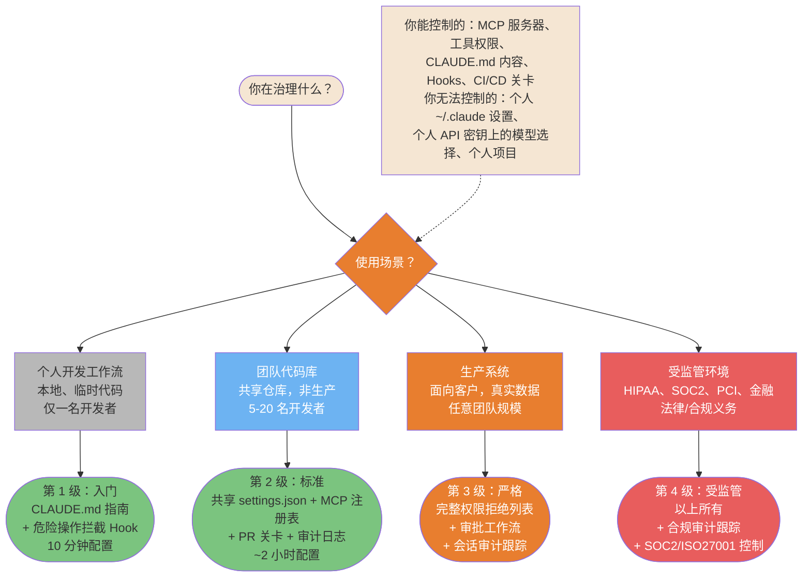
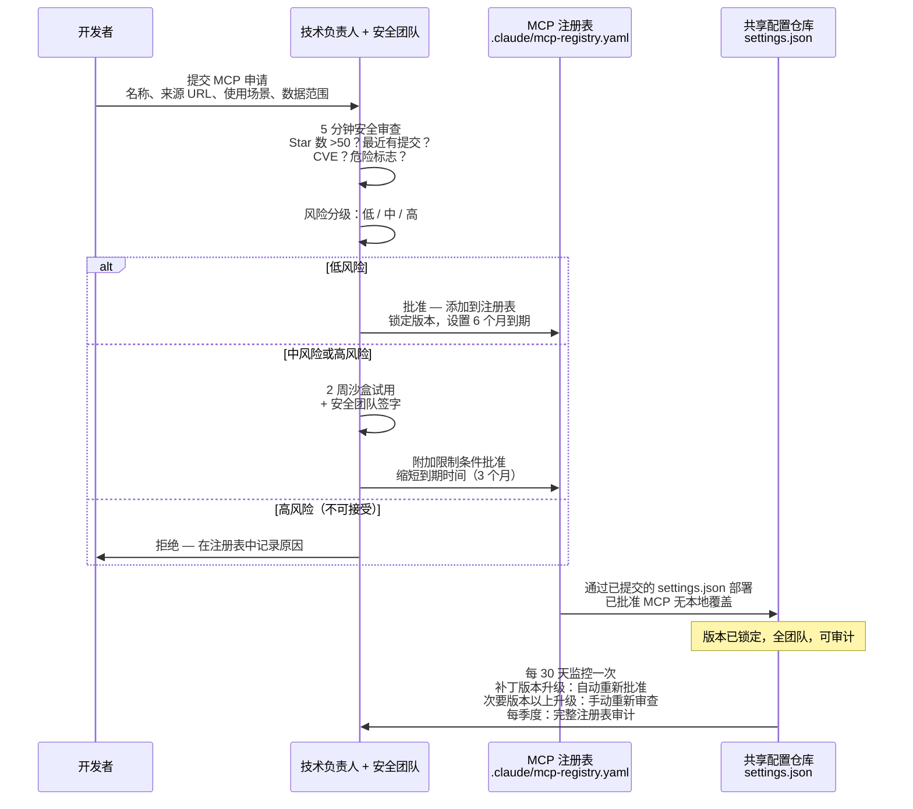
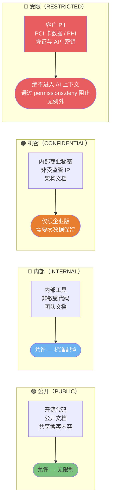

# 企业治理

在组织层面大规模部署 Claude Code 的模式——使用层级、MCP 审批工作流和护栏配置。

> **受众**：技术负责人、工程经理、安全官员。个人开发者安全请参见 「安全与生产环境」。

---

### 治理风险层级 — 何时控制什么

并非所有场景都需要严格治理。这个决策树根据实际风险将你的场景路由到正确的控制级别——从个人开发工作流（最低控制）到受监管环境（完整合规栈）。



ASCII 版本

```Plain Text
使用场景？
├─ 个人开发工作流      → 第 1 级：入门     （CLAUDE.md + 基础 Hooks，10 分钟）
├─ 团队代码库          → 第 2 级：标准     （共享 settings.json + MCP 注册表 + PR 关卡）
├─ 生产系统            → 第 3 级：严格     （完整拒绝列表 + 审批 + 审计跟踪）
└─ 受监管（HIPAA/SOC2/PCI）→ 第 4 级：受监管 （以上所有 + 合规审计跟踪）

你能控制的：仓库中的 settings.json、CLAUDE.md、Hooks、CI/CD 关卡、MCP 注册表
你无法控制的：个人 ~/.claude、个人 API 密钥模型选择、个人项目

```

> **来源**：「企业治理」 — 第 1 节治理拆分，第 4 节护栏层级

---

### MCP 治理工作流

单个 MCP 审查需要 5 分钟。组织级 MCP 治理是 5 步流水线，确保已批准的服务器持续合规、版本已锁定、部署前完成风险分级。



ASCII 版本

```Plain Text
开发者提交 MCP 申请（名称、来源、使用场景、数据范围）
    │
技术负责人：5 分钟安全审查（Star 数、提交、CVE、标志）
    │
风险分级：低 / 中 / 高
    │
┌───┴────────────────────────────┐
低                               中/高
立即批准                        2 周沙盒试用
                                + 安全团队签字
    │
添加到注册表（.claude/mcp-registry.yaml）
  - 锁定精确版本
  - 设置到期时间（低风险 6 个月，中风险 3 个月）
  - 记录已批准的范围
    │
通过已提交的 settings.json 部署（无本地覆盖）
    │
每 30 天监控：
  - 检查安全公告
  - 补丁版本升级：自动 | 次要版本以上：手动重新审查
  - 每季度：完整注册表审计

```

> **来源**：「MCP 治理工作流」 — 第 3.1 节审批工作流

---

### 数据分类与 Claude Code 访问规则

数据分类决定 Claude Code 被允许读取和处理的内容。搞错这一点是影响最大的治理失误。四个级别，明确规则，RESTRICTED 级别无例外。



ASCII 版本

```Plain Text
公开（PUBLIC）   → 允许，无限制
内部（INTERNAL） → 允许，标准配置
机密（CONFIDENTIAL） → 仅限企业版（需要零数据保留）
受限（RESTRICTED）   → 绝不进入 AI 上下文（PII、PCI、PHI、凭证）
               通过以下方式阻止：permissions.deny Read(.env, *.key, *.pem, secrets/**)

硬性规则：受限数据绝不进入上下文窗口。
不在提示词中，不在 Claude 读取的文件中，不作为示例。

```

> **来源**：「AI 使用章程」 — 第 2.1 节数据分类

---

## 相关文章

- [企业 AI 治理](../../企业级安全与治理/企业%20AI%20治理.md)
- [数据隐私与保留](../../企业级安全与治理/数据隐私与保留.md)
- [MCP 服务器生态](../../生态与工具链全景/MCP%20服务器生态.md)
- [生产安全规则](../../企业级安全与治理/生产安全规则.md)

---

> 来源：飞书 · AI Spark 知识库 ｜ 原文（最新版）：<https://lcnniolukk80.feishu.cn/wiki/DqEpwoPv6iYoZ6kKkzHctxNNnyc> ｜ 归档：2026-06-04
