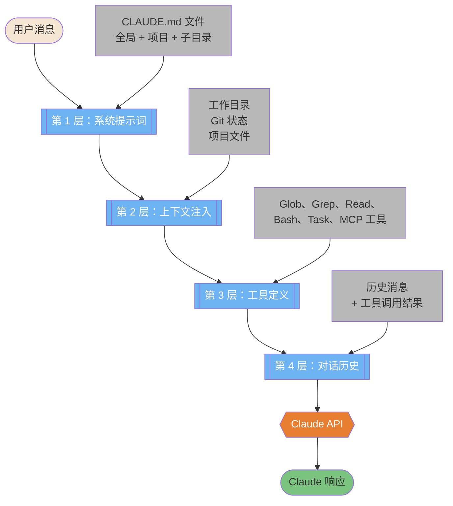
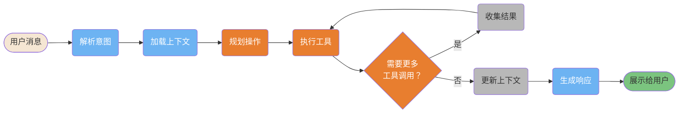
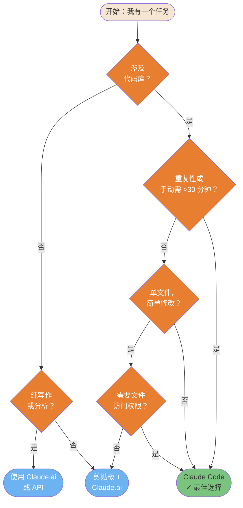
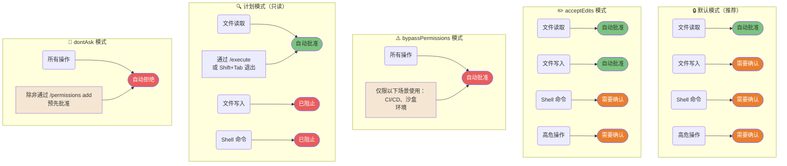

# 基础概念

解释 Claude Code 是什么以及其基本运作原理的核心概念。

---

### "从聊天机器人到上下文系统" — 4层模型

Claude Code 不是聊天机器人——它是一个上下文系统，在调用 API 前会将你的消息转化为丰富的多层提示词。此图展示了每次请求背后隐式发生的 4 层增强过程。



ASCII 版本

```Plain Text
用户消息
     │
     ▼
┌─────────────────────────────────┐
│ 第 1 层：系统提示词             │ ← CLAUDE.md 文件
│ 第 2 层：上下文注入             │ ← 工作目录、git 状态
│ 第 3 层：工具定义               │ ← 所有可用工具
│ 第 4 层：对话历史               │ ← 历史消息
└─────────────────┬───────────────┘
                  │
                  ▼
           Claude API 调用
                  │
                  ▼
           Claude 响应

```

> **来源**：「Claude Code 工作原理」 — 第 ~2360 行

---

### 9 步工作流流水线

每次对 Claude Code 的请求都会经历这条流水线——从解析你的意图到展示最终响应。理解这个循环有助于你写出更好的指令，并更快地定位问题。



ASCII 版本

```Plain Text
用户消息 → 解析意图 → 加载上下文 → 规划操作
                                        │
                     ┌──────────────────┘
                     ▼
               执行工具 ◄──────────────────┐
                     │                     │
               需要更多工具？── 是 ── 收集结果
                     │ 否
                     ▼
              更新上下文 → 生成响应 → 展示

```

> **来源**：「快速入门」 — 第 ~277 行

---

### 快速决策树 — "我该使用 Claude Code 吗？"

并非所有任务都需要 Claude Code。这个决策树帮助你将正确的任务路由到正确的工具——Claude Code CLI、Claude.ai 还是剪贴板方式。



ASCII 版本

```Plain Text
任务涉及代码库？
├── 否 → 纯写作/分析？ → 是 → Claude.ai
│                      → 否  → 剪贴板 + Claude.ai
└── 是 → 重复性或 >30 分钟？
          ├── 是 → ✓ Claude Code
          └── 否  → 单文件，简单修改？
                    ├── 是 → 需要文件访问？ → 否 → 剪贴板
                    │                        → 是 → Claude Code
                    └── 否  → ✓ Claude Code

```

> **来源**：「快速入门决策」 — 另见 `machine-readable/reference.yaml`（decide 部分）

---

### 权限模式对比

Claude Code 有 5 种权限模式，控制哪些操作可以自动执行，哪些需要你的审批。选错模式是第 #1 安全错误。



ASCII 版本

```Plain Text
默认模式（推荐）             acceptEdits               bypassPermissions
────────────────             ───────────               ─────────────────
文件读取  → 自动 ✓           文件读取  → 自动 ✓         所有操作 → 自动 ⚠️
文件写入  → 确认             文件写入  → 自动 ✓
Shell 命令 → 确认            Shell 命令 → 确认           仅限：CI/CD、
高危操作  → 确认             高危操作  → 确认            沙盒环境

计划模式（只读）              dontAsk 模式
────────────────             ────────────
文件读取  → 自动 ✓           所有操作 → 自动拒绝 ✗
文件写入  → 已阻止 ✗         除非通过
Shell 命令 → 已阻止 ✗        /permissions add 预先批准
退出：/execute 或 Shift+Tab

```

> **来源**：「权限系统」 — 第 ~760 行

---

## 相关文章

- [核心工作循环](../../零到精通：七步上手路径/核心工作循环.md)
- [架构与内部机制](../架构与内部机制.md)
- [安装与环境配置](../../零到精通：七步上手路径/安装与环境配置.md)
- [配置参考手册](../配置参考手册.md)

---

> 来源：飞书 · AI Spark 知识库 ｜ 原文（最新版）：<https://lcnniolukk80.feishu.cn/wiki/JwLowhPbliFpsHkJLw9cKS4pnFf> ｜ 归档：2026-06-04
