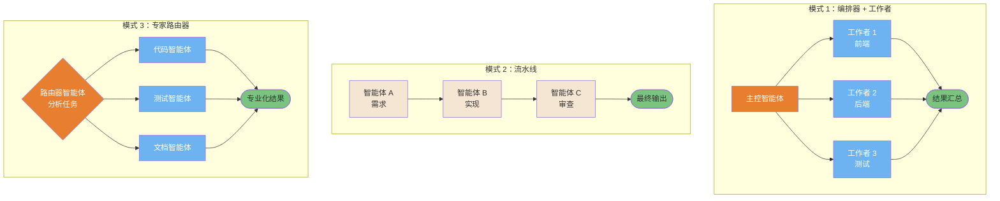
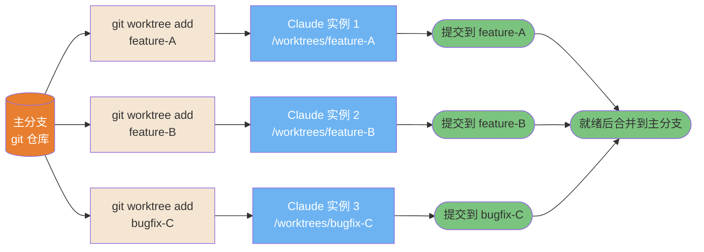
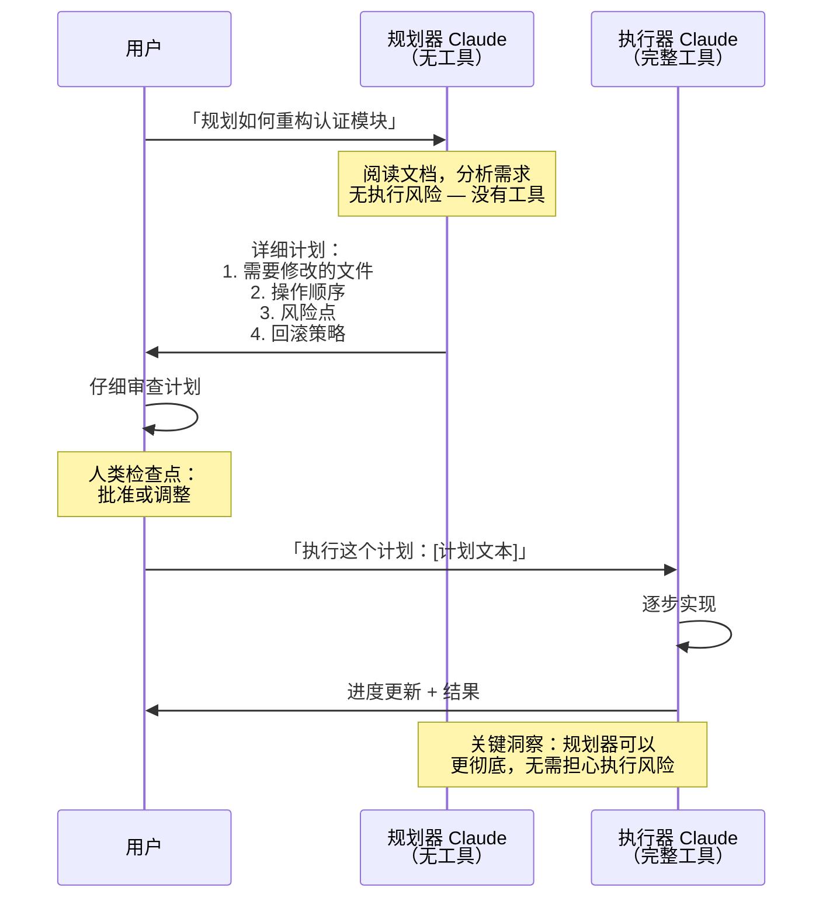
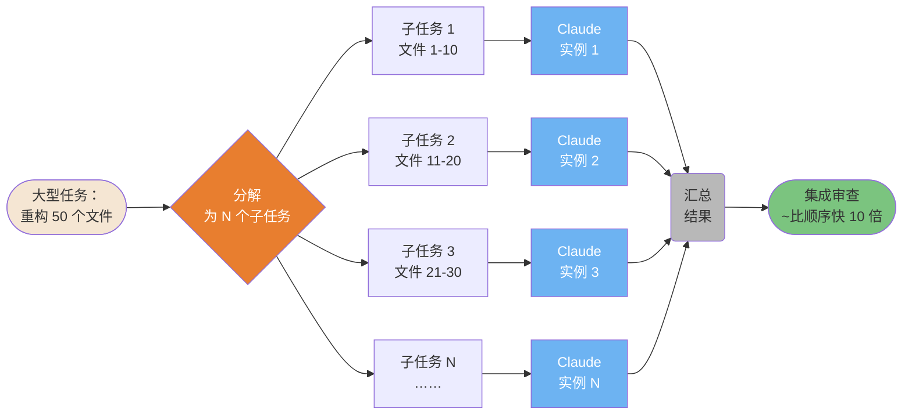
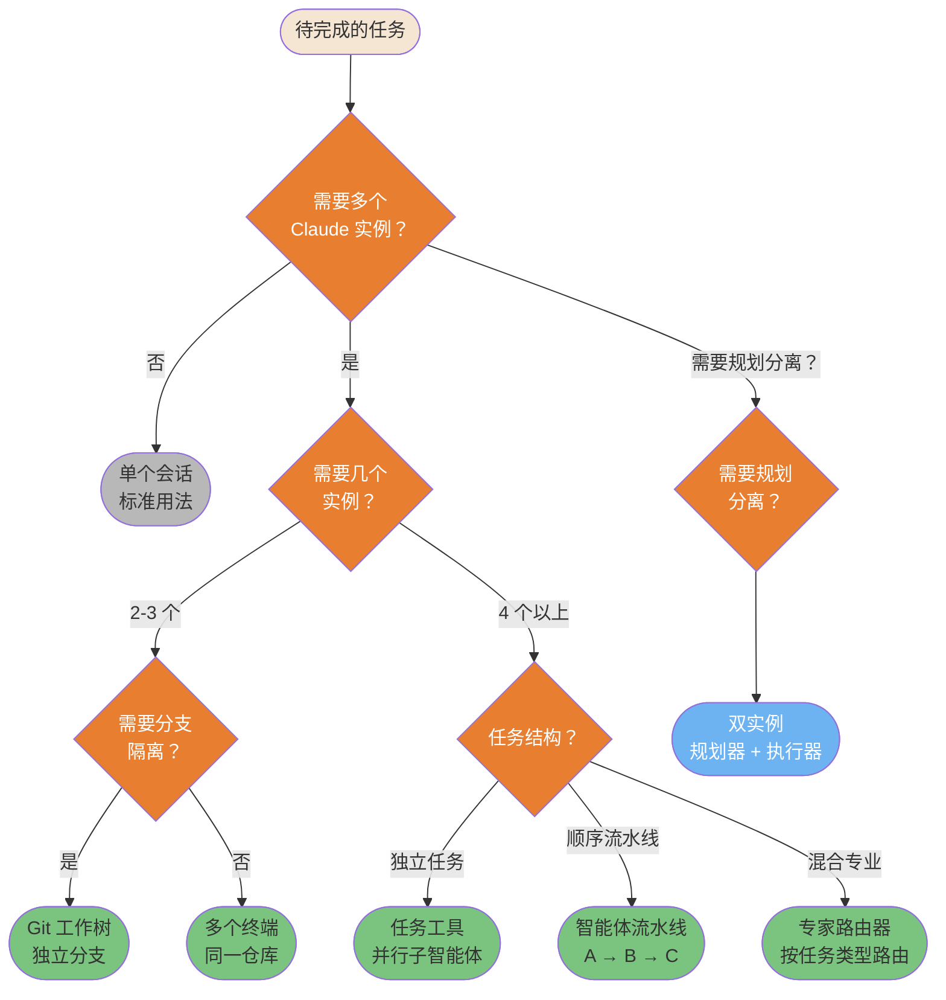

# 多智能体模式

协调多个 Claude 实例进行并行和复杂工作的模式。

---

### 智能体团队 — 3 种编排拓扑

三种经过验证的多智能体协调拓扑结构。根据任务独立性、顺序要求和专业化需求来选择。



ASCII 版本

```Plain Text
编排器 + 工作者：         流水线：                路由器：

   主控智能体            智能体 A（需求）          路由器
  /    |     \                │                  /  |  \
W1    W2     W3          智能体 B（实现）       代码 测试 文档
  \   |     /                 │                  \  |  /
   汇总                  智能体 C（审查）          结果
                               │
                           最终输出

```

> **来源**：「智能体团队」 — 第 ~59 行

---

### Git 工作树多实例模式

Git 工作树实现真正的并行开发：每个 Claude 实例在独立分支的独立工作目录中工作。无冲突，无上下文混淆。



ASCII 版本

```Plain Text
主仓库
├── git worktree add feature-A → Claude 1 → 提交到 feature-A
├── git worktree add feature-B → Claude 2 → 提交到 feature-B
└── git worktree add bugfix-C  → Claude 3 → 提交到 bugfix-C

无冲突：独立工作目录，独立分支
全部完成后合并回主分支

```

> **来源**：「Git 工作树」 — 第 ~10634 行

---

### 双实例规划模式（Jon Williams）

使用两个 Claude 实例将规划与执行分离，可以防止代价高昂的错误：规划器 Claude 没有工具，所以在分析期间不会意外执行任何操作。



ASCII 版本

```Plain Text
用户 → 规划器（无工具）：「规划 X」
         │
    [安全分析，无执行风险]
         │
规划器 → 用户：详细计划
         │
用户审查 + 批准
         │
用户 → 执行器（完整工具）：「执行：[计划]」
         │
    [带完整上下文地实现]
         │
执行器 → 用户：结果

```

> **来源**：「双实例规划」

---

### Boris Cherny 水平扩展模式

当任务可以并行化时，同时派生 N 个 Claude 实例，而不是顺序运行。加速比与任务独立性成正比。



ASCII 版本

```Plain Text
大型任务
     │
分解为 N 个独立子任务
     │
┌────┼────┐
│    │    │
I1  I2  I3……（并行）
│    │    │
└────┼────┘
     │
汇总 → 集成审查
（~比顺序快 10 倍）

```

> **来源**：「水平扩展」 — 第 ~9617 行

---

### 多实例决策矩阵

并非每个任务都需要多个实例。这个决策树根据任务特征引导你选择正确的模式。



ASCII 版本

```Plain Text
需要多个实例？
├─ 否 → 单个会话
├─ 是 → 需要几个？
│        ├─ 2-3 个 → 需要分支隔离？
│        │        ├─ 是 → Git 工作树
│        │        └─ 否  → 多个终端
│        └─ 4 个以上 → 任务结构？
│                 ├─ 独立 → 任务工具（并行子智能体）
│                 ├─ 顺序  → 智能体流水线 A→B→C
│                 └─ 混合  → 专家路由器
└─ 需要规划分离？ → 双实例（规划器 + 执行器）

```

> **来源**：「多实例模式」 — 第 ~11176 行

---

## 相关文章

- [智能体团队协作](../../实战工作流手册/智能体团队协作.md)
- [智能体团队快速入门](../../实战工作流手册/智能体团队快速入门.md)
- [双实例计划工作流](../../实战工作流手册/双实例计划工作流.md)
- [智能体框架工程](../智能体框架工程.md)
- [智能体与专业化](../../零到精通：七步上手路径/智能体与专业化.md)

---

> 来源：飞书 · AI Spark 知识库 ｜ 原文（最新版）：<https://lcnniolukk80.feishu.cn/wiki/Nva4wFln6iXQfPk24OLcrxiHnwh> ｜ 归档：2026-06-04
