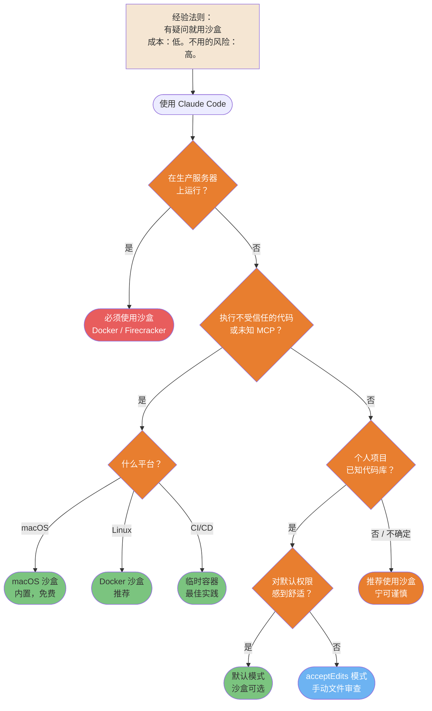
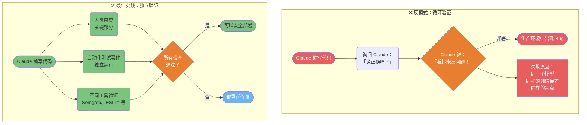
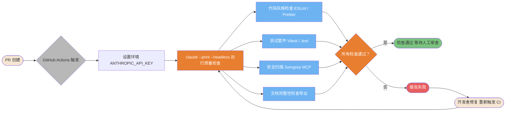

# 安全与生产环境

在敏感和生产环境中安全运行 Claude Code 的模式。

---

### 安全 3 层防御模型

Claude Code 的纵深防御：预防层阻止大多数威胁，检测层捕获漏网之鱼，响应层限制爆炸半径。任何单一层次都不够充分。

```mermaid
flowchart LR
    THREAT([威胁 / 攻击]) --> L1

    subgraph L1["🛡️ 第 1 层：预防"]
        P1[MCP 服务器审查<br/>安装前阅读源码]
        P2[CLAUDE.md 限制<br/>定义禁止操作]
        P3[.claudeignore<br/>隐藏敏感文件]
        P4[最小权限<br/>bypassPermissions 仅限 CI]
    end

    subgraph L2["🔍 第 2 层：检测"]
        D1[工具前钩子<br/>记录所有工具调用]
        D2[审计日志<br/>完整历史记录]
        D3[异常告警<br/>意外的文件访问]
    end

    subgraph L3["🔒 第 3 层：响应"]
        R1[沙盒隔离<br/>Docker / Firecracker]
        R2[权限关卡<br/>高风险操作需人工审批]
        R3[回滚能力<br/>git revert、备份]
    end

    L1 -->|被绕过| L2
    L2 -->|被绕过| L3
    L3 --> BLOCKED([威胁已遏制])

    style THREAT fill:#E85D5D,color:#fff
    style P1 fill:#7BC47F,color:#333
    style P2 fill:#7BC47F,color:#333
    style P3 fill:#7BC47F,color:#333
    style P4 fill:#7BC47F,color:#333
    style D1 fill:#6DB3F2,color:#fff
    style D2 fill:#6DB3F2,color:#fff
    style D3 fill:#6DB3F2,color:#fff
    style R1 fill:#E87E2F,color:#fff
    style R2 fill:#E87E2F,color:#fff
    style R3 fill:#E87E2F,color:#fff
    style BLOCKED fill:#7BC47F,color:#333
```



ASCII 版本

```Plain Text
威胁
  │
第 1 层：预防
  - MCP 审查 + CLAUDE.md 限制 + .claudeignore
  │（被绕过）→
第 2 层：检测
  - 钩子日志 + 审计日志 + 异常告警
  │（被绕过）→
第 3 层：响应
  - 沙盒 + 权限关卡 + 回滚
  │
已遏制

```

> **来源**：「安全加固」 — 完整指南

---

### 沙盒决策树

沙盒化会带来额外开销。使用这个决策树来判断你的情况是强制使用、推荐使用还是可选使用。



ASCII 版本

```Plain Text
生产服务器？→ 是 → 必须使用沙盒（Docker/Firecracker）
     │ 否
不受信任的代码或未知 MCP？
  ├─ 是 → macOS 沙盒 / Docker / 临时容器
  └─ 否  → 已知代码库的个人项目？
            ├─ 是 → 默认或 acceptEdits（沙盒可选）
            └─ 否  → 推荐使用沙盒

规则：有疑问就用沙盒。

```

> **来源**：「原生沙盒」 — 第 ~512 行

---

### 验证悖论

让 Claude 验证自己的工作是循环论证。生成 bug 的同一个模型在审查时往往也会遗漏它。这种反模式会导致生产事故。



ASCII 版本

```Plain Text
差：Claude 编写 → Claude 检查 → 「没问题」→ 部署 → Bug
   （同一模型，同样的偏差，循环论证）

好：Claude 编写 → 人类审查（关键部分）
                → 自动化测试（独立）
                → 静态分析（不同工具）
                → 全部通过？→ 部署 ✓

```

> **来源**：「生产安全」 — 第 ~639 行

---

### CI/CD 集成流水线

Claude Code 可以在非交互模式下在 CI/CD 流水线中运行，对每个 PR 进行自动化代码审查、文档和质量检查。



ASCII 版本

```Plain Text
PR 创建 → GitHub Actions → 设置 ANTHROPIC_API_KEY
                                    │
                          claude --print --headless
                                    │
                    ┌───────────────┼────────────────┐
                  风格           测试            安全
                                    │
                          所有通过？──否──► PR 失败 + 报告
                            │ 是
                          ✓ 通过 → 人工审查 → 合并

```

> **来源**：「CI/CD 集成」 — 第 ~6835 行

---

## 相关文章

- [生产安全规则](../../企业级安全与治理/生产安全规则.md)
- [沙箱隔离方案](../../企业级安全与治理/沙箱隔离方案.md)
- [原生沙箱详解](../../企业级安全与治理/原生沙箱详解.md)
- [安全加固指南](../../企业级安全与治理/安全加固指南.md)
- [GitHub Actions 集成](../../实战工作流手册/GitHub%20Actions%20集成.md)
- [生产可靠性模式](../../实战工作流手册/生产可靠性模式.md)

---

> 来源：飞书 · AI Spark 知识库 ｜ 原文（最新版）：<https://lcnniolukk80.feishu.cn/wiki/JKgDwZHgDiza8ukxr1Scu6wxn9c> ｜ 归档：2026-06-04
