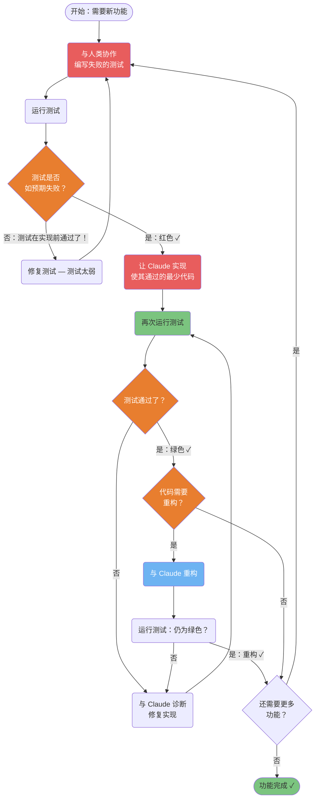
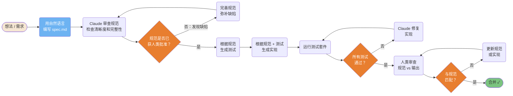
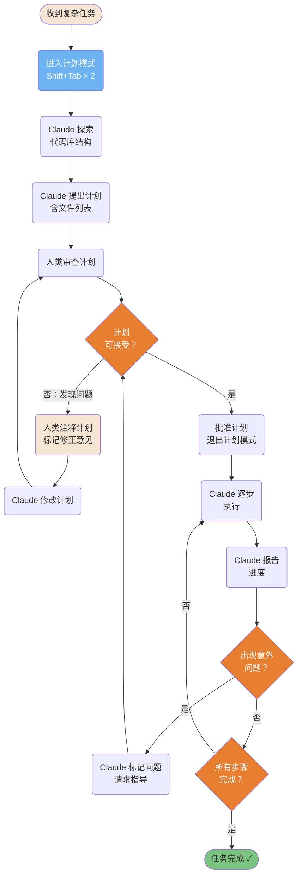
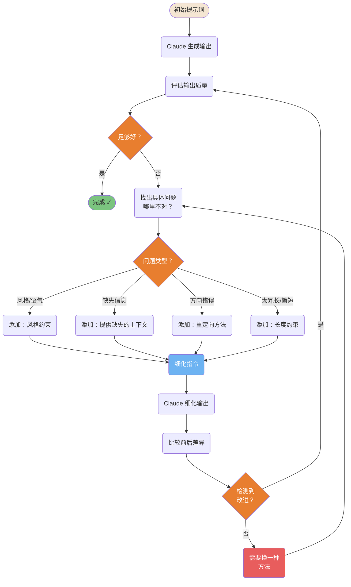
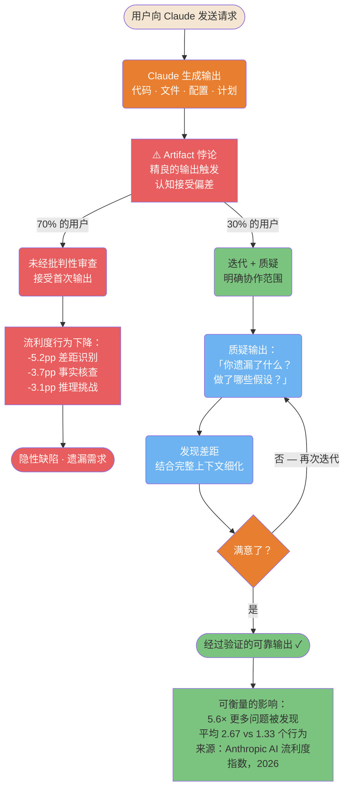

# 开发工作流

构建 AI 辅助开发会话的经过验证的模式。

---

### TDD 红-绿-重构与 Claude 配合

适配 Claude Code 的测试驱动开发（TDD）：先写失败的测试，再让 Claude 仅实现使其通过所需的最少代码。这可以防止过度工程化，并确保测试真正验证行为。



ASCII 版本

```Plain Text
编写失败的测试（红色）
        │
    运行测试
        │
  如预期失败？
  ├─ 否  → 修复测试（太弱）
  └─ 是 → 让 Claude：实现最少代码
                │
           运行测试
                │
           通过？（绿色）
           ├─ 否  → 诊断 + 修复
           └─ 是 → 需要重构？
                    ├─ 是 → 重构（重构）→ 重新运行测试
                    └─ 否  → 下一个功能

```

> **来源**：「TDD 与 Claude」

---

### 规范优先开发流水线

在写代码之前先写规范。Claude 将规范作为单一可信来源——防止计划与实际构建之间产生偏差。



ASCII 版本

```Plain Text
想法 → 编写 spec.md → Claude 审查
                             │
                       通过？─否→ 完善规范
                             │ 是
                       根据规范生成测试
                             │
                       生成实现
                             │
                       运行测试 → 通过？─否→ Claude 修复
                             │ 是
                       人类审查 → 与规范匹配？─否→ 修复
                             │ 是
                           合并 ✓

```

> **来源**：「规范优先开发」

---

### 带注释的计划驱动工作流

复杂任务受益于计划模式：Claude 探索代码库，提出计划，你进行注释，然后 Claude 只执行已批准的内容。防止大规模重构时出现意外。



ASCII 版本

```Plain Text
复杂任务
     │
计划模式（Shift+Tab×2）
     │
Claude 探索代码库
     │
Claude 提出计划
     │
人类审查 ──否──► 注释 + Claude 修改 ──► 重新审查
     │ 是
批准 + 退出计划模式
     │
Claude 逐步执行
     │
意外？──是──► 标记 + 请求指导
     │ 否
完成？──否──► 继续
     │ 是
完成 ✓

```

> **来源**：「计划驱动工作流」

---

### 迭代优化循环

输出很少在第一次就完全达到预期。这个循环为你提供了一种系统化的方式，通过有针对性的反馈来改进结果，而不是给出「让它更好」这样模糊的指令。



ASCII 版本

```Plain Text
提示词 → 输出 → 评估 → 足够好？──是──► 完成
                             │ 否
                      找出具体问题
                             │
                      ┌──────┴──────────────┐
                     风格  缺失  方向  长度
                      └──────┬──────────────┘
                      细化指令
                             │
                      Claude 细化
                             │
                      更好了？──是──► 再次评估
                             │ 否
                      换一种方法

```

> **来源**：「迭代优化」 — 第 ~347 行

---

### AI 流利度 — 高流利度 vs 低流利度路径

当 Claude 生成看起来精良的输出时，一种认知偏差会被触发：输出看起来越完整，大多数用户对其批判性评估就越少。这就是「Artifact 悖论」，Anthropic 在 9,830 次对话中记录了这一现象。此图展示了区分高流利度用户（30%）和接受首次输出的用户（70%）的因素，以及可衡量的输出质量差异。



ASCII 版本

```Plain Text
用户请求 → Claude 输出（代码 · 文件 · 配置 · 计划）
                        ↓
              ⚠️ Artifact 悖论
          精良的输出 → 认知偏差
                        ↓
    ┌───────────────────┴──────────────────────┐
70% 的用户                            30% 的用户
未经审查接受                          迭代 + 质疑
        ↓                                     ↓
流利度行为下降：              质疑：「你遗漏了什么？
-5.2pp 差距识别                        做了哪些假设？」
-3.7pp 事实核查                               ↓
-3.1pp 推理挑战               发现差距 → 细化
        ↓                                     ↓
隐性缺陷                    满意了？──否──► 迭代
                                        ↓ 是
                            经过验证的输出 ✓
                                        ↓
                           5.6× 更多问题被发现
                           平均 2.67 vs 1.33 个行为

```

> **来源**：[Anthropic AI 流利度指数](https://www.anthropic.com/research/AI-fluency-index)（Swanson 等，2026-02-23）— 「指南章节：常见陷阱」

---

## 相关文章

- [TDD 测试驱动开发](../../实战工作流手册/TDD%20测试驱动开发.md)
- [规范优先开发](../../实战工作流手册/规范优先开发.md)
- [计划驱动开发](../../实战工作流手册/计划驱动开发.md)
- [迭代优化工作流](../../实战工作流手册/迭代优化工作流.md)
- [高级模式](../../零到精通：七步上手路径/高级模式.md)

---

> 来源：飞书 · AI Spark 知识库 ｜ 原文（最新版）：<https://lcnniolukk80.feishu.cn/wiki/Dg5UwyRBPinLSIkodX9c7Z1fnPc> ｜ 归档：2026-06-04
