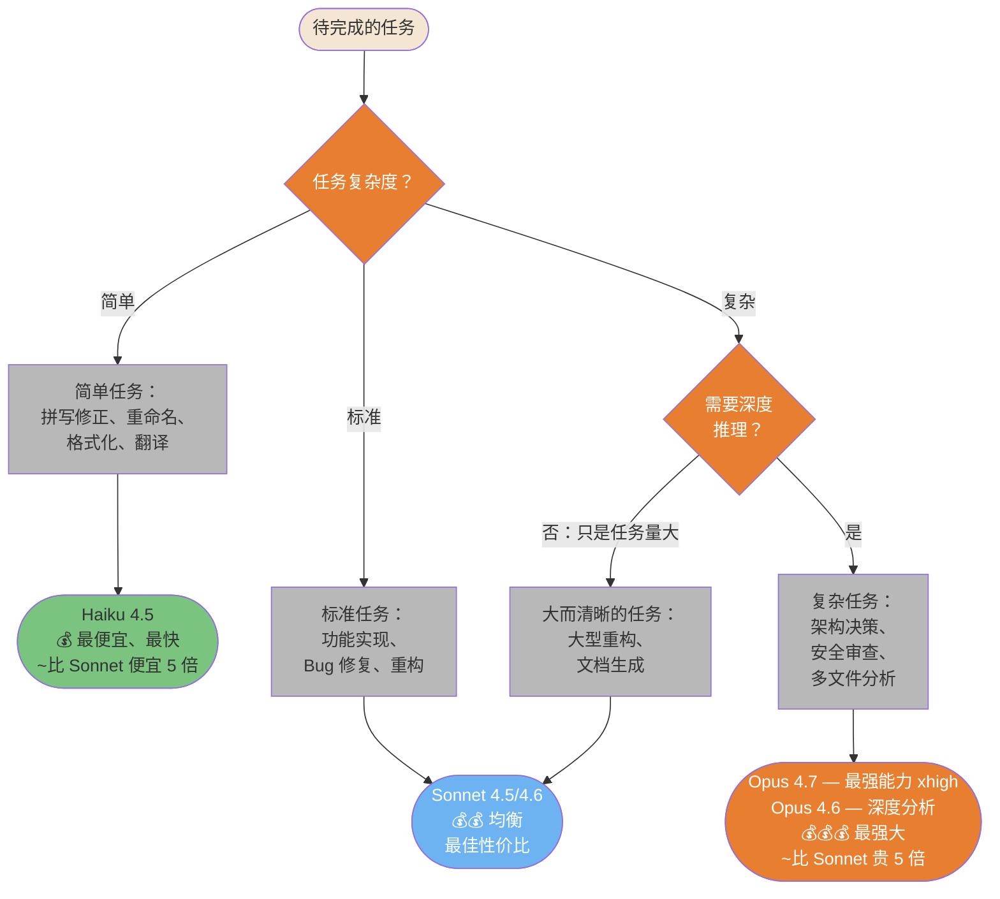
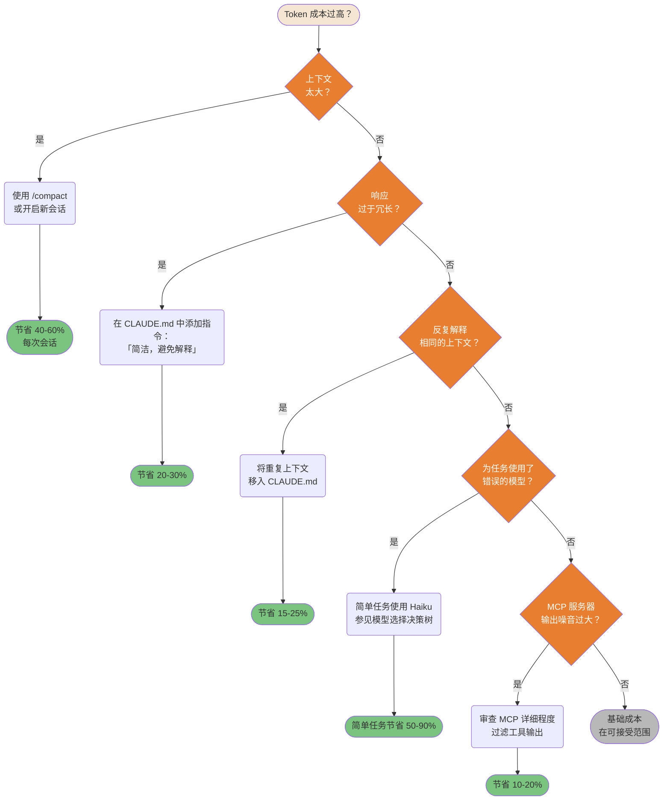
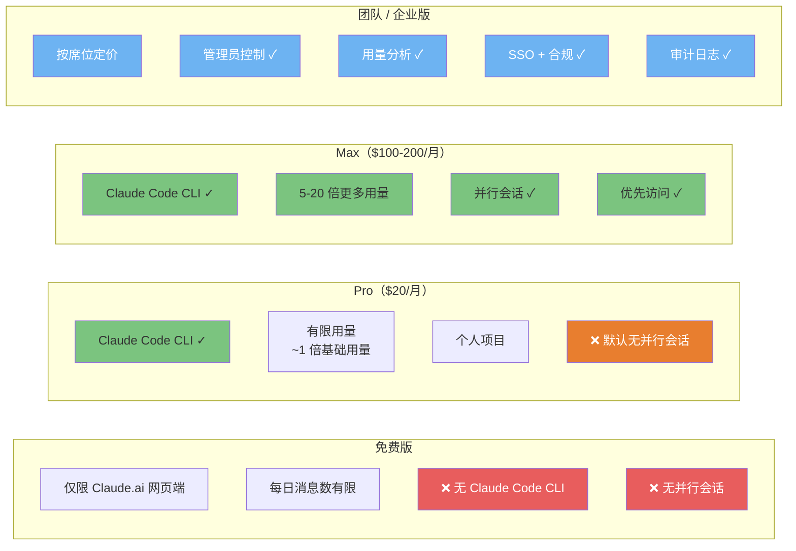

# 成本与优化

如何在控制 Token 消耗和成本的同时，从 Claude Code 中获取最大价值。

---

### 模型选择决策流程

并非所有任务都需要最强大的模型。为正确的任务选择正确的模型，可以在不牺牲质量的前提下将成本降低 5-10 倍。

> **此图表假设预算不受限制（Max/API）。** 对于预算较紧的套餐（Pro、Teams Standard），请应用下面的预算修正器。



> **定价**：显示的是相对费用——请在 [anthropic.com/pricing](https://www.anthropic.com/pricing) 查看当前价格。

**预算修正器** — 对于预算受限的套餐，每个阶段降低一档：

| 套餐 | 规划阶段 | 实现阶段 |
|-|-|-|
| **Max / API 不受限（xhigh）** | Opus 4.7 | Sonnet |
| **Max / API 不受限** | Opus 4.6 | Sonnet |
| **Pro / Teams Standard** | Sonnet | Haiku（机械性任务） |
| **API 紧张预算** | Sonnet | Haiku |

> *社区模式（Teams Standard $25/月）：Sonnet 用于规划 → Haiku 用于实现。机械性任务以极低成本获得相同质量输出。*

ASCII 版本

```Plain Text
任务复杂度？
├─ 简单（拼写、格式、重命名） → Haiku 4.5       ($  — ~比 Sonnet 便宜 5 倍)
├─ 标准（功能、Bug）          → Sonnet 4.5/4.6  ($ — 最佳性价比)
└─ 复杂（架构、安全）
   ├─ 需要深度推理？           → Opus 4.7 (xhigh) / Opus 4.6  ($$ — ~比 Sonnet 贵 5 倍)
   └─ 只是量大/清晰？          → Sonnet 4.6                    ($$ — 胜任)

预算修正器（预算受限套餐降一档）：
  Max/API (xhigh)  → Opus 4.7 规划，Sonnet 实现
  Max/API          → Opus 4.6 规划，Sonnet 实现
  Pro/Teams        → Sonnet 规划，Haiku 实现（机械性任务）

```

> **来源**：「模型选择」 — 第 ~2634 行

---

### 成本优化决策树

Token 成本高通常是可以修复的。这个系统化的决策树找出根本原因，并为每种浪费模式指出正确的解决方法。



ASCII 版本

```Plain Text
成本过高？
├─ 上下文太大？      → /compact 或新会话          （节省 40-60%）
├─ 响应过于冗长？    → CLAUDE.md：简洁             （节省 20-30%）
├─ 反复解释上下文？  → 移入 CLAUDE.md              （节省 15-25%）
├─ 使用了错误模型？  → 简单任务使用 Haiku          （节省 50-90%）
├─ MCP 输出噪音大？  → 过滤工具输出               （节省 10-20%）
└─ 以上都不是？      → 基础成本，在可接受范围

```

> **思考力度调节器** — `/effort xlow/low/default/high/xhigh`（v2.1.111）让你可以按任务调节思考深度。思考力度越低 = 消耗的 Token 越少。与模型选择结合使用，可进行精细的成本控制。

> **来源**：「成本优化」 — 第 ~8878 行

---

### 订阅套餐 — 各套餐解锁内容

不同套餐解锁不同的 Claude Code 能力。了解限制有助于你规划使用并为升级提供依据。



ASCII 版本

```Plain Text
免费         Pro ($20)          Max ($100-200)     团队/企业
────         ─────────          ──────────────     ───────────────
仅网页端     CLI ✓              CLI ✓              按席位定价
消息数有限   有限用量           5-20 倍用量        管理员控制
无 CLI       个人使用           并行 ✓             用量分析
             无并行             优先 ✓             SSO + 合规

```

> **来源**：「订阅套餐」 — 第 ~1933 行

---

### Token 减少策略流水线

多种策略叠加可累计节省 Token。按从高影响到低成本的顺序依次应用。

```mermaid
flowchart LR
    BASE([基准：<br/>100% Token]) --> RTK

    subgraph RTK["策略 1：RTK 代理"]
        R1[原始 CLI 输出<br/>→ 过滤输出]
        R2["git status、cargo test、<br/>pnpm list → 压缩"]
        R3[CLI 命令节省 60-90%]
    end

    RTK --> COMP

    subgraph COMP["策略 2：/compact"]
        C1[长对话<br/>→ 摘要]
        C2[保留决策，<br/>丢弃冗余推理]
        C3[检查点节省 40-60%]
    end

    COMP --> CLAUDE_MD

    subgraph CLAUDE_MD["策略 3：CLAUDE.md"]
        CM1[重复上下文<br/>→ 持久指令]
        CM2[无需重复解释<br/>项目规范]
        CM3[每次会话节省 15-25%]
    end

    CLAUDE_MD --> MODEL

    subgraph MODEL["策略 4：模型选择"]
        MO1[简单任务使用 Haiku<br/>而非 Sonnet]
        MO2[相同质量输出<br/>成本极低]
        MO3[简单任务节省 50-90%]
    end

    MODEL --> RESULT([优化后：<br/>典型用法约 10-20%<br/>基准用量])

    style BASE fill:#E85D5D,color:#fff
    style R3 fill:#7BC47F,color:#333
    style C3 fill:#7BC47F,color:#333
    style CM3 fill:#7BC47F,color:#333
    style MO3 fill:#7BC47F,color:#333
    style RESULT fill:#7BC47F,color:#333
```



ASCII 版本

```Plain Text
100% 基准
    │
RTK 代理（CLI 输出压缩）         → CLI 操作节省 60-90%
    │
/compact（对话摘要）              → 检查点节省 40-60%
    │
CLAUDE.md（避免重复上下文）       → 每次会话节省 15-25%
    │
模型选择（简单任务用 Haiku）      → 简单任务节省 50-90%
    │
典型用法约 10-20% 基准用量

```

> **跟踪用量** — 使用 `/usage` 监控 Token 消耗和成本（自 v2.1.118 起替代 `/cost`；`/cost` 仍作为别名有效）。

> **来源**：「Token 优化」 — 第 ~13355 行

---

## 相关文章

- [上下文工程](上下文工程.md)
- [配置参考手册](../配置参考手册.md)
- [速查手册](../../速查手册.md)

---

> 来源：飞书 · AI Spark 知识库 ｜ 原文（最新版）：<https://lcnniolukk80.feishu.cn/wiki/IR8QwvDfUiJMjhktqiTcttr3nzf> ｜ 归档：2026-06-04
