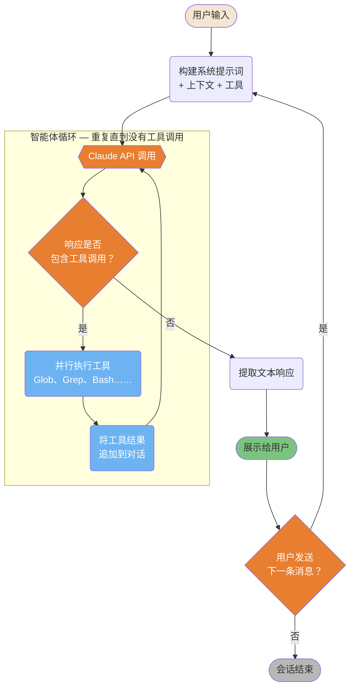
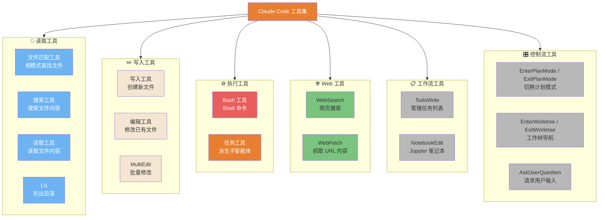
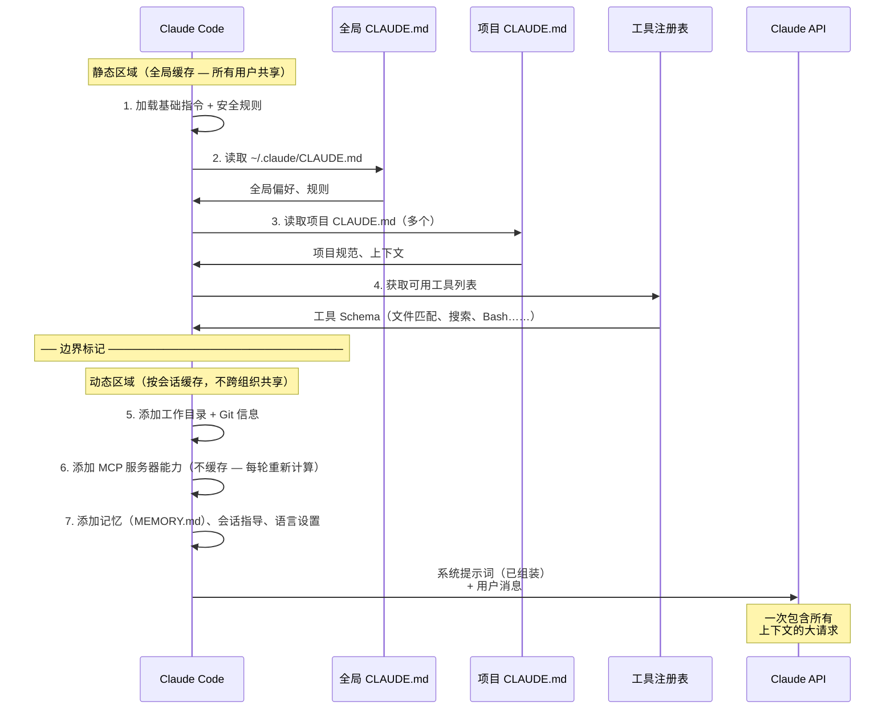
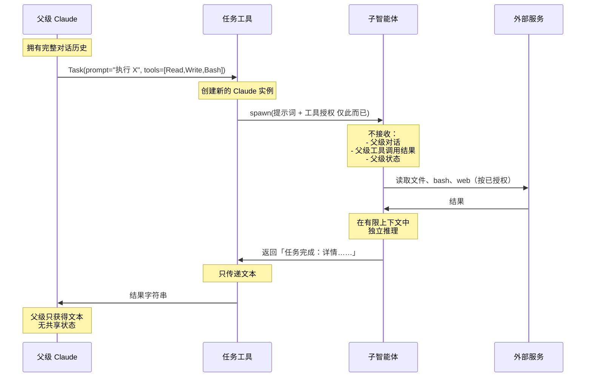

# 架构内部

Claude Code 运行时的底层机制。

---

### 主循环

Claude Code 的核心执行由两个嵌套循环组成：**内层智能体循环**——只要返回工具调用就持续调用 API；**外层对话循环**——在用户响应时开始新轮次。



ASCII 版本

```Plain Text
用户输入
     │
构建提示词（系统 + 上下文 + 工具）
     │
 ┌── 智能体循环 ───────────────────────┐
 │ Claude API ◄────────────────────┐  │
 │      │                          │  │
 │ 有工具调用？                     │  │
 │  ├─ 是 → 执行工具 ──────────────┘  │
 │  └─ 否  → 退出循环                 │
 └────────────────────────────────────┘
               │
         展示响应
               │
         用户下一条消息？──► 是 → 重建提示词 → 循环
               └─ 否 → 会话结束

```

> **来源**：「架构：主循环」 — 第 ~72 行

> *来源确认（2026-03-31）：内层循环为 queryLoop() 异步生成器。工具通过 StreamingToolExecutor 执行（最多 10 个并发）。循环通过 10 种终止原因之一退出（completed、max_turns、aborted_tools 等）。*

---

### 工具分类与选择

Claude Code 有 6 种工具类别，各自针对不同操作进行优化。了解 Claude 选择哪种工具（以及原因），有助于你编写能引导更好工具选择的指令。



ASCII 版本

```Plain Text
读取：   文件匹配工具（查找）、搜索工具（搜索）、读取工具（内容）、LS（列表）
写入：   写入工具（创建）、编辑工具（修改）、MultiEdit（批量）
执行：   Bash 工具（Shell）、任务工具（子智能体）← 最强大/高风险
Web：    WebSearch、WebFetch
工作流： TodoWrite、NotebookEdit
控制：   EnterPlanMode/ExitPlanMode、EnterWorktree/ExitWorktree、AskUserQuestion

```

> **来源**：「架构：工具」 — 第 ~213 行

> *已简化——还有更多工具可用。完整列表见 「架构：工具集」。*

---

### 系统提示词组装

在每次 API 调用前，Claude Code 会按照特定顺序从多个来源组装系统提示词。提示词被分为两个缓存区域，中间由边界标记分隔。



ASCII 版本

```Plain Text
静态区域（全局可缓存，跨组织）：
1. 基础指令（硬编码）
2. ~/.claude/CLAUDE.md
3. /project/CLAUDE.md + 子目录
4. 工具定义列表
────── 边界标记 ──────
动态区域（按会话缓存）：
5. 工作目录 + Git 状态
6. MCP 服务器能力（始终重新计算）
7. 记忆、会话指导、语言设置
──────────────────────
→ 全部合并 → Claude API 调用

```

> **来源**：「架构：系统提示词」 — 第 ~354 行

> *来源确认（2026-03-31）：通过 SYSTEM_PROMPT_DYNAMIC_BOUNDARY 标记实现两区域架构。静态区域设有 cacheScope: 'global'（所有用户共享）。MCP 指令明确不缓存——源码注释：「服务器在每轮之间连接/断开」。*

---

### 子智能体上下文隔离

子智能体与父级完全隔离——它们无法读取父级的对话，也无法修改父级状态。这种隔离既是一种安全特性，也是有意为之的设计约束。



ASCII 版本

```Plain Text
父级（完整上下文）
    │
    Task(prompt, tools=[...])
    │
    ▼
子智能体（隔离）
  输入：提示词 + 工具授权 仅此而已
  能做：独立使用已授权的工具
  不能做：查看父级对话、修改父级状态
  输出：仅文本结果
    │
    ▼
父级接收：文本字符串

```

> **来源**：「架构：子智能体」 — 第 ~444 行

---

## 相关文章

- [架构与内部机制](../架构与内部机制.md)
- [智能体框架工程](../智能体框架工程.md)
- [上下文工程](上下文工程.md)
- [智能体与专业化](../../零到精通：七步上手路径/智能体与专业化.md)

---

> 来源：飞书 · AI Spark 知识库 ｜ 原文（最新版）：<https://lcnniolukk80.feishu.cn/wiki/JqpSwTSxniIlJLkbcsYccpqAnNc> ｜ 归档：2026-06-04
