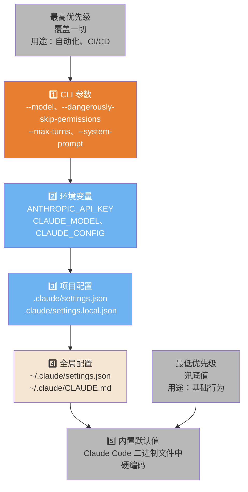
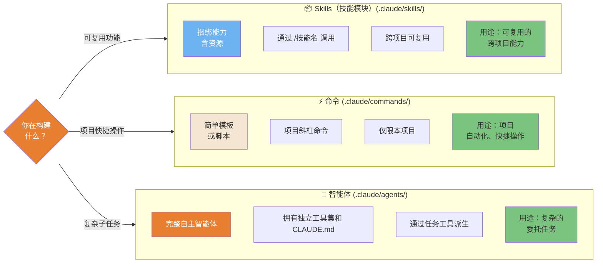
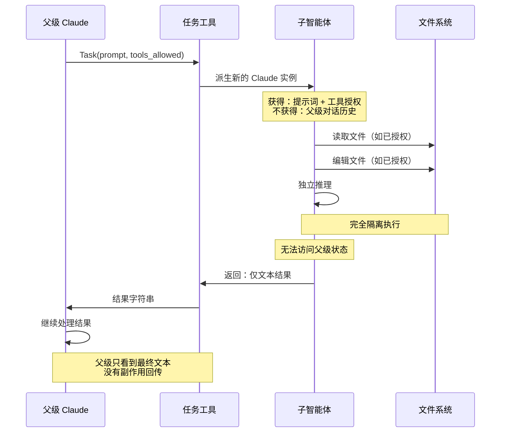
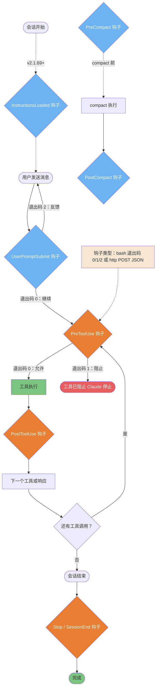

# 配置系统

Claude Code 如何加载设置、解决冲突并编排可扩展性。

---

### 配置优先级（5 层）

Claude Code 通过严格的优先级层次解析设置。高优先级层覆盖低优先级层。了解这一机制可以避免"为什么我的配置不生效？"的疑惑。



ASCII 版本

```Plain Text
优先级（从高到低）
═══════════════════════════
1. CLI 参数          ← --model、--system-prompt
2. 环境变量          ← ANTHROPIC_API_KEY
3. 项目 .claude/     ← settings.json、settings.local.json
4. 全局 ~/.claude/   ← settings.json、CLAUDE.md
5. 内置默认值         ← 硬编码的兜底值

```

> **来源**：「配置系统」 — 第 ~3760 行

---

### Skills（技能模块）vs 命令 vs 智能体 — 何时使用各方

三种可扩展性机制，各有不同的用途和权衡。选错抽象方式会导致过度工程化或自动化能力不足。



ASCII 版本

```Plain Text
                Skills（技能模块）       命令               智能体
位置：      .claude/skills/     .claude/commands/  .claude/agents/
触发方式：  /技能名             /命令名            任务工具
作用域：    跨项目              本项目             任意场景
复杂度：    中（捆绑）          低（模板）         高（自主）
使用场景：  可复用能力          快速快捷操作       复杂任务

```

> **来源**：「可扩展性系统」 — 第 ~4495、~5025、~3900 行

---

### 智能体生命周期与作用域隔离

子智能体与父级完全隔离运行。它们接收上下文的副本，但不共享任何状态。理解这一点可以避免"为什么子智能体看不到 X？"的困惑。



ASCII 版本

```Plain Text
父级 ──Task(prompt, tools)──► 子智能体
                                    │
                               [隔离执行]
                               - 读取文件
                               - 编辑文件
                               - bash（如已允许）
                                    │
父级 ◄───── 文本结果 ───────────────┘
（不共享状态，没有副作用回传）

```

> **来源**：「子智能体」 — 第 ~3900 行

---

### Hooks（钩子）事件流水线

Hooks（钩子）让你可以在 Claude Code 生命周期的关键节点运行自定义代码——用于安全扫描、日志记录、强制执行或通知。执行顺序非常重要。



ASCII 版本

```Plain Text
会话开始
     │ （InstructionsLoaded 钩子 — v2.1.69+）
用户消息
     │
 UserPromptSubmit ──退出码 2──► 反馈给 Claude（循环）
     │ 退出码 0
 PreToolUse ──退出码 1──► 已阻止
     │ 退出码 0
     ▼
工具执行
     │
PostToolUse
     │
还有工具？──是──► PreToolUse（循环）
     │ 否
会话结束
     │
  Stop / SessionEnd 钩子
     │
 完成

另外：PreCompact ──► /compact ──► PostCompact

钩子类型：bash（退出码 0/1/2）| http POST JSON（v2.1.63+）

```

> **来源**：「Hooks 系统」 — 第 ~5350 行 | UserPromptSubmit + HTTP 钩子：v2.1.63+ | InstructionsLoaded：v2.1.69+

---

## 相关文章

- [配置参考手册](../配置参考手册.md)
- [Skills 与自动化](../../零到精通：七步上手路径/Skills%20与自动化.md)
- [Skills 设计模式](../Skills%20设计模式.md)
- [Hooks 与事件](../../零到精通：七步上手路径/Hooks%20与事件.md)
- [智能体与专业化](../../零到精通：七步上手路径/智能体与专业化.md)

---

> 来源：飞书 · AI Spark 知识库 ｜ 原文（最新版）：<https://lcnniolukk80.feishu.cn/wiki/Fi0ewYzkEiaIpuka5s4c5iAQnjh> ｜ 归档：2026-06-04
